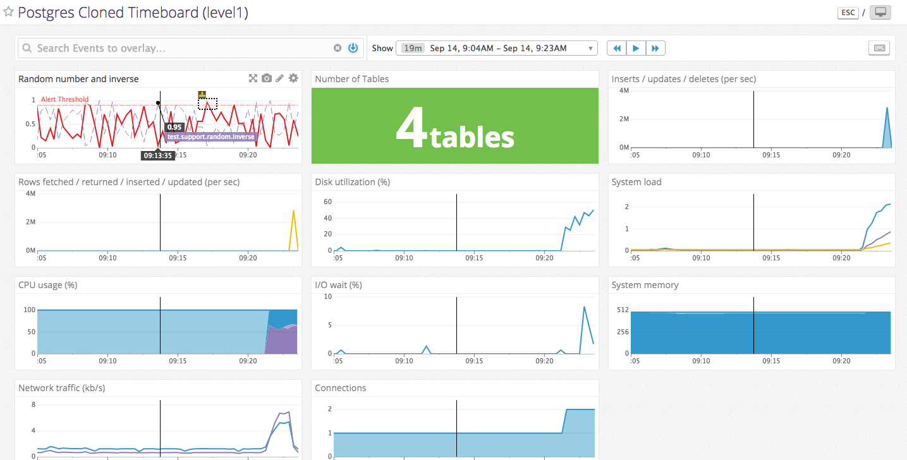

# The Challenge - Rich Upshall

## Answers

### Level 0

* See Vagrantfile which conatins the bento/centos-7.1 box this has psql and the datadog agent setup when ```vagrant up``` is run.  Datadog is configured with ```DD_INSTALL_ONLY=true``` to allow configs to be created prior to sending stats to Datadog.
 
  ```bash
  DD_API_KEY=<APIKEY> DD_INSTALL_ONLY=true bash -c "$(curl -L https://raw.githubusercontent.com/DataDog/dd-agent/master/packaging/datadog-agent/source/install_agent.sh)"
  ```

### Level 1
* Agent installed via Vagrant on launch of box to ensure a stable base when other users launch the vm.

* The agent a piece of software that is very easy to install via the commands listed on the agent screen (https://app.datadoghq.com/account/settings#agent) or via source on platforms such as Solaris(!).  Written in python, it runs within its own venv to keep it disparate from your own applications.  It consists of three main elements, a collector, dogstatsd and a forwarder.  The collector gathers system stats (cpu, memory etc) as well as metrics from integrations from an ever growing list provided by Datadog (https://www.datadoghq.com/product/integrations/).  Where these do not meet the user's needs, custom metrics may be passed to dogstatsd (http://docs.datadoghq.com/guides/metrics/).  The forwarder then collects all metrics and sends these out to Datadog in batches. The agent provides a number of tools that allow for debugging and inspection of the agen.  For example ```sudo service datadog-agent info``` provides an overview of metrics and checks collected as well as the status of the forwarder and dogstatsd elements.  ```sudo service datadog-agent jmx``` provides an invaluable tool in creating jmx based checks (jmx, tomcat, solr etc), showing the matching elements and those exceeding the 350 check limit.

* The screenshot below shows the single host looking very lonely on its own.   The fill is set to %CPU utilised and the size shows used memory.

 

* Postgres integration setup by creating the Datadog read-only postgres user and yaml file postgres.yaml

  SQL run on Postgres server
  ```sql
 create user datadog with password '<password>';
 grant SELECT ON pg_stat_database to datadog;
  ```
  postgres.yaml
  ```yaml
init_config:

instances:
  - host: localhost
    port: 5432
    username: datadog
    password: <password>
    dbname: test
  ```
* Random number generator (and inverse) created by creating a python file within the ```checks.d``` folder and a corresponding yaml file within ```conf.d``` the yaml file requires a dummy value within ```instances```.

  ```python
import random

from checks import AgentCheck

#Third Party
import whois

class RandomGen(AgentCheck):
    def check(self, instance):
        num = random.randrange(0,100)/100.0
        self.gauge('test.support.random', num)
        self.gauge('test.support.random.inverse', 1-num)
  ```

  ```yaml
init_config:

instances:
  # No configuration is needed for this check.
  # A single instance needs to be defined with any value.
  - key: value
  ```
 
### Level 2
* Timeboard available [here](https://app.datadoghq.com/dash/183135/postgres-cloned-timeboard-level1?live=true&page=0&is_auto=false&from_ts=1473794616550&to_ts=1473798216550&tile_size=s) and screenshot below

 

* 
  * A timeboard allows the display of multiple metrics in multiple formats in a time syncronised view.  This means that each graph will show the same time period and allow for quick correlation of stats across multiple graphs.  Display timeframes are selected in a global dropdown and users may zoom in by selecting ranges directly on the graphs to allow quick access to key data.
  * A screenboard allows free flow editing and formatting and is useful for monitoring screens and presentations.  It can accomodate a variety of widgets and allows for branding by pulling in images from other sites.  Date ranges are fixed per widget and different widgets can display differing time periods.
 
* Screenshot of snapshot below 

 

### Level 3
* Simple Alert created [here](https://app.datadoghq.com/monitors#922138/edit)

 

* Multi alert per host created [here](https://app.datadoghq.com/monitors#922154?group=all&live=4h)

  

* Alert email screenshot

 

* Scheduled downtime screenshot

 

### Bonus
* I've added a couple of screenshots found at ```bonus/``` to demonstrate a more data-rich hostmap and screenboard that I have put together at work

