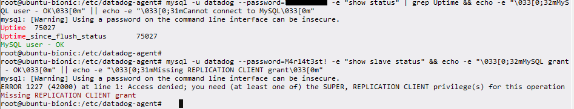
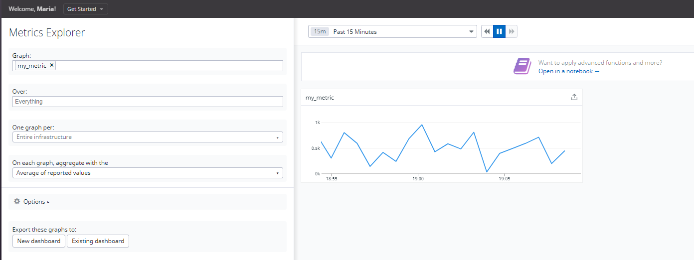

# Technical Assessment MidMarket Sales Engineer - EMEA - Maria Camila Martinez
April 2022 - Amsterdam, The Netherlands

*Datadog: Cloud Monitoring as a Service
See inside any stack, any app, at any scale, anywhere*

## Introduction
The purpose of this assessment is to dive into the application in a structured way.
Each section provides a detailed explanation of the followed steps, faced issues, and additional remarks to complete the implementation.

## Content
- [Environment Setup](#environment-setup)
  - VM setup
  - Installing Datadog Agent

- [Collecting metrics](#collecting-metrics)
  - Adding Tags
  - DB Installation
  - Custom Agent Check
  - Bonus Question

- [Visualizing Data](#visualizing-data)
  - Dashboard
  - Snapshot
  - Dependency Issues
  - Bonus Question

- [Monitoring Data](#monitoring-data)
  - Creating New Monitor
  - Bonus Question

- [Collecting APM Data](#collecting-apm-data)
  - Flask Application
  - Bonus Question

- [Final Question](#final-question)

## Environment Setup

### VM Setup
The first step is to [download](https://www.vagrantup.com/downloads) the correct vagrant package for my OS. In this case a Windows package. Following the [installation](https://learn.hashicorp.com/tutorials/vagrant/getting-started-project-setup?in=vagrant/getting-started), I deployed a vagrant Linux machine running Ubuntu 18.04.6 LTS.

Connecting to the VM via PowerShell:


### Installing Datadog Agent

The trial provides the following command with the API key to install the Datadog Agent in the VM.
```shell
DD_AGENT_MAJOR_VERSION=7 DD_API_KEY=<DD-API-KEY> DD_SITE="datadoghq.eu" shell -c "$(curl -L https://s3.amazonaws.com/dd-agent/scripts/install_script.sh)"
```


>**Note**:
During trial registration, I was not able to complete the third step of the signup process. Even though the agent was installed, the button to finalize the setup only showed "Waiting for an Agent to report...".
I fixed the issue by logging in again and selecting the EU site.

## Collecting Metrics

### Adding Tags
Tags were added in datadog.yaml ([Getting started with tags](https://docs.datadoghq.com/getting_started/tagging/))


>**Note**:
Important to remove additional spaces in the yaml file when uncommenting tags details. This caused issues while restarting the agent to submit changes.

Checking the Agent status, the tags were added successfully:\


Changes are also visible in the UI:


### DB Installation

I installed MySQL to integrate it with Datadog. Installation instructions can be found [here](https://phoenixnap.com/kb/how-to-install-mysql-on-ubuntu-18-04).
```shell
wget -c https://dev.mysql.com/get/mysql-apt-config_0.8.11-1_all.deb
sudo dpkg -i mysql-apt-config_0.8.11-1_all.deb
sudo apt-get update
sudo apt-get install mysql-server
sudo mysql_secure_installation
sudo service mysql status
```

Following the steps of the [MySQL integration](https://docs.datadoghq.com/integrations/mysql/?tab=host).

1. Create user in MySQL
```sql
CREATE USER 'datadog'@'%' IDENTIFIED BY 'PASSWORD';
```
2. Verify the user was created successfully


3. Grant privileges  
The Agent needs a few privileges to collect metrics. The following limited privileges are granted:
\
If enabled, metrics can be collected from the performance_schema database by granting an additional privilege:


4. Check datadog-agent status\
\
UI status\


### Custom Agent Check

Following the [custom Agent check](https://docs.datadoghq.com/developers/write_agent_check/?tab=agentv6v7) documentation, I created the yaml file under `/etc/datadog-agent/conf.d/custom_my_check.yaml`

```yaml
instances:[{}]
```
I changed the file permissions to avoid issues with the agent
```shell
cd /etc/datadog-agent/conf.d
ls -lrth custom_my_check.yaml
chown dd-agent:dd-agent custom_my_check.yaml
ls -lrth custom_my_check.yaml
```

I made use of the **hello.py** example and created [custom_my_check.py](Scripts/custom_my_check.py) under `/etc/datadog-agent/checks.d/`.

```python
# As my Agent version is greater than 6.6.0, only `datadog_checks.base` is needed.
from datadog_checks.base import AgentCheck
import random

__version__ = "1.0.0"


class MyCheck(AgentCheck):
    def check(self, instance):
        self.gauge("my_metric", random.uniform(0, 1000), tags=["team:hiringtest"])
```
Custom check validation


For Agent v6+, `min_collection_interval` must be added at an instance level and is configured individually for each instance.

```yaml
init_config:

instances:
 - min_collection_interval: 45
```

>**Note**: If the `min_collection_interval` is set to 45, it does not mean that the metric is collected every 45 seconds, but rather that it could be collected as often as every 45 seconds. The collector tries to run the check every 45 seconds but the check might need to wait in line, depending on how many integrations are enabled on the same Agent. Also if the check method takes more than 45 seconds to finish, the Agent skips execution until the next interval.



### Bonus Question
As mentioned in the documentation, the Python script does not need to be modified, as the interval can be specified in the `custom_my_check.yaml` file.
Even though this can be done from the CLI, I found an option in the UI to modify the metric interval.
- I changed the interval to 15 seconds in the UI
- Checking the graph after this change, it kept the 45 seconds interval as specified in the `custom_my_check.yaml` file
- As a test, I removed `min_collection_interval` in the `custom_my_check.yaml` file
- Checking the graph after this change, the interval changed to 15 seconds


## Visualizing Data

### Dashboard

As Timeboard endpoint is outdated, this can be done by [creating dashboards](
https://docs.datadoghq.com/api/latest/dashboards/). A dashboard is created with an authenticated POST request. This requires [API and application keys](https://docs.datadoghq.com/account_management/api-app-keys/).

For this implementation, a new application key is created. API key already available.


I used **example.py** as an example for my final dashboard. As [widgets](https://docs.datadoghq.com/dashboards/widgets/) in Datadog are the building blocks for a dashboard, I created a Python script [test_timeboard.py](Scripts/test_timeboard.py) with 3 timeseries widgets:
- My custom metric 'my_metric'
```python
Widget(
    definition=TimeseriesWidgetDefinition(
        type=TimeseriesWidgetDefinitionType("timeseries"),
        title="My Custom Metric",
        requests=[
            TimeseriesWidgetRequest(
                q="avg:my_metric{*}"
            )
        ],
    )
)
```
- [Anomaly function](https://docs.datadoghq.com/monitors/create/types/anomaly/#overview)
```python
Widget(
    definition=TimeseriesWidgetDefinition(
        type=TimeseriesWidgetDefinitionType("timeseries"),
        title="Anomaly function for DB CPU performance",
        requests=[
            TimeseriesWidgetRequest(
                q="anomalies(avg:mysql.performance.cpu_time{*}, 'basic', 2)"
            )
        ],
    )
)
```
- [Rollup function](https://docs.datadoghq.com/dashboards/functions/rollup/#pagetitle)
```python
Widget(
    definition=TimeseriesWidgetDefinition(
        type=TimeseriesWidgetDefinitionType("timeseries"),
        title="Rollup function for my custom metric - Sum up all points for the past hour",
        requests=[
            TimeseriesWidgetRequest(
                q="my_metric{*}.rollup(sum, 3600)"
            )
        ],
    )
)
```

To create a dashboard, it is required to install the Python package **datadog-api-client**
```shell
pip3 install datadog-api-client
```

The Python package **requests** needed to be upgraded on my VM (issue explained in next section)

```shell
pip3 install requests --upgrade
```

And then run the following command
```shell
DD_SITE="datadoghq.com" DD_API_KEY="<DD_API_KEY>" DD_APP_KEY="<DD_APP_KEY>" python3 "test_timeboard.py"
```


[](https://app.datadoghq.eu/dashboard/air-zmq-fcg/hiring-test-visualizing-data-maria?from_ts=1650060000000&to_ts=1650319140000&live=false)
>**Note**: The dashboard is accessible in Datadog by clicking in the image above.

### Snapshot

Setting the Timeboard's timeframe to the past 5 minutes, I selected **My Custom Metric** graph and sent a snapshot to my email.


### Dependency Issues

I encountered an error while executing the **test_timeboard.py** script.


```
urllib3.exceptions.MaxRetryError: HTTPSConnectionPool(host='api.datadoghq.eu', port=443): Max retries exceeded with url: /api/v1/check_run (Caused by SSLError(SSLError("bad handshake: Error([('SSL routines', 'tls_process_server_certificate', 'certificate verify failed')])")))
```
The first thing was to validate both **example.py** and **test_timeboard.py** scripts. As the scripts had no syntax issues, just to be sure, I set incorrect API and APP keys to determine if I would  receive at least a forbidden request. The output of the commands were the same. The keys and the scripts were not the issue.

I started checking if it was a Python dependency. Using the Python interpreter, I checked random get requests with different Python packages (requests, urllib, urlib3), and this was not an issue, random get requests were working. I uninstalled and installed **datadog-api-client**, and rebooted the VM as a last resource.

Searching in the issue tracker of the **datadog-api-client** repo, I found out it was an issue with the version of the **requests** Python package. This known issue was raised on March 9th and is described in DataDog/datadog-api-client-python#873. They have provided 2 workarounds. I tried the first one, by upgrading the requests package from v2.18.4 to v2.27.

### Bonus Question


According to the documentation, anomaly detection is an algorithmic feature that identifies when a metric is behaving differently than it has in the past, taking into account trends, seasonal day-of-week, and time-of-day patterns. It is well-suited for metrics with strong trends and recurring patterns that are hard to monitor with threshold-based alerting. I used a basic anomaly in my graph.

I decided to take **mysql.performance.cpu_time** due to the behavior of the graph for better application of the anomaly detection function. Another approach for monitoring metrics is to set static thresholds, but in such a metric anomaly detection is the best approach.

This graph could allow to identify unexpected behavior in the DB. It could mean that a process is consuming more resources. Maybe caused by a query taking longer. We can troubleshoot further, finding out what process is consuming the most CPU in our server. We could complement this anomaly with time querying responses, and Disk I/O log errors.  

## Monitoring Data
### Creating New Monitor
To [create a monitor](https://docs.datadoghq.com/monitors/create/) in Datadog, hover over 'Monitors' in the main menu and click 'New Monitor' in the sub-menu.

I created the new monitor that watches the average of **my_metric** and will alert if it’s above the following values over the past 5 minutes:
- Warning threshold of 500
- Alerting threshold of 800
- No Data over the past 10 minutes.


I will receive a message whenever the monitor triggers. I created different messages based on whether the monitor is in an Alert, Warning, or No Data state, including the metric value and the host IP.


>**Note**: To be able to receive the tags {{host.name}} and {{host.ip}}, it is needed to define from where you need the details of your metric. Otherwise these values will be empty in your message.


>**Note**: To receive the ALERT message, I set up conditions to trigger when the metric is above or equal the threshold at least once during the last 5 minutes.


>**Note**: To get the NO DATA message, I tested the notification in edit mode.

Notification Configuration
```txt
@camilam0425@gmail.com

{{#is_alert}}
**ALERT STATUS **
Host:{{host.name}},{{host.ip}}
**my_metric** is above the threshold >= 800
**Metric value:** {{value}}
{{/is_alert}}
{{#is_warning}}
**WARNING STATUS**
Host:{{host.name}},{{host.ip}}
**my_metric** is above the threshold >= 500
**Metric value:** {{value}}
{{/is_warning}}
{{#is_no_data}}
**NO DATA**
Host:{{host.name}},{{host.ip}}
**Metric value:** {{value}}
Datadog has not received data for the last 10 min.
Any of the processes involved may not be running
{{/is_no_data}}
```

### Bonus Question

Weekday downtime selecting CEST timezone: 7:00 p.m. to 9:00 a.m. from Monday to Friday


Weekend downtime selecting CEST timezone: Silence all day on Saturday and Sunday


## Collecting APM data  

### Flask Application
Given the [flask_app.py](Scripts/flask_app.py), I have [set up the Datadog APM](https://docs.datadoghq.com/tracing/setup_overview/setup/python/?tab=containers) for Python.

In order to trace the Python script, the **pip** package needs to be upgraded, and the **ddtrace** package needs to be installed. The script also depends on [Flask](https://www.datadoghq.com/blog/monitoring-flask-apps-with-datadog/), which is also installed.
```shell
pip3 install --upgrade pip
pip3 install ddtrace
pip3 install flask
```
Datadog agent needs to be configured for APM in `datadog.yaml`

```yaml
####################################
## Trace Collection Configuration ##
####################################

apm_config:
enabled: true
receiver_port: 8126

```

**datadog-agent** needs to be restarted and the Flask application can be launched

```shell
DD_SERVICE="APM_Test_Maria" DD_ENV="APM_Flask" DD_LOGS_INJECTION=true ddtrace-run python3 flask_app.py
```


To be able to see the APM service, Curl requests were made to `http://0.0.0.0:5050/` simulating users requests to the webserver. For this, I created cronjobs to run each minute. This populated more data in the APM service dashboard.

```shell
crontab -e
```

```txt
*/1 * * * * curl http://0.0.0.0:5050/
*/1 * * * * curl http://0.0.0.0:5050/api/apm
*/1 * * * * curl http://0.0.0.0:5050/api/trace
*/1 * * * * curl http://0.0.0.0:5050/aa
```


>**Note**: If the **flask_app.py** is not launched and traffic is not generated, the **apm_test_maria** service will disappear from the APM service list. However, old data will be visible once the flask app is launched again.

### Bonus Question:

 What is the difference between a Service and a Resource?

 A service can be a group of resources that provides an endpoint solution. The service would be the process running in the background of an application, which requires certain system resources to provide the correct functionality.

 However, referring to the [APM glossary & Walktrough](https://docs.datadoghq.com/tracing/visualization/)
 >*Services are the building blocks of modern microservice architectures - broadly a service groups together endpoints, queries, or jobs for the purposes of building your application. Resources represent a particular domain of a customer application - they are typically an instrumented web endpoint, database query, or background job*.

Screenshot of Integrations + APM Dashboard
[](https://app.datadoghq.eu/dashboard/n3h-2ew-2sq/apm-and-infrastructure-metrics?from_ts=1650221580000&to_ts=1650394380000&live=false)

 >**Note**: To visualize the APM dashboard, the date and time of the dashboard needs to be set as: Apr 17, 8:53 pm – Apr 19, 8:53 pm. The dashboard is accessible in Datadog by clicking in the image above.

## Final Question

Datadog has been used in a lot of creative ways in the past. We’ve written some blog posts about using Datadog to monitor the NYC Subway System, Pokemon Go, and even office restroom availability!

Is there anything creative you would use Datadog for?

Regarding my current experience, I would be interested in using Datadog with HFC network monitoring systems. This could be an interesting integration for Internet service providers, which already have HFC monitoring systems. They are interested in the Outages and Proactive alarms generated in their networks. Datadog could analyze the behavior of this alarms and provide anomaly details, helping the providers in the Quality of Service improvement. Based on issue geolocation and service performance, some trends can be identify and issue can be improved.
