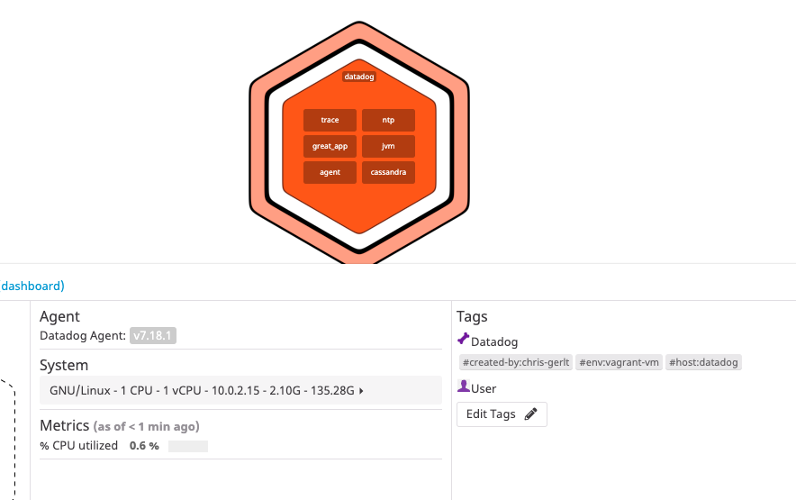

https://guides.github.com/features/mastering-markdown/

# Answers

**Name: Christopher Gerlt**

**Position: SE**

## Collecting Metrics:

**1) Add tags in the Agent config file and show us a screenshot of your host and its tags on the Host Map page in Datadog.**

```
#inside /etc/datadog-agent.yaml
tags:
  - env:vagrant-vm
  - created-by:chris-gerlt
```




**2) Install a database on your machine (MongoDB, MySQL, or PostgreSQL) and then install the respective Datadog integration for that database.**

```
#install c*
echo "deb https://downloads.apache.org/cassandra/debian 36x main" | sudo tee -a /etc/apt/sources.list.d/cassandra.sources.list

curl https://downloads.apache.org/cassandra/KEYS | sudo apt-key add -
sudo apt-get update
sudo apt-get install cassandra
#set the listen_address and seeds to 192.168.50.50 in cassandra.yaml
```


**3)Create a custom Agent check that submits a metric named my_metric with a random value between 0 and 1000.  Change your check's collection interval so that it only submits the metric once every 45 seconds.**

```
cat /etc/datadog-agent/checks.d/custom_int_check.py
import random
# the following try/except block will make the custom check compatible with any Agent version
try:
    # first, try to import the base class from new versions of the Agent...
    from datadog_checks.base import AgentCheck
except ImportError:
    # ...if the above failed, the check is running in Agent version < 6.6.0
    from checks import AgentCheck

# content of the special variable __version__ will be shown in the Agent status page
__version__ = "1.0.0"

class HelloCheck(AgentCheck):
    def check(self, instance):
        self.gauge('great_app.chris_metric', random.randint(0,1000), tags=['TAG_KEY:TAG_VALUE'])

cat /etc/datadog-agent/conf.d/custom_int_check.yaml
init_config:

instances:
  - host: datadog
  - min_collection_interval: 45

sudo chmod 755 /etc/datadog-agent/checks.d/custom_int_check.py
```


**Bonus Question Can you change the collection interval without modifying the Python check file you created?**

This can be done by changing the global default to another value.  The default is located below.

```
vagrant@datadog:~$ sudo cat /etc/datadog-agent/datadog.yaml | grep jmx_check_period
## @param jmx_check_period - integer - optional - default: 15000
# jmx_check_period: 15000
```

## Visualizing Data:


**1) Utilize the Datadog API to create a Timeboard that contains:**

* Your custom metric scoped over your host.
* Any metric from the Integration on your Database with the anomaly function applied.
* Your custom metric with the rollup function applied to sum up all the points for the past hour into one bucket
* Please be sure, when submitting your hiring challenge, to include the script that you've used to create this Timeboard.

Once this is created, access the Dashboard from your Dashboard List in the UI:

* Set the Timeboard's timeframe to the past 5 minutes
* Take a snapshot of this graph and use the @ notation to send it to yourself.


**Bonus Question: What is the Anomaly graph displaying?**

The anomly graph uses an algorithm to determine the "normal" range of the given metric, and then provides color indicating when the metric strays from this normal range.

```
{
    "title": "Great App Dashboard for SE Exercise",
    "widgets": [
        {
            "definition": {
                "type": "timeseries",
                "requests": [
                    {
                        "q": "max:great_app.chris_metric{host:datadog}"
                    }
                ],
                "title": "Great App - Chris Metric!"
            }
        },
        {
            "definition": {
                "type": "timeseries",
                "requests": [
                    {
                        "q": "max:great_app.chris_metric{host:datadog}.rollup(sum, 3600)"
                    }
                ],
                "title": "Great App - Chris Metric! - Rollup(sum, 3600)"
            }
        },       
       {
            "definition": {
                "type": "timeseries",
                "requests": [
                    {
                        "q": "anomalies(avg:cassandra.db.droppable_tombstone_ratio{*}, 'basic', 0.5)"
                    }
                ],
                "title": "Cassandra Droppable Tombstone Ratio - Anomalies"
            }
        },        
             {
            "definition": {
                "type": "timeseries",
                "requests": [
                    {
                        "q": "anomalies(max:cassandra.latency.75th_percentile{*}, 'basic', 2)"
                    }
                ],
                "title": "Cassandra Client Request Latency 75th - Anomalies"
            }
        },
           {
            "definition": {
                "type": "timeseries",
                "requests": [
                    {
                        "q": "anomalies(max:jvm.thread_count{*}, 'basic', 2)"
                    }
                ],
                "title": "JVM Thread Count - Anomalies"
            }
        }
        
    ],
    "layout_type": "ordered",
    "description": "Chris Dashboard via API",
    "is_read_only": true,
    "notify_list": [
        "chris.gerlt@gmail.com"
    ],
    "template_variables": [
        {
            "name": "host",
            "prefix": "host",
            "default": "<HOSTNAME_1>"
        }
    ],
    "template_variable_presets": [
        {
            "name": "Saved views for hostname 2",
            "template_variables": [
                {
                    "name": "host",
                    "value": "<HOSTNAME_2>"
                }
            ]
        }
    ]
}
```

## Monitoring Data

Since you’ve already caught your test metric going above 800 once, you don’t want to have to continually watch this dashboard to be alerted when it goes above 800 again. So let’s make life easier by creating a monitor.

Create a new Metric Monitor that watches the average of your custom metric (my_metric) and will alert if it’s above the following values over the past 5 minutes:

Warning threshold of 500
Alerting threshold of 800
And also ensure that it will notify you if there is No Data for this query over the past 10m.
Please configure the monitor’s message so that it will:

Send you an email whenever the monitor triggers.

Create different messages based on whether the monitor is in an Alert, Warning, or No Data state.

Include the metric value that caused the monitor to trigger and host ip when the Monitor triggers an Alert state.

When this monitor sends you an email notification, take a screenshot of the email that it sends you.

Bonus Question: Since this monitor is going to alert pretty often, you don’t want to be alerted when you are out of the office. Set up two scheduled downtimes for this monitor:

One that silences it from 7pm to 9am daily on M-F,
And one that silences it all day on Sat-Sun.
Make sure that your email is notified when you schedule the downtime and take a screenshot of that notification.


## Collecting APM Data:

Given the following Flask app (or any Python/Ruby/Go app of your choice) instrument this using Datadog’s APM solution:
Bonus Question: What is the difference between a Service and a Resource? Provide a link and a screenshot of a Dashboard with both APM and Infrastructure Metrics.  Please include your fully instrumented app in your submission, as well.

Dashboard Link: https://p.datadoghq.com/sb/mmlfs8396gbzdg4y-789b5d6f3f5b9c70f6840ac662c6db6f


```
from flask import Flask
import logging
import sys
from ddtrace import tracer
from ddtrace.constants import ANALYTICS_SAMPLE_RATE_KEY

# Have flask use stdout as the logger
main_logger = logging.getLogger()
main_logger.setLevel(logging.DEBUG)
c = logging.StreamHandler(sys.stdout)
formatter = logging.Formatter('%(asctime)s - %(name)s - %(levelname)s - %(message)s')
c.setFormatter(formatter)
main_logger.addHandler(c)

app = Flask(__name__)

@app.route('/')
def api_entry():
    return 'Entrypoint to the Application'

@app.route('/api/apm')
def apm_endpoint():
    return 'Getting APM Started'

@app.route('/api/trace')
def trace_endpoint():
    span = tracer.current_span()
    span.set_tag(ANALYTICS_SAMPLE_RATE_KEY, True)
    return 'Posting Traces'

@app.route('/shopping_cart/<int:customer_id>')
#@login_required
def shopping_cart(customer_id):
    # Get the active span
    current_span = tracer.current_span()
    current_span.set_tag(ANALYTICS_SAMPLE_RATE_KEY, True)
    if current_span:
        # customer_id -> 254889
        current_span.set_tag('customer.id', customer_id)
        return "Hello Customer  %s" % customer_id

if __name__ == '__main__':
    app.run(host='0.0.0.0', port='5050')
```

The difference between a service and a resource is a service is a system process where a resource is an endpoint for an api.

## Final Question:

Datadog has been used in a lot of creative ways in the past. We’ve written some blog posts about using Datadog to monitor the NYC Subway System, Pokemon Go, and even office restroom availability! Is there anything creative you would use Datadog for?

**It would be interesting to monitor drone deliveries by amazon once that becomes a reality!**
