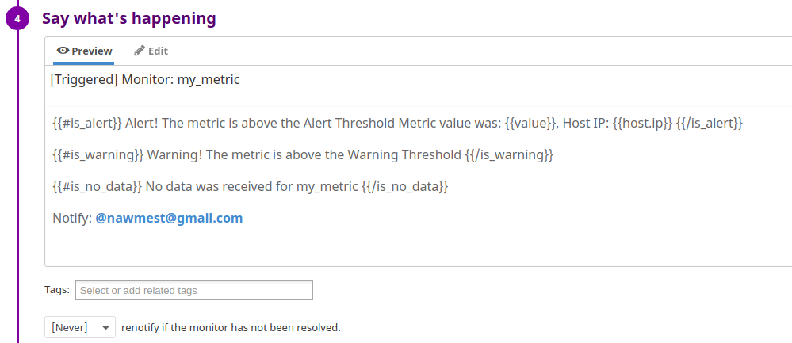

# Nawfel Mestoui - DataDog Technical Test

## Prerequisites - Setup the environment
I am using my current OS Ubuntu 17.10 to complete this exercise.
</img>
### Installing Datadog agent
After sign in to Datadog, I did <a href="https://app.datadoghq.com/account/settings#agent/ubuntu">install Datadog agent</a> for Ubuntu:
</img>

## [](https://github.com/DataDog/hiring-engineers/tree/solutions-engineer#collecting-metrics)Collecting Metrics:

### Add tags in the Agent config file
After updating the configuration file `/etc/datadog-agent/datadog.yaml`, we can see the host and the new tags from Host Map page in Datadog:
</img>

### Installing Datadog integration for MongoDB
In my current machine I have already MongoDB Community Edition v3.6.6, <a href="https://docs.mongodb.com/manual/tutorial/install-mongodb-on-ubuntu/"> here are instructions to install it on Ubuntu</a>

To check if the database is active:
`service mongod status`
</img>

In order to install Datadog integration for MongoDB, I followed the instuctions from this <a href="https://app.datadoghq.com/account/settings#integrations/mongodb">page</a>:

After adding a read-only user administrator for datadog (to collect complete server statistics),
and after running verification commands from the instructions page, I get this result:
</img>

The second part of the integration is to configure the Datadog Agent to connect to my MongoDB instances, for that I need to update the configuration file `/etc/datadog-agent/conf.d/mongo.yaml`

After restarting Datadog service, I can check that MongoDB is well Integrated:

By typing "mongoDb" in the <a href="https://app.datadoghq.com/metric/summary"> metrics summary page</a>, we can see all the MongoDb metrics.
</img>

And also if we check the <a href="https://app.datadoghq.com/dashboard/lists">dashboard list page <a/> we can see that MongoDb is present in the list:
</img>

### Creating a custom Agent check
To have a custom Agent check, I create 2 files: `my_check.yaml` in `/etc/datadog-agent/conf.d/` and the pyhton script `my_check.py` in `/etc/datadog-agent/checks.d/`

#### my_check.yaml
```
init_config:
	min_collection_interval: 45
instances:
    [{}]
 ```   
min_collection_interval can be added to the init_config section to help define how often the check should be run globally, in this case it's set to 45.

##### my_check.py
```
from checks import AgentCheck

import random


class HelloCheck(AgentCheck):

    def check(self, instance):
        self.gauge('my_metric',random.randint(0, 1000)
```
The check class inherits from AgentCheck and send a gauge of a random number for the metric 'my_metric' on each call.

#### Bonus Question: the collection interval is set in the yaml file of our Agent check


## Visualizing Data:
The first step was to get an Application key from the <a href="https://app.datadoghq.com/account/settings#api">APIs page</a>
</img>

The new timeboard will contain:

the new metric: my_metric

'my_metric' with the rollup function applied to sum up all the points for the past hour into one bucket

MongoDb Total number of connections created
	
Find more about Timeboard creation <a href="https://docs.datadoghq.com/api/?lang=python#create-a-timeboard">here</a>

```
from datadog import initialize, api

options = {
    'api_key': 'b94670e66009a0332312afdeec0ca939',
    'app_key': 'cbdd2353176dfca0df90a7558e10067c255ccc4a'
}

initialize(**options)

title = "Nawfel Timeboard"
description = "New timeboard to visualise our new metrics"
graphs = [{
	"definition": {
		"viz": "timeseries",
		"requests": [
       		  {
               		"q": "avg:my_metric{host:nawmest-Aspire-E5-575G}",
               		"type": "line",
               		"style": {
                       		"palette": "dog_classic",
                       		"type": "solid",
                       		"width": "normal"
               		},
               		"conditional_formats": [],
               		"aggregator": "avg"
       		  }
        	],
   	},
    	"title": "my_metric random values"
},
{
   	"definition": {
  		"viz": "timeseries",
  		"requests": [
    		  {
      			"q": "avg:my_metric{host:nawmest-Aspire-E5-575G}.rollup(sum, 3600)",
      			"type": "line",
      			"style": {
        			"palette": "dog_classic",
        			"type": "solid",
        			"width": "normal"
      		  	},
      		"conditional_formats": [],
      		"aggregator": "avg"
    		  }
  		],
	},
	"title": "Sum of my_metric over 1h"
},
{
        "definition": {
                "viz": "timeseries",
                "requests": [
                  {
			"q": "anomalies(avg:mongodb.connections.totalcreated{host:nawmest-Aspire-E5-575G}, 'adaptive', 2)",
                        "type": "line",
                        "style": {
                                "palette": "dog_classic",
                                "type": "solid",
                        	"width": "normal"
                        },
                "conditional_formats": [],
                "aggregator": "avg"
                  }
                ],
        },
        "title": "MongoDb Total number of connections created"
}]

read_only = True
api.Timeboard.create(title=title,
                     description=description,
                     graphs=graphs,
                     read_only=read_only)
```
### Taking a snapshot of the graph
I took a snapshot of the graph by clicking on the camera icon, and select my email using @ notation and send it to myself.
</img>

</img>

### Bonus Question: What is the Anomaly graph displaying?
The highlighted area in the graph represent the expexted range of the metric based on previous values, so anything outside that range is an anomaly.

## Monitoring Data:

I created a new Metric Monitor that watches the average of your custom metric (my_metric) and will alert if it’s above the following values over the past 5 minutes:

Warning threshold of 500
Alerting threshold of 800
And also ensure that it will notify you if there is No Data for this query over the past 10m.

</img>

Send you an email whenever the monitor triggers.
Create different messages based on whether the monitor is in an Alert, Warning, or No Data state.
Include the metric value that caused the monitor to trigger and host ip when the Monitor triggers an Alert state.

</img>

### Bonus Question:
Set up two scheduled downtimes for this monitor:
Scheduled downtimes are set up from this <a href="https://app.datadoghq.com/monitors#/downtime">page</a>

One that silences it from 7pm to 9am daily on M-F
</img>

And one that silences it all day on Sat-Sun.
</img>
