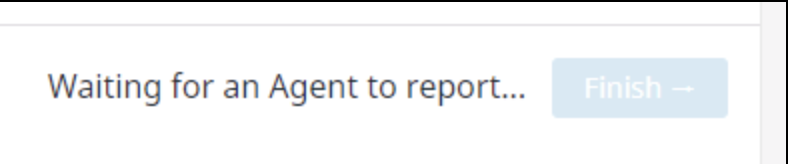

Your answers to the questions go here.

# These Answers by Stephen Roe

Candidate for Solution Engineer in London

*my hobby github account is p6steve, email is stephen.john.roe@gmail.com*

*link to this repo provided by Nick Elwell*

## Prerequisites

My personal setup...

1. My home laptop is OSX, could spin up Docker on that machine, but...
2. I already have a LAMP build (Ubuntu 18.04 / Apache2 / mysql / PHP, Python) live on AWS to run Wordpress - so let's instrucment that with the DataDog Agent and connect from OSX as client

### Sign Up for DataDog, Install Agent & Connect

Just used `> sudo DD_AGENT_MAJOR_VERSION=7 DD_API_KEY=7b108d7...`  That was smooth!

### Get the Agent Reporting Metrics from your (local) Machine

Successful initial report from DD agent on app.datadoghq.eu webpage, including some custom tags...

## Collecting Metrics

Adding tags to the DD Agent config file...

`tags:
    - "<p6steve_build>:<1.0>"
    - "<p6steve_url>:<henleycloudconsulting.co.uk>"
    - "<p6steve-ssl>:<on>"`
    
*rather an unusual yaml format*

## Adding MySQL Integration

Adding user...
`mysql: [Warning] Using a password on the command line interface can be insecure.
Uptime	353341
Uptime_since_flush_status	353341`

Tweaking privileges...
`issing REPLICATION CLIENT grant\033[0m"
mysql: [Warning] Using a password on the command line interface can be insecure.
MySQL grant - OK`

