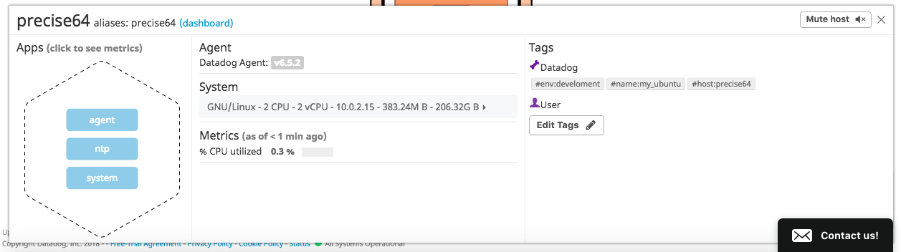
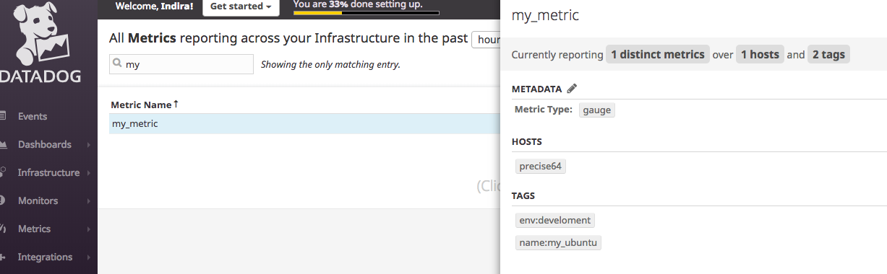

Indira Williams | Solutions Engineer Candidate

## Environment Set-up
1: Download Vagrant (Make sure its the correct version for your operating system)

2: Download VirtualBox

3: Follow the prompts to install both Vagrant & VirtualBox

4: Run the commands to get Vagrant up & running
	$ vagrant init hashicorp/precise64
	$ vagrant up

5: SSH into vagrant VM by running “vagrant ssh” in the command line
(Side note: terminate the VM by typing “vagrant destroy” into the command line)


6: Sign up for DataDog

7: Install Agent for the proper environment (Ubuntu)

8: Click “Finish” and your "Events" page should look like this:


## Collecting metrics
1: Add tags to config file:


Host map with tags:



2: Integrations (I chose Postgres)

3: Create a custom Agent check that submits a metric named my_metric


my_metric screenshot:


Bonus Question: Can you change the collection interval without modifying the Python check file you created?
Answer: Add ‘min_collection_interval’ to yaml file under init_config.

## Visualizing Data
Create dashboard with graphs using API request:


Set time to last 5 mins, take screen shot, send to self using @ notation:


Sending to self:


Bonus Question: What is the Anomaly graph displaying?
Answer: Any unusual activity

## Monitoring Data
1: Create new metric monitor
2: Set Warning & Alerting thresholds
3: Configure notification

Notification Received:


## Collecting APM Data
APM - https://docs.datadoghq.com/tracing/setup/
- Installed the agent
- Installed the `ddtrace` gem into an existing rails application


- Created the initializers/datadog.rb file in the rails project and added the configuration details:
```ruby
 Datadog.configure do |c|
   c.use :rails, service_name: 'booze_app'
  end
```
- Downloaded the tracing agent (https://github.com/DataDog/datadog-trace-agent#run-on-osx)
- Set enabled the APM in datadog.yaml
```yaml
apm_config:
    enabled: true
```
- Started the rails app
- Started the datadog-agent and the tracing agent
- Clicked around the app and saw the tracing logs

APM Services:


APM UI (1):


APM UI (2):


#### Link to GitHub Repo for Rails App used in this section:
https://github.com/iwilliams83/booze_app

## Final Question
Is there anything creative you would use Datadog for?

Answer: Monitoring the lines at my favorite food spots to get an idea of ideal times to get grub.
OR
Monitoring traffic on retailers' websites to see when there's a sale or promo happening.
