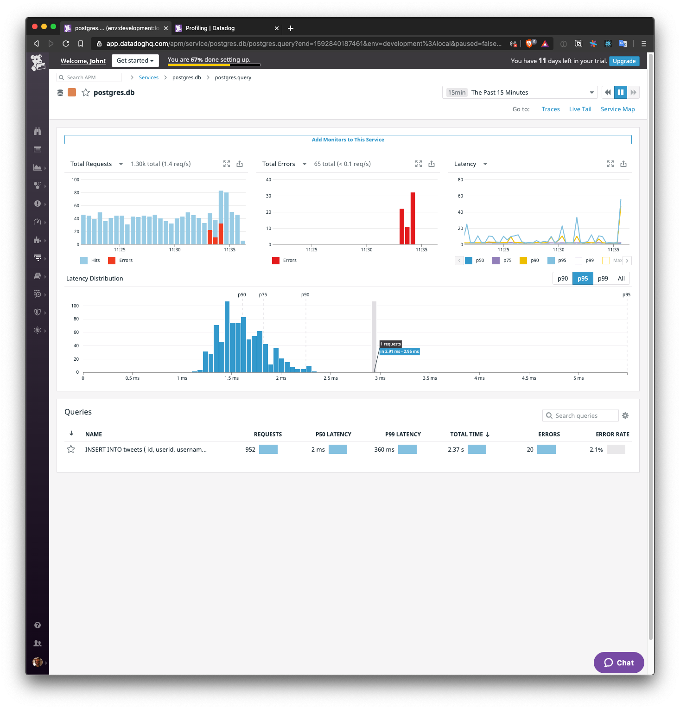

# Overview

This exercise has been really fun!

I can really appreciate how easy Datadog has made collecting metrics on every level. The Datadog Agent gives you deep
insight into every host by default. Integrations allow you to inspect every minute detail on nearly every OSS, cloud,
and SaaS service you can imagine with little configuration. APM gives you the power to track custom metrics and trace
custom applications and services. To top it all off, at every level, logs are collected and correlated with the host,
service, resource, and any custom tags of your choice.

Datadog has effectively created a real-time debugger for an entire business! I'm not just talking about the engineering
side of the house, either. With a few more integrations with services like Stripe and Paypal, executives could have a
live view of their KPIs!

I've created a final Timeboard to visualize a lot of the infrastructure, hosts, and services. You can find it
[here](https://p.datadoghq.com/sb/6s03fdxvlge0lgoi-07796019422cfc8a90e83326def76aed). Also included are bonus
screenshots at the [bottom in the last section](#bonus).

## Approach

I've chosen to model my solutions to the exercise as close to real-world as possible without getting overly complicated.
The goal was to create a solution that could concievably be used as a client-facing demo. What this means is that I've

- Created a "cluster" of multiple hosts
- Created a new service for each task that required custom code or configuration and ran it on its host machine

This allowed me to demonstrate the capabilities of Datadog much more thoroughly than I could when running everything
from a single host. Scoping, averaging, and applying functions across queries result in more meaningful graphs, and
tracking more basic metrics like CPU use could be measured accoss the entire cluster.

In addition to the elements of the exercise, I've created an extra few services to explore Datadog further.

`twitter_collector` is a service that listens to tweets about `#love` using the public Twitter streaming API. It saves
them into the PostgreSQL database and exposes an API to get the last 5 tweets sorted by tweet ID. It uses Datadog's APM
tools to automatically trace API requests and postgres queries. It also includes some manual Span tracing for good
measure. Since I focused on Python for the main part of the exercise, I decided to use GoLang, my other favorite
language 🤓

```bash
curl localhost:8082/tweets/last/5
```

I've used Docker a bunch in my career so, I wanted to see how it works with Datadog. To do that, I've containerized
`twitter_collector` on the respective host. The only thing you have to do to run it is build the Go binary on
your local machine before spinning up the VM. The full command on how to do this is in the [hosting](#hosting) section.

This service made the Live Tail feature of APM come to life. Diving into traces was super easy and fun. I also used it
as an opportunity to check out the new Profiling feature. Neat!

Finally, there is the `frontend`. I had originally intended to build a small web app, maybe using Flask/Jinja or
React/GatsbyJS, which used the `twitter_collector` API to display `#love` tweets every 30 seconds. I decided not to
complete this service due to scope and time constraints. It would have been cool, but the more I write, the more you
have to review, and I don't want to waste anyone's time. Given that the rest of the exercise is complete and I had
explored APM thoroughly, the `frontend` is just out of scope. 😭

## Environment

There are three hosts that fulfill the sections in the exercise and two hosts that I had some fun with.

1. `postgresql`
   - Hosts the PostgreSQL database and uses the Datadog Agent's Postgres integration
2. `chaos_engine`
   - Hosts the custom Datadog Agent check to generate a random value metric
3. `demo_api`
   - Collects APM data from the example Flask app
4. `twitter_collector`
   - Hosts a  golang APM app within a docker container that listens to a filtered stream of tweets containing `#love`
     and saves them to postgres
   - Has a queryable API to get the last 5 tweets (sorted by tweet ID)
5. `frontend`
   - A placeholder.
   - Was originally intended to host a simple web app that displayed the `#love` tweets and updated automatically every
     30 seconds.

These names are carried through the host and service to make correlation easier, e.g. `host:demo_api` and
`service:demo_api`.

### Hosting

All Ubuntu 18.04 hosts were created with [Vagrant](https://www.vagrantup.com/) and are stored and provisioned from the `agents`
directory. Each host has its own provisioning script and each script calls `baseline.sh` and `start.sh` to install,
configure, and start the services for common packages and the Datadog Agent.

> In the real world, you'd likely use Terraform, Ansible, Chef, or a similar tool to handle provisioning. To keep it
> simple I just used bash scripts. I also decided to use `sed` to configure the Datadog Agent when necessary instead of
> maintain custom configs across each host for the same reason.

Vagrant will mount the respective app in the `apps` directory of this repository to `/app` on the appropriate host. For
example, `apps/demo_api/` will be mounted at `/app` in the `demo_api` host. The VM is configured this way so I could
do development while the machine was running and easily restart services on the host without having to reprovision
the machine and/or transfer the modified files to the host.

### Start the "cluster"

1. [Install Vagrant](https://www.vagrantup.com/intro/getting-started)
2. [Install GoLang]()
3. [Create a Twitter App](https://developer.twitter.com/en/apps), generate its access token, and save both the key and
   token values/secrets for step 4
4. `cd ./apps/twitter_collector` and run
   `GOOS=linux GOARCH=amd64 go build -o ../../agents/provisioning/twitter_collector/twitter_collector_linux ./cmd/twitter_collector`
3. `cd ./agents`
4. Set the following environment variables or prepend them to step 5
   * DD_API_KEY
   * TWITTER_CONSUMER_KEY
   * TWITTER_CONSUMER_SECRET
   * TWITTER_ACCESS_TOKEN
   * TWITTER_ACCESS_SECRET
5. Run `vagrant up`

After the machines are up, you will start seeing metrics in the Datadog UI. You can create a simple Dashboard for them
using the python script in `apps/dashboards/custom_metrics/`. The tag `interviewee:john@jrichter.io` has been applied to
every Agent to make it easy to identify metrics collected from this exercise submission. The `env` has been set to
`development:local` on all Agents as well.

# Answers
## Collecting Metrics

### Step 1 (Host Map)

I couldn't capture all the tags in the screenshot. Here is a list (excludes autogenerated `host` tags)

- `role:chaos`
- `role:data-collection`
- `role:demo:api`
- `role:storage`
- `role:web`,
- `env:development:local`
- `interviewee:john@jrichter.io`


### Step 2 (Postgres)


### Step 3 & 4 (Custom Agent Check and Collection Interval)

See code in `apps/chaos_engine/` and `agents/provisioning/chaos_engine`.

> Can you change the collection interval without modifying the Python check file you created?

Yes, you can! Just edit the custom check's config file, in this case, `chaos_engine.d/chaos_engine.yaml` and add the
following:

```yaml
instances:
  - min_collection_interval: 45
```

By default, the Agent will call your check every 15 seconds. Special consideration should be taken when checks
take longer to complete than their collection interval. The Agent will attempt to run the custom check at least every
interval (in this case, 45 seconds). If the previous check is still running when the next attempt is made, the Agent
will **not** run the check.

While it would be possible to write a check that executes on its schedule programmatically, it is not recommended.
Such use cases would be better executed with custom applications and services using the Datadog API.

## Visualizing Data

### Part 1 (Timeboard via API)

See code in `dashboards/custom_metrics/create_visualizing_data_demo_timeboard.py` to create the timeboard.

### Part 2 (Viewing Timeboard in the UI)

I was unable to set the Timeboard's timeframe to `The past 5 minutes`, even while using the shortcuts (`5m`) in the
timeframe select box. The smallest available is `The past 15 minutes`. I was able to use the keyboard shortcuts
`Opt` + `[` or `]` to zoom in to the past 5 minutes as a specific time range. Additionally, I could not take a snapshot
of the entire Timeboard, but I was able to snapshot the graphs individually. I included one for the main `my_metric`
graph.


You can find the public Timeboard above [here](https://p.datadoghq.com/sb/6s03fdxvlge0lgoi-41ce1c9b1ef83628631a34c9657ab5be).

> What is the Anomaly graph displaying?

The Anomaly graph uses the historical data from your metrics to determine what range of values are expected **in the
future** and what values are not. It displays these ranges as "bands" around the graphed metric lines. These bands are
statistical deviations around the aggregated values in the given timeframe. They can be adjusted to have a wider or
narrower range to fit different use cases and expectations.

In essence, they allow you to visually determine when a host, system, service, or resource is misbehaving and enable
you to take action to triage and resolve any issues *while* they are happening.

In the Postgres example, the bgwriter write and sync times were historically 0 seconds. When a single query caused data
to be written the spike in write times the Anomaly function saw that as unexpected and labeled it as an anomaly, i.e.
colored that part of the graphed line red.

## Monitoring Data

### Step 1 (Creating a Monitor)


### Step 2 (Alert Emails and Downtime)

Subject:

```
Chaos in my_metric {{#is_alert}}has reached critical levels{{/is_alert}}{{#is_warning}}is getting too high{{/is_warning}}{{#is_no_data}}is unknown{{/is_no_data}}{{#is_recovery}}is back to normal{{/is_recovery}}!
```

Message:

```
@john@jrichter.io,

{{#is_alert}}
`my_metric` has reached unsustainable levels ({{value}}!). Unfortunately, there is nothing you can do except blame {{host.ip}}  ☹️

With any luck order will be restored soon!
{{/is_alert}}

{{#is_warning}}
`my_metric` is way too high ({{value}}), but we can handle it for now. {{host.ip}} is getting rowdy.

🤞 it doesn't keep climbing!
{{/is_warning}}

{{#is_no_data}}
We aren't receiving any data from `my_metric`. This could be good... or it could be bad. It depends if you like troubleshooting chaos or not.

Make sure that all chaos metric generators, such as the `chaos_engine` Agent check, are running on the `chaos_engine` host ({{host.ip}}).
{{/is_no_data}}

{{#is_recovery}}
Rest easy my friend. `my_metric` and {{host.ip}} found their joy.
{{/is_recovery}}

Good luck and god speed 🖖
```


> Since this monitor is going to alert pretty often, you don’t want to be alerted when you are out of the office. Set up two scheduled downtimes for this monitor


## Collecting APM Data

I chose to use `ddtrace-run` to instrument the provided Flask app. The code can be found in `apps/demo_api/`. The app is
configured as a system service on the host `demo_api` and started during the VM provisioning process. It is exposed by
Vagrant on the host at `localhost:8081`.

I ran a bunch of [API benchmarks](https://github.com/wg/wrk) against each resource of the API as well as a non-existent
resource to generate 404 responses. This made the graphs pretty 🤓

```
wrk -t12 -c400 -d1h --latency localhost:8081/
wrk -t12 -c400 -d1h --latency localhost:8081/api/apm
wrk -t12 -c400 -d1h --latency localhost:8081/api/trace
wrk -t12 -c400 -d5m --latency localhost:8081/api/nope
```

I had some trouble getting logging correlating with the resource/request traces. I tried a few different methods of
configuring the Python logger (`basicConfig()` and configuring the root logger directly), but had no luck.

You can find the public Timeboard above [here](https://p.datadoghq.com/sb/6s03fdxvlge0lgoi-882221b93f75c1f3ded01691ee211c81).


> What is the difference between a Service and a Resource?

A `service` is the equivalent of a program. In this case it is a REST API running as a Flask app. When we ran our API
with `ddtrace-run` it considers the python file it executed, `apps/demo_api/api.py`, as the `service`.

A `resource` is a component of a service that is used internally by the `service`, externally by other `services`, or
both. These are typically programmatic APIs (i.e. functions, methods). In the case of our demo API our `resources`
are the publically accessible endpoints (`/`, `/api/apm`, and `/api/trace`). These endpoints are just traced functions
within the `demo_api` service. Due to Datadog's integration with Flask, we can see how fast our API can handle requests,
how many requests happen over time, and much more automagically!

## Ingenious Datadoggos

> Is there anything creative you would use Datadog for?

1. Fresh off of my first entrepreneurial venture, one of the first things I wanted to use Datadog for was tracking
   business KPIs. I think it would be possible to build [Baremetrics](https://baremetrics.com/) *within* Datadog - for a
   single business, at least. The only thing missing are integrations with the popular payment platforms like Stripe and
   Paypal.

2. You could use Datadog to track the position of a racecar on a racetrack as a function of time. I believe you would
   be able to correlate this with other in-car data to figure out how to improve your lap times.

3. My local river can fluctuate between `safe to swim` and `not safe to swim`. It would be cool to have sensors anchored
   around the river capturing water-health data and feeding that data into Datadog. Graphs and Monitors could be used to
   show thresholds of safety. If they were publically available on a timeboard, this would make our community's lives
   easier.

4. You could probably build an [IFTTT](https://ifttt.com/) clone using Datadog to track and alert on certain conditions.
   I wanted to turn on my [Nanoleaf](https://nanoleaf.me/en/) lights on and automatically set them to the appropriate music
   visualization setting if music was playing in the same room. Bonus points if I could set the to a different
   visualizer depending on the genre of music being played!

# Bonus



