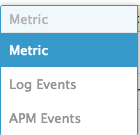

*Your answers to the questions go here.*

Thanks for the oppurtunity to complete the tech challenge!  Please see my results inline.

## Vagrant Config
To start off the exercise I setup the most basic possible Ubuntu 16.04 Vagrant config:

```ruby
Vagrant.configure(2) do |config|
  config.vm.box = "ubuntu/xenial64"
  config.vm.network "public_network"
end
```

I ran `vagrant up`, waited for the box to download, and moved onto the next step.

> **Note**: I use the combination of vagrant/Virtualbox all the time so I already had the components installed on my mac

## Signing Up
I completed the signup, but I did skip the survey as to not add 'junk' to your system since this is just a test account.

## Getting the agent installed
After the vagrant box came up I grabbed an ssh session via `vagrant ssh`.  Following the instructions of the `Install your first Datadog Agent` wizard; I ran the following command: 
  ```bash
  DD_API_KEY=<redacted> bash -c "$(curl -L https://raw.githubusercontent.com/DataDog/datadog-agent/master/cmd/agent/install_script.sh)"```
  ```
After that completed successfully I verified that the agent was running (as described in the post-install text):
  ```console
  vagrant@ubuntu-xenial:~$ sudo systemctl status datadog-agent
  ● datadog-agent.service - "Datadog Agent"
     Loaded: loaded (/lib/systemd/system/datadog-agent.service; enabled; vendor preset: enabled)
     Active: active (running) since Fri 2018-06-15 13:45:30 UTC; 59s ago
   Main PID: 2942 (agent)
      Tasks: 9
     Memory: 21.8M
        CPU: 902ms
     CGroup: /system.slice/datadog-agent.service
             └─2942 /opt/datadog-agent/bin/agent/agent start -p /opt/datadog-agent/run/agent.pid
  ```
Back in the webui the `Finish` button was now 'clickable' and I continued.

## Collecting Metrics
See below for each section of the challenge.
### Add Tags
To add tags I first navigated to the `/etc/datadog-agent` location and started reviewed the `datadog.yaml` file to see how far I could get on my own (before consulting docs).  I found this in the example configuration file:

```
# Set the host's tags (optional)
# tags:
#   - mytag
#   - env:prod
#   - role:database
```

I entered a similar format into the datadog.yaml file and checked the tags assigned by navigating to the `Infrastructure` view in the WebUI and clicking on **Inspect** to get the details.  To my dismay, I didn't find the tags.  I tried restarting the agent (thinking maybe it didn't reload automatically when the config file is changed) but there was no impact.  Within the tooltip in the WebUI it said agent tags are submitted via setting in `dd-agent/datadog.conf` but I couldn't find that directory nor the file (tried to locate via mlocate).  It was time to hit the docs; my answer came on [this](https://docs.datadoghq.com/getting_started/tagging/assigning_tags/#assigning-tags-using-the-configuration-files) page.  The problem was that the `datadog.yaml` file doesn't actually accept the tags in this format (allow that is valid in other locations).  I updated my `datadog.yaml` file with tags as shown:

```yaml
tags: id:matt_laptop, env:testing, role:techchallenge, location:ohio, building:house
```

And here is the view of these glorious tags in the UI!


### Database Integration
I choose to install MySQL.  Installation was simple, completed via a basic apt command:

```bash
sudo apt-get update
sudo apt-get install mysql-client mysql-server
```

When prompted, I set the root password for the database.  Here is the result:
```console
vagrant@ubuntu-xenial:/etc/datadog-agent$ mysql -uroot -p
Enter password:
Welcome to the MySQL monitor.  Commands end with ; or \g.
Your MySQL connection id is 4
Server version: 5.7.22-0ubuntu0.16.04.1 (Ubuntu)

Copyright (c) 2000, 2018, Oracle and/or its affiliates. All rights reserved.

Oracle is a registered trademark of Oracle Corporation and/or its
affiliates. Other names may be trademarks of their respective
owners.

Type 'help;' or '\h' for help. Type '\c' to clear the current input statement.

mysql>
```

To install the integration I first navigated to the `Integrations` menu item, searched for `MySQL`, hovered over it, and finally clicked **Install**.  When the `MySQL Integration` page opened I navigated to the `Configuration` tab and followed the instructions(I did have to add user/pass to the commands supplied by the Wizard):

```bash
sudo mysql -uroot -p -e "CREATE USER 'datadog'@'localhost' IDENTIFIED BY '%BgoD7k2bNO9IFfiviG59Mgb';"
sudo mysql -uroot -p -e "GRANT REPLICATION CLIENT ON *.* TO 'datadog'@'localhost' WITH MAX_USER_CONNECTIONS 5;"
sudo mysql -uroot -p -e "GRANT PROCESS ON *.* TO 'datadog'@'localhost';"
sudo mysql -uroot -p -e "GRANT SELECT ON performance_schema.* TO 'datadog'@'localhost';"
```

I also successfully ran the validation scripts(results only shown here):

```console
MySQL user - OK
MySQL grant - OK
MySQL SELECT grant - OK
MySQL PROCESS grant - OK
```

I created conf.d/mysql.yaml with the following contents:

```yaml
init_config:

instances:
  - server: localhost
    user: datadog
    pass: '<redacted>'
```
Also, I adjusted the permissions to match the other files:

```bash
sudo chown dd-agent: mysql.yaml
```

Finally, I restarted the agent:

```bash
sudo systemctl restart datadog-agent
```

Back in the WebUI, I clicked on **Install Integration**.  As a final step, I ran `sudo datadog-agent check mysql` to validate that the check was working.

> **Note**: The copy/pasted config file from the WebUI did not work because it was invalid YAML. I had to put my password in single quotes to make the YAML valid.  After that the agent worked fine.

A quick screenshot of the working MySQL integration:


### Custom Metric
Since I've never worked with DataDog before my first step for this was to find the right documentation.  I ended up using this doc: [link](https://docs.datadoghq.com/developers/agent_checks/#your-first-check)

The resulting check in check.d:

```python
from checks import AgentCheck
import random

class MyMetricCheck(AgentCheck):
    def check(self, instance):
        self.gauge('my_metric', random.randint(0,1000))
```

And the corresponding config file (conf.d/my_metric.d/my_metric.yaml):

```yaml
init_config:


instances:
    [{}]
```

Running the check manually produces:

```console
$ sudo datadog-agent check my_metric
=== Series ===
{
  "series": [
    {
      "metric": "my_metric",
      "points": [
        [
          1529080703,
          552
        ]
      ],
      "tags": null,
      "host": "ubuntu-xenial",
      "type": "gauge",
      "interval": 0,
      "source_type_name": "System"
    }
  ]
}
=========
Collector
=========

  Running Checks
  ==============
    my_metric
    ---------
      Total Runs: 1
      Metrics: 1, Total Metrics: 1
      Events: 0, Total Events: 0
      Service Checks: 0, Total Service Checks: 0
      Average Execution Time : 0ms
```

#### Change the custom metric to 45 second collection interval
To change the interval I followed the guidance on this docs page: [link](https://docs.datadoghq.com/developers/agent_checks/#your-first-check).  My updated configuration file looked like this:

```yaml
init_config:

instances:
  - min_collection_interval: 45
```

Once I made these updates and restarted the agent I saw the following log messages confirming the change:

```console
Jun 15 17:01:12 ubuntu-xenial agent[6284]: 2018-06-15 17:01:12 UTC | INFO | (scheduler.go:72 in Enter) | Scheduling check my_metric with an interval of 45s
```

#### Bonus question: Can you change the collection interval without modifying the Python check file you created?
Yes, I would just adjust `min_collection_interval` to the appropriate value and restart the agent.

## Visualizing Data
For this challenge the first thing I needed to do was review the API guide; I started [here](https://docs.datadoghq.com/api/?lang=python#overview).  Since I was using my local mac to run these scripts I did have to add the `datadog` module to my machine, which I did via `pip install datadog`. Also, I had to (following the docs) go and collect my API key and generate a new application key to allow me to authenticate and use the API.
  
Once I got the basics working I turned to the API docs specific for Timeboards, specifically [this](https://docs.datadoghq.com/api/?lang=python#create-a-timeboard) doc.  In addition, I leveraged the function documentation found [here](https://docs.datadoghq.com/graphing/miscellaneous/functions/).
  
I had some problems getting the `anomalies` function, so I ended up building the query in the WebUI through the metrics page.
  
Once that was built, I completed my script [here](scripts/timeboard.py).  In the WebUI I navigated to the new timeboard and using `alt+]` set the timeframe down to 5 minutes.  From there I took a snapshot of the anomaly graph and included myself in the comment via `@` notation.  Here is the email I received:


### Bonus Question:  What is the Anomaly graph displaying?
The anomaly is displaying the data points that fall outside of a historically typical pattern.  In my case I'm using the `basic` algorithm so that I had data that showed up (vs agile or robust that require more historical data to account for longer trends)


## Monitoring Data
In the WebUI I headed over to `Monitors` -> `Manage Monitors` and clicked **New Monitor**.  I chose `Metric` and selected `my_metric` in this list, set `from` to `host:ubuntu-xenial` (my vm).
  
From there I filled in some more fields:
* **Alert Threshold**: `800`
* **Warning Threshold**: `500`
* **Notify if data is missing more than X minutes**: `10`
* Populated my email message using macros for alert and warning:


  
Here is an example of an email I received when it went status `warning`:


### Bonus Question: Downtime Schedule
To setup downtime I used the `Manage Downtime` UI under Monitors and configured as described. See the email below of the scheduled notification:


> **NOTE**: I intentionally bumped up the time so that it would start now and send an email


## Collecting APM Data
Before I could run this application I needed to setup a python environment on my Ubuntu system:

> **Note**: I followed the docs found [here](http://pypi.datadoghq.com/trace/docs/#module-ddtrace.contrib.flask) which is how I knew to install blinker and ddtrace

```bash
sudo apt-get install python3-venv
python3 -m venv ~/venv
source ~/venv/bin/activate
pip install wheel
pip install flask
pip install blinker
pip install ddtrace
```
  
Following the docs I made minimal changes to the app (diff below) - source is [here](scripts/app.py):


Here is the resulting screenshot of the dashboard with unified APM and Infra data:


> **Note**: Where's the link?  I see where if I create a screenboard I can generate a public link.  The problem I am having is that I cannot seem to add metrics to charts from APM sources(see screenshot below).  I was able to build charts and export them to timeboards, however.  So clearly I'm doing something wrong here.
>
> 
>
> The link directly to my timeboard is [here](https://app.datadoghq.com/dash/836839/apminfra-together?live=true&page=0&is_auto=false&from_ts=1529092035146&to_ts=1529095635146&tile_size=m)

## Bonus Question: What is the difference between a Service and a Resource?
A service represents the application (or service) itself, whereas each service may have many resources.  In this example, the resources are the different Flask routes: `/`, `/api/apm`, and `/api/trace`.


## Final Question
Given the example of monitoring bathrooms, it certainly made me consider all of the possibilities!!!  I was actually just discussing with my wife before the end of school how we wished we knew exactly when my daughters bus was coming - we've spent many a day camping out waiting for it to come, or missing it completely.  It'd be really nice to monitor its arrival time so we could do a bit better planning!  Not sure *how* I'd achieve that, but it sure would be nice!


