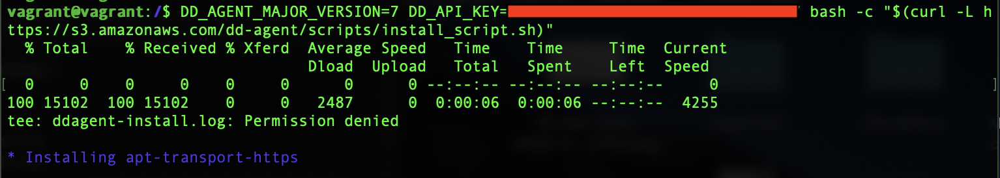
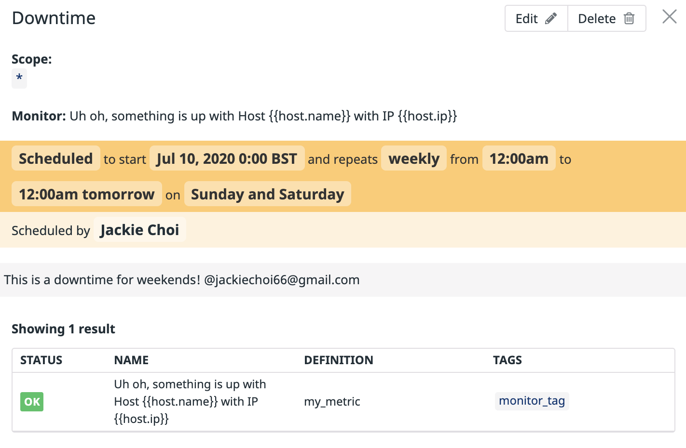
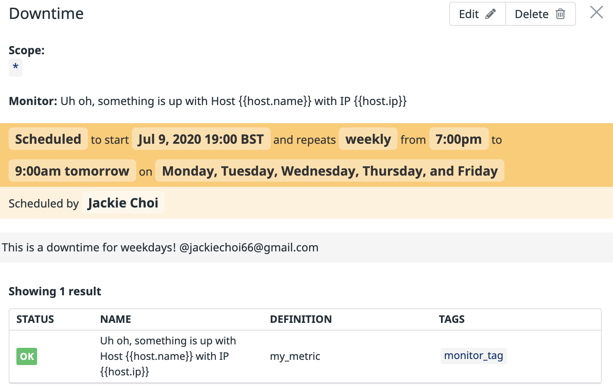

## Technical Exercise - Jackie Choi (https://www.linkedin.com/in/jackie-c-071b9b55/)

## Intro 

In this README, I'll walk through the configuration of the four following Datadog functionalities:
- Collecting Metrics
- Visualizing Data
- Monitoring Data
- Datadog APM

# 0. Prerequisites - Setup the environment

- localhost (OSX): One-step install with `DD_AGENT_MAJOR_VERSION=7 DD_API_KEY=[YOUR_API_KEY] bash -c "$(curl -L https://raw.githubusercontent.com/DataDog/datadog-agent/master/cmd/agent/install_mac_os.sh)"`
 

- vagrant (ubuntu 18.04): One-step install with `DD_AGENT_MAJOR_VERSION=7 DD_API_KEY=[YOUR_API_KEY] bash -c "$(curl -L https://raw.githubusercontent.com/DataDog/datadog-agent/master/cmd/agent/install_script.sh)"`
 

# 1. Collecting Metrics

## Add tags in the agent config file

I added tags to an agent by modifying `/etc/datadog-agent/datadog.yaml` as shown here:
 

Tags shown in the agent view:
 

## Install a database and integration

I installed the MySQL on the vagrat host. Then I prepared the server and created a database user for the Datadog Agent with the following `mysql> CREATE USER 'datadog'@'localhost' IDENTIFIED BY '<UNIQUEPASSWORD>';`

To start collecting my MySQL metrics and logs, I edited the mysql.d/conf.yaml file, in the conf.d/ folder at the root of my Agent’s configuration directory


MySQL is properly integrated:


## * Create a custom Agent check that submits a metric named my_metric with a random value between 0 and 1000.

To define a custom metric, I initially implemented the config file and my_metric.py file that returns a randomized value between 0 and 1000
 `/conf.d/my_metric.yaml` 

```
instances: [{}]
```
 `/checks.d/my_metric.py` 


## Changing check collection interval 
Please see below.

## *Bonus Question* Can you change the collection interval without modifying the Python check file you created?

To change the collection interval of my check without modifying the Python check file, I added min_collection_interval in the my_metric.yaml file. 


My_metric set up is confirmed:


# 2. Visualize Data

Using the Timeboard endpoints I programmatically created Timeboard (public URL: https://p.datadoghq.com/sb/k5p3uvk58fhvsb1a-5ead3443b83d701fceb6e2d8c9ed0bfd) that contains:

* Time series tracking my_metric on host:vagrant
* anomaly detection on the percentage of CPU time spent in kernel space by MySQL on host:vagrant
* A rollup sum of all my_metric values for the past hour


Script used to create the timeboard: new_timeboard.py(https://github.com/jc-uk/hiring-engineers/blob/jc-uk-patch-1/new_timeboard.py)

Once this is created, access the Dashboard from my Dashboard List in the UI:

* I set the Timeboard's timeframe to the past 5 minutes
* I took a snapshot of this graph and used the @ notation to send it to myself.


## What does Anomaly graph display?

The anomaly graph represents a methodology used to detect when metrics fall above or below an expected range. There are two parameters for this function, the Algorithm and Bounds. This function overlays a gray band on the metric showing the expected behavior of a series based on the past and will show if the metric value is falling outside the expected behavior. By analyzing a metric’s historical behavior, anomaly detection distinguishes between normal and abnormal metric trends.


# 3. Monitoring Data

I created a Metric Monitor that watches the average of my_metric and will alert if it’s above the following values over the past 5 minutes:

* Warning threshold of 500
* Alerting threshold of 800
* Notification if no data for 10mins
* Evalution window: 5mins

Below are screenshots of the alert configuration setup. 


And here's a screenshot of the WARNING email that I received, titled "Uh oh, something is up with Host vagrant with IP 10.0.2.15"


* **Bonus Question**: I configured downtime windows where this monitor won't file any alerts. 



For some reason the email notification did not fire off at the time of downtime scheduling. So I modified the existing schedule, which triggered an email notification.


# 4. Collecting APM data

First, I installed the Datadog Tracing library, ddtrace, using `pip3 install ddtrace`


Then to instrument the Flask application, I ran the following: `ddtrace-run python3 flask_app.py` (No changes were made to the sample Flask app)

To activate APM services, I restarted datadog-agent and started the flask_app.py using: 
```
FLASK_APP=app.py DATADOG_ENV=flask_test DD_RUNTIME_METRICS_ENABLED=true DD_TRACE_ANALYTICS_ENABLED=true ddtrace-run flask run --port=5050 --host=0.0.0.0
```


To simulate traffic on the app's endpoint, I ran the following
```
curl http://127.0.0.1:5050
curl http://127.0.0.1:5050/api/apm
curl http://127.0.0.1:5050/api/trace
```


I was able to confirm a successful setup by running `datadog-agent status`


And the APM is running and tracing on the dashboard:


Here's a [public link](https://p.datadoghq.com/sb/k5p3uvk58fhvsb1a-4bc1f4415a9557f71d86213b58904cf8) to a dashboard showing both APM and infrastructure metrics.


## Service vs Response

A Service refers to a grouping of endpoints or actions that form a unit of related functionality. For example, when a user request a URL on a web browser, a Domain Name Service performs the translation of the domain name into an IP address. This action is a service. 

A Resource is a component of a Service that accomplishes a more granular individual action. A service will leverage one or more resources to handle a given task. For example, a database (service) will need resources (cpu, memory, disk, network connection) in order to function.
In our case, each of the Flask endpoints such as `/api/apm` is a distinct Resource.


# Final Question

I'd love to see Datadog being utilized to monitor vehicle fault codes that could potentially prevent life-threatening accidents on the road.
There are a number of telematics companies whose vehicle gateway devices communicate directly with a vehicle but the fault code information gathered are often silo'ed and not acted upon at an infrastructure level. By leveraging Datadog's monitoring system, we could not only detect anomalies but also read patterns and predict future vehicle malfunction, depending on a particular model or make.
