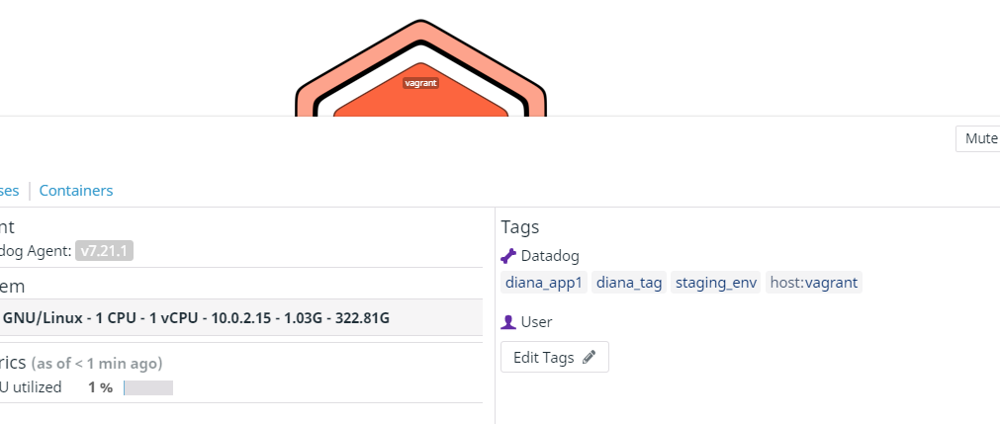
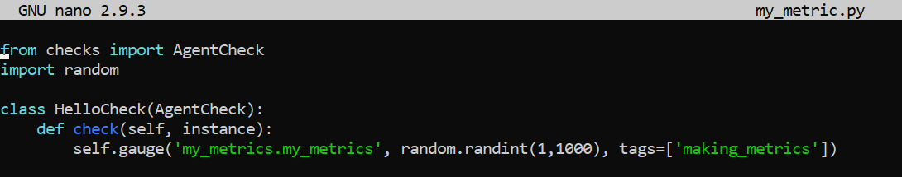
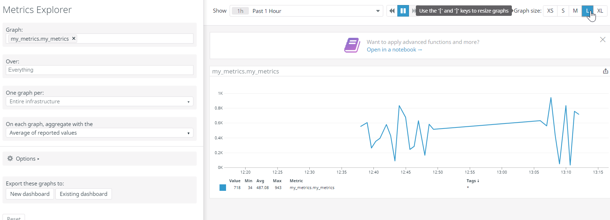

***Setting Up the Environment***

I spun up a Vagrant Ubuntu VM since I was using a Windows machine. I had no issues installing the Datadog agent with the single-step command.
images/vagrant_init.png

resource: https://app.datadoghq.com/account/settings#agent/ubuntu

***Collecting Metrics***
I installed vim.

Then, I added tags to the /etc/datadog-agent/datadog.yaml file. I had a little issue getting this to work at first because of some indentation issues.

INSTALL DATABASE & INTEGRATION
I chose MySQL as my database since I had some experience with it from college and followed the instructions via this resource:
	* https://app.datadoghq.com/account/settings#integrations/mysql

For some reason, I couldn't find the mysql.d/conf.yaml file. I had to create it and then fill it with example text from the DataDog documentation.

Here is a view of my database on the host map.

Creating My Metric Custom Agent Check
This was the first point of friction that I experienced in the exercise. I don't have much experience with Python so I had to utilize a few resources to feel confident editing the .py example script. I started by creating the /conf.d/my_metric.yaml to correspond with my /checks.d/my_metric.py file. I found a method called "randint" from a class called "random". I used this resource: https://www.w3schools.com/python/ref_random_randint.asp

I successfully updated the min_collection_interval to 45 seconds.

Bonus Question: Can you change the collection interval without modifying the Python check file you created?
Yes, this can be changed in the .yaml config file.

Other Resources Used:

	* https://docs.datadoghq.com/developers/write_agent_check/?tab=agentv6v7
	* https://datadoghq.dev/summit-training-session/handson/customagentcheck/
	* https://docs.datadoghq.com/developers/metrics/types/?tab=count
  * https://stackoverflow.com/questions/710551/use-import-module-or-from-module-import

***Visualizing Data***
Timeboard Public URL:https://p.datadoghq.com/sb/tih4blia4g5rapfz-a7a3536999bd52534f23fb4bd086b3af

<INSERT my_metric.py>

Here is a snapshot sent to myself of the Anomalies graph.

Resources:
https://docs.datadoghq.com/api/v1/dashboards/
https://docs.datadoghq.com/monitors/monitor_types/anomaly/
https://docs.datadoghq.com/dashboards/functions/rollup/

Bonus Question: What is the Anomaly graph displaying?
The Anomaly function identifies when a metric is behaving differently than it has in the past, taking into account trends and patterns. The graph in my timeboard is programmatically displaying database CPU anomalies and deviations from normal behavior.

***Monitoring Data***
See screenshots for the monitors I configured per instructions.
<INSERT IMAGES  of Monitor HERE>

<INSERT IMAGES OF EMAILS>

<INSERT IMAGES OF DOWNTIME FOR BONUS QUESTION>

***Collecting APM Data***
I installed ddtrace per these instructions (I had to upgrade pip and install flask first). I did not make any changes to the flask app.
Resource: https://app.datadoghq.com/apm/docs?architecture=host-based&language=python

And then executed the flask app provided:

I got a bit caught up when attempting to simulate traffic in the app and view the APM Services. I eventually realized that I needed simulate traffic to the app by opening a second terminal window since the one running the flask app was busy.

Bonus Question: What is the difference between a Service and a Resource?
 A service is a set of processes that do the same job (like a database or a group of endpoints). A resource is a particular action/component for a given service (typically an individual endpoint or database query).
 https://docs.datadoghq.com/tracing/visualization/#resources
 https://docs.datadoghq.com/tracing/visualization/#services

***Final Question***
Is there anything creative you would use Datadog for?

The worst part of being a human is having to go the DMV. I think that Dante would have made the DMV the first circle of hell if he had lived in modern times. The most altruistic application of Datadog APM would be to apply it's monitoring to DMV foot-traffic/check-ins. Leveraging Datadog's monitoring tools could help find patterns in DMV surge times, improve staffing and resource allocation, and alert community members with appointments of upticks in wait times. It could help everyone spend the smallest amount of time possible in the DMV and minimize human suffering.
