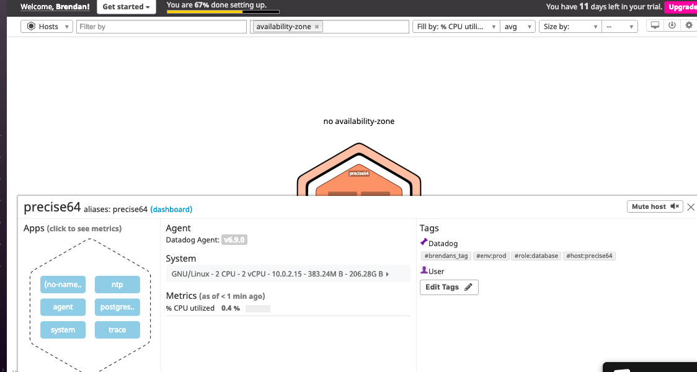
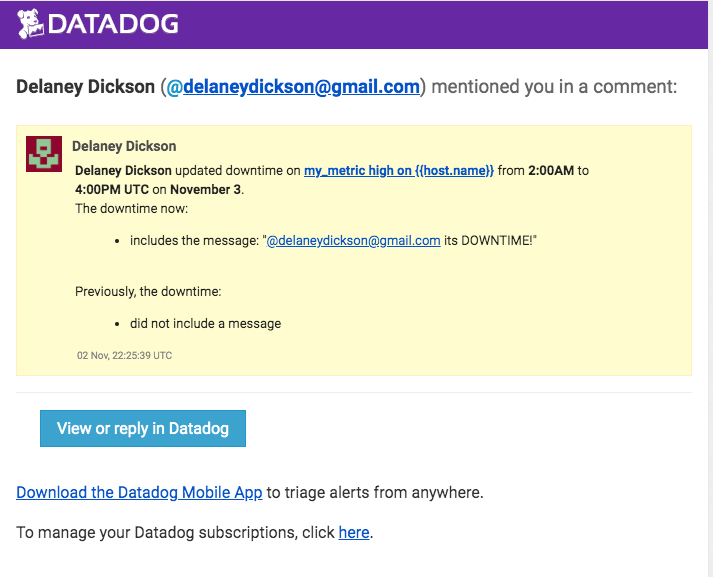
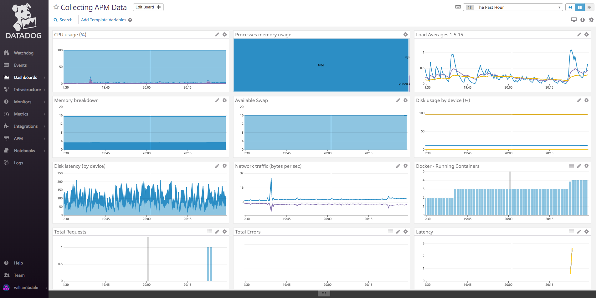

Your answers to the questions go here.

## Collecting Metrics:

I first attempted to write a custom tag in the datadog.yaml file, however I was using the improper format.  I was alerted by running the `sudo datadog-agent status` command.  I received an error stating that `mapping values are not allowed in this context` so I corrected the format and the tags are shown below:

I also found that the delay between changing the file then restarting the agent, and viewing the results in Datadog caused a bit of an issue in troubleshooting.  

### my_metric

When creating the metric, I looked at the Datadog Docs for [writing custom agent checks](https://docs.datadoghq.com/developers/write_agent_check/?tab=agentv6), as well as [custom metrics](https://docs.datadoghq.com/developers/metrics/custom_metrics/).  My only concern with this metric is that, according to the docs, the interval will not *always* be 45 seconds, but *as often as* 45 seconds.  In the interest of overall performance, I found this to be acceptable.  

my_metric.py:

    from checks import AgentCheck
    from random import random

    class HelloCheck(AgentCheck):
      def check(self, instance):
        self.gauge('random.number.gen', int(random()\*1000))
my_metric.yaml:

    init_config:

    instances:
      - min_collection_interval: 45

The metric shows the following data:

## Visualizing Data

### Timeboard using API

At first when interacting with the API, I did so exclusively through the CLI and [Postman](https://www.getpostman.com/).  I created a few test timeboards, monitors and metrics to test using the api, endpoints and syntax.  

After creating the timeboard using Postman and cURL, I wanted to investigate into other ways in which I might be able to create a timeboard.  I had been using Ubuntu on my PC because I was unable to download the VirtualBox on my Mac.  I had some experience working with Linux and Ubuntu, but I am much more comfortable with the Mac OS.  Once I moved through the challenge and arrived at the timeboard, I looked back and realized that my Docker was not installed properly.  I looked into this issue through various online resources and decided to reinstall Docker (I had done so through the CLI previously).  I attempted to reinstall Docker, however many of the dependencies were missing or unable to be installed.  I went throughout manually to attempt to install the missing packages from different places but There were permission or other dependency errors that I could not fix.  I then decided to try and fix my Mac so that it could load Vagrant.  After looking into many different resources and contacting friends, I found the issue to be a permissions error that was not apparent to me on the first install attempt.  I fixed this issue by forcing permissions from the terminal (not something that I typically do but i felt I had no other choice).  I was able to install VirtualBox.

After I installed Vagrant and VirtualBox, I read as much documentation on Vagrant and VirtualBox that I could find.  I read the docs from each provider, some blogs and some mock setups.  Also found some best practices and use cases, mainly for VirtualBox.  I then decided to look into Docker to see if I could fix the errors that I was running into.  

After reading the Docker docs, blogs and help sites, as well as Ubuntu docs and configuration sites, I was able to manually uninstall, clear and reinstall the packages.  I worked from the root to do so and that seemed to work well, though I feel like overriding the permissions could lead to a potential security issue.  

Once I got Docker up and running correctly, I played around with creating containers and doing a little experimenting with them, running apps and working with images. I wanted to recreate tags and metrics while using the docker so I redid those.  

`create timeboard from file: pip3 timeboard_test.py`

After attempting to create a timeboard from a python file, I was running into module errors.   Python could not find the necessary datadog module, so I attempted to install it using pip.  However pip was unable to import "name main".  I did some digging and found that I was using 2 different versions of pip (pip and pip3).  I was using pip to install the datadog module, however when I used pip3 it worked and I was able to run the file for the timeboard.

This was a step in the right direction because I was able to run files to interact with the API instead of cURL and Postman.  It makes reusability easier and allows for a better view as to how the exercises were implemented.  

To create the timeboard with the appropriate functions, I first created an anomaly monitor for system.load.1 to alert if the load drops below 0.05, and a warning set at 0.1.  After I created the monitor, i was able to see the query that was used.  I then modified the query to create an anomaly monitor on a new metric using the API directly.  For the initial test, I created a separate file to create the monitor on the system.load.15 metric with a threshold of 0.1.  I then ran the file to test and make sure that the monitor was showing up and working correctly on my account.  I believe that there may be a function that takes care of including the monitor directly in the timeboard but I could not find documentation on it.  I will continue to research to make sure.

Once I verified that my monitor was created correctly through the API, I moved on to applying the rollup to my_metric.  Through the docs, I read about the rollup and the implementation.  I appended the function to the metric query on the graph.

`{"q":"random.number.gen{\*}.rollup(sum,3600)"}`

I added monitor to the timeboard file so that the timeboard with my_metric and the metric with an anomaly function could all be created at once in a single location.  In the future, I might consider breaking these out (timeboard and monitor) into separate files and including them in one aggregate file for clarity and repeatability, however for demonstration and code flow readability, and since I would only be running this file once, I kept them in a single file.  I changed the timeboard data to reflect the new graph.  Below is the timeboard:

[Link to the timeboard](https://app.datadoghq.com/dash/1012686/timeboard-with-the-3-graphs?tile_size=m&page=0&is_auto=false&from_ts=1544205060000&to_ts=1544208660000&live=true)

The code is shown below:

    from datadog import initialize, api

    options = {
    'api_key': '3c658e247c0076099c7676f2d42460df',
    'app_key': '9afb3a081055cf3f3ef8a2d57d3ba9d0a9c72699'
    }

    initialize(\**options)

    api.Monitor.create(
      type="query alert",
      query="avg(last_5m):avg:system.load.5{host:william-Q325UA} < 0.15",
      name="Load of system.load.5",
      message="Load dropped below acceptable range of 0.15"
    )

    timeboard_title = "Timeboard with the 3 graphs"
    timeboard_description = "Timeboard created with my_metric, system.load.5 with anomaly monitor and my_metric with rollup function"
    timeboard_graphs = [{
       "definition": {
           "events": [],
           "requests": [
               {"q":"random.number.gen{\*}"}
           ],
           "viz": "timeseries"
       },
     "title": "Random Number Timeboard (scoped over host)"
    },
    {
       "definition": {
           "events": [],
           "requests": [
               {"q":"system.load.5{\*}"}
           ],
           "viz": "timeseries"
       },
       "title": "System load with monitor"
    },
    {
       "definition": {
           "events": [],
           "requests": [
               {"q":"random.number.gen{\*}.rollup(sum,3600)"}
           ],
           "viz": "timeseries"
       },
       "title": "Random Number Timeboard (with rollup functin applied)"
    }]

    read_only = True

    api.Timeboard.create(title=timeboard_title,
                    description=timeboard_description,
                    graphs=timeboard_graphs,
                    read_only=read_only)

### Bonus

To schedule downtime, I went into the downtime section via `Monitor > Manage Downtime`.  I created the first weekday schedule by applying the following settings:

Here is how the schedule appeared:

I assumed that having overlapping settings (such as 2 downtimes during Saturday and Sunday) would not cause an issue, so I set the downtime up for 9p - 7a everyday.

For the weekend, I applied the following settings:

Here is how the schedule appeared:

I set the downtime up to occur every 7 days starting at 12a on Saturday morning.  I could have set it from 9a - 7p since the weekday monitor would have been applied from 7p - 9a but I wanted to be explicit so that the monitor would not be dependent on each other and it would be apparent what each downtime schedule was applying to.

## Monitoring Data

I attempted to complete this part of the challenge using the API.  I was able to write a program that satisfied most of the conditions by using code examples in the API and the docs on creating monitors.  The code is shown below:

    from datadog import initialize, api

    options = {
      'api_key': '3c658e247c0076099c7676f2d42460df',
      'app_key': '9afb3a081055cf3f3ef8a2d57d3ba9d0a9c72699'
    }

    initialize(\**options)

    options = {
        "notify_no_data": True,
        "no_data_timeframe": 10
    }
    tags = ["app:webserver", "frontend"]

    thresholds = {
        'critical': 800,
        'warning': 500,
    }

    api.Monitor.create(
        type="metric alert",
        query="max(last_5m):random.number.gen{host:william-Q325UA} > 800",
        name="Bytes received on host0",
        message="{{#is_alert}}@williambdale@gamil.com The generator average is {{value}} from {{host.ip}} and is at an unacceptable level{{/is_alert}}{{#is_warning}}@williambdale@gamil.com The generator average is {{value}} from {{host.ip}} and is approaching a dangerous level{{/is_warning}}",
        tags=tags,
        options=options
    )

After the code implementation, I created a monitor using the UI.  

Here is the setup that I used:

After the monitor was created, I received the following email:

While waiting for an alert message, I was skeptical if I would see one since yielding an average of 800 over a 5 minute span at 45 second intervals using a random number generator between 0 and 1000 statistically would take a while.  I decided to temporarily change the alert threshold to 510 to make sure that the alert function was working as well.  Below is the alert message that I received:

The process to create the monitor was straight forward.  Using the [notification API](https://docs.datadoghq.com/monitors/notifications/?tab=is_alertis_warning), [metric monitor](https://docs.datadoghq.com/monitors/monitor_types/metric/) and [event stream](https://docs.datadoghq.com/graphing/event_stream/#events-email) I was able to correctly set up the monitor with the UI.  Translating the variables used in the UI setup to using the API was difficult.  I felt that I was spending too much time interacting with the backend trying to create a specific monitor using a single function call.  While going into the documentation however, being able to conditionally use CRUD functionality (create, read, update or delete) on monitors would prove useful for many applications.  You may only want to have a monitor for a set amount of time, after which you should delete it.  Or if you detect certain anomalies, create a second monitor (or graph, dashboard, etc.).

## Collecting APM Data

For the APM portion of the challenge, I decided to go with ddtrace as opposed to the Middleware.  When looking at the docs and the Discover Datadog APM section, I found that the ddtrace route was more deeply documented and had I felt that I would be better able to interact that way.

The first thing I did was to create a file named `flask_app.py` in which I placed the code for the flask app given in the challenge. I then uncommented the `apm_config: enabled:true` line in `datadog.yaml` file.  Next, I installed the ddtrace and then ran the app through ddtrace:

    $ pip3 install ddtrace
    $ ddtrace-run python3 flask_app.py

My concern then became my novice experience with Python.  Earlier in the challenge, Python had been one of the reasons for some of the errors I was receiving.  

After I ran the app with the ddtrace wrapper, I was able to see the metrics on the Datadog platform.  I cloned the Infrastructure dashboard to create one that I could edit and I attempted to add the metrics.  I then went to the APM Trace List on the platform and exported the metrics onto the cloned Infrastructure dashboard.  The link is below, followed by a screenshot of the dashboard:

[Dashboard](https://app.datadoghq.com/dash/1013053?tile_size=m&page=0&is_auto=false&from_ts=1544142600000&to_ts=1544146200000&live=true)

I will need to clarify if this is what the question was asking, however these are the metrics that I was able to find and display.  

## Final Question

This was a fun question to think about.  Especially being from a business and engineering background, I have taken several statistics, economics and data classes.  Hopefully my idea is a good one!

While I was hiking the Appalachian Trail for 5 months, I had a lot of time to think.  A lot of my thoughts revolved around methods to enhance the trail experience using different technologies and methods.  I think this would be a perfect place to use datadog.

I found that most, if not all hikers I met on the trail had a phone on them and were often GPS enabled.  Hiker locations could be mapped to a database with timestamps and latitude/longitude coordinates, and update every 10 minutes or so (anonymously).  Over the course of the 5-7 month trek, many different metrics could be received:

1. The average time taken to complete the Trail
2. Most often places stopped at
3. Busiest times of the year
4. The locations could be combined with weather metrics (through datadog as well) to see the impact of foul/fair weather on hiking patterns
5. The data could help local businesses see when to stock items or clear lodging for hikers which was sometimes an issue
6. Most common places hikers get lost (guilty, several times)
7. Any anomalies such as slow hikers which could indicate injury or lost hikers

Friends and family members could create dashboards to keep tabs on different behaviors set up by the hiker (speed, stopping places to receive packages) or they can create custom monitors and metrics to track other behaviors.

I have a hiking app that I created that I want to integrate with the Google maps API.  I think I will try to use Datadog and see if I can actually get this integration with some volunteers (a few thousand hike each year).

*All files and codes above are attached for convenience.*
