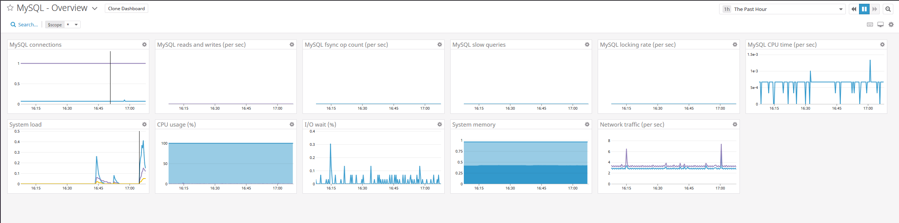
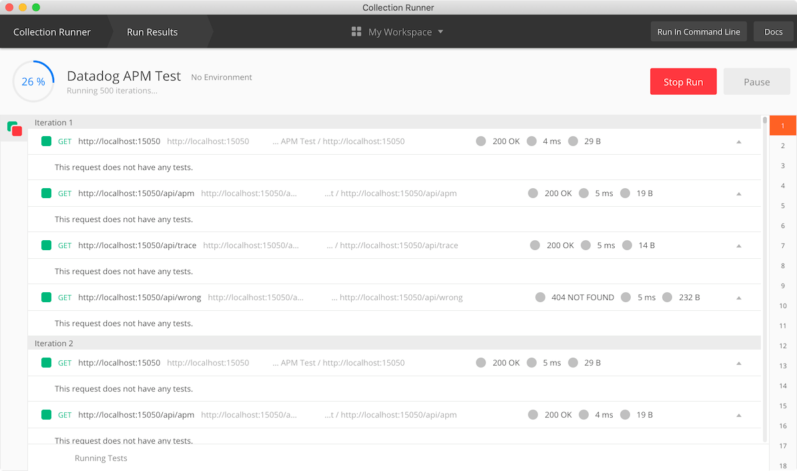

# Answers

This page includes personal answers for each steps with the link(and some inline codes) to the scripts and screenshots located in `scripts` and `images` subdirectories respectively. 

## Step 0 - Prerequisites - Setup the environment

Setup an environment with Ubuntu 16.04 using Vagrant for this exercise as recommended in the exercise. Created a single box project using [this Vagrantfile](scripts/Vagrantfile) and below is the screenshot of Vagrant version check.


## Step 1 - Collecting Metrics:

* Add tags in the Agent config file and show us a screenshot of your host and its tags on the Host Map page in Datadog.


Tags added in [datadog.yaml](scripts/datadog.yaml) file is as below.
```
tags:
  - mytag
  - env:test
  - role:general
  - os:ubuntu
```

* Install a database on your machine (MongoDB, MySQL, or PostgreSQL) and then install the respective Datadog integration for that database.

Installed MySQL 5.6 and configured the agent to collect database metrics.



* Create a custom Agent check that submits a metric named my_metric with a random value between 0 and 1000.


A script used to generate random number([custom_hello.py](scripts/custom_hello.py)) located at `/etc/datadog-agent/checks.d/custom_hello.py` is as below.

```
# the following try/except block will make the custom check compatible with any Agent version
try:
    # first, try to import the base class from old versions of the Agent...
    from checks import AgentCheck
except ImportError:
    # ...if the above failed, the check is running in Agent version 6 or later
    from datadog_checks.checks import AgentCheck

from random import randint

# content of the special variable __version__ will be shown in the Agent status page
__version__ = "1.0.0"


class custom_hello(AgentCheck):
    def check(self, instance):
        self.gauge('my_metric', randint(1, 1001), tags=['custom:custom_check'])
```

* Change your check's collection interval so that it only submits the metric once every 45 seconds.

Created a config file [custom_hello.yaml](scripts/custom_hello.yaml) and located under `/etc/datadog-agent/conf.d/` for Datadog Agent to accept new settings.

```
init_config:

instances:
  - min_collection_interval: 45
```

* **Bonus Question** Can you change the collection interval without modifying the Python check file you created?

Answer: Yes, you can change the settings in the config file using `min_collection_interval` attribute.

## Step 2 - Visualizing Data:

Utilize the Datadog API to create a Timeboard that contains:

* Your custom metric scoped over your host.
* Any metric from the Integration on your Database with the anomaly function applied.
* Your custom metric with the rollup function applied to sum up all the points for the past hour into one bucket

Below `curl` command creates a new dashboard with three  widgets. Link to the dashboard is [https://app.datadoghq.com/dashboard/ree-ip4-urv](https://app.datadoghq.com/dashboard/ree-ip4-urv?tile_size=m&page=0&is_auto=false&from_ts=1556060640000&to_ts=1556064240000&live=false).

```
curl -X POST -H "Content-type: application/json" \
-d '{
  "title": "Create new dashboard using API request",
  "widgets": [{
    "definition": {
      "type": "timeseries",
      "requests": [{
        "q": "avg:my_metric{host:ubuntu-xenial,custom:custom_check} by {host}"
      }],
      "title": "Average of my_metric over host"
    }
  }, {
    "definition": {
      "type": "toplist",
      "requests": [{
        "q": "avg:my_metric{host:ubuntu-xenial}.rollup(sum, 3600)"
      }],
      "title": "Sum of custom metric rollup for 1 hour"
    }
  }, {
    "definition": {
      "type": "timeseries",
      "requests": [{
        "q": "avg:mysql.performance.com_select{host:ubuntu-xenial}"
      }],
      "title": "Mysql Select Performance with Anomali bounds"
    }
  }],
  "layout_type": "ordered",
  "description": "A dashboard for custom metric.",
  "is_read_only": true,
  "notify_list": ["powerhan96@gmail.com"]
}' \
"https://api.datadoghq.com/api/v1/dashboard?api_key=8a07d0578e0b4f35366de82257665074&application_key=ef7b885b2105ec7b93e3b641d0252306b3fbeb8d"
```

Followed by the screenshot of the dashboard.


Once this is created, access the Dashboard from your Dashboard List in the UI:

* Set the Timeboard's timeframe to the past 5 minutes
* Take a snapshot of this graph and use the @ notation to send it to yourself.


* **Bonus Question**: What is the Anomaly graph displaying?

Answer: Anomalies() function didn't work with API request and had to apply it through the UI which resulted as below screenshot. Anomaly graph shows the upper and lower bound limit based on the algorithm used and shows the abnoraml values with red. Link to the dashboard is [https://app.datadoghq.com/dashboard/ree-ip4-urv](https://app.datadoghq.com/dashboard/ree-ip4-urv).


## Step 3 - Monitoring Data

Create a new Metric Monitor that watches the average of your custom metric (my_metric) and will alert if it’s above the following values over the past 5 minutes:

* Warning threshold of 500
* Alerting threshold of 800
* And also ensure that it will notify you if there is No Data for this query over the past 10m.

Please configure the monitor’s message so that it will:

* Send you an email whenever the monitor triggers.
* Create different messages based on whether the monitor is in an Alert, Warning, or No Data state.
* Include the metric value that caused the monitor to trigger and host ip when the Monitor triggers an Alert state.
* When this monitor sends you an email notification, take a screenshot of the email that it sends you.

Email notification for no-data.


Email notification for warnings.


* **Bonus Question**: Since this monitor is going to alert pretty often, you don’t want to be alerted when you are out of the office. Set up two scheduled downtimes for this monitor:

  * One that silences it from 7pm to 9am daily on M-F,
  * And one that silences it all day on Sat-Sun.
  * Make sure that your email is notified when you schedule the downtime and take a screenshot of that notification.

Email notification for scheduled downtimes.


## Step 4 - Collecting APM Data:

Given the following Flask app (or any Python/Ruby/Go app of your choice) instrument this using Datadog’s APM solution:

Created a simple Python app using Flask framework and ran the service using `ddtrace-run` to collect APM data as below.

`$ ddtrace-run python3 flask-app.py`

In order to connect to Vagrant box from local browser, added below portforwarding settings to [Vagrantfile](scripts/Vagrantfile).

`config.vm.network "forwarded_port", guest: 5050, host: 15050`

For request testing, used [Postman](https://www.getpostman.com/) to continusously send request to the app.



APM menu page for `flask` service in Datadog console. Link to this APM page is [here](https://app.datadoghq.com/apm/service/flask/flask.request?end=1556066607810&env=test&paused=true&start=1556065707810).


Link to the dashboard that include both APM and Infrastructure Metrics is [https://app.datadoghq.com/dashboard/n69-kni-4g3](https://app.datadoghq.com/dashboard/n69-kni-4g3?tile_size=m&page=0&is_auto=false&from_ts=1556064540000&to_ts=1556068140000&live=false).


* **Bonus Question**: What is the difference between a Service and a Resource?

Answer: A Service can be considered as an or a set of an application itself while Resource is a separate request of a set of data residing in that Service such as a URI endpoint.

A python app used is [flask-app.py](scripts/flask-app.py).

```
from flask import Flask
import logging
import sys

# Have flask use stdout as the logger
main_logger = logging.getLogger()
main_logger.setLevel(logging.DEBUG)
c = logging.StreamHandler(sys.stdout)
formatter = logging.Formatter('%(asctime)s - %(name)s - %(levelname)s - %(message)s')
c.setFormatter(formatter)
main_logger.addHandler(c)

app = Flask(__name__)

@app.route('/')
def api_entry():
    return 'Entrypoint to the Application'

@app.route('/api/apm')
def apm_endpoint():
    return 'Getting APM Started'

@app.route('/api/trace')
def trace_endpoint():
    return 'Posting Traces'

if __name__ == '__main__':
    app.run(host='0.0.0.0', port='5050')
```

Also tested Datadog Logs to see the actual logs from the same service. Ran the service using below command to generate the log file to be collected by Datadog Agent.

`ddtrace-run python3 flask-app.py > flask-app.log 2>&1`

And added below settings to Datadog config file located at `/etc/datadog-agent/conf.d/python.d/conf.yaml`

```
#Log section
logs:

  - type: file
    path: /opt/flaskapp/flask-app.log
    service: Flask
    source: python
    sourcecategory: sourcecode
```

Below screenshot is the logs for upper service from Datadog Log Explorer and the link to the page is [here](https://app.datadoghq.com/logs?cols=core_host%2Ccore_service&from_ts=1555901082158&index=main&live=false&stream_sort=desc&to_ts=1555901380761).


## Step 5 - Final Question:

**Is there anything creative you would use Datadog for?**

Answer: Some ideas using Datadog as data platform.

- **Smart Home Monitor**: By consolidating various metric data from home IoT devices, routers and power grids and more to provide a single point of truth to simply monitor and alert or even automate several actions based on custom rules such as turn off lights when nobody is at home. Smart Home service provider do not need to build their own data platform but use Datadog and focus to customer facing features and mobiles apps.

- **Greenhouse Analysis**: Increasing greenhouse productivity highly rely on several factors like temperature, humidity and light. And this factor changes over geometric location, type of corps and even seasonal reasons. By monitoring these sensor metrics using Datadog's custom metrics can provide flexable monitoring of operating a greenhouse comparing it with the cost to better tweak major factors for next season keep increasing the productivity.

