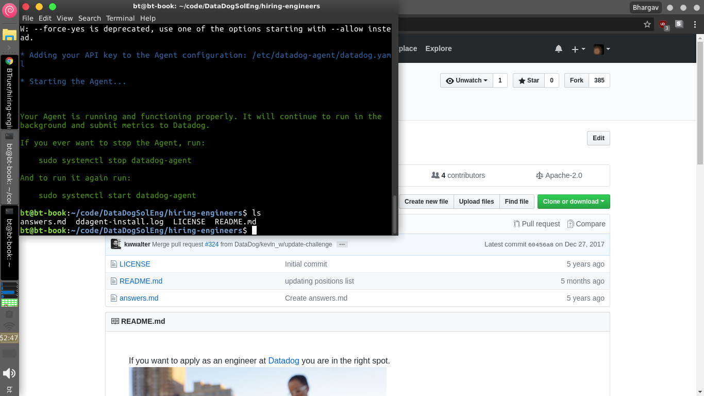

## Prerequisites - Setup the environment
The base machine I work with day to day is Ubuntu 16.04. Although I have vagrant installed for ease of screen-shot purposes I went ahead and worked on the base machine.

I first installed the DataDog Agent via the command given on the last stage signing up.

## Collecting Metrics
In this part of the project we get learn how to collect data from our host and send it to Datadog's services.

Under `/etc/datadog-agent` is the config file `datadog.yaml` which was updated to include user/host's tags.

After restarting the Agent we can see on the hostmap that tags are now visible.

Next we learn about database integrations with Datadog.

I already had MongoDB installed so I chose that to integrate with Datadog. I created a user and tested successfully with the commands given from Datadog's documentation. On the Datadog integrations page we install the MongoDB integration.

Now to get the Datadog Agent to connect with the database I created the file `/etc/datadog-agent/conf.d/mongo.d/mongo.yaml` according to Datadog's official documentation.

Finally we restarted the agent to receive the data.

The next part of the project asks us to create a custom metric which in this case is specified as a random number.

Following the documentation (which this section is not updated for agent v6 and caused confusion initially) in the directory `/etc/datadog-agent/` we create two files:
1. `/checks.d/my_metric.py`
2. `/conf.d/my_metric.d/my_metric.yaml`.

After restarting the agent we see the metric is sending data.

On the dashboard metric tab we can view my_metric's data.

Next we want to update the python script to only send updates every 45 seconds.

We can update `my_metric.py` to include a time delay. We can either make the process sleep, keep track of the time difference or use python's scheduler library to schedule this function for a set time interval. By far the least amount of code is sleeping the process for a fixed time like so:

**Bonus Question** Can you change the collection interval without modifying the Python check file you created?

You can certainly change the interval time according to the documentation by adding a flag in the configuration file for my_metric.

## Visualizing Data
In this section we use the Datadog API to create a Timeboard which is like a live monitoring dashboard and can be used to draw useful insights and analytics. The project specifies for three graphs:
1. Your custom metric scoped over your host.
2. Any metric from the Integration on your Database with the anomaly function applied.
3. Your custom metric with the rollup function applied to sum up all the points for the past hour into one bucket

The Datadog API allows us to programmatically create these dashboards which is good for dynamic situations or avoiding GUI if you like the command line (browser headless approach).
After looking at examples and official API documentation we wrote a python script `board.py` (included in the repository). After executing it we get a resulting Timeboard:

To look at the Timeboard with only a 5 minute range we simply click and drag to zoom into a 5 minute window.

And similarly when one leaves a comment via clicking the camera icon on the top right of a graph you can notify via email a user by mentioning them in a comment e.g. `@person@domain.com`

**Bonus Question**: What is the Anomaly graph displaying?

According to [the documentation](https://docs.datadoghq.com/monitors/monitor_types/anomaly/), [this article](https://www.datadoghq.com/blog/introducing-anomaly-detection-datadog/), and [wikipedia](https://en.wikipedia.org/wiki/Anomaly_detection), an anomaly graph displays data and highlights trends in the data that do not fit the norm based different algorithms.

## Monitoring Data

In this section we learn about Datadog's meteric monitoring and alerting.
The project specifies for signals at three different conditions
1. Warning threshold of 500
2. Alerting threshold of 800
3. And also ensure that it will notify you if there is No Data for this query over the past 10m.

Using the Datadog platform we simply go to the monitoring tab and create a new monitor with the conditions above.

To create the alert, warning, and no data message we complete the last steps in the monitoring process.

The results are emails alerts like so:

### **Bonus Question**: Since this monitor is going to alert pretty often, you don’t want to be alerted when you are out of the office. Set up two scheduled downtimes for this monitor:
  1. One that silences it from 7pm to 9am daily on M-F,
  2. And one that silences it all day on Sat-Sun.
  3. Make sure that your email is notified when you schedule the downtime and take a screenshot of that notification.

To schedule downtime we just go to the monitoring tab and then downtime.
This has scheduled weekday downtime:

This has scheduled weekend downtime:

The results are emails letting us know about downtime like this one:

## Collecting APM Data
In this part of the project we are familiarizing ourselves with Datadog's APM tool which could be used to instrument the performance and scalability of webapps.

1. First we saved the Flask code in a file `app.py`.
2. In the chance we didn't have these python packages installed `pip install ddtrace flask` (note this is a global install)
3. Update `/etc/datadog-agent/datadog.yaml` to include `apm_config: enabled: true`
4. There are two approaches: add tracing middleware to the actual python code like [the documentation suggests](https://docs.datadoghq.com/tracing/setup/python/) or run `ddtrace-run python app.py`

If we go to the locally running web application at http://0.0.0.0:5050/ and go to each of the routes we can see the application being traced.

**Bonus Question**: What is the difference between a Service and a Resource?

On the Internet a service is what provides a resource. A service for example is a restful api or graphql api that serves the resources: data, media etc. It's like in the real world where shipping companies provide a service to move goods via boxes, trucks, planes, etc., to deliver your goods (i.e. the resource).

## Final Question:

Datadog has been used in a lot of creative ways in the past. We’ve written some blog posts about using Datadog to monitor the NYC Subway System, Pokemon Go, and even office restroom availability!
Is there anything creative you would use Datadog for?

This may not be particularly creative but I would Datadog as an intrusion detection system. Modern proprietary servers have IDS features that enable alerts, load balancing, and other features. However, during a DDoS attack Datadog's visibility and metrics tracing along with monitoring alerts could be used to trigger other actions like turning on more load balancers, scaling up servers or filtering malicious traffic in realtime. This product would have been excellent for the work I had done previously at AT&T labs working on DDoD mitigation. Thus, I would use it to deal with DDoS attacks. I could use the API and programmatically control what happens after an alert has gone off.
