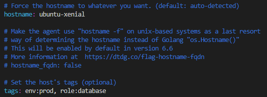
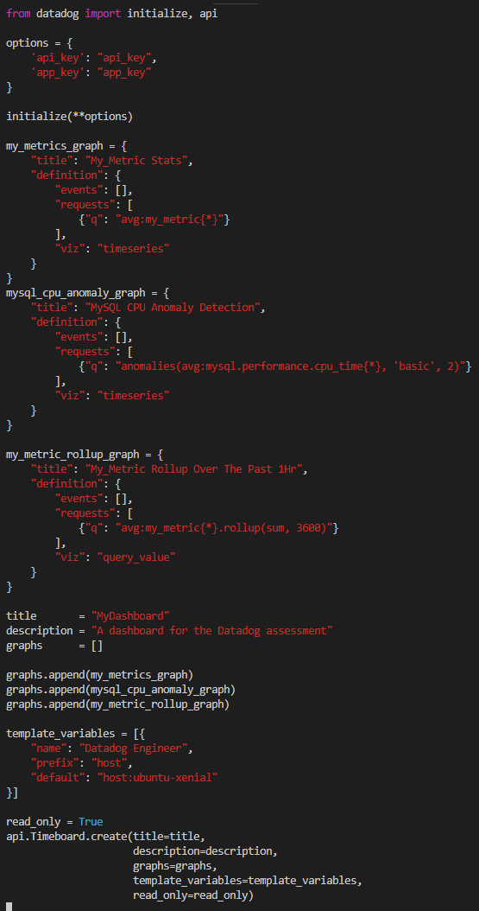

## Prerequisites - Setup the environment:
- [x] Created and setup Vagrant Ubuntu 16.04 VM.

## Collecting Metrics:
- [x] Added tags to agent config file.

- [x] Installed MySQL and Datadog MySQL integration.

- [x] Created custom agent check (my_metric.py) with a random value between 0 and 1000.

- [x] Changed my_metric metric collection interval to once every 45 seconds.

##### Bonus Question:
- [x] You can change the collection interval without modifying the python check file by setting the min_collection_interval to 45 as per the above image in /etc/datadog-agent/conf.d/my_metric.yaml

## Visualising Data:
- [x] Utilising Datadog API create a timeboard that contains:
- [x] Create a my_metric data graph.
- [x] MySQL metric with database anomaly function applied.
- [x] My custom metric with the rollup function applied to sum up all the points for the past hour into one bucket.
- [x] Take a snapshot of the graph and use the @ notation
- [x] Set timeboard timeframe to past 5 minutes.

##### Bonus Question:
- [x] The anomaly graph is displaying any deviations of CPU from the MySQL integration utilising historic data collected that is outside its expected behaviour threshold. The blue line are current metrics, the grey area is the threshold and the red markers are the anomaly detections.

## Monitoring Data:
- [x] Create a new metric monitor that watches the average of my_metric and alert if it is above the following values:
- [x] Warning threshold of 500.
- [x] Alerting threshold of 800.
- [x] Ensure that it will notify if no data for this query past 10 minutes.
- [x] Configure monitor message to:
- [x] Email whenever the monitor triggers.
- [x] Create different messages based on whether the monitor is in an alert, warning or no data state.
- [x] Include the metric value that caused the monitor to trigger and host ip when the monitor triggers an alert state.

- [x] When this monitor sends an email notification, take a screenshot of the email.

##### Bonus Question:
- [x] Set up two scheduled downtimes for this monitor:
- [x] One that silences it from 7pm to 9am daily on M-F.

- [x] One that silences it all day on Sat-Sun.

- [x] Make sure that your email is notified when you schedule the downtime and take a screenshot of that notification.

## Collecting APM Data:
- [x] Instrument the Flask app using Datadog’s APM solution.
- [x] Provide a link and a screenshot of a Dashboard with both APM and Infrastructure Metrics.
- [x] Please include your fully instrumented app in your submission.

  - https://p.datadoghq.com/sb/7le8a7jjc0an3ex5-2496e5fdf930ebaec877dcb2d4852647

##### Bonus Question:
- [x] A service is a set of processes that do the same job. For instance, a simple web application may consist of two services:
  - A single webapp service and a single database service.
  - While a more complex environment may break it out multiple services.

- [x] A resource is a particular action for a service.
  - For a web application: some examples might be a canonical URL, such as /user/home or a handler function like web.user.home (often referred to as “routes” in MVC frameworks).
  - For a SQL database: a resource is the query itself, such as SELECT * FROM users WHERE id = ?.

## Final Question:
Datadog has been used in a lot of creative ways in the past. We’ve written some blog posts about using Datadog to monitor the NYC Subway System, Pokemon Go, and even office restroom availability!

Is there anything creative you would use Datadog for?

##### Public Transport System - Trains and Buses
The goal of the public transport system is to provide the fastest, efficient and safest route for its passengers. However with millions of different IoT devices around the city, how do you collect their events, metrics and run analytics against the data to give greater insights into what passengers are experiencing? How do you measure and ensure they are getting the best commute experience with minimal delays?

Datadog allows you to capture data from any device, anywhere and anytime around the country. Datadog gives you the flexibility to ingest data from your logs, IoT devices, WiFi hotspots, web services and many more. Below are some examples of what you can visualise and analyse with Datadog:

- How many people are there on trains and buses?
- Where do they start and end their journey?
- How long do they travel for?
- How many people are on which line and in which part of the city?

Actionable insights from Datadog provides a real-time analysis into the true customer experience allowing you to make more informed and educated decisions to continuously improve transportation services to the public.
