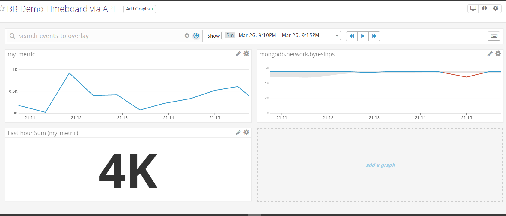

# The Beginner's Guide to Datadog (by Brandon)

Learning datadog for the first time? Building a demo environment? Planning an evaluation guide for a client? Completing the datadog hiring exercise?

If you answered 'yes' to any of those questions then you've come to the right place. This handy guide will help you in understanding the key components and setup steps for datadog! This will bring you one step closer to improving collaboration and visibility across teams. 

## Prerequisites - Setting up the environment

Download and install vagrant with ubuntu image

Download and install Datadog Ubuntu agent using bash command provided

## Collecting Metrics:

This section focuses on collecting infrastructure metrics from your host

Modify the agent config file to add your own tag mytag:bbdemo

Go to the host Map page in data dog. Filter by the tag created

You should also be able to see data coming in from your host

Install Mongodb on your machine with "sudo apt-get -y mongodb-org

Create a new user for Datadog in Mongo using db.createUser 

Validate user with db.auth command

create a mongo.yaml config file in conf.d directory

restart the agent

You should now see mongodb on the hostmap

Create a custom agent check my_metric that submits random value between 0 and 1000 via python script in checks.d. Implement the AgentCheck interface and "random" library. Use randint function as 2nd param in self.gauge call

Create check config yaml file in conf.d directory. **Bonus Tip** You can specify collection interval here without needing to modify the python script

Lastly, run the dd-agent check command to validate things are working okay.

## Visualizing Data

This section focuses on taking that data and visualizing it in a useful way.

First, validate that datadog is receiving the metric by checking the metric explorer.

Next, manually create a timeboard that shows my_metric scoped over the host, mongodb.network.bytesinps metric from mongo, and a rollup sum of my_metric over the last hour

To automate the timeboard creation for simply future deployment, use the datadog API dash resource via python script https://docs.datadoghq.com/api/?lang=python#create-a-timeboard

You will first need an api key and app key which can be created in Datadog

Below is a screenshot of the script (see createtimeboards.py) **Hint** For the graph array of definition JSON objects: copy the JSON from the timeboard graph setting screen for each graph that you made earlier

Once you run the script, you will see a newly-created timeboard in datadog:

Change the timeboard to only show last 5 minutes then create an annotated snapshot and inform yourself.

**Bonus Tip** The anomaly graph for the mongodb metric is showing where Datadog expects the behavior of the metric to be based on past performance. This is useful for letting you know when your metrics are performing out of the ordinary.

## Monitoring Data

This section focuses on setting alerts for the data so that you don't have to continually watch the graphs and can be informed immediately when there is an issue.

Set a Warning, Alerting and No Data Threshold for my_metric

Configure this to send you a different email message for each threshold type.

You should receive an email like this:

**Bonus Tip** It's important to set schedule downtimes for alerts which effectively will mute the alerts when you don't want to receive emails (IE: non-working hours & weekend)

You will receive an email notification of the scheduled downtime:

## Collecting APM Data

This section focuses on collecting trace data from an application. This helps you trace transactions flowing through an app as well as see latency and other metrics. 

Install and run Flask via venv. Using the provided endpoint Flask app, instrument the app by inserting Middleware to capture traces. See highlighted inserts below.(see ddflaskdemo.py) Run the app using the following Flask command: FLASK_APP=ddflaskdemo.py python -m flask run --host 127.0.0.1:7000

**Bonus Tip** Datadog looks at both services and resources for an app. A **service** is a set of processes that do the same job. IE: database service, admin service, query service, etc. A **resource** is a specific action for the service. These are usual endpoints or queries

Now you are able to add APM traces to the dashboard you created  earlier. In this case the measurement is number of hits to the app resource endpoints. Leverage curl command on your vagrant box to hit 127.0.0.1:7000/api/apm to push hit metrics through

Lastly, create a screenboard using the same graphs from the timeboard and create a shareable link. This lets you publicize your beautiful graphs across teams!

https://p.datadoghq.com/sb/01d5134f0-573da2d6049667df5919f79d4df4b86d

## Final Thoughts

As you can see, datadog at its core is a data graphing platform. Its primary value for companies is to pull in metric data from infrastructure, apps, and logs. However, with custom metrics, any data can be collected and sent to Datadog for graphing.
I believe a very useful application of Datadog would be to help monitor and analyze big data for Smart Cities across the globe. Cities are beginning to leverage data to make smart decisions on growth and allocation of public resources. Monitoring traffic flow could help stoplight managment run smoothly, monitoring parking space usage could help determine peak demand and create variable pricing, and monitoring rideshare or smart bike usage could help cities determine where the public transit investments should go.

Those are just a few examples of how Datadog can add value in a BIG way! The sky is the limit.
