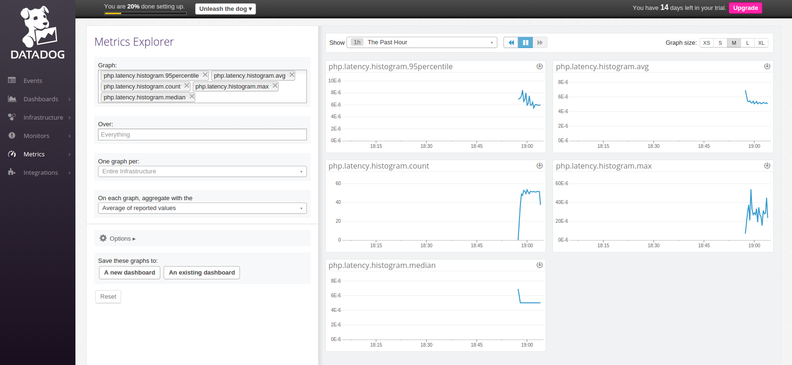
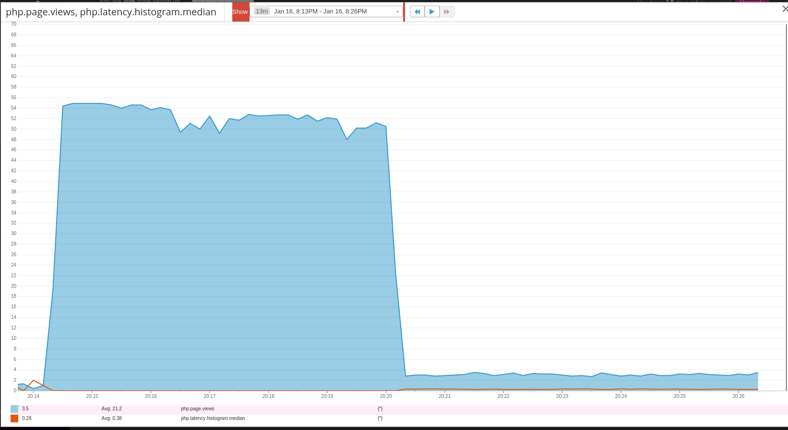
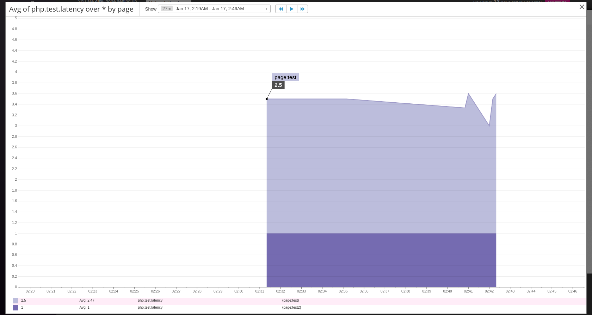

## Answers

### Level 1

* Sign up for Datadog (use "Datadog Recruiting Candidate" in the "Company" field), get the agent reporting metrics from your local machine.


[Metrics](https://app.datadoghq.com/dash/host/45359250?live=true&page=0&is_auto=false&from_ts=1452962740892&to_ts=1452966340892&tile_size=m)

* Bonus question: what is the agent?

The agent is the service that runs in the host and collects events and metrics to send to Data Dog for monitoring. It is comprised of three main parts:
* Collector: Checks for integrations and monitors system metrics.
* Dogstatsd: Back-end server that receives custom metrics from an application.
* Forwarder: Captures the data from the collector and dogstatsd and sets it to be sent to Data Dog.

There is also a supervisor process that controls and ties everything together.

* Submit an event via the API.

```
#!/bin/sh

curl  -X POST -H "Content-type: application/json" \
-d '{
      "title": "Can you hear me DD?",
      "text": "First event test.",
      "priority": "normal",
      "tags": ["environment:test"],
      "alert_type": "info"
  }' \
'https://app.datadoghq.com/api/v1/events?api_key=f22de6751add6c71161b8582cac9e488'
```


[First event](https://app.datadoghq.com/event/event?id=365550117954820773)

* Get an event to appear in your email inbox (the email address you signed up for the account with)

```
#!/bin/sh

curl  -X POST -H "Content-type: application/json" \
-d '{
      "title": "Email notification from event",
      "text": "@jorgerc85@gmail.com. Check this out!",
      "priority": "normal",
      "tags": ["environment:test"],
      "alert_type": "info"
  }' \
'https://app.datadoghq.com/api/v1/events?api_key=f22de6751add6c71161b8582cac9e488'
```


[Email event](https://app.datadoghq.com/event/event?id=365560316136793562)

### Level 2

* Take a simple web app ([in any of our supported languages](http://docs.datadoghq.com/libraries/)) that you've already built and instrument your code with dogstatsd. This will create **metrics**.

For this section I will use a web app with a PHP backend.

To install dogstatsd I added this dependency to `composer.json`:

```
"datadog/php-datadogstatsd": "0.3.*"
```

To increment a counter I added this to the login function of the UserController:

```
public function login()
{
  \Datadogstatsd::increment('php.user.login');

  ...
}
```


[Dogstatsd PHP user login](https://app.datadoghq.com/metric/explorer?live=true&page=0&is_auto=false&from_ts=1452965171334&to_ts=1452968771334&tile_size=m&exp_metric=php.user.login&exp_scope=&exp_agg=avg&exp_row_type=metric)

* While running a load test (see References) for a few minutes, visualize page views per second. Send us the link to this graph!

To run the load test I used this command:

```
ab -t 360 -c 100 http://localhost:8000/patients
```


To monitor the page views I added this to the patients route function:

```
Route::get('/patients', function () {
    Datadogstatsd::increment('php.page.views');

    ...
});
```


[Dogstatsd PHP page views](https://app.datadoghq.com/metric/explorer?live=false&page=0&is_auto=false&from_ts=1452974048178&to_ts=1452974471940&tile_size=l&exp_metric=php.page.views&exp_scope=&exp_agg=avg&exp_row_type=metric&exp_calc_as_rate=true)

* Create a histogram to see the latency; also give us the link to the graph

Using the same load test I added this code to the getPatients function:

```
public function getPatients()
{
    ...

    $start_time = microtime(true);
    $patients = $this->_getPatientsByUnit($unitId);
    \Datadogstatsd::histogram('php.latency.histogram', microtime(true) - $start_time);

    return $patients;
}
```


[Dogstatsd PHP page views](https://app.datadoghq.com/metric/explorer?live=true&page=0&is_auto=false&from_ts=1452978295793&to_ts=1452981895793&tile_size=m&exp_metric=php.latency.histogram.95percentile%2Cphp.latency.histogram.avg%2Cphp.latency.histogram.count%2Cphp.latency.histogram.max%2Cphp.latency.histogram.median&exp_scope=&exp_agg=avg&exp_row_type=metric)

* Bonus points for putting together more creative dashboards.

I made a dashboard graph to compare page views and the median latency during a load test. There is a period of time where the median latency is zero and the page view rate is over 50 per second. I then introduced some extra latency by adding a `time_nanosleep(0, rand(100000000, 500000000))`. This made the page view rate drop significantly to around 2 - 4 per second.


[Dogstatsd PHP page views versus median latency](https://app.datadoghq.com/dash/92254/page-views--histograms?live=true&page=0&is_auto=false&from_ts=1452983323999&to_ts=1452986923999&tile_size=m&fullscreen=72191252)

### Level 3

* tag your metrics with `support` (one tag for all metrics)

In order to tag all metrics from a host at once, I used this script:

```
#!/bin/sh

api_key=f22de6751add6c71161b8582cac9e488
app_key=e8767e5bb4244c8738057d01a7d6d7d242fdf0fe
host=jorge-RV411

# Find a host to add a tag to
host_name=$(curl -G "https://app.datadoghq.com/api/v1/search" \
    -d "api_key=${api_key}" \
    -d "application_key=${app_key}" \
    -d "q=hosts:$host" | cut -d'"' -f6)

curl  -X POST -H "Content-type: application/json" \
-d "{
      \"tags\" : [\"support\"]
    }" \
"https://app.datadoghq.com/api/v1/tags/hosts/${host_name}?api_key=${api_key}&application_key=${app_key}"
```

This ensures that all metrics coming from that particular host will have this tag.

* tag your metrics per page (e.g. metrics generated on `/` can be tagged with `page:home`, `/page1` with  `page:page1`)

Based on the metrics used on level 2, I used this syntax to apply different tags to each metric.

```
\Datadogstatsd::increment('php.user.login', array('tagname' => 'page:login'));
\Datadogstatsd::increment('php.page.views', array('tagname' => 'page:patients'));
\Datadogstatsd::histogram('php.latency.histogram', microtime(true) - $start_time, array('tagname' => 'page:patients'));
```

For reasons I haven't determined yet, none of these metrics had tags assigned to them. When grouping by page tag (using this query `avg:php.latency.histogram.median{*} by {page}`) they all showed up ad `page:N/A`. In order to test the origin of the problem I attempted sending a time series with tags using this script:

```
#!/bin/sh

currenttime=$(date +%s)
curl  -X POST -H "Content-type: application/json" \
-d "{ \"series\" :
         [{\"metric\":\"php.test.latency\",
          \"points\":[[$currenttime, 2]],
          \"type\":\"gauge\",
          \"host\":\"jorge-RV411\",
          \"tags\":[\"page:test\"]}
        ]
    }" \
'https://app.datadoghq.com/api/v1/series?api_key=f22de6751add6c71161b8582cac9e488'

currenttime=$(date +%s)
curl  -X POST -H "Content-type: application/json" \
-d "{ \"series\" :
         [{\"metric\":\"php.test.latency\",
          \"points\":[[$currenttime, 1]],
          \"type\":\"gauge\",
          \"host\":\"jorge-RV411\",
          \"tags\":[\"page:test2\"]}
        ]
    }" \
'https://app.datadoghq.com/api/v1/series?api_key=f22de6751add6c71161b8582cac9e488'
```

This script allows to simulate metrics being sent from two different pages of the app. I used this metrics to complete the last part of this level.

* visualize the latency by page on a graph (using stacked areas, with one color per page)

Using the metrics provided by the script I was able to create this graph:


[Dogstatsd PHP simulated latency using shell script grouped by page tag](https://app.datadoghq.com/dash/92263/blank-dashboard?live=true&page=0&is_auto=false&from_ts=1453006026794&to_ts=1453009626794&tile_size=m&fullscreen=72211744)
