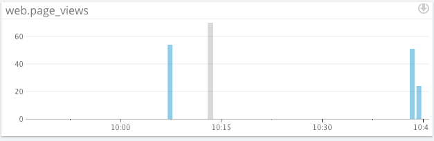

Thank you taking the time to review my coding challenge and I look forward to speaking with members of the team regarding this opportunity.

Obligatory Excitement Gif


### Level 1

* Sign up for Datadog, get the agent reporting metrics from your local machine.


* Bonus question: what is the agent?

The Datadog Agent is a program that collects metrics and events and sends this information to Datadog for analysis.  The Agent serves as the worker for the online portal which displays all the information to the user in easy to use dashboards.

* Submit an event via the API.

Code for initial event creation from API Docs

```ruby
require 'rubygems'
require 'dogapi'


api_key = "This would be hidden"

dog = Dogapi::Client.new(api_key)

dog.emit_event(Dogapi::Event.new("This is the intial setup event for the datadog support engineer hiring challenge", :msg_title => "First Event Submission"))
```
And the screenshot showing successful submission:


* Get an event to appear in your email inbox (the email address you signed up for the account with)

Code for creation of email notification event:

```ruby
require 'rubygems'
require 'dogapi'


api_key = "f1ef993e5fb3d4d7eddf8bd3be232971"

dog = Dogapi::Client.new(api_key)

dog.emit_event(Dogapi::Event.new("Now submitting a second event to showcase the email alert system, @asdvaughan@gmail.com", :msg_title => "Email Notification"))

```

Email screenshot from Gmail:


Datadog Screenshot:


### Level 2

* Take a simple web app ([in any of our supported languages](http://docs.datadoghq.com/libraries/)) that you've already built and instrument your code with dogstatsd. This will create **metrics**.

For this exercise I will be intergrating the code into an application called Hidden Treasures, a Sinatra Geocaching Application that allows users to place digital treasures in the world for their friends to find.

* While running a load test (see References) for a few minutes, visualize page views per second. Send us the link to this graph!

To assist with accessing my code I have created a helper method that will be called withing my controller:

```ruby
    def update_count
      statsd = Statsd.new
      statsd.increment('web.page_views')
    end
```

[Link to the Graph](https://app.datadoghq.com/dash/47296/hidden-treasures?live=true&from_ts=1429664285082&to_ts=1429667885082&tile_size=m)
* Create a histogram to see the latency; also give us the link to the graph

I added a method to Datadog module to assist with adding a histogram of the database latency based off the API Docs.

```ruby
    def update_count
      statsd = Statsd.new
      statsd.increment('web.page_views', :tags => ['support'])
    end

    def latency
      statsd = Statsd.new
      start_time = Time.now
      results = Treasure.all
      duration = Time.now - start_time
      statsd.histogram('database.query.time', duration)
    end
```
[Link to the Graph](https://app.datadoghq.com/dash/47296/hidden-treasures?live=true&from_ts=1429665376561&to_ts=1429668976561&tile_size=m)


* Bonus points for putting together more creative dashboards.


### Level 3

Using the same web app from level 2:
* tag your metrics with `support` (one tag for all metrics)

Here is the code with the added tags:

```ruby
    def update_count
    statsd = Statsd.new
    statsd.increment('web.page_views', :tags => ['support'])
end

def latency
  statsd = Statsd.new
   start_time = Time.now
    results = Treasure.all
    duration = Time.now - start_time
    statsd.histogram('database.query.time', duration, :tags => ['support'])
end

def treasures_latency
  statsd = Statsd.new
   start_time = Time.now
    results = Treasure.all
    duration = Time.now - start_time
    statsd.histogram('database.query.time', duration, :tags => ['support', 'page:treasures'])
end

def users_latency
  statsd = Statsd.new
   start_time = Time.now
    results = User.all
    duration = Time.now - start_time
    statsd.histogram('database.query.time', duration, :tags => ['support', 'page:users'])
end
```
* tag your metrics per page (e.g. metrics generated on `/` can be tagged with `page:home`, `/page1` with  `page:page1`)

* visualize the latency by page on a graph (using stacked areas, with one color per `page`)


### Level 4

Same web app:
* count the overall number of page views using dogstatsd counters.
* count the number of page views, split by page (hint: use tags)
* visualize the results on a graph

I was able to get the totals from each page view and visualize their load test on the below graph taken from another custom dashboard:




* Bonus question: do you know why the graphs are very spiky?

It appears the graphs are very spiky based on the method of load testing.  I am making multiple requests over the course of 15 minutes with the possibility of multiple requests made at once.  The spikes in the graph seem to represent the gaps in requests to the database.


### Level 5

Let's switch to the agent.

* Write an agent check that samples a random value. Call this new metric: `test.support.random`

I followed the instructions from the Guide and ran into a few problems.  It appears that my python environment was not setup correctly for some of the items needed for the agent.  I corrected these issues and continue on trying to get the metric to appear in the dashboard.

Here is the yaml file:

```python
init_config:

instances:
  [{}]
```
Here is the random_test.py file:

```python
import random
from checks import AgentCheck

class RandomTest(AgentCheck):

  def check(self, instance):
    random_num = random.random()
    self.gauge('test.support.random', random_num)
    print('This worked')

if __name__ == '__main__':
  check, instance = RandomTest.from_yaml('./conf.d/random_test.yaml')
  check.check(instance)
```

* Visualize this new metric on Datadog, send us the link.

I unfortunately was unable to get the metric to appear in the dashbaord.  I input a print statement to ensure that the code was being run but still wan unable to see the metric online.  I still feel that the challenge was a sucess and that I was able to get a better understanding for the support engineer role while troubleshooting the problems I encountered.
