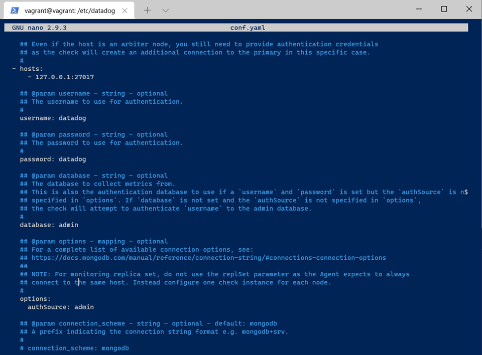

# Ryan Hanson - Datadog Solutions Engineer Technical Exercise

## Environment Setup
For this exercise, I used the recommended method of spinning up a new Ubuntu 18.04.5 VM through Vagrant. 
*  OS: Windows 10 V. 20H2 OS build 19042.964
    * Vagrant 2.2.16
    * Ubuntu 18.04.5
    
### Vagrant

Following the recommended <a href="https://learn.hashicorp.com/collections/vagrant/getting-started" target="_blank">instructions provided</a> from the References section, I was able to spin up a fresh Ubuntu VM utilizing Vagrant. 

*Note: Looking a bit forward into the instructions, an installation of VirtualBox is required here. This was not necessary for me here as VirtualBox was already installed on my machine.  I did check for any relevant updates of VirtualBox before moving forward with the Vagrant installation.*

First, I downloaded the 64-bit version of Vagrant, and ran the downloaded `.msi` file to run the installation wizard.  


Installation was successful after running this wizard.  After this, I created a directory for my Vagrant VM to reside.


In my terminal, I ran `vagrant init hashicorp/bionic64`, creating an Ubuntu VM in my directory.

The environment can be started by running the command `vagrant up`.


At this point, I also noted the helpful command `vagrant halt`, which allows a graceful shutdown of the VM.  This was useful throughout the exercise for testing.
At this point, we can SSH into the VM with the command `vagrant ssh`.


Before moving forward, I ensured the VM was up to date and all packages were updated and upgraded.

```bash
sudo apt update
```
```bash
sudo apt upgrade
```

### Datadog Agent

At this point, I signed up for a trial Datadog account and logged in.  Before digging into the tool itself, we need to install the agent on the new VM.  The references section of the exercise provides a link to the Agent Guide: https://docs.datadoghq.com/agent/.

From here, I can select Ubuntu as my platform, which includes a link to the Agent Installation: https://app.datadoghq.com/account/settings#agent/ubuntu. Installation was completed with the one-step install line from these instructions.

Going back to the Agent guide, I noted several useful commands:


Running `sudo datadog-agent status`, I can see if the agent has been successfully installed and is now running.


Success! We should begin to see this machine in the Datadog application.  At this point, I began to explore the Datadog application. The main page has my Ubuntu machine already reporting on the right hand side. (Note: I spun up an additional machine during the exercises, so this machine may be present in the screenshots, but is not documented).


Clicking on the expanded host map allows me to look more closely at the machine and its metrics.


I also noted the section <a href="https://app.datadoghq.com/infrastructure" target="_blank">Infrastructure List</a> gives me more information on my machine:


## Collecting Metrics
Tasks for this section:
* Add tags in the Agent config file and show us a screenshot of your host and its tags on the Host Map page in Datadog.
* Install a database on your machine (MongoDB, MySQL, or PostgreSQL) and then install the respective Datadog integration for that database.
* Create a custom Agent check that submits a metric named my_metric with a random value between 0 and 1000.
* Change your check's collection interval so that it only submits the metric once every 45 seconds.
    * **Bonus Question**: Can you change the collection interval without modifying the Python check file you created?

### Adding Tags
We need to add some custom tags onto our machine. A quick search of the Datadog Docs resulted in the section <a href="https://docs.datadoghq.com/getting_started/tagging/" target="_blank">Getting Started with Tags</a>.  Our tags here allow telemetry from machines to be filtered and compared together.  In most situations, it becomes increasingly useful to use tags to narrow data based on what a customer/user might need to know in aggregate, such as memory usage across a specific set of services in a server instead of the entire server.

This section defines the tagging methods and formats as well.  Here I learned that tags (and for that matter, a lot more things in this exercise!) can be assigned using the Agent configuration file.  For my Ubuntu VM, this is located at `/etc/datadog-agent/datadog.yaml`.


Navigating to this file we can see the tags section.  I can add my custom tags here.


We’ll need to restart the Datadog service for this to take effect:

```bash
sudo service datadog-agent restart
```

*Side note: At this point, I also noticed the “Events” section of the Datadog app.  This gave me another route to check that the datadog service had restarted. I found this useful throughout the exercise.*

After several minutes, these tags will appear at the host map for our machine:


Inspecting the tags section, we can see that our custom tags have appeared.

### Databases

The next task is to install a database into our VM and integrate it with the Datadog agent.  As I have familiarity with MongoDB, I elected to install it onto my machine.  This was done using the MongoDB guide for Ubuntu: https://docs.mongodb.com/manual/tutorial/install-mongodb-on-ubuntu/

```bash
wget -qO - https://www.mongodb.org/static/pgp/server-4.4.asc | sudo apt-key add –
echo "deb [ arch=amd64,arm64 ] https://repo.mongodb.org/apt/ubuntu bionic/mongodb-org/4.4 multiverse" | sudo tee /etc/apt/sources.list.d/mongodb-org-4.4.list
sudo apt-get update
sudo apt-get install -y mongodb-org
```

To get the MongoDB service started, we can use `sudo systemctl start mongod`. Using `sudo systemctl status mongod`, we can verify the service is running:


As a last step, I configured the MongoDB service to run at start-up using the command `sudo systemctl enable mongod`.

The next step is to get the MongoDB server connected to the Datadog agent.  Another quick search of the Docs gives us the MongoDB integrations guide: https://docs.datadoghq.com/integrations/mongo/?tab=standalone#pagetitle

Following these instructions, I need to first create a new Mongo user for the Datadog agent.  Since MongoDB is on version 4.4.5, we’ll use the following commands at the Mongo shell:


We can check for a successful user by using the command `show users`:


Now that a user has been created for the agent, the agent will need to be configured correctly.  Following the guide, we can navigate to `/etc/datadog-agent/conf.d/mongo.d`. As a general guide, configurations for integrations will be found here in the conf.d directory.  Similar to the custom tags process, we’ll navigate to a `.yaml` file to configure the MongoDB database for the agent.

Opening the `conf.yaml` file, we’ll uncomment and add several feeds according to the instructions:



At this point, a restart of the agent should allow the MongoDB integration into our Datadog app.  Checking the integrations section we can see this is the case:


This is also present on the Host Map:


I repeated this exercise with a MySQL integration as well to see how the agent handled multiple databases.  Integration of this server was done the exact same way but using the guide for MySQL: https://docs.datadoghq.com/integrations/mysql/?tab=host#pagetitle

### Custom Agent Metric

To create a custom metric, I used the link in the references for custom agent checks: https://docs.datadoghq.com/developers/write_agent_check/?tab=agentv6v7

From reading through this, it can be noted that we will need to make our custom metric and a configuration file for that metric.  They must match in name.

Checks run in the check.d directory:


In this directory, I’ll create a file named `custom_metric.py`:


The instructions of this task specify that we should create a metric named “my_metric”, and this should have a random value between 0 and 1000.  I’ve used the python library `random` to do this.

Continuing to follow the guide, we’ll need to edit our configuration file to specify the collection interval for this metric.  We’ll need to submit this metric every 45 seconds.  Navigation to the `conf.d` directory, we can create a custom configuration file here, making sure to name it `custom_metric.yaml`. In this file, we can specify our interval:


Note: From the guide, this doesn’t the metric will be sent every 45 seconds, but that the agent will attempt to collect “my_metric” every 45 seconds.  In a situation where other processes are running, this will be placed in the queue of processes and may have to wait until other processes are done.  

Restarting the agent, the new metric can be collected and viewed in the app.  The guide does give a handy command to check that the check is running:


I have also discovered that this can be seen by running `sudo datadog-agent status` as well.

At this stage, I navigated to the Metrics section of the Datadog application.  Using the Metrics Explorer, we can see our custom metric:


Note: this metric, like many of the additions made so far, also appears available to see in the Host Map and the Infrastructure List. That’s useful!

#### Bonus Question
“Can you change the collection interval without modifying the Python check file you created?”

We can do this by changing the `custom_metric.yaml` file. We can adjust our `min_collection_interval` value here:


A restart of the agent will enable this change. In addition to this method, you can also do this through the Datadog UI. Navigating to the “Explorer” section in “Metrics”, you can search for your custom metric.  Clicking on the metric opens a window where you can edit the metric’s metadata, including the interval:


## Visualizing Data
Tasks for this section:
*	Utilize the Datadog API to create a Timeboard that contains:
    * Your custom metric scoped over your host
    * Any metric from the integration on your Database with the anomaly function applied.
    * Your custom metric with the rollup function applied to sum up all the points for the past hour into one bucket.
* Once this is created, access the dashboard form your Dashboard List in the UI:
    * Set the Timeboard’s timeframe to the past 5 minutes
    * Take a snapshot of this graph and use the @notation to send it to yourself.
    * Bonus Question: What is the Anomaly graph displaying?

### Creating a Timeboard

The first task is to create a timeboard using the Datadog API.  My first step here was to open the main API Reference: https://docs.datadoghq.com/api/latest/. This will help me make a python script to automatically create the dashboard.  Searching for “timeboard” in the API, we can see that we’ll need to use the Dashboards reference here as well, as a Timeboard is a specific type of dashboard: https://docs.datadoghq.com/api/latest/dashboards/

Following these guides, the datadog client libraries for Python need to be installed using `pip install datadog`. (As a note, all scripts and calls to the API were done using a separate Linux machine).

To create my python script for this dashboard, I utilized the example Python code found in the Dashboard guide to create a new dashboard.  The first aspect of creating this dashboard was that I needed an API key and an application key.

After a bit of searching on the Datadog UI, I discovered my API key in the Integrations Section:


I followed the second link to create an application key as well:


From here, we can use the example code as a base and utilize the API definitions and requirements to construct the necessary additional elements of my dashboard .  My custom timeboard python script can be seen below (Note: API and App keys have been hidden/represented as ‘XXXX’ in the image below for security).


Walking through the elements of this code:

The **options** section contains the API and application keys to authenticate with my unique Datadog instance. This is passed to the function “initialize” from the Datadog library.


The next piece of the script consists of the **title** for my custom dashboard, and then defines the various **widgets** we’ll use in the dashboard:

* My custom metric scoped over my host, configured as a timeseries graph. I used the guide <a href="https://docs.datadoghq.com/dashboards/querying/" target="_blank">Querying</a> in the Datadog Docs to identify how to correctly query my custom metric.


* •	A metric from my database with the anomaly function applied.  I elected to use the mongoDB metric `mongodb.mem.resident`, which describes the amount of memory the MongoDB process is using at a given time.  I referenced the <a href="https://docs.datadoghq.com/dashboards/functions/algorithms/" target="_blank">Functions->Algorithms</a> section of the guide to correctly apply the anomaly function to my metric.


* My custom metric with the rollup function applied to it, summing all points over an hour.  Again, I referenced the Functions section in the Guide for <a href="https://docs.datadoghq.com/dashboards/functions/rollup/" target="_blank">Rollup</a> to correctly query my metric.


The rest of the script sets the various **properties** of the dashboard. The API definition requires several fields which I filled out accordingly.


Finally, the script calls the **create** function from the datadog library to create the dashboard.

Following the instructions from the create dashboard section of the Guide, I used two commands to create my dashboard:


If we head to the Dashboard section of the Datadog GUI, we can see the new dashboard has appeared:


The created timeboard was successfully created:


This timeboard can be accessed through this <a href="https://p.datadoghq.com/sb/10f6ef96-adaa-11eb-a26f-da7ad0900002-2a0a4daa5a289655030d16bad113d522" target="_blank">LINK</a>.

### Accessing and Manipulating the Dashboard

For the next phase of this task, we’ll edit this dashboard using the GUI.

* Set the Timeboard's timeframe to the past 5 minutes.

This can be done using the timeframe box in the upper right-hand corner of the UI:


* Take a snapshot of this graph and use the @ notation to send it to yourself.

Sending snapshots can be done using the send icon on the custom metric graph and selecting “Send snapshot”:


Using “@”, I can send a snapshot to myself.


#### Bonus Question
“What is the Anomaly graph displaying?”

Anomaly detection identifies trends or values over time that deviate from the typical behavior in the past.  Anomaly detection can be quite simple (for example, a value hits an outside bound higher than the bounds it has been in for the last week) or it can be complex (such as a rotational motor where elements such as harmonics, audio, and vibration could all be taken into account to assess motor health).

This function, and the graph it displays on the dashboard, display a period of time when the custom metric behaves differently than it may have in the past, taking into account any kind of seasonality, time of the day trends, day of the week trends, or any other repeated behavior.

In the guide for the Anomaly function, there is a link to further details on the “Anomaly Monitor”: https://docs.datadoghq.com/monitors/monitor_types/anomaly/, which confirms this behavior.  Since we specified our algorithm as “Basic”, we’re doing a lagging computation to determine what is and is not an anomaly.

## Monitoring Data
Tasks for this Section:

* Create a new Metric Monitor that watches the average of your custom metric and will alert if it’s above the following values over the past 5 minutes:
    * Warning threshold of 500
    * Alerting threshold of 800
    * And also ensure that it will notify you if there is No Data for this query over the past 10 minutes.
* Configure the Monitor’s Message so that it will:
    * Send you an email whenever the monitor triggers.
    * Create different messages based on whether the monitor is in an Alter, Warning, or No Data state.
    * Include the metric value that caused the monitor to trigger and the Host IP when the Monitor triggers an Alert state.
    * When this monitor sends you an email notification, take a screenshot of the email it sends you.
* Bonus Question: Since this monitor is going to alert pretty often, you don’t want to be alerted when you are out of the office.  Set up two scheduled downtimes for this monitor:
    * One that silences it from 7pm to 9am daily on M-F
    * And one that silences it all day Sat-Sun
    * Make sure your email is notified when you schedule the downtime and take a screenshot of that notification.

### Creating a new Metric Monitor

In order to create a new metric monitor in the Datadog app, we can go to the Monitors section and select <a href="https://app.datadoghq.com/monitors#/create" target="_blank">New Monitor</a>.  From here, we can select “Metric”.

Below is a screenshot of how the monitor was customized for the task’s requirements.


1. Detection Method: We can select “Threshold Alert” as we want to know when we hit a specific point with the custom metric.
2. Define the metric: Here, we can select our custom metric.
3. Set Alert Conditions: Here, we’ll specify that we want to trigger when the average of our metric over 5 minutes is above certain levels.  We’ll set alert to 800, and warning to 500. We’ll also enable notifications if data is missing for more than 10 minutes.

### Configure the Monitor
To configure the notifications of this monitor, I searched the Datadog Dogs for notifications.  This led me to the Notifications Guide: https://docs.datadoghq.com/monitors/notifications/?tab=is_alert. This will be helpful to write out our notification tasks. The screenshot below shows the conditional statements used to set our notifications correctly:

* Send a message the warning is hit
* Send a message if the alert is hit, and send the value of the metric as well as the IP address
* Send a message if data is missing for more than 10 minutes.

The last piece is the “@” notification, which specifies where this should be sent (to me!).


Below is a screenshot of the email I received when this monitor was triggered:


#### Bonus Question
“Set up two scheduled downtimes for the monitor: one that silences it from 7pm-9am daily M-F, and one that silences it all day on Sat-Sun.  Make sure that your email is notified when you schedule the downtime, and take a screenshot of this notification.”

Looking around the Monitors section of the Datadog app, there is a section called “Manage Downtime”. Selecting the button “Schedule Downtime” will let us schedule downtimes for this monitor:


We can use the following window to configure a scheduled downtime:


In this window, I selected the following: 
* Selected the correct monitor for our custom metric
* Repeat weekly, on M-F
* Start at 7:00 PM, and last for 14 hours (till 9:00 AM)
* Notify myself

We can do the same thing for the weekend downtime:


Below is the notification sent to my email for the scheduled downtime:


## Collecting APM Data

Tasks for this section:

* Given a flask app, instrument it using Datadog’s APM solution.
* Bonus Question: What is the difference between a Service and a Resource?
* Provide a link and a screenshot of a Dashboard with both APM and Infrastructure Metrics.

### Instrumenting the Flask App

Using the included flask application provided by this exercise, we’ll need to add to it to allow Datadog to instrument and monitor it.  I started by going to the “Datadog Tracing Docs” section of the Datadog Docs from the exercise References: https://docs.datadoghq.com/tracing/

Given that we have a flask app, I consulted the Python section of the guide: https://docs.datadoghq.com/tracing/setup_overview/setup/python/?tab=containers

On my vagrant Ubuntu VM, I updated `pip3` using `sudo -H pip3 isntall –upgrade pip`. From here, I can install the Datadog Tracing library using `pip3 install ddtrace`.

In my VM, I saved the provided flask app as `logger.py` in my datadog-agent folder (`/etc/datadog-agent`).


At this stage, following the Python guide, I should be able to run this instrumented app with the following command:

```bash
DD_SERVICE="FlaskApp" DD_ENV="RHdev" DD_LOGS_INJECTION=true DD_TRACE_ENABLED=true ddtrace-run python3 logger.py
```

The service will need to be hit by opening a different terminal window and executing curl commands on the port specified in `logger.py` (http://0.0.0.0:5050/). This allows traces to be sent to Datadog.


As this is done, these requests can be seen in the previous terminal:


This can be repeated for the different routes specified in the flask app:

**api/apm**


**api/traces**


In the Datadog UI, the flask app service can be seen in the APM section:


The traces can also be seen in the next tab over, “Traces”:


#### Bonus Question

“What is the difference between a Service and a Resource?”

Consulting the Datadog Docs for this question, I found the APM Glossary and Walktrough section: https://docs.datadoghq.com/tracing/visualization/#services

Here, a service is defined as:
“Services are the building blocks of modern microservice architectures - broadly a service groups together endpoints, queries, or jobs for the purposes of building your application.”

Resources are defined as: 
“Resources represent a particular domain of a customer application - they are typically an instrumented web endpoint, database query, or background job.”

In other words, services group together resources to begin to architect and scale specific instances.  Resources are a particular piece of an application, such as a database query or background application.  Services are groups of resources.

### Dashboard with APM and Infrastructure Metrics

Given a set of APM traces, database integration, and a custom metric, a dashboard can be created to see the range of items that were created during this exercise.  This dashboard can be seen in the screenshot below, as well as viewed at this link:

<a href="https://p.datadoghq.com/sb/10f6ef96-adaa-11eb-a26f-da7ad0900002-8ffd628feb124ab41bf164f7fdffb673" target="_blank">APM and Infrastructure Dashboard</a>


## Final Question
“Datadog has been used in a lot of creative ways in the past. We’ve written some blog posts about using Datadog to monitor the NYC Subway System, Pokemon Go, and even office restroom availability! Is there anything creative you would use Datadog for?”

Absolutely! One possibility that I can see this being useful is for lawn care companies, which was a previous customer I have worked with.  These companies go door to door every day and spray a mixture of fertilizer on customer lawns to treat and maintain the grass and plants.  Currently, these companies have little to no intelligence and are constantly playing a guessing game as to all the variables needed to treat lawns correctly.  So many things matter here: the time of day of the fertilizer application, the season, the month, the location in the world, the mixture of the fertilizer itself.  In addition, each technician has a list of 20-30 homes a day to drive to and fertilize.  This means time optimization is important as well.  Finally, each technician’s vehicle can be tracked with GPS, but all of the data goes to a cellular provider, not the customer directly. 

The full suite of tools with Datadog could be used to improve this customer’s situation.  A multitude of metrics could be pulled from simple IoT sensors deployed on the technician’s fertilizer tools to monitor the amount of fertilizer used.  These could be correlated with all of the different time and day metrics.  Using anomaly functions, you can begin to make some assumptions on how fertilizer needs to change.  Implementing location metrics could also improve how and when fertilizer is applied.

The customer could also use this to monitor all the backend infrastructure that supports this data, as well as integrating the GPS data from the cellular provider directly through API integration.  Numerous dashboards and notifications could be used to alert specific branches in specific locations of impending weather, or necessary changes in fertilizer application.  Using these tools could even allow the fertilizer manufacturer themselves to see how to change their products in the future, making a link between lawn care and manufacturing itself instead of a guessing game every year.


