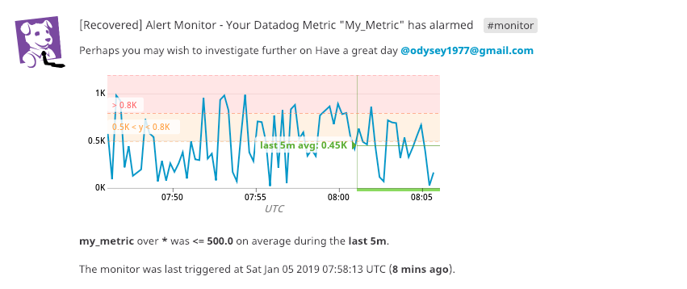

## My Answers to the Hiring Engineers Exercise

The following represents my answers and showcases the workings for the Sales Engineer role exercise.  I have used Datadog in the past so this a great way to extend some of the tasks asked for and build some extra level of automation / capability.  Having demonstrated some use cases to Customers in Australia I am extremely familiar with the integration of different services to solve almost any business challenge with the use of Datadog.

This exercise for the Sales Engineer role in Australia was extremely enjoyable and I look forward to sharing more and more with Datadog and Customers alike.

### Pre-Requisites
As I already had Vagrant installed on my MacOS laptop, I continued to leverage that.  As recommended, I leveraged the Ubuntu 16.04 VM.  Within the Vagrant file, I configured a boot script that would automatically download the Datadog agent and install it.

Vagrant File:
```yaml
# -*- mode: ruby -*-
# vi: set ft=ruby :

Vagrant.configure("2") do |config|
  config.vm.box = "ubuntu/xenial64"
  config.vm.define "serole" do |serole|
    serole.vm.hostname = "serole"
    serole.vm.provision :file, source: 'serole.sh', destination: 'serole.sh'
    serole.vm.provision :shell, privileged: false, path:  "serole.sh", args: "serole"
  end
end 
```
serole.sh script:

```yaml
DD_API_KEY="2d48d77b05c92f4c724805f5c6055610" bash -c "$(curl -L https://raw.githubusercontent.com/DataDog/datadog-agent/master/cmd/agent/install_script.sh)"
```
Once this was complete, I modified the datadog.yaml file to modify the tags as appropriate.  Personally, I leverage tags in everything.  Not only are they really important for grouping, but for further analysis, business decisions, etc they provide one of the best forms of visibility.  It’s also really important to note that if you can – match your tags across your Cloud Vendors.  For instance, if you are monitoring an AWS EC2 instance (which of course you should) and you have tags configured (again – yes you should), then matching these across to Datadog can save you time, effort and provide the same level of visibility across the entire platform.

Once the datadog.yaml file is modified on the Vagrant VM, the agent needs a restart by typing on the console – ```“systemctl restart datadog-agent”``` and it should start reporting info.   You can check what it is doing with datadog-agent status.  If for some reason you see an error, I would recommend you can check ```/var/log/datadog/agent.log``` to see what happened. Once its started you should see an event in your datadog panel as well as a host in the host map with the tags defined in your yaml file. 

 

Once the agent was reporting inside the Datadog panel, the next step was to install a database. As I am far more comfortable with MYSQL, I continued down this path.  On the Vagrant Ubuntu VM, I installed MYSQL and started it up. 

 

Whilst this was being installed, I started on the MYSQL integration via the Datadog Integration tab.  As soon as the MYSQL database server was functional, it was time to configure the integration.  The first step is to create a user to allow datadog to connect to the MYSQL Server as well as provide enough rights on the server (as documented) to capture the necessary metrics.  Once the user was setup and tested with the provided command, I was able to move onto the datadog agent configuration for MYSQL integration. This is done by either modifying or creating a copy of the existing yaml file in /etc/datadog-agent/conf.d/mysql.d directory (I like to make a copy in-case I ever need to revert any changes – just in case). To finalise this step, I modified the file to ensure the agent could login to the database.


Once the agent was restarted ```“systemctl restart datadog-agent”```, I was able to check the status of the Datadog agent ```(datadog-agent status)``` to ensure all was working.

 

We can also see this connection, plus some extra information from our [Datadog dashboard](https://app.datadoghq.com/dash/1036097/my-sql-dashboard?tile_size=m&page=0&is_auto=false&from_ts=1546728600000&to_ts=1546732200000&live=true) and Events pages

 

### Creating a Custom Metric
This is one of the most critical and adaptive features of Datadog (in my personal opinion).  In the most simplest terms – a Metric is a standard of measurement.  Another words, metrics give us the ability to gain visibility into system and read some information for that point in time to reflect behaviour.  For instance – if we want to look at how a CPU is behaving or how many Web requests are going through to a particular web server – we do this by collecting metrics.  This in turn provides us with an abundance of visibility to make decisions – evidence based decisions.

Custom metrics are really clever.  For example – you may want to collect some information from a proprietary application and / or define a particular metric that is specific to a use case you have within the Business.   Personally, I have leveraged Custom metrics in the past to check for Database replications, Container communication (before leveraging Envoy, which I use now).

To perform a custom metric, we leverage two files.  The first file is the check that we wish to perform and the second is to instruct the agent to do something (go look for the check).  The custom metric requested sends a random number between 1 and 1000 to the agent.  

 

### The Bonus Question for this Challenge

In relation to the bonus question – the YAML file can (and was) changed to reflect the time up to a standard 45 seconds.  You have a lot of flexibility when it comes to the Custom metric – not just timing, but the type of information, tagging (again, really important) – plus by leveraging the query editor inside the Datadog panel – how you represent that data (and how it aligns to a business challenge/issue or KPI – this is really important for “C” level executives). 

 

And, again, after running ```“datadog-agent status”``` – I can see my newly created Metric.
 


## Visualising the Data
Collecting data and presenting on a dashboard in a meaningful way is of great use to not only the IT Department (Dev, Ops, Security, Architects), but also the Business.  Whilst the IT team will generally leverage for reaction or even forecasting events, troubleshooting, planning – the Business can leverage the data collected to make educated and meaningful decisions about direction, their KPI’s and the most important – their Customer Experience.  We have all heard too often about Organisations (Vendors and internal IT Teams), claiming a certain SLA for availability – however this bares very little consequence to any performance impacts.  It’s no good having a system that’s up if the User experience is poor and nobody uses the system.  This then has a flow on effect to overall Business performance, Customer experience and long-term growth of the Organisation.

This is where Datadog stands above the rest in how it represents Dashboards (information) for not only the IT Team (as service providers), but also the Business.  For this exercise I leveraged the Datadog API to create a custom dashboard via a script.  Whilst this can be created via the GUI very quickly – there may be times where you need to automate a set of Dashboards (bringing on new accounts, separate accounts/customers, automation activities).  For this we leverage the API.

By leveraging a number of key points of the API, it’s very straight forward to create a Dashboard.  For this exercise I created a Timeboard with the three metrics as requested in the exercise.  

``` yaml
from datadog import initialize, api

options = {'api_key': '2d48d77b05c92f4c724805f5c6055610',
           'app_key': '488f4966561b13f18ce101602d1444196f468917'}

initialize(**options)

title = "TimeBoard Dashboard - SE Role"
description = "Timeboard Creation for SE Role"

# The following represents Challenge 1 - use my cusotm metric

graphs = [{
    "definition": {
        "events": [],
        "requests": [
          {"q":"avg:my_metric{host:serole}"}
        ],
        "viz": "timeseries"
    },
    "title": "My Metric on SE Role"
},
 # This is for Challenge 2 - Any metric from the Integration on your Database with the anomaly function applied. 
 # As I am running MySQL I am going to leverage CPU Performance as a test

    {
    "definition": {
        "events": [],
        "requests": [
            {"q": "anomalies(max:mysql.performance.cpu_time{*}, 'basic', 2)"}
        ],
        "viz": "timeseries"
    },
    "title": "MYSQL Server with CPU Anamalies"},

# And now for Challenge 3 - Here will rollup the points for the past hour for the custom metric

    {
    "definition": {
        "events": [],
        "requests": [
            {"q": "sum:my_metric{host:serole}.rollup(sum)"}
        ],
        "viz": "timeseries"
    },
    "title": "My Custom Metric With Rollup to 1 hour"
}]

read_only = True
api.Timeboard.create(title=title,
                     description=description,
                     graphs=graphs,
                     read_only=read_only)

# Post a message so we know it works via the events page
api.Comment.create(message='Congrats - you have a new Dashboard')

```

 

The next part of the exercise was to set my Dashboard to 5 minutes and send a notation to myself.  This is done by a few steps, as follows:
•	In one of the graphs, however the mouse over it until you see the time.  
•	Hold the left mouse button down and drag right/left until you can represent 5 minutes.
•	Release the mouse button and you now have a 5 minute graph

 

•	Then left mouse click on a point you want to highlight to someone else (annotate)
 


•	Once entered, you will then receive two notifications – on the Events page and via email
 


 

### Bonus Question
Looking for anomalies is a great way to highlight, with the use of a shadow, the average range for the data. If the line appears red than the data reported is outside of the normal numbers expected.  Overall – being able to look at anomalies can give us some great insight into long term / season based performance.  For instance – if we run an ecommerce site, we can quickly get some information over a period of time to determine our Customer behaviour (again – linking data we collect back to a Business focused objective / outcome).  Another important factor here is to be able to not just see how things are behaving, but also get a glimpse when it falls “below” what we expect as normal.  We may not get alerts – but we can start to ask some really important questions and take appropriate action – before our users get impacted…Really powerful stuff.

## Monitoring Data
Dashboards are a fantastic way of visualising your metrics.  They provide us with information that we can make decisions against – whether IT related (something’s broken/behaving abnormally) or Business decisions (what times do our Customers access our ecommerce site and where do they go / come from).  However, as we can’t possibly watch a dashboard everyday/all day – we need to setup a form on monitoring to alert us on some specific behaviour.  Within this exercise:

•	I created a new Monitor that would provide an alert based on a set of thresholds set (500 alert and 800 warning).  
•	I also wanted it to notify me if there was “No Data” for this query for the past 10 mins.
•	Send me an email on the alert, warning and no data
•	Include the metric number within the email

There are a few ways to perform this exercise – via the API or via the UI.  For this exercise I chose the UI for ease of demonstration.

 

After defining the alert conditions, etc - I defined who and how I want to be notified. In this case I want my email notified on warning, alert, and no data.

Here are a few results from the Monitor.





There are lots of other options here for notification – particularly if you leverage some of the extra Integrations.  For instance, if this alerts, we can set it to go (below is a very small but quick list – there are more):

•	Pagerduty
•	ServiceNow
•	Slack

### Bonus Question
As noted, there are times or situations where we don’t want to receive emails/alerts for particular systems.  For instance, we may not want to be notified regarding a Test environment over the weekend.  Or perhaps we have systems that we don’t need to be notified during the middle of the night.  For this we can setup up a “Downtime Schedule” on an alert.  Another meaning for this is to “Mute” the Monitor.  We still get information for historical purposes, but we won’t be woken up in the middle of the night.

To do so, inside the Datadog Panel:

•	Hover the mouse of the Monitors tab and click on Manage Downtime
•	Click on the icon “Schedule Downtime” and fill in the information
  o	Monitor Name or Tag
  o	Schedule – when to silence the monitor
  o	Message – what to say when notifying this monitor will be down for the scheduled period of time
  o	Who to notify

I setup two schedules – Monday to Friday (7pm to 9am) and Weekends (All day Sat and Sun)


## Collecting APM Data

By far one of the most powerful and exciting features of Datadog.  The amount of visibility and access we get from this feature is invaluable.  There are so many different use cases and it’s extremely exciting to see how Customers are getting excited about the possibilities here.

For this exercise I leveraged the Flask Application on my Virtual Machine and the following script.
``` python 
from flask import Flask
import logging
import sys

main_logger = logging.getLogger()
main_logger.setLevel(logging.DEBUG)
c = logging.StreamHandler(sys.stdout)
formatter = logging.Formatter('%(asctime)s - %(name)s - %(levelname)s - %(message)s')
c.setFormatter(formatter)
main_logger.addHandler(c)

app = Flask(__name__)

@app.route('/')
def api_entry():
    return 'Entrypoint to the Application'

@app.route('/api/apm')
def apm_endpoint():
    return 'Getting APM Started'

@app.route('/api/trace')
def trace_endpoint():
    return 'Posting Traces'

if __name__ == '__main__':
    app.run(host='127.0.0.1', port='5050')
``` 
After creating the above file (my_app.py), I then instructed Flask to run.  I then opened up another Vagrant tab in Terminal and run the following command to send data every 5 seconds to the WebServer:

``` yaml
while sleep 5; do curl http://127.0.0.1:5050; done
```

This produced the following results within the APM Dashboard (as per expected).


 

I also created the following [dashboard](https://app.datadoghq.com/dash/1036113/infrastructure-and-apm?tile_size=m&page=0&is_auto=false&from_ts=1546736040000&to_ts=1546739640000&live=true)


### Bonus Question
Below is a screen shot of the APM trace list that shows the values of our Type, Service and Resource.


From here we can see that Flask is our Service and “GET /” is our resource.  Flask is the Service we have running on our Virtual Machine.  A Service is often detailed as a number of processes that are combined to provide a set of features – a Web service for instance (Web Server, App Server and Database Server).  A Resource, however is a query to that particular resource.

For our demonstration, we have Flask running on our Virtual Machine (our service) and I am performing numerous “Curl” requests as noted above as “GET /”.

## Final Question
For Datadog, there are a number of very different use cases that could be adopted.  The limiting factor will be our imagination.  However, if we look natively at what we are collecting and what that means – we then have the ability to provide a Business with some real information to make educated decisions.  The following are use cases that I have previously provided Proof of Concepts / Demonstrations for – to both IT staff and Business Executives:

•	eCommerce customer – Wanted to understand more about their Customers behaviour.  They were really interested in where the user came from, where they went within their eCommerce platform and how long they spent there.  What was even more interesting to understand was if a customer opted out of a purchase, the Business could use the data collected to determine why they did.  Because of this, they were able to potentially follow up.  They could also use the data collected to determine when to scale, where to scale (around the world) and look at their current CDN platform to ensure adequacy for future “Click Frenzies”.

•	MSP provider that wanted to provide a multi-cloud adopted framework for Monitoring as a Service platform.  They wanted a solution that would integrate not only with AWS, but also GCP and Azure.  This solution was to also integrate with CloudHealth to send key metrics for Cost analysis.  The final piece of integration was ServiceNow and HipChat for notifications and ticket allocation.  They were able to provide an end to end capability (completely automated) as well as provide cost analysis across a multi-cloud platform.

•	Leveraging APM will certainly provide a number of greater use cases for Customers.  Deep dive analysis for developers would be crucial – particularly when deploying new services into the business.  Another great use case is for Cloud Migration / Roadmaps.  We could the Service Map capability to determine what Applications talk to each other and how.  This would then assist in developing dependency mappings for applications before they migrate to the cloud.  It also provides a key baseline as to “how” applications behave today for which we could then baseline after migrations.  Far too often I have seen Customers migrate Applications to the Cloud without having a clear picture on Application Dependency mapping.  Datadog absolutely provides a clear picture before we migrate to the Cloud.


