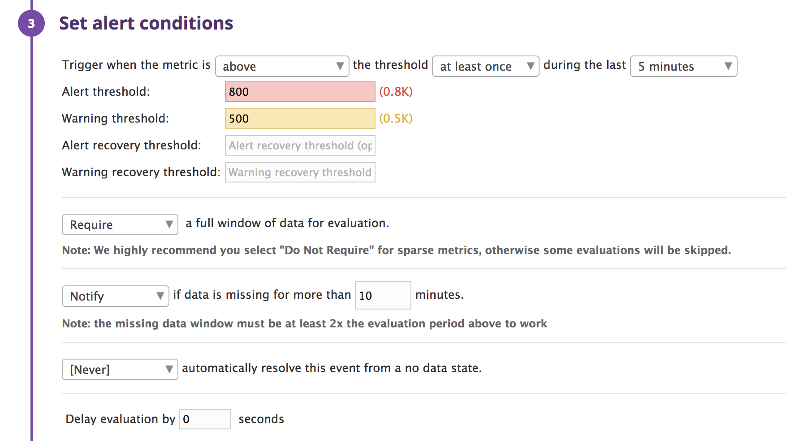

## Prerequisites - Setup the environment

> You can utilize any OS/host that you would like to complete this exercise. However, we recommend one of the following approaches:

- [x] I utilize a containerized approach with Docker for Linux and our dockerized Datadog Agent image as below.

  https://hub.docker.com/r/datadog/docker-dd-agent/

- [x] I sign up for Datadog (use “Datadog Recruiting Candidate” in the “Company” field).

  screenshot1
  

## Collecting Metrics:

- [X] I add tags in the Agent config file and show us a screenshot of my host and its tags on the Host Map page in Datadog.

  screenshot2  
  

- [X] I install a database on my machine (MySQL) and then install the respective Datadog integration for that database.

  screenshot3  
  

- [X] I create a custom Agent check that submits a metric named my_metric with a random value between 0 and 1000.

  screenshot4  
  

- [X] I change my check's collection interval so that it only submits the metric once every 45 seconds.

  screenshot5  
  

- [X] **Bonus Question** I change the collection interval without modifying the Python check file I created.

  same as schreenshot5

## Visualizing Data:

> Utilize the Datadog API to create a Timeboard that contains:

- [X] I create my custom metric scoped over my host.

  screenshot6 and embedurl1  
    
  https://p.datadoghq.com/sb/bc3f6b77c-b136ac0884

- [X] I create Any metric from the Integration on my Database with the anomaly function applied.

  screenshot7 and embedurl2  
    
  https://p.datadoghq.com/sb/bc3f6b77c-0a21ac2139

- [X] I create my custom metric with the rollup function applied to sum up all the points for the past hour into one bucket.

  same as screenshot6 and embedurl1

> Once this is created, access the Dashboard from your Dashboard List in the UI:

- [X] I set the Timeboard's timeframe to the past 5 minutes

  screenshot8 and embedurl3  
    
  https://p.datadoghq.com/sb/bc3f6b77c-abe77f65ce

- [X] I take a snapshot of this graph and use the @ notation to send it to yourself.

  screenshot9  
  

- [X] **Bonus Question**: The xxxx is displaying as the Anomaly graph?

    Faster or Slower increase or decrease of value of metric as calculated by Datadog anomal algorithm.

## Monitoring Data

> Create a new Metric Monitor that watches the average of your custom metric (my_metric) and will alert if it’s above the following values over the past 5 minutes:

- [X] I set warning and alerting and No Data monitoring for this query over the past 10m.

  screenshot10, 11  
    
  

> Please configure the monitor’s message so that it will:

- [X] I send an email to myself whenever the monitor triggersand different messages based on whether the monitor is in an Alert, Warning, or No Data state and include the metric value that caused the monitor to trigger and host ip when the Monitor triggers an Alert state.

  screenshot12  
  

- [X] I take a screenshot of the email that it sent to me.

  screenshot13, 14  
    
    

* **Bonus Question**: I set up two scheduled downtimes for this monitor as bellow:
- [X] One that silences it from 7pm to 9am daily on M-F and one that silences it all day on Sat-Sun.

  screeenshot15, 16  
    
  

- [ ] Make sure that your email is notified when you schedule the downtime and take a screenshot of that notification.

  no mail recieved

## Collecting APM Data:

> Given the following Flask app (or any Python/Ruby/Go app of your choice) instrument this using Datadog’s APM solution:

- [x] I only use one or the other of ddtrace-run. 

  screenshot17, 18, 19 and 20 and 21 and embedurl4  
    
    
    
    
  
  https://p.datadoghq.com/sb/bc3f6b77c-244797aa29

- [x] **Bonus Question**: I mension about the difference between a Service and a Resource.

    Service is one application having any Resources. Resource is each URI or URL depends on parameters.  
    ex) {Your_Application_URL}/user?id=1 or {Your_Application_URL}/user?id=2 are each one Resource, and Both URIs are included by one Service.

## Final Question:

> Is there anything creative you would use Datadog for?

- [x] I answer as bellow.

    For healthcare solution. Using for your grand parents's health checking by tracing your house energy usage of your house monitoring and check.

That's all.
