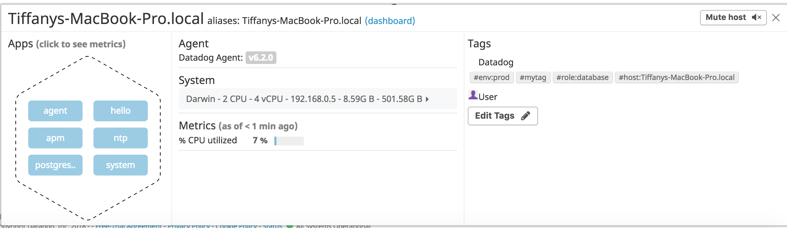
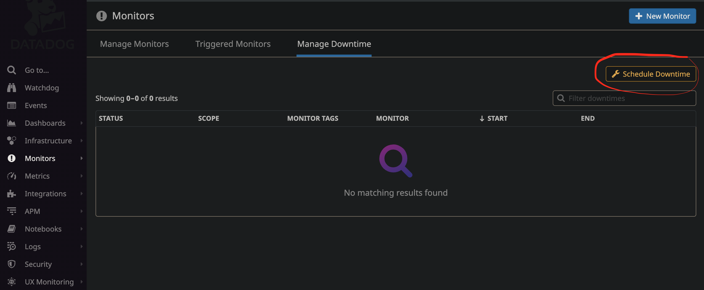

# Datadog Solutions Engineer Tech Exercise

This document should provide a follow-along wiki-style article for showing off
some of the features of Datadog in line with the Tech Exercise for being hired
as a Datadog Solutions Engineer.

- [What is Datadog?](#what-is-datadog)
- [Getting started - setting up a test environment](#getting-started---setting-up-a-test-environment)
  - [Gather and Install the Prerequisites](#gather-and-install-the-prerequisites)
  - [Boot up the test environment virtual machine](#boot-up-the-test-environment-virtual-machine)
- [Collecting Metrics:](#collecting-metrics)
  - [Tagging](#tagging)
  - [Integrations](#integrations)
  - [Custom Agent Checks](#custom-agent-checks)
  - [Metric Intervals](#metric-intervals)
- [Visualizing Data:](#visualizing-data)
- [Monitoring Data](#monitoring-data)
- [Collecting APM Data:](#collecting-apm-data)
  - [Getting Creative](#getting-creative)

# What is Datadog?

Datadog is a suite of products focused around metrics.  It includes a robust
metric collection and visualization web platform, as well as alerting, application
performance management, and a host of other features.

# Getting started - setting up a test environment

Datadog operates on a variety of hosts and platforms, including Windows, Linux,
and Mac OSX.  For this demonstration, we will utilize a Ubuntu Linux Virtual
Machine running on top of [Virtualbox](https://www.virtualbox.org/) with some
automation provided by [Vagrant](https://www.vagrantup.com/) to get us going in
a safe test environment.

This tutorial will not aim to teach you how to utilize Vagrant and Virtualbox,
but we will provide enough information to utilize these tools for the purposes
of exploring Datadog.  We've automated much of the setup so that we can get to
the fun stuff!

## Gather and Install the Prerequisites

We need to get things setup for our test environment.

1. Install Virtualbox from [here](https://www.virtualbox.org/wiki/Downloads).
2. Install Vagrant from [here](https://www.vagrantup.com/docs/installation/).
3. Clone this repository to a folder on your machine
4. Check out the 'alex' branch
5. Login to Datadog and get your API key from [here](https://app.datadoghq.com/account/settings#api).
Of note, Datadog has a 14 day free trial if you don't already have an account!
6. Create an app key while you are there, give it a name, and save it for the next step.
7. Place your API key, app key and some tags in a `.env` file.
```
echo "API_KEY=0123456789abcdef" > .env
echo "TAGS=\"alex, env:dev, role:se\"" >> .env
echo "APP_KEY=abcdef0123456789" >> .env
```

The .env file is just a convention for my automated setup.  These values will
actually end up in the datadog agent config on our test host.  The API key allows
us to identify our Datadog account to the agents, and when combined with the app
key gives us access to the programattic API.  You may wish to use a separate APP
key for any given app that uses the API, so you can easily revoke them if needed.

## Boot up the test environment virtual machine

From the root of the repository, run `vagrant up`.  This should take the following
steps automatically for you:

1. Download the Ubuntu Xenial Vagrant box (base virtual machine image) if you
don't have it.
2. Import the image in to a new virtualbox virtual machine
3. Start the virtual machine
4. Update and install needed packages, including PostgreSQL and the Datadog agent
5. Copy the datadog checks to the appropriate places
6. Updates the agent configuration file with the values in `.env`
7. Starts the datadog agent
8. Creates a Datadog Timeboard that we can use later

# Collecting Metrics

Lets get to the heart of Datadog: metrics!

## Tagging

Tags are Datadog's way of giving you arbitrary ways to identify hosts and metrics.  They
are easily set in the agent configuration file through whatever configuration management
you may use.

In our example case, we've already set these tags in our `.env` file which I've used to
configure our test machine.  The appropriate entry in the config file is as follows:
```yaml
[Main]
tags: alex, env:dev, role:se
```

These will help us limit and filter our metrics in various ways later.  You'll be able
to see the tags on a given host in the detail view of Datadog's host map:



## Integrations

Integrations are one of the primary ways to add services Datadog can collect metrics on.
In our case here, our test host has a PostgreSQL database on it, and we've installed and
configured the Datadog integration for it.  Most integrations will require some manual
configuration.  In the case of PostgreSQL, it needed a role created with access to the
`pg_stat_database`.  This is automated in `setup_dd_user.sql` as follows:
```sql
CREATE USER datadog WITH PASSWORD 'datadog';
GRANT SELECT ON pg_stat_database TO datadog;
```

Secondly, we had to add the configuration for that user to the Datadog integration.  This
is done by placing a configuration file at `/etc/dd-agent/conf.d/postgres.yaml` with the
following information in it:
```yaml
init_config:

instances:
  - host: localhost
    port: 5432
    username: datadog
    password: datadog
```

## Custom Agent Checks

Custom agent checks work in much the same way as integrations.  You can write a check,
place it in `/etc/dd-agent/checks.d` and place a config for it in `/etc/dd-agent/conf.d`.
The beauty of custom agent checks is that you can write them to do anything you would like.
There are also quite a few useful checks already prebuilt by the datadog team, such as
`check_http` to arbitrarily examine urls.

Our test environment has an example check written as follows, using Datadog's python API:
```python
import random

from checks import AgentCheck


class CheckRandom(AgentCheck):
    def check(self, instance):
        self.gauge('my_metric', random.randrange(0, 1000))
```

This, of course, checks nothing of value, but it will give us data cataloged as `my_metric` to
work with later in our exploration of Datadog's features.

Also worth noting, there are several types of metrics based that you can send.  We are using
a simple gauge metric, but there are several others such as histograms and counts, each useful
for a different purpose.  More info can be found in the docs [here](https://docs.datadoghq.com/guides/dogstatsd/#metrics).

## Metric Intervals

Metric intervals for custom checks are well explained in the [agent check documentation](https://docs.datadoghq.com/guides/agent_checks/#configuration),
but the short version is that for each agent check you can set the minimum interval to collect.
This means that the agent will never send data more often than the value specified in seconds.

In the case of our `check_random.py` that we setup in our test environment, I've set it so that
the agent will only submit the check if at least 45 seconds has passed since the last time the
metric was sent.  You can see this in it's config file `check_random.yaml`:
```yaml
init_config:
  min_collection_interval: 45
```

# Visualizing Data:

Timeboards, also known as dashboards, are one of the several ways visualize the
metrics we're now collecting.  You can set them up through Datadog's web UI or
through Datadog's API.  An example of setting up a timeboard via the API can be
located in `create_timeboard.py`.  Datadog's API is easy to use with good [docs](https://docs.datadoghq.com/api/)
that can allow you to programatically setup quite a few things in dynamic
environments.

I had `create_timeboard.py` use the API key and App key you setup in the `.env` file
to create a basic dashboard with following things on it:

* A basic system stat collected by the agent, in this case average free memory
* The custom metric `my_metric` that we setup with `check_random` scoped to just our host.
* A metric from our PostgreSQL integration, specifically the max connection count, with
the anomaly function applied
* The custom metric `my_metric` with the rollup function applied to sum up all the points for
the past hour, displayed as a number.

The anomaly function is one of several algorithms you can apply to your data.  The
anomaly detection allows you to identify when a metric is behaving differently than it has
in the past, taking into account trends, seasonal day-of-week and time-of-day patterns.
It is well-suited for metrics with strong trends and recurring patterns that are hard or
impossible to monitor with threshold-based alerting.

The created dashboard should look something like this:


Another interesting feature is from any graph on a dashboard, you can click the camera
icon when you hover over it with a mouse to make a notification.


You can then type a message, using an @user style notation to notify other team members
or groups of members


This can email team members, and these discussions will also show up as an event on your
[event timeline](https://app.datadoghq.com/event/stream).


You can even use the @ notifications to contact Datadog support with `@support-datadog`!

# Monitoring Data

Datadog also has a powerful alerting system you can utilize to alert based on your collected
metrics, events, and more.  They call these metric alerts "monitors" and they are very useful.
You can integrate the alerting side of these monitors with many popular alerting and on-call systems
including [PagerDuty](https://www.pagerduty.com/) and [OpsGenie](https://www.opsgenie.com/)
if you need more alerting flexibility than the built-in Datadog system provides.

Lets say we want to make sure our test metric to tell us when it's over 800.  You can
create a new Metric Monitor that watches the average our custom metric `my_metric` and will
alert if it’s above the following values over the past 5 minutes:

* Warning threshold of 500
* Alerting threshold of 800
* And also ensure that it will notify you if there is No Data for this query over the past 10m.

Head to [Manage Monitors](https://app.datadoghq.com/monitors/manage) in the Datadog web UI, and
choose New Monitor in the upper right.  Choose metric monitor, and setup the thresholds something
like this:


Lets also make the alert message useful by having it:

* Send you an email whenever the monitor triggers.
* Create different messages based on whether the monitor is in an Alert, Warning, or No Data state.
* Include the metric value that caused the monitor to trigger and host ip when the Monitor triggers an Alert state.
* When this monitor sends you an email notification, take a screenshot of the email that it sends you.

Datadog has conditionals that you can use, as well as some variables available to customize your messages.
To achieve my goals, I had to do the following:


Markdown is also supported, so it's quite easy to link to a wiki article for your alert if needed.
I also included this in my example.

After a while, you should start receiving emails.  That might get a bit annoying when alerts are
expected.  Luckily, Datadog provides a facility to mitigate the alerts when we want.
Lets use the scheduled downtimes for this alert to do a few things:

    * One that silences it from 7pm to 9am daily on M-F,
    * And one that silences it all day on Sat-Sun.
    * Make sure that your email is notified when you schedule the downtime and take a screenshot of that notification.

You can go to [Manage Downtime](https://app.datadoghq.com/monitors#/downtime) in the Datadog UI to
get started.  Setting things up is pretty self-explanatory.  Here's an example of setting up the
nightly downtime:


You should get an email when downtimes are scheduled as well:


The Manage Downtime board gives you a good overview of all your schedule downtimes, which can be sorted, scoped,
and filtered by tags as well.



# Collecting APM Data:

Datadog has the ability to collect APM Trace data from a variety of frameworks and languages.
Below, we have a simple Flask application that's instrumented within code.  For python applications,
you could also use their `ddtrace-run` utility.  More specific information on APM Tracing
can be found in the docs [here](https://docs.datadoghq.com/tracing/).

I've provided a simple Flask app, and instrumented it using the framework specific middleware
provided.  You can see the code in `flaskapp.py` but in this case, it's a simple middleware
injected before app run time:
```
from ddtrace import tracer
from ddtrace.contrib.flask import TraceMiddleware

from flask import Flask

app = Flask(__name__)
traced_app = TraceMiddleware(app, tracer, service="my-flask-app", distributed_tracing=False)


if __name__ == '__main__':
    app.run()
```

It should already be running and providing traces.  You can see the service running in the [APM UI](https://app.datadoghq.com/apm/services):


If you drill in, you can see there are 3 resources underneath our Flask app.  It might
take a bit to get used to the [terminology](https://docs.datadoghq.com/tracing/terminology/)
used, but for our purposes here, a service is a set of processes that do the same job.  In
our instance, that is our Flask webapp.  A resources is a particular query to that service.
In our case, that's one of the 3 available app routes I defined in `flaskapp.py`.

You can also include APM metrics on Dashboards right alongside infrastructure metrics.
This can help you determine root cause much more easily.  For example, if web requests are
slowing down due to a constrained database server, you could pull response times for given
routes in to a dashboard, as well as your database server i/o statistics, to look for issues,
like this:


## Getting Creative

Datadog has been used in a lot of creative ways in the past. Datadog has written some blogs
about using Datadog to monitor the NYC Subway System, Pokemon Go, and even office restroom
availability!

If you can find a way to get data in, you can use it in all of these interesting ways! I for
one would love to be able to track the availability of my favorite ice creams at the
コンビニ (convenient store) down the street so I wouldn't have to walk there and find they
are out!  Now to figure out how to count ice creams from a web cam mounted in the store...

On a more practical example, I'd also would like to take an ADS-B receiver and create
a dashboard profiling airplanes in my receiving distance, avg/min/max alititude of flights, number of
planes in the area, and other such fun statistics to please the aviator in me.
