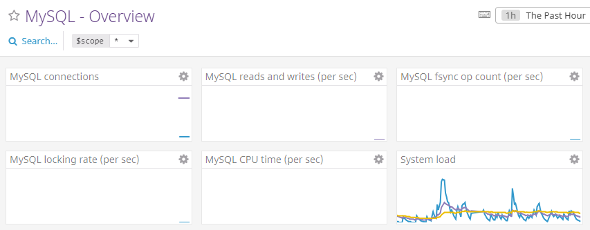
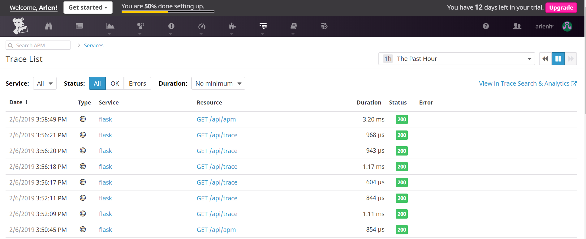

## Collecting Metrics:

### Adding a custom tag to the Agent config file.

I modified the Agent config file by adding a simple tag of my name.

`tags: tonysaavedra`

and then verified that it updated the host map page.


### Installing MySQL on Ubuntu and the Datadog integration.

I installed MySQL on Ubuntu per these [instructions](https://www.digitalocean.com/community/tutorials/how-to-install-mysql-on-ubuntu-16-04),
and then added the Datadog integration with the configuration as follows:

```yaml
init_config:

instances:
  - server: localhost
    user: datadog
    pass: PASS
    tags:
        -mysql_integration
    options:
      replication: 0
      galera_cluster: 1
```

This allowed me to get a detailed view of the integration.



You can view this dashboard of the MySQL metrics [here](https://app.datadoghq.com/dash/integration/12/mysql---overview?tile_size=m&page=0&is_auto=false&from_ts=1546495560000&to_ts=1546499160000&live=true)

### Creating a custom Agent check 

Following the [Datadog documentation](https://docs.datadoghq.com/developers/write_agent_check/?tab=agentv6), I then created a custom Agent check that submits a random number between 0 and 1000.

```python
try:
  from checks import AgentCheck
except ImportError:
  from datadog_checks.checks import AgentCheck

from random import seed
from random import randint

seed(1)

__version__ = "1.0.0"

class MyMetricCheck(AgentCheck):
  def check(self, instance):
      self.gauge('my_metric', randint(0, 1000))
```

I included its yaml configuration so that it submits the metric every 45 seconds.

```yaml
init_config:

instances:
  - min_collection_interval: 45
```

Final result:


If I can't modify the Python file, I'm not aware of an easy implementation to change the collection interval.

We might be able to set an environment variable and read it in the yaml file, but I can't verify this with certainty or speak for its efficacy / use of good practices.

## Visualizing Data:

Creating a timeboard was an easy task to accomplish using the [Datadog API](https://docs.datadoghq.com/api/?lang=python#timeboards).

```python
from datadog import initialize, api

options = {
    'api_key': '',
    'app_key': ''
}

initialize(**options)

title = "My First Timeboard"
description = "Solutions Engineer Challenge"
graphs = [{
    "definition": {
        "events": [],
        "requests": [
            {"q": "my_metric{host:ubuntu-xenial}"}
        ],
        "viz": "timeseries"
    },
    "title": "my_metric"
},
{
    "definition": {
        "events": [],
        "requests": [
            {"q": "anomalies(sum:mysql.innodb.buffer_pool_read_requests{host:ubuntu-xenial}, 'basic', 2)"}
        ],
        "viz": "timeseries"
    },
    "title": "Sum MySQL Read Requests"
},
{
    "definition": {
        "events": [],
        "requests": [
            {"q": "sum:my_metric{host:ubuntu-xenial}.rollup(sum, 3600)"}
        ],
        "viz": "timeseries"
    },
    "title": "my_metric total sum per hour"
}]

template_variables = [{
    "name": "host1",
    "prefix": "host",
    "default": "host:ubuntu-xenial"
}]

read_only = True
res = api.Timeboard.create(title=title,
                     description=description,
                     graphs=graphs,
                     template_variables=template_variables,
                     read_only=read_only)
print(res)
```

Looking at the graphs array, you can see how I created three graphs, where the last two were custom made to answer the challenge at hand. 

After making the API call, I verified that a new dashboard was created!


Then, setting the timeframe to the past 5 minutes, I created a snapshot and sent it to myself.


#### Bonus Question

The Anomaly algorithm I used was the 'basic' one, which determines the range of expected values. According to [this article](https://www.datadoghq.com/blog/introducing-anomaly-detection-datadog/), it adjusts quickly to changing conditions but has no knowledge of seasonality or long-term trends. 

## Monitoring Data:

Similar to creating a timeboard, creating a monitor involved making an API call and writing a script for that:

```python
from datadog import initialize, api

options = {
    'api_key': '',
    'app_key': ''
}

initialize(**options)

options = {
    "notify_audit": "false",
    "locked": "false",
    "timeout_h": 0,
    "new_host_delay": 300,
    "require_full_window": "true",
    "notify_no_data": "true",
    "renotify_interval": "0",
    "escalation_message": "",
    "no_data_timeframe": 10,
    "include_tags": "true",
    "thresholds": {
        "critical": 800,
        "warning": 500
    }
}

res = api.Monitor.create(
    type="metric alert",
    query="avg(last_5m):avg:my_metric{host:ubuntu-xenial} > 800",
    name="my_metric threshold reached",
    options=options,
    message="{{#is_alert}}\nAlert: the value for my_metric reached {{value}}, surpassing the 500 threshold.\n{{/is_alert}} \n{{#is_warning}}\nWarning: the value for my_metric reached {{value}}, surpassing the 800 threshold!\n{{/is_warning}}\n{{#is_no_data}}\nThe host has not received data over the past 10m for my_metric.\n{{/is_no_data}} @ajsaavedrax@gmail.com"
)

print(res)
```

Following the [documentation](https://docs.datadoghq.com/api/?lang=python#create-a-monitor), I configured the monitor to send a message based on the monitor state and included the value that triggered the monitor.

The following depicts the monitor working as expected, where the metric value that triggered the monitor is shown.


You can find the final version of my monitor [here](https://app.datadoghq.com/monitors/7801518)
### Bonus Question

After scheduling a downtime for the monitor above, I silenced it from Monday-Friday from 7pm to 9am and received this notification:


Disabling on Saturday and Sunday, gave me this notification


You can find both downtimes scheduled here:

[M-F](https://app.datadoghq.com/monitors#downtime?id=445779190)
[weekend](https://app.datadoghq.com/monitors#downtime?id=445801685)

## Collecting APM Data:

I instrumented the provided Flask application using Datadog's APM solution.

```python
from flask import Flask
import logging
import sys

main_logger = logging.getLogger()
main_logger.setLevel(logging.DEBUG)
c = logging.StreamHandler(sys.stdout)
formatter = logging.Formatter('%(asctime)s - %(name)s - %(levelname)s - %(message)s')
c.setFormatter(formatter)
main_logger.addHandler(c)

app = Flask(__name__)

@app.route('/')
def api_entry():
    return 'Entrypoint to the Application'

@app.route('/api/apm')
def apm_endpoint():
    return 'Getting APM Started'

@app.route('/api/trace')
def trace_endpoint():
    return 'Posting Traces'

if __name__ == '__main__':
    app.run(host='127.0.0.1', port='5050')
```

After setting up a directory with this application and installing [pip](https://pypi.org/project/pip/) on Ubuntu, I then followed the [documentation](https://docs.datadoghq.com/agent/apm/?tab=agent630) and updated the main Agent configuration to enable `apm_config`.

Upon installing the [Datadog Tracing library with pip](https://docs.datadoghq.com/tracing/languages/python/), I instrumented the Flask application.

The Datadog Agent did not start collecting traces until I called the Flask API with [cURL](https://curl.haxx.se/),
at which point I was able to see the following dashboards:



This can be found [here](https://app.datadoghq.com/apm/service/flask/flask.request?end=1546496525467&env=none&paused=false&start=1546410125467)

### Bonus Question

A "Service" is said to be the name of a set of processes that work together to provide a set of features. If speaking about a web application, we can say that the web app may have the service for the application itself and a service concering all database processes.

If we specifically talk about our APM Flask implementation, `flask.request` is the service.

A "Resource" then is a particular query to a service. With regards to a web application service, a resource example would be a URL `/products/organic`.

If you look at the screenshot above, the resource `/api/apm` for the service `flask.request` is listed. 

## Final Question

I work for the Berkeley Bowl Marketplace, so I think that my idea for a Datadog implementation would be to monitor a store with an accurate inventory system by monitoring metrics on custom DB queries.

That is, I would be very interested in monitoring sales on specific items, or to send alerts when one reaches a threshold, i.e. when an item on sale has sold more than expected.

But apart from that, it would be great to notify buyers when their inventory numbers are reaching a lower number before they need to make a purchase to restock, or when a certain item is under-selling.

