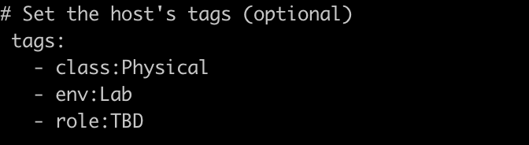
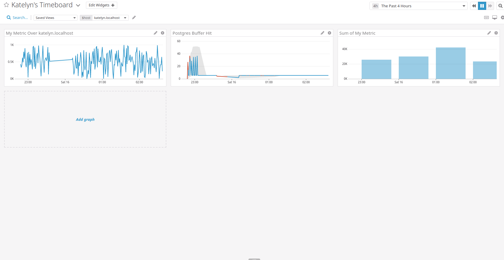

## Setup the Environment
I decided to start a Vagrant VM (ubuntu 12.04) on my linux machine to not mess with my environment. 
I used the simplest Vagrant file to begin as quickly as possible.

## Collecting Metrics

* **Tags set up in the Agent config** 
Here is the configuration of my agent : [datadog.conf](dd-agent/datadog.conf) 
I added one tag to describe the environment (env:) and one to set the role (role:). 
My tags are well shown on the host map as expected: 

* **Database installation and integration set up** 
I chose to install a MySQL DB. 
The integration has been done and the "mysql" app can be seen on the host map for my host : 

* **Custom Agent check** 
Creating a custom agent check means adding two new files to the host. 
The first one is a YAML which describes the configuration of the custom check : [YAML file](dd-agent/conf.d/my_check.yaml) 
The second one is a Python script which defines what the check sends : [Python file](dd-agent/checks.d/my_check.py) 

After the integration, we can see that the new metric is well sent by the Agent in the "all metrics" pannel : 

* **Check collection interval change** 
I changed the [configuration](dd-agent/conf.d/my_check.yaml) of the check by adding :
"min_collection_interval: 45" to the "init_config" part.

* **BONUS QUESTION : Can you change the collection interval without modifying the Python check file you created?** 
I didn't modify the python script to do so, I modified the config in the YAML file as explained in the question before. This is the only way I know, for now.

## Visualizing Data
* **Timeboard creation with the API** 
I decided to use a python script to create/update a board via the API. 
Here is my script : [update_board.py](./update_board.py), It takes several argument like the name of the board, its id, the JSON describing the board and the keys needed for the API. 
Here is the JSON file used for the board : [board.json](./board.json) where we can see the different metrics used : 
- my metric scoped over my host : my_metric {host:precise64} 
- my metric with the rollup function : avg:my_metric{*}.rollup(sum, 3600) 
- the number of connections on my mysql DB with anomalies function : anomalies(avg:mysql.net.connections{*}, 'basic', 2) 

I also added 3 more pannels to have each metric on its own pannel to check if everything is working.
 
Here is the screenshot of the Timeboard:

* **Snapshot and annotation** 
I didn't receive an email after my annotation. I tried several times and I even changed my email adress. No success. I screenshoted the event in the event list to show that the event happened anyway  

* **Bonus Question: What is the Anomaly graph displaying?** 
The Anomaly Graph displays a line (or other visualization) which can take 2 colors, blue or red. If the color goes to red for a part of the graph, it means that the value went below or higher the "usual" trend calculated by the anomaly algorithm. https://docs.datadoghq.com/guides/anomalies/ 

## Monitoring Data
* **Metric Monitor set up** 
Here are screenshots of my monitor edit tab to show how I configured it:

I received the expected e-mail for a "Warning" notification:

* **BONUS QUESTION: Downtime set up**  
I set up both downtimes and here is the view of both in the downtime pannel.

Weekly Downtime :

Week-end Downtime:
 

I wasn't notified when I scheduled the downtimes (same issue as the notification e-mail maybe) but I received an e-mail later when the downtime started.

## Collecting APM Data
* **APM Metric set up** 
To gather APM metrics, I installed ddtrace on my vragrant VM with a "pip install" command and I also installed Flask in order to run the code provided. 
I started the flask code with "ddtrace-run python flask_app.py &" on my vagrant VM. 
To make sure it works and to generate APM metrics, I have done some curls to query the different endpoints. 

The metrics appeared as expected on the APM page of the datadog website and I could used them on my dashboard. 
I decided to show the CPU and the Mem used by my host to correlate with the latency shown by the APM metrics. 
[Link to my Dashboard](https://p.datadoghq.com/sb/b1131d66e-41a43718b5) 
Screenshot of my dashboard :

* **Bonus Question: What is the difference between a Service and a Resource?** 
Following the python doc (http://pypi.datadoghq.com/trace/docs/), a "service" is "the name of a set of processes that do the same job", for example, the name of your app.
A ressource is "a particular query to a service". For example, an endpoint or a sql query.

## Final Question
* **Is there anything creative you would use Datadog for?** 
Following the idea of monitoring NYC Subway System, I would like to monitor the Paris "Velib" System (Bike Service).
Each of the "hub" would be viewed as a Host and we could couple this with a map of Paris. We could monitor the number of bikes in each Hub and set up alerts when there is none, or when the hub is full.
By doing this, we could identify which hubs tend to be more often empty and add extra bikes. We could also identify the peak hours and so on.
I know that the city of Paris is already exposing some datas but could be nice to implement the dd agent on each hub.
