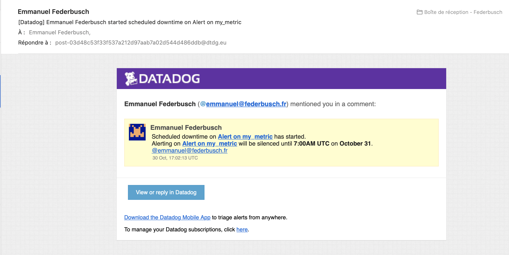

## Level 1 - Collecting your Data

**Bonus question: In your own words, what is the Agent?**
The agent is a daemon process that resides on your server, collecting metrics and sending them to DataDog. The three part approach of a system metric collector, a custom metric collector and the forwarder, which sends metrics to DataDog, allows for customization of exactly what gets collected and sent.


**Write a custom Agent check that samples a random value. Call this new metric: `test.support.random`**

```
from checks import AgentCheck
import random
class RandCheck(AgentCheck):
    def check(self, instance):
        self.gauge('test.support.random', random.random())
```

## Level 2 - Visualizing your Data

**Clone your database integration dashboard and add additional database metrics to it as well as your `test.support.random` metric from the custom Agent check.**

https://app.datadoghq.com/dash/249972/support-engineering-dashboard

Cloning the database integration dashboard - in this case, the MySQL integration dashboard based off of the database that I installed in level 1 - was straight forward. From the MySQL integration dashboard page, I clicked the gear icon in the top right and Clone Dashboard. From there, I assigned a unique name for this dashboard, and then added the `test.support.random` graph as a Timeseries, as this data was a value that changed over time, and was best displayed in this format.

**Bonus question: What is the difference between a timeboard and a screenboard?**
A timeboard shows modules that utilize the same time window, often used for viewing real time data. Integration dashboards look to be comprised mostly of timeboards by default. Screenboards, however, have modules with individual time windows, or even static data that doesn't rely on time.

**Take a snapshot of your `test.support.random` graph and draw a box around a section that shows it going above 0.90.**


When setting up the graph, initially, I had set this graph to use the average value of `test.support.random` and display that in the timeseries graph. In doing so, however, the value of 0.9 didn't come up very often. To increase the odds of this value occurring, I set the timeseries to graph the maximum value of the `test.support.random` metric, which more frequently reported a 0.9 value, making it easier to find the proper snapshot.


## Level 3 - Alerting on your Data

**Set up a monitor on this metric that alerts you when it goes above 0.90 at least once during the last 5 minutes**

https://app.datadoghq.com/monitors#1631294

With the data being graphed by the maximum value of `test.support.random` instead of the average value, as I mentioned previously, the frequency that this monitor would be in a critical state increased, and as such, I received several open and close emails for different incidents of this value going above and below the 0.9 threshold for 5 minute increments.


Although basic in formatting, the alert notification email format that I went with was clear and easy to decipher what was going on. While such a *comforting* note might not find its way into an actual alert message, being able to customize the content of the body of the message itself was quick and easy.

**Bonus: Since this monitor is going to alert pretty often, you don't want to be alerted when you are out of the office. Set up a scheduled downtime for this monitor that silences it from 7pm to 9am daily. Make sure that your email is notified when you schedule the downtime and take a screenshot of that notification.**



[View Scheduled Downtime](https://app.datadoghq.com/monitors#downtime?id=214104063)

Having scheduled downtime through this tool gives users the ability to avoid alert fatigue. With the frequency of alert notifications that I was receiving, that alert fatigue could have set in quickly. By scheduling downtime for these notifications, I was able to avoid this. One thing I did note is that while setting the timezone for the downtime to a timezone that I'm not currently in, the time I received in the email reflected the UTC time for the end time, rather than the local time.
