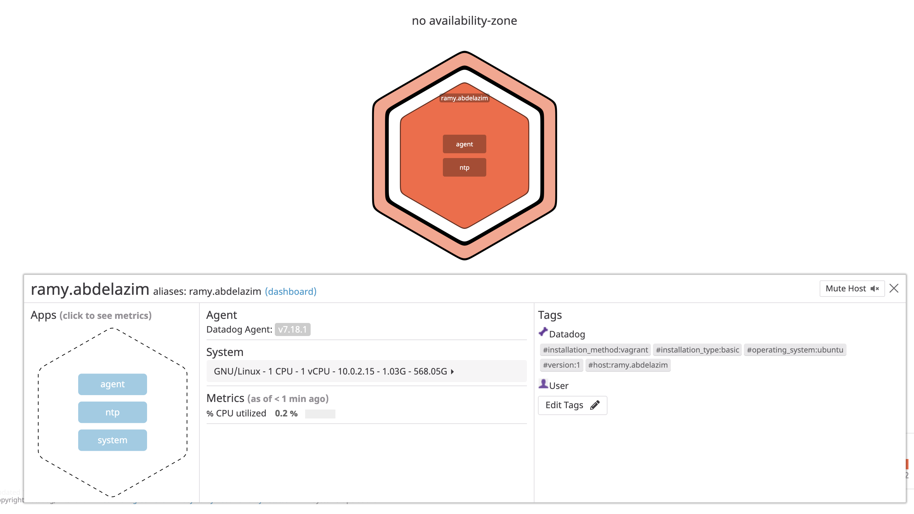

In order to demonstrate some of the main features of DataDog, here is a quick run-through of how to get started on a few of them.

To get started you'll need a couple of things.

First, you'll need a machine to work on. You can [install a VM with vagrant](https://www.vagrantup.com/intro/getting-started/) pretty quickly if you don't want to get your personal machine too messy.

Next, sign up for a trial at the [Datadog website.](https://app.datadoghq.com/signup)

Finally you'll have to install a datdog agent onto the machine you're working with. I'm running Ubuntu on my VM, but you can find your operating system [here](https://app.datadoghq.com/account/settings#agent) and install the agent that way. This agent will report the metrics you configure to the Datadog website and you'll be able to view the data there after logging in. 

If you have any trouble with that last step you can refer to [the excellent datadog docs and guides.](https://docs.datadoghq.com/getting_started/agent/?tab=datadogussite)


Now that that's out of the way, let's dive in!

# Collecting Metrics


First and foremost, Datadog is a metrics collection tool. Everything else flows from the data that you've collected. So let's start by collecting some data!

In order to slice up our data in different ways, we'll use [tagging](https://docs.datadoghq.com/tagging/). The tags that come out of the box are as follows:


It's worth looking over the [guidelines for leveraging tags](https://docs.datadoghq.com/tagging/#defining-tags) but you don't need to read that to get started.

#### Add tags in the Agent config file and show us a screenshot of your host and its tags on the Host Map page in Datadog.

So let's for fun add some of our own tags. To add tags, we'll put them into our `datadog.yaml` file which lives at `/etc/datadog-agent/datdog.yaml` on Ubuntu systems. For other operating systems, check the [configuration section](https://docs.datadoghq.com/agent/basic_agent_usage/ubuntu/?tab=agentv6v7#configuration) for your particular OS.

Here's how I've added my tags to the bottom of my yaml file:

```
hostname: ramy.abdelazim
tags:
        - "installation_method:vagrant"
        - "installation_type:basic"
        - "operating_system:ubuntu"
        - "version:1"
```

After adding this to your agent configuration, log in to the datadog site and you'll be able to see that the tags have been added to your host by going to the [host map](https://app.datadoghq.com/infrastructure/map).

Here's what mine looks like:


---------------------------------------------------------------------------------------------------------------------------------------------------------------------------

Install a database on your machine (MongoDB, MySQL, or PostgreSQL) and then install the respective Datadog integration for that database.


Create a custom Agent check that submits a metric named my_metric with a random value between 0 and 1000.
Change your check's collection interval so that it only submits the metric once every 45 seconds.
Bonus Question Can you change the collection interval without modifying the Python check file you created?


[Next Page](./README.md)
