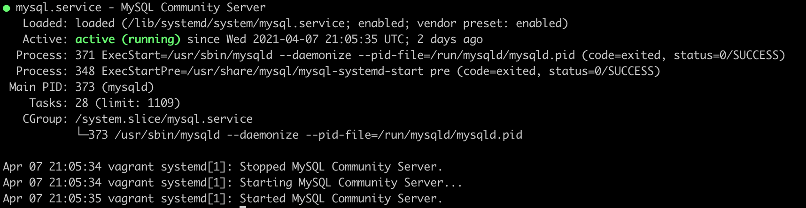

# André Hostombe

## Datadog Exercise:


## Questions
Please provide screenshots and code snippets for all steps.

## Prerequisites - Setup the environment
You can utilize any OS/host that you would like to complete this exercise. 

For the exercise two DataDog Agent where installed on two different MacBooks.
-	MacBook Pro (13-inch, 2017) - 2,3 GHz Intel Core i5
-	MacBook Pro (Retina 15', Mitte 2014) - 2,5GHz Intel Core i7

Installation was done using the installer script provieded in the Agent Sector.
```
(DD_API_KEY=efd6d9433248935024bd9ea0a28fca3d bash -c "$(curl -L https://raw.githubusercontent.com/DataDog/datadog-agent/master/cmd/agent/install_mac_os.sh)
```
On both machines the Agents where insalled without any issue

The test account i created already 3 weeks ago. So there is no “Datadog Recruiting Candidate” in my „Company“ Field. But basically the registration when prety stright foreward.

## Collecting Metrics
Definition of new Tags based on the DataDog documentation on tags ([Datadog Tagging](https://docs.datadoghq.com/tagging/), [using](https://docs.datadoghq.com/tagging/using_tags/)).

Configured the tags within the ```Datadog Agent Manager``` 


Add tags in the Agent config file and show us a screenshot of your host and its tags on the Host Map page in Datadog.
Both machines got there individual Tags. The first mac got the tags in the first Picture


The next one is fort he second mac


The Host map with all Tags (seperated by Agent)

1. Agent 1:


2. Agent 2:


### Install a database on your machine (MongoDB, MySQL, or PostgreSQL) and then install the respective Datadog integration for that database.

MySQL on a NAS was used as a Database. I decided against a local installation. I was intersted if there are some additional issues regarding accessing via Network.
First step was to create a user like described in the Dokumentation (https://docs.datadoghq.com/integrations/mysql/)
With the following parameter

- ```CREATE USER 'datadog'@'localhost' IDENTIFIED BY '<UNIQUEPASSWORD>'```
 - Also all rights and so on where created like discriped.
 - The issue was that the database could not be reached because this was a local user only. So changed the right for the user to have access from everywhere
 
 
 
With that change it was possible to add the database to the Datadog Agent (second mac was used)

•	 
 
•	All default metrics could be seen and reported.

•	

## Create a custom Agent check that submits a metric named my_metric with a random value between 0 and 1000.

Create wiht help of "[Your First Check](https://docs.datadoghq.com/developers/agent_checks/#your-first-check)" documentation a YAML configuration file in the ```conf.d``` directory and a check File in the ```checks.d``` directory.

Created two different files.

1.	my_metric.yaml – this files contains the generell call and definition. This file is stored under /opt/datadog-agent/etc/config.d 


2.	my_metric.py – this file contains the current code. Stored under: /opt/datadog-agent/etc/checks.d	
 
 

After a restard oft he DataDog-Agent the new metric can be reported. It will also be displayed in the datadog-agent Manager under Status -> Collector 

Position: 

Result: 


#### Change your check's collection interval so that it only submits the metric once every 45 seconds.

Changed min_collection_interval to 45 by editing my_check.yaml


#### Bonus Question Can you change the collection interval without modifying the Python check file you created?
Yes this can be done by changing the my_check.yaml in /etc/datadog-agent/conf.d as below: 

•	 

## Visualizing Data
### Utilize the Datadog API to create a Timeboard that contains:

- Your custom metric scoped over your host.
- Any metric from the Integration on your Database with the anomaly function applied.
- Your custom metric with the rollup function applied to sum up all the points for the past hour into one bucket
- Please be sure, when submitting your hiring challenge, to include the script that you've used to create this Timeboard.

With help of different DataDog help pages a script for creating a Timeboard was created. Used help pages where the documentation on [timeboards](https://docs.datadoghq.com/graphing/dashboards/timeboard/), the [Datadog API - Section Timeboard](https://docs.datadoghq.com/api/?lang=python#timeboards) description, and Graphing Primer using [JSON](https://docs.datadoghq.com/graphing/graphing_json/).

The Script contains 3 metrics as described above.

The first part of the Script contains first of all the initial and the api libary needed. The second part contains the access to the authentication. See [authentication](https://docs.datadoghq.com/api/?lang=python#authentication)
```
### Authentication
All requests to Datadog’s API must be authenticated. Requests that write data require reporting access and require an API key. Requests that read data require full access and also require an application key.
```

```
from datadog import initialize, api

options = {
    'api_key': '<api key>',
    'app_key': '<app key>'
}
```
The API keys are unique to the organization. An API key is required by the Datadog Agent to submit metrics and events to Datadog. This key is automatic generated. If needed a seperate key could be created.

Application keys, in conjunction with the org's API key, give full access to Datadog's programmatic API. Application keys are associated with the user account that created them and can be named. The application key is used to log all requests made to the API. These keys have to create manually.


To be able to use a python script the Python integration must be installed.
This will be done by 
```
pip install datadog
````
To be able to run this commant it is essential that pip is installed.
if it is not installed there will be the error:
-> -bash: pip: command not found

To be able to use pip follow the instruction how to [install pip python](https://pip.pypa.io/en/stable/installing/)
```
curl https://bootstrap.pypa.io/get-pip.py -o get-pip.py
python get-pip.py
```
To be able to run the script it is essential that the user has rights to the install folder.
After installing pip it is possible to run the first line again
```
pip install datadog
````
depending on the environment it could be needed to run the installation with the follwing comand:
```
python -m pip install datadog
```

After installing the created Timeboard Script could be executed:
```
python timeboard.py
```

Created the script to create the Timeboard with needed metric
Xx
Xx
Xx
Script seems to run without any problem but did not created any Timeboard. 
The next step was that i tried to analyse the process and let the script directly in an python environment running. Now i could see, that the first part oft he scritp was running without any issues. The part where the Timeboard was created was stoped with an error (see screen). 
I tried to find out what this problem could cause but could not find anything so far.
Once this is created, access the Dashboard from your Dashboard List in the UI:

Based on the problem with loading i created a simular Dashboard to go on with the following steps.

- Set the Timeboard's timeframe to the past 5 minutes

- Setting timeframe can be done on different ways. Depending on the time period it could be done by selection the correct time selector (e.g. xxx-days).
- To select 5 Minutes it is easy to set on the smallest time selector and than just markt he needed time frame.
- Take a snapshot of this graph and use the @ notation to send it to yourself.
- Screen
#### Bonus Question: What is the Anomaly graph displaying?
An anamaly graph shows next to normal trends also an expection band that shows the expection horizont (e.g. number of user acces, CPU usage and so on) Next to these „normal“ expected numbers the graph shows also all numbers that are above or below the expection band (e.g. RAM usage is normaly between 30% and 75%. If it rises above 75% it will be shown and marked as anomaly.
An anomaly graph in combination with a defined monitoring / alerting can help reducing issues that are caused by an anomaly. For example if a new patch on a Server is installed and suddenly the number of errors rises dramatical an allert will directly inform that something is happen. That means that a user (e.g Admin) can directly have a look at the data and resolve the issue before even and end user will find out that there is something happening.

## Monitoring Data
Since you’ve already caught your test metric going above 800 once, you don’t want to have to continually watch this dashboard to be alerted when it goes above 800 again. 
So let’s make life easier by creating a monitor.
Create a new Metric Monitor that watches the average of your custom metric (my_metric) and will alert if it’s above the following values over the past 5 minutes:
```
•	Warning threshold of 500
•	Alerting threshold of 800
•	And also ensure that it will notify you if there is No Data for this query over the past 10m.
```
### Monitor
Creating Monitors could be easy done within the GUI. To create a new Monitor choose "Monitor" and than "New Monitor".

The following Screen would allow different Monitors to be created. The focus here is to create a Monitor for a Metric. Therefore "Metric" will be selected.


The definition will be based on "Threashold Alert" and the selected metric will be "my_metric".

Alert condition will be set for "warning threshold" to 500, an for "alerting threshold" to 800.


Also the alert notify for no data will be set to 10 minutes.


### Message
Please configure the monitor’s message so that it will:
```
•	Send you an email whenever the monitor triggers.
•	Create different messages based on whether the monitor is in an Alert, Warning, or No Data state.
•	Include the metric value that caused the monitor to trigger and host ip when the Monitor triggers an Alert state.
```
Within the same view the output mail container can be defined. Based on predefined parameter it is possible to create one mail container with different content regarding the event that took place (Alert, Warning and so on).
 

```
When this monitor sends you an email notification, take a screenshot of the email that it sends you.
```
Depending on current event, different mails will be triggert. As an example there is a screenshot of a warning message. This message is triggered when the metric is above 500.


#### Bonus Question: Since this monitor is going to alert pretty often, you don’t want to be alerted when you are out of the office. 
```
- Set up two scheduled downtimes for this monitor:
- One that silences it from 7pm to 9am daily on M-F,
- And one that silences it all day on Sat-Sun.
- Make sure that your email is notified when you schedule the downtime and take a screenshot of that notification.
```
Like the definition of the monitor itselfe it is also easy possible to create within the GUI different downtimes. A downtime will be defined under "Manage Downtime" and "Schedule Downtime". 


##### Setup for Weekly down time
Configuration


Mail content


##### Setup for Weekend down time
Configuration


Mail content


Outcome Mail


##### Overview Screen
All downtime definition can be seen in the overview screen. From that screen every entry can be edit or deleted.


Outcome Mail


## Collecting APM Data:
Given the following Flask app (or any Python/Ruby/Go app of your choice) instrument this using Datadog’s APM solution:

How to use [APM](https://docs.datadoghq.com/tracing/) the [APM](https://docs.datadoghq.com/tracing/) documentation could be used a basic. Additional there is a [setup](https://docs.datadoghq.com/tracing/setup/) guide.

Enabled trace collection by updating the ```apm_config``` key in the ```datadog.yaml```, restarted the Agent, and checked status.


Configuration change was done on both Agents. 
Even after 


I found in some other documentation that python should be installed as Integration. But even after doing so the error still resists.
From Quick Start on GUI, noticed that Python wasn't installed as an Integration, chose "installed integration" option.

```
from flask import Flask
import logging
import sys

# Have flask use stdout as the logger
main_logger = logging.getLogger()
main_logger.setLevel(logging.DEBUG)
c = logging.StreamHandler(sys.stdout)
formatter = logging.Formatter('%(asctime)s - %(name)s - %(levelname)s - %(message)s')
c.setFormatter(formatter)
main_logger.addHandler(c)

app = Flask(__name__)

@app.route('/')
def api_entry():
    return 'Entrypoint to the Application'

@app.route('/api/apm')
def apm_endpoint():
    return 'Getting APM Started'

@app.route('/api/trace')
def trace_endpoint():
    return 'Posting Traces'

if __name__ == '__main__':
    app.run(host='0.0.0.0', port='5050')
```
•	Note: Using both ddtrace-run and manually inserting the Middleware has been known to cause issues. Please only use one or the other.
•	Bonus Question: What is the difference between a Service and a Resource?
Provide a link and a screenshot of a Dashboard with both APM and Infrastructure Metrics.
Please include your fully instrumented app in your submission, as well.
Final Question:
Datadog has been used in a lot of creative ways in the past. We’ve written some blog posts about using Datadog to monitor the NYC Subway System, Pokemon Go, and even office restroom availability!
Is there anything creative you would use Datadog for?
Instructions
If you have a question, create an issue in this repository.
To submit your answers:
•	Fork this repo.
•	Answer the questions in answers.md
•	Commit as much code as you need to support your answers.
•	Submit a pull request.
•	Don't forget to include links to your dashboard(s), even better links and screenshots. We recommend that you include your screenshots inline with your answers.

