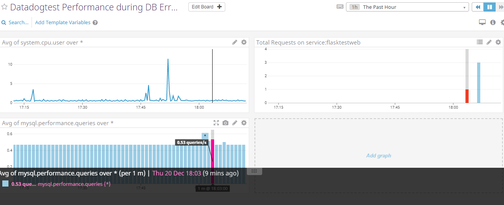

# Hiring Challenge

## Setup

To get started with using the Datadog Agent, let's begin by spinning up a fresh Ubuntu VM using Vagrant. Install Vagrant on your local machine and enter the following:

```
vagrant init ubuntu/xenial64
vagrant up
vagrant ssh
```

We should now have a shiny new VM running Ubuntu 16.04 (for more information on using Vagrant, see [here](https://www.vagrantup.com/intro/getting-started/)). Log in to your Datadog account (sign up if you haven't yet for a 14 day free trial) and you'll be sent to the Events page of your account. From the Events page, navigate to Integrations -> Agent and select your OS. Follow the instructions on the screen and you'll soon have a Datadog Agent to use. With the Agent v6 installed, let's start exploring Datadog! 

## Collecting Metrics

### Adding tags in the Agent config file

Tags provide Datadog users with a way to query aggregated data from their metrics across a number of hosts. This is useful because we'll have a bird's eye view of how metrics behave across a collection of systems instead of each system individually. To get started with tags, we'll have to modify the overall Agent's configuration file by navigating to the directory it's located in and editing it with an editor of your choice (for these examples, I'll be using vim).

Navigating to datadog.yaml:

```
cd \etc\datadog-agent
sudo vim datadog.yaml
``` 

Open the file and look for the section that sets the host's tags. You'll notice that there is an example of tags already there, but for the fun of it let's create our own. **For optimal functionality, Datadog recommends that we contruct tags that use the *key:value* syntax**. 

datadog.yaml:

```
# The host of the Datadog intake server to send Agent data to
dd_url: https://app.datadoghq.com

[...]

# Set the host's tags (optional)
tags: name:jonathan, region:westus, env:test
```

Now that we've modified the configuration file, [restart your Agent](https://docs.datadoghq.com/agent/basic_agent_usage/ubuntu/#commands) and go to your Events page and navigate to Infrastructure -> Host Map. Here are all the Agents associated with your account. Select the Agent you've been working on and you'll be able to confirm that your tags was added (note: it may take a few minutes for your tags to show up with your host). Here is mine for reference:


For more information on assigning tags, please refer to the Datadog documentation on [assigning tags using the configuration files](https://docs.datadoghq.com/getting_started/tagging/assigning_tags/#assigning-tags-using-the-configuration-files).

### Installing the Datadog MySQL integration

Before we begin collecting metrics, we'll need to set up MySQL on our VM and then install its respective Datadog integration. 

Installing MySQL:

```
sudo apt-get update
sudo apt-get install mysql-server
```

To install the Datadog MySQL integration, start at your Events page and navigate to Integrations -> Integrations and click on the MySQL option from the list of integrations. Following the instructions, you should have successfully installed the MySQL integration. To check if your installation was successful, restart your Agent and then run the status command:

```
sudo service datadog-agent restart
sudo datadog-agent status
``` 

You should see a response very similar to the one I got:

```
Running Checks
==============

[...]

    mysql
    -----
      Total Runs: 7
      Metric Samples: 61, Total: 426
      Events: 0, Total: 0
      Service Checks: 1, Total: 7
      Average Execution Time : 29ms
```

### Creating a custom Agent check

Agent checks are a great way to collect metrics from custom applications or unique systems. For more information, be sure to check out Datadog's documentation on [writing an Agent check](https://docs.datadoghq.com/developers/agent_checks/#your-first-check). We can start making our custom Agent check by first creating a Python script that submits *my_metric* and a random value between 0 and 1000. Navigate to **/etc/datadog-agent/checks.d** and create a Python class **metric_check.py** inside that directory.

metric_check.py:

```python
from checks import AgentCheck
from random import randint
class MetricCheck(AgentCheck):
    def check(self, instance):
        """Sends a gauge between 0 and 1000 for my_metric on each call"""
        self.gauge('my_metric', randint(0, 1000))
```

Now navigate to the `/etc/datadog-agent/conf.d`. Here, we must create a configuration file that matches our check. Since we have named our check `metric_check.py`, we'll have to create a configuration file named `metric_check.yaml` inside the current directory.

metric_check.yaml:

```
init config:

instances:
    [{}]
```

It's possible to [change the collection interval](https://docs.datadoghq.com/developers/agent_checks/#configuration) from inside the configuration file by adding **min_collection_interval** at the instance level. This means that we don't have to modify the Python check file we just created!

metric_check.yaml:

```
init config:

instances:
    - min_collection_interval: 45
````

Restart the Agent for the changes to be enabled and, from your Agent root, run:

```
sudo -u dd-agent -- datadog-agent check metric_check
```

You should now get a response very similar to the one I got:

```
=== Series ===
{
  "series": [
    {
      "metric": "my_metric",
      "points": [
        [
          1530416448,
          656
        ]
      ],
      "tags": null,
      "host": "ubuntu-xenial",
      "type": "gauge",
      "interval": 0,
      "source_type_name": "System"
    }
  ]
}
=========
Collector
=========

  Running Checks
  ==============
    metric_check
    ------------
      Total Runs: 1
      Metric Samples: 1, Total: 1
      Events: 0, Total: 0
      Service Checks: 0, Total: 0
      Average Execution Time : 0ms
```

## Visualizing Data

### Creating a Timeboard

Timeboards are great for troubleshooting and visualizing your metrics! Before we make our first timeboard, I strongly recommend that you learn the basics of [Dashboards](https://docs.datadoghq.com/graphing/dashboards/) and read the [Timeboard API documentation](https://docs.datadoghq.com/api/?lang=python#create-a-timeboard). Now let's get started! To use Datadog's API with Python, we need to first install Datadog on our VM.

Check if datadog is installed:

```
pip freeze | grep datadog
```

If not installed, install from pip:

````
pip install datadog
````

Or install from source:

```
python setup.py install
```

There's just two more pieces of information we'll need before we can start coding: your API key and APP key. Your API key can be found inside your `datadog.yaml` file in the `/etc/datadog-agent` directory. Starting from your Events page, you can create an APP key by going to Integrations -> APIs -> Application Keys. You're ready to create your first Timeboard! From the /etc/datadog-agent directory, create a file named `timeboard.py` with the following code:

timeboard.py

```python
options = {
    'api_key': '<YOUR_API_KEY>',
    'app_key': '<YOUR_APP_KEY>'
}

initialize(**options)

title = "My Timeboard"
description = "An informative timeboard that contains the following information: my custom metric scoped over my host, a metric from MySQL with the anomaly function applied, and my custom metric with the rollup function applied"

""" Create our custom graphs and modify each graph definition based on what we want to analyze """
graphs = [{
    "definition": {
        "events": [],
        "requests": [
            {"q": "avg:my_metric{*}"}
        ],
        "viz": "timeseries"
    },
    "title": "my_metric scoped over host"
},

{
    "definition": {
            "events": [],
            "requests": [
                {"q": "avg:anomalies(mysql.performance.queries{*}, 'basic', 3)"}
            ],
            "viz": "timeseries"
        },
        "title": "mysql.performance.queries with the anomaly function applied"
},

{
    "definition": {
            "events": [],
            "requests": [
                {"q": "avg:my_metric{*}.rollup(sum, 3600)"}
            ],
            "viz": "timeseries"
        },
        "title": "my_metric with the rollup function applied"
}]

template_variables = [{
    "name": "host1",
    "prefix": "host",
    "default": "host:my-host"
}]

read_only = True
api.Timeboard.create(title=title,
                     description=description,
                     graphs=graphs,
                     template_variables=template_variables,
                     read_only=read_only)
```

Start off by replacing the placeholders for your API and APP keys. Give your Timeboard a name and description that tells your team what your Timeboard is about. For each graph that you want on your Timeboard, create a new graph definition inside the *graphs* list that describes how your metrics will be aggregated. 

Our first graph definition queries for our custom metric, my_metric, over our host. 

Our second graphs queries the mysql.performance.queries metric from our MySQL integration with the anomalies function applied. The anomalies function takes two parameters: the anomaly algorithm (basic/agile/robust) you want to use as the first parameter and the standard deviations for your algorithm (usually 2 or 3) as the second parameter. We'll be using the basic algorithm because we do not have enough historical data to make use of the other two algorithms. 

Our last graph definition queries for our custom metric with the rollup function applied. The rollup function also takes two parameters: the method used (sum/min/max/count/avg) and time(in seconds). In this case, we wanted to sum up all the points for the past hour into one bucket and display it on our graph.

When you're done, simply run the Python script.

For more information on how to use graph functions, check out the Datadog documentation [here](https://docs.datadoghq.com/graphing/miscellaneous/functions/). You'll learn more about the anomalies and rollup functions as well as all the other graphing functions that Datadog has to offer.

### Setting the Timeboard's timeframe to the past 5 minutes

Now that we've created our Timeboard, it's time to look at our results! Go back to the Events page and navigate to `Dashboards -> Dashboard List`. This is where all the Timeboards created by you and your team will be; click on the Timeboard you just made and you'll be moved to your Timeboard's page. The reason for why Timeboards are great for troubleshooting is that you can use the timeframe feature to select a data point and view data from before or after that selected point. Let's look at an example:


 Select the data point in your graph that you want to analyze and drag your cursor 5 minutes (the x-axis unit of measurement) to the left or right. Your graph will now change to show you the data within that 5 minute timeframe. Pressing on the camera icon will take a snapshot of this graph and using the @ notation will allow you to send it to yourself. 

### What is the Anomaly graph displaying?

In my Anomaly graph, I noticed that my data (the blue line) looks almost constant with the Anomaly function (the gray band) covering data width slightly below and slightly above our own. The gray band ensures that anomalies inside it is the data we normally would expect and anything that goes beyond it is anomalous. Note that this band is wide enough so that there is variation allowed in our data, but narrow enough so that any data that can be anomalous is shown. It is possible that because I chose a metric that was not fluctuating much, its data seemed very smooth and the Anomaly band's width did not have to be that wide (but it is large enough to know that if there a large number of queries at one time, it is detected and an alert is triggered).

Anomaly detection gives users a great way to automate metric watching. Although the metric sample size I used in this example is really small, imagine the possibilities of being able to view and measure all the metrics you've collected over a course of months and across way more devices! If anomaly detection is something that you want to learn more about, please see this article [here](https://docs.datadoghq.com/monitors/monitor_types/anomaly/), which describes anomalies more in detail.

## Monitoring Data

Not only does Datadog provide us with a way to view our metrics through Timeboards, but we are also given a way to know when critical changes are occurring within the metrics by using [monitors](https://docs.datadoghq.com/monitors/). 

There are a couple ways to create a monitor in Datadog. My recommended approach is to, starting from the Events page, navigate to `Monitors -> Manage Monitors -> New Monitor`. You'll be prompted to select a monitor type (for this example, let's use a metric monitor). Now define the metric you wish to monitor and begin to setup its [configuration](https://docs.datadoghq.com/monitors/monitor_types/metric/#configuration/). Set the alert condition thresholds and figure out how you would like to notify your team if a critical change occurs. For more information on setting up notifications for your team, please see the Datadog documentation on [Notifications](https://docs.datadoghq.com/monitors/notifications/). 

My finished Metric Monitor:


The second is to use [Datadog's API on monitors](https://docs.datadoghq.com/api/?lang=python#create-a-monitor) to create a basic monitor:

```python
from datadog import initialize, api

options = {
    'api_key': '<YOUR_API_KEY>',
    'app_key': '<YOU_APP_KEY>'
}

initialize(**options)

# Create a new monitor
options = {
    "notify_no_data": True,
    "no_data_timeframe": 10,
}
api.Monitor.create(
    type="metric alert",
    query="avg(last_5m):avg:my_metric{*} > 800",
    name="my_metric tracked over the past 5 minutes with alerts over 800",
    message="Critical - test metric has gone over 800",
    tags=tags,
    options=options
)
```

Once finished, run this as a Python script and you'll be happy to see it in your monitors list when you go to `Monitors -> Manage Monitors`. Note that you can still edit this monitor to your liking.

However you decide to do it, make sure to keep an eye on your email for all the notifications that will be coming through.

Warning threshold email:


Alert threshold email:


Since this monitor is going to alert pretty often, it's useful to [schedule downtimes](https://docs.datadoghq.com/monitors/downtimes/) so that you won't be alerted when you're out of the office. To set downtimes, navigate to `Monitors -> Manage Downtime -> Schedule Downtime` and fill in the necessary steps as shown below.

Downtime for M-F from 7 PM PDT to 9 AM PDT:


Email from M-F downtime:


Downtime for Sat-Sun all day:


Email from Sat-Sun downtime:


## Collecting APM Data

### Using Datadog's APM Solution

Datadog's APM provides users with a way to analyze the performance of both their infrastructure and application. For this example, I'll be using the provided Flask Python application. Start by creating `my_app.py` using the following code snippet.

my_app.py:

```python
from flask import Flask
import logging
import sys

# Have flask use stdout as the logger
main_logger = logging.getLogger()
main_logger.setLevel(logging.DEBUG)
c = logging.StreamHandler(sys.stdout)
formatter = logging.Formatter('%(asctime)s - %(name)s - %(levelname)s - %(message)s')
c.setFormatter(formatter)
main_logger.addHandler(c)

app = Flask(__name__)

@app.route('/')
def api_entry():
    return 'Entrypoint to the Application'

@app.route('/api/apm')
def apm_endpoint():
    return 'Getting APM Started'

@app.route('/api/trace')
def trace_endpoint():
    return 'Posting Traces'

if __name__ == '__main__':
    app.run(host='0.0.0.0', port='5050')
``` 

Before we can get it running, we'll need to install `ddtrace`:

```
pip install ddtrace
```

Now we can use ddtrace to instrument the Python code:

```
ddtrace-run python my_app.py
```

And finally, we can access the following resources with our service:
```
sudo wget http://0.0.0.0:5050/
sudo wget http://0.0.0.0:5050/api/apm
sudo wget http://0.0.0.0:5050/api/trace
```

We'll now be able to view our APM data by navigating to `Events -> APM -> Services` and `Events -> APM -> Traces`. 


From here, export your graphs to a timeboard so that you can display both APM and Infrastructure metrics.

APM and Infrastructure Timeboard:


And [here](https://app.datadoghq.com/dash/849252/my-timeboard?live=true&page=0&is_auto=false&from_ts=1530509734397&to_ts=1530596134397&tile_size=m) is a link to my Timeboard.

### What is the difference between a Service and a Resource?

A service is a set of processes that do the same job; for instance, a single webapp service and a single database service that both belongs to a simple web application. A resource is a particular action for a service, such as a canonical URL for the webapp or a query for the SQL database.

Want to learn more about services and resources? Take a look [here](https://docs.datadoghq.com/tracing/visualization/#services).

## Final Question: Is there anything creative you would use Datadog for?

I'm a huge basketball fan. For the past 4 years, my friends and I get together and play fantasy basketball during the regular season of the NBA. The problem is that I'm very competitive and my friends are generally better than I am at picking up high-performing free agent players. Whenever a player starts to do really well, he's picked up by another team hours before I can even do any research. I want to beat them to the punch and I think Datadog can help me with that.

A player's stats is the best indicator of how well he is doing with respect to the stats of the other available free agents to choose from. Using Datadog, I would:

	* Write an Agent Check to collect the average metrics for each stat (points, rebounds, assists, steals, blocks, 3s, FG%, FT%) and display the data on a Timeboard.
	* Write an Agent Check to collect the metrics for how many times a certain player is added and dropped during the day (if there's a lot of commotion, something big must have happened).
	* Using anomalies and a monitor, I would email myself whenever a player does exceptionally well that day so that I would be able to log in to the app and pick him up on my team.
	* As fun as this all sounds, it would probably be a good idea to schedule downtimes for this monitor during work hours.

Hey, this actually sounds like a pretty good app idea now that I think about it.


