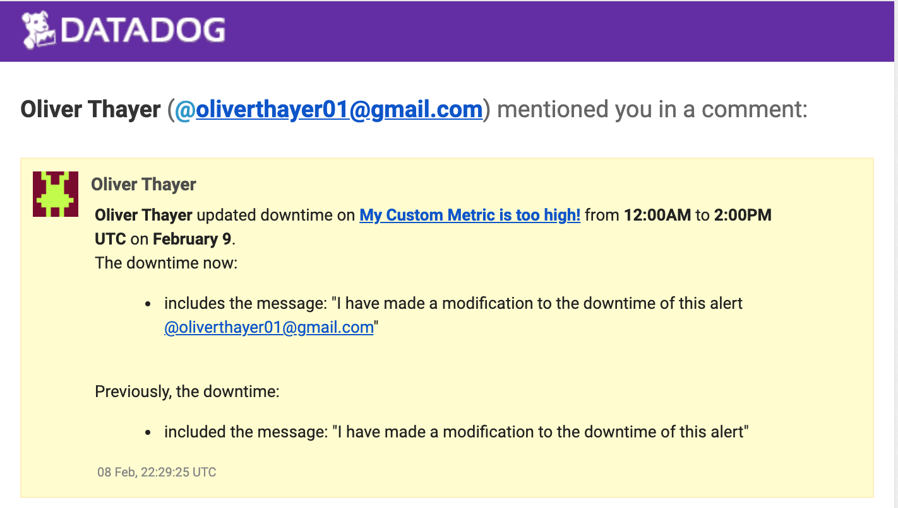

<h1 style="text-align: center;"> Collecting Metrics</h1>
<h3 style="text-align: center;"><b><u>Adding Tags</u></b></h3>
     
To add tags to your host we must access the Agent Configuration file. This file is titled <b>datadog.yaml</b> within the datadog-agent folder. For this example, we will be adding tags to our host. These tags will be added to line 66 of the datadog.yaml file. In the example shown below, you can see that I have assigned generic tags to my host titled "key_1_:_value_1, key_2_:_value_2, key_3_:_value_3" to ensure that the host tags are displaying correctly. There are a few rules to defining tags:
 
     <ul>
        <li> Tags must start with a letter.</li>
        <li>Tags can be up to 200 characters long & also support Unicode.</li>
        <li>Tags are converted to lowercase. With this in mind it is advised to not use camel case for naming your tags.</li>
        <li> Tags can be formatted as "key:value" as shown in the example, or they can be "value".</li>
        <li>Tags should not be originiated from unbound sources such as User ID's.</li>
    </ul>
    
     
  
<h3 style="text-align: center;"><b><u> Usage and why this is important</u></b></h3>

Let's say we want to look at our containers or cloud environments at the service level. It would be a lot more beneficial and time concious to be able to see our CPU usage across multilple hosts than having to invesitgate these values on individual servers. This is where tags come into play. By setting these up we can more easily aggregate metrics of a service across multiple servers.

 

<h3 style="text-align: center;"><b><u>Database Integration</u></b></h3>

Adding a database integration to your Datadog configuration is a very straight forward process thanks to the documentation provided on your Datadog UI. As a quick rundown, here is how a PostgreSQL is integrated:

<ul>
<li>As the PostgreSQL check is already packaged with the Datadog Agent, our first step  will be to create a read-only datadog user that has access to our server. This can be achieved by opening a psql session on the PostgreSQL database and entering the following commands: 
            "create user datadog with password 'PASSWORD';
            grant pg_monitor to datadog;
            grant SELECT ON pg_stat_database to datadog;"
<li>From here we will need to make some modifictions to the postgres.d/conf.yaml file so that it points to our host/port.</li></ul> 
<h3 style="text-align: center;"><b><u>Usage and why this is important</u></b></h3>

This one may be a bit obvious but in most scenarios we will want to see how many of our servers are currently up and running.

<h3 style="text-align: center;"><b><u>Create a Custom Agent Check</u></b></h3>

In the scenario where we want to collect metrics for unique systems or custom applications, we will want to create a custom agent check. In this example, I will be creating a custom metric called "my_metric" that will produce a random integer between 0 and 1000.
 

We must create two files within the datadog-agent folder. One being the configuration file, and the other being the check file. <b>It is vitally important to note that these files must share the same name.  So in this example my check file is titled "my_metric.py" and my configuration file is named "my_metric.yaml".</b>
 

The configuration file contains a sequence called "instances" that can remain blank for the time being.
 

Within the check file is where we want our logic for this check. As mentioned, "my_metric" is simply a random number between 0-1000. To accomplish this, I have modified the check itself which inherits from AgentCheck.  
`self.gauge( "my_metric", random.randint(0, 1000), tags=["TAG_KEY:TAG_VALUE"],)` 

As you can see, tags can be added to this check, but I have not modified them in my_metric for the time being
 

To change the collection interval we will be modifying the configuration file mentioned above. The default interval is 15 seconds, but lets change this to 45 seconds. We will use "min_collection_interval" parameter within the "instances" sequence mentioned above. **Note: By setting min_collection_interval" to 45, this does not mean that the metric will be collected every 45 seconds, but rather that it <b>can</b> be collected as often as every 45 seconds
  

<h3 style="text-align: center;"><b><u>Usage and why this is important</u></b></h3> 
            

Again, custom agent checks can be a crucial part of your operation if you are trying to collect metrics for custom applications. If you are trying to collect metrics for widely available applications, public services, etc., it is recommended to create a full Agent configuration.

 

<h3 style="text-align: center;"><b><u>Modify Collection Interval via Datadog UI</u></b></h3>

Another way to adjust the collection interval of a custom Agent check is to change it within the UI. In the Dashboard view, click the gear icon of the custom metric, and then select the metric from the small pop-up window. From here you will see your metric in the "Metric Name" list. By clicking on the metric another panel pops out from the right side of the screen and shows a field titled "Interval". By clicking on the "Edit" button  just  below this, we are given access to manually change the collection interval.

<h3 style="text-align: center;"><b><u>Usage and why this is important</u></b></h3>

Modifying the collection interval via the Datadog UI provides a potentially quicker and easier way to adjust your intervals as opposed to modifying the configuration file itself.

 

<h3 style="text-align: center;"><b><u>Visualizing Data</u></b></h3>

Up until this point it is assumed that you have been working directly withn the UI to create dashboards, however in  this section we will cover how to create a dashboard via the Datadog API. In this example we will be creating a dashboard that contains our custom metric (my_metric) scoped over the host, a metric from our database, and our custom metric with the rollup function applied to sum up all the points for the past hour into a bucket.
 
<a href="initializeapitest.py">TEST</a>(initializeapitest.py) 

After entering your proper API & APP key, you can start to define the widgets that you want to create. You will see that within the definition of each widget, you have some customizable parameters, the first being 'type'. For this excercise, we will be building a timeboard for each widget. Next we will be modifying the request itself. The "{'q'}" found before the metric name is in reference to the query definition. Imeediately following the query definiton is where we will define what metric the widget is made for. On line 57 you will see that this widget is going to be monitoring my_metric over all (*) instances within the infrastructure. 
 

To effectively apply the rollup function to a widget you can append ".rollup(method, time)". The methods available for the rollup function are sum, min, max, count, and avg. You can see above that I have used the average method. The time field is measured in seconds, so in the above example I have set my rollup function to 1 hour intervals.

<h3 style="text-align: center;"><b><u>Usage and why this is important</u></b></h3>

The abiltity to leverage the Datadog API for creating dashbaords is an incredibly powerful aspect of the Datadog infrastructure. By creating these scripts to create, view, and delete dahsboards could save you a ton of time as opposed to manually creating them via the Datadog UI.

 

<h1 style="text-align: center;">Monitoring Data</h1>

Datadog provides multiple integrations for recieving alerts of metrics that hit thresholds that indicate issues with your environment such as Slack, Jira, and PagerDuty. These alerts can also be setup via the Datadog UI with these steps:

<ul>
<li>From the dashboard view, click the cog wheel at the top right of the metric's panel, and then click "Create monitor"</li>
<li>For this example we will be creating an Alert threshold that alerts when the average of the  metric exceeds 800 over a 5 minute period, a Warning threshold that alerts whenthe metric exceeds 500 over a 5 minute period, as well as an alert that triggers if there is no data over the past 10 minutes.</li>
 <li>To accomplish the first two tasks, simply enter the values of the thresholds in the appropriate fields.</li>
<li>To set a "Data Missing" alert, you will first need to select "Notify" from the dropdown. After this has been selected, you can determine how many minutes must pass for the alert to trigger.</li>
<li>We will want our messages to be verbose on exactly what is happening with our metric, and why we are getting an alert. This can be setup in Step 4 of the New Moonitor screen. Datadog provides multiple variables to use in these messages that can give us a clear picture of what is happening. For example, I have set my Alert message as: "{{#is_alert}}My Metric is above 800 on IP {{host.ip}} with {{value}} {{/is_alert}}"</li>
<li>In this example, the text within {{#is_alert}} will be displayed when the alert message is triggered. {{host.ip}} tells us the IP  address of the host that is experiencing the issue, and {{value}} tells us exactly the value that triggered the alert.</li>

<li>Finally, we want to ensure that the proper employees are receiving this message so that it can be remedied in a timely manner. In step 5 we can dictate who recieves this particular alert from the dropdown.</li> 
<h3 style="text-align: center;">Silencing Alerts</h3>

There are likely a multitude of reasons that you would want to silence an alarm, such as weekend hours for certain employees, or planned maintenance on your system. To achieve this select "Monitors" on the left side of the UI, and then "Manage Monitors". On this screen we can see the monitor that we have created, and after selecting it we are given an option at the top for "Manage Downtime". On the right we can see an icon that reads "Schedule Downtime". After selecting this we can decide what days and time that we want to silence our alert. For this exercise we have silenced the alert from Monday to Friday, from 7PM to 9AM, as well as all day on Saturday and Sunday. It may also be important for your organization to alert members that a downtime has been set. This capability can be found in step 4, "Notify your team".

<h3 style="text-align: center;"><b><u>Usage and why this important</u></b></h3>

It is imperitive that your teams receive notifications when something goes awry with your system. If not for alerts/notifications, it could take quite some time to realize something is wrong, thus costing you clients and/or money.

 

<h1 style="text-align: center;">Collecting APM Data</h1>

Collecting APM (Application Performance Monitoring) data is made easy by Datadog. After installing ddtrace you will then start adding the appropriate entry/end points into your application. Based upon the example given in the exercise, we can see that '/' route triggers the 'api_entry'. This is reflected within the UI when the page is hit by a user. Within the APM dashboard screen, we can see our status codes for GET requests when we hit that endpoint in oour browser. An important feature to note is the presence of timestamps for every trace picked up by Datadog within this interface.  This applies to the  other two routes determined in the Flask script as well. Note: If your port for Flask is different from the default set by Datadog (8126), this will need  to updated in the datadog.yaml file so that the agent is listening to the correct port.

 

Another important aspect of APM with Datadog is that you have the ability to leverage your tags to keep traces that matter most in your application.

[Flask app example](APMTest.py)
<h3 style="text-align: center;"><b><u>Usage and why this is important</u></b></h3>

Collecting traces from your application is absolutely essential for understanding runtime metrics and performance of your web application. Knowing what aspects of your applications may be throwing 500 errors or showing latency is vitally important to maintaining a healthy system and providing a satisfactory experience for your customers. 

 

<h1 style="text-align: center;">Creative Uses for Datadog</h1>

I personally think that a creative use for Datadog would be to monitor the activity of certain stock/crypto currencies in terms of searches or discussions. I firmly believe we are in a very interesting time of investing where retail investors have more access than ever to research and buy/sell stocks or currencies. We saw a huge surge in retail investing recently with the rise of the Gamestop madness fueled by WallStreetBets on Reddit, and I believe this is only the beginning of a new era of retail investing. With this in mind, Datadog could provide a wealth of crucial information to those same investors. 
