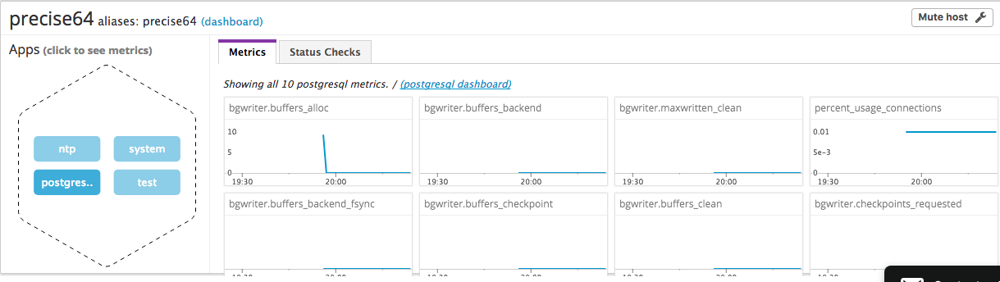

# Answer - Support Engineer

Thank you for giving chance to apply this position.
I can learn whtat datadog is through this trial.

### Level 0 (optional) - Setup an Ubuntu Virtual Machine(VM)

First of all, I create the virtual environment on my laptop.
Here is my condition.

|Category|Condition|
|----------|--------------|
|PC        |Mac book Air  |
|OS        |macOS Sierra  |
|VirtualBox|version 5.1.30|
|Vagrant   |version 2.0.0 |
|git       |version 2.12.2|

The 20, 30 minutes needed to start VM.

```bash
$ vagrant init hashicorp/precise64
$ vagrant up
$ vagrant ssh
```

Before getting start, I update repository and install build-essentail and curl package.

```bash
vagrant@precise64:~$ sudo apt-get update
vagrant@precise64:~$ sudo apt-get install curl vim -y
```

### Level 1 - Collecting your Data

#### Sign up for Datadog

> Task: Sign up for Datadog (use "Datadog Recruiting Candidate" in the "Company" field), get the Agent reporting metrics from your local machine.

After regisration, I install the datadog agent on my VM. The one liner is pretty easy. You can get the introduction of agent installation at the beginning or selecting [Integrations] > [Agent] in right pane.

```bash
DD_API_KEY=XXXXXXXXXXXXXXXXXXXXXXXXXXXXXXXX bash -c "$(curl -L https://raw.githubusercontent.com/DataDog/dd-agent/master/packaging/datadog-agent/source/install_agent.sh)"
```

Now open Datadog. You can see your VM at [Infrastracture] > [Infrastracture List].


And set timezone going my account > [Settings] and select "PREFERENCES". You can change timezone from [Change timezone].

#### What does "Agent" means

> Task: Bonus question: In your own words, what is the Agent?

The agent has responsibility for collecting and sending metric for master without preventing the service running at host server. I can sometimes see "agent" called as "slave" in some distributed processing software but "agent" is more suited because this seems to be intelligent.

#### Put Tag

> Task: Add tags in the Agent config file and show us a screenshot of your host and its tags on the Host Map page in Datadog.

I created backup of configuration file. The configuration file for Datadog agent is at ```/etc/dd-agent/datadog.conf```.

```bash
vagrant@precise64:~$ sudo su -
root@precise64:~# cd /etc/dd-agent
root@precise64:~# cp datadog.conf datadog.conf.org
```

Then, I looked for ```tags``` section and added below tags.

```bash
$ vim datadog.conf

...

# Set the host's tags (optional)
tags: mytag, env:prod, role:mytest
```

After that, enforce my tags restarting Datadog agent.

```bash
root@precise64:/etc/dd-agent# sudo /etc/init.d/datadog-agent restart
 * Stopping Datadog Agent (stopping supervisord) datadog-agent           [ OK ]
 * Starting Datadog Agent (using supervisord) datadog-agent              [ OK ]
```

Next, check out Datadog web ui
* [infrastructure] > [Host Map] in right pane
* Click the hex shape and check tags can be seen.


#### Correct Database Metric

> Task: Install a database on your machine (MongoDB, MySQL, or PostgreSQL) and then install the respective Datadog integration for that database.

I select PostgreSQL in this time and start setup.

```bash
root@precise64:~$ sudo apt-get install postgresql postgresql-contrib -y
```

Enforce PostgreSQL integration.
- Go to [Integrations] > [Integrations]
- Select [Postgres] and select [Generate Password]
- Create ```datadog``` user in PostgreSQL (the process and password are shown when you select PostgreSQL panel at Datadog web ui).

```bash
vagrant@precise64:~$ sudo su -
root@precise64:~# su - postgres
postgres@precise64:~$ psql
psql (9.1.24)
Type "help" for help.

postgres=# create user datadog with password 'XXXXXXXXXXXXXXXXXXXXXXXXX';
CREATE ROLE
postgres=# grant SELECT ON pg_stat_database to datadog;
GRANT
postgres=# \q
```

- Modify user and password in ```postgresql.yaml```

```bash
root@precise64:~# su - dd-agent
$ cd /etc/dd-agent
$ cp conf.d/postgres.yaml.example conf.d/postgres.yaml  


init_config:

instances:
  - host: localhost
    port: 5432
    username: datadog
    password: XXXXXXXXXXXXXXXXXXXXXXXXX
...
```

- Restart Datadog agent and enforce new metric.

```bash
root@precise64:/etc/dd-agent/conf.d# sudo /etc/init.d/datadog-agent restart
 * Stopping Datadog Agent (stopping supervisord) datadog-agent           [ OK ]
 * Starting Datadog Agent (using supervisord) datadog-agent              [ OK ]
```

Now check setting using ```datadog-agent info``` command. You can see ```postgres (5.18.1)``` at Checks section.

```bash
vagrant@precise64:~$ sudo /etc/init.d/datadog-agent info


...

Checks
======

  ntp (5.18.1)
  ------------
    - Collected 0 metrics, 0 events & 0 service checks

  disk (5.18.1)
  -------------
    - instance #0 [OK]
    - Collected 40 metrics, 0 events & 0 service checks

  postgres (5.18.1)
  -----------------
    - instance #0 [OK]
    - Collected 10 metrics, 0 events & 1 service check

  network (5.18.1)
  ----------------
    - instance #0 [OK]
    - Collected 18 metrics, 0 events & 0 service checks

...
```

Also you can check at Host Map.



#### Set Agent Check

> Task: Write a custom Agent check that samples a random value. Call this new metric: `test.support.random`

The agent check is useful when you want to collect metric from your application. And also you can share your agent check for another people.
So I get start preparing agent check script.

```bash
vagrant@precise64:~$ sudo su -
root@mytest:~# su - dd-agent
$ cd /etc/dd-agent
$ vim checks.d/mytest.py

from checks import AgentCheck
import random

class Mytest(AgentCheck):
    def check(self, instance):
        self.gauge('test.support.random', random.random())

$ vim conf.d/mytest.yaml

init_config:

instances:
    [{}]
```

Restart agent and enforce metric.

```bash
vagrant@precise64:~$ sudo /etc/init.d/datadog-agent restart
 * Stopping Datadog Agent (stopping supervisord) datadog-agent                                [ OK ]
 * Starting Datadog Agent (using supervisord) datadog-agent                                   [ OK ]
```

Check agent check using debug command ```dd-agent check```.

```bash
vagrant@precise64:~$ sudo -u dd-agent dd-agent check mytest
2017-11-02 16:01:55,027 | ERROR | dd.collector | utils.dockerutil(dockerutil.py:138) | Failed to initialize the docker client. Docker-related features will fail. Will retry 0 time(s). Error: Error while fetching server API version: ('Connection aborted.', error(2, 'No such file or directory'))
2017-11-02 16:01:55,056 | INFO | dd.collector | config(config.py:1157) | initialized checks.d checks: ['postgres', 'mytest', 'ntp', 'disk', 'network']
2017-11-02 16:01:55,059 | INFO | dd.collector | config(config.py:1158) | initialization failed checks.d checks: []
2017-11-02 16:01:55,060 | INFO | dd.collector | checks.collector(collector.py:543) | Running check mytest
Metrics:
[('test.support.random',
  1509638515,
  0.2277691741020057,
  {'hostname': 'precise64', 'type': 'gauge'})]
Events:
[]
Service Checks:
[]
Service Metadata:
[{}]
    mytest (5.18.1)
    ---------------
      - instance #0 [OK]
      - Collected 1 metric, 0 events & 0 service checks
```

Also you can confirm via ```datadog-agent info``` command.

```bash
Checks
======

  postgres (5.18.1)
  -----------------
    - instance #0 [OK]
    - Collected 10 metrics, 0 events & 1 service check

  mytest (custom)
  ---------------
    - instance #0 [OK]
    - Collected 1 metric, 0 events & 0 service checks

  ntp (5.18.1)
  ------------
    - Collected 0 metrics, 0 events & 0 service checks

  disk (5.18.1)
  -------------
    - instance #0 [OK]
    - Collected 40 metrics, 0 events & 0 service checks

  network (5.18.1)
  ----------------
    - instance #0 [OK]
    - Collected 18 metrics, 0 events & 0 service checks
```

Finally, check it on web.
- Select [Metrics] on left pain.
- Select ```test.support.random``` on Graph pulldown.


### Level 2 - Visualizing your Data

#### Clone dashboard

> Task: Since your database integration is reporting now, clone your database integration dashboard and add additional database metrics to it as well as your `test.support.random` metric from the custom Agent check.

First get starting cloning database integration dashboard.

* Go to [Dashboards] > [Dashboard List]
* Select [Postgres - Overview] in "Integrations Dashboard" list.
* Select [Clone Dashboard] and set new dashboard name.


Same as database dashboard. Next, clone ```test.support.random``` dashboard.

* Open [Dashboards] > [Dashboard List]
* Select [Custom Metrics - test] in "Integrations Dashboard" list.
* Select [Clone Dashboard] and set new dashboard name.


As a result, 2 custom dashboards are created.


#### Difference between "Timeboard" and "Screenboard"

> Bonus question: What is the difference between a timeboard and a screenboard?

The graphs in "Timeboard" has same time range and you can grasp multiple metric on specific time range. On the other hands, graphs in "Screenboard" has not only time sceries graph but other variety of graph including.

#### Put Annotation

> Task: Take a snapshot of your `test.support.random` graph and draw a box around a section that shows it going above 0.90. Make sure this snapshot is sent to your email by using the @notification

* Go to "Cloned Test Dashboard" and narrow down the range which exceed over 0.9.


* Select the camera icon in right upper side in the graph.
* Drag the expected area.


* Type message and add @"(my email address)".


### Level 3 - Alerting on your Data

#### Set Monitor

> Question: Since you've already caught your test metric going above 0.90 once, you don't want to have to continually watch this dashboard to be alerted when it goes above 0.90 again. So let's make life easier by creating a monitor. Set up a monitor on this metric that alerts you when it goes above 0.90 at least once during the last 5 minutes. Give it a descriptive monitor name and message (it might be worth it to include the link to your previously created dashboard in the message). Make sure that the monitor will notify you via email. This monitor should alert you within 15 minutes. So when it does, take a screenshot of the email that it sends you.

* Go to [Monitors] > [New Monitor]
* Select [Metric] in the monitor type
* Select "Threshold Alert" because we going to catch the graph overcome 0.9 again
* Select ```test.support.random``` metric from pull down menu.
* Not use "Multi Alert" in this time.
* Set condition below
  - trigger above the threshold at least once
  - during the last 5 minutes
  - set 0.9 at "Alert threshold"
* Finally write message

```markdown
{{#is_alert}} Over threshold.{{/is_alert}}

Visit and confirm it at [Dashboard](https://app.datadoghq.com/dash/392260/cloned-test-dashboard?live=true&page=0&is_auto=false&from_ts=1509713779058&to_ts=1509717379058&tile_size=m)
@yuri.woof.ohno@gmail.com does know this issue. so call him now.
```


* Select [Save] button and wait for alert will be invoked.
* The recieved mail is below.


#### Set Multi Alert

> Bonus points:  Make it a multi-alert by host so that you won't have to recreate it if your infrastructure scales up.

You can Multi-alert function to grasp same metric from multiple agent. Blow example is collecting disk usage from multiple host(I have only one VM space in my PC, so I just put example settings).

```bash
avg:system.disk.in_use{*} by {host}
```

#### Set Downtime

> Bonus: Since this monitor is going to alert pretty often, you don't want to be alerted when you are out of the office. Set up a scheduled downtime for this monitor that silences it from 7pm to 9am daily. Make sure that your email is notified when you schedule the downtime and take a screenshot of that notification.

* Go to [Monitors] > [Manage Downtime]
* Select [Schedule Downtime] button
* Set down time from 7:00pm to 9:00am


When downtime starts, I recieve below message.


