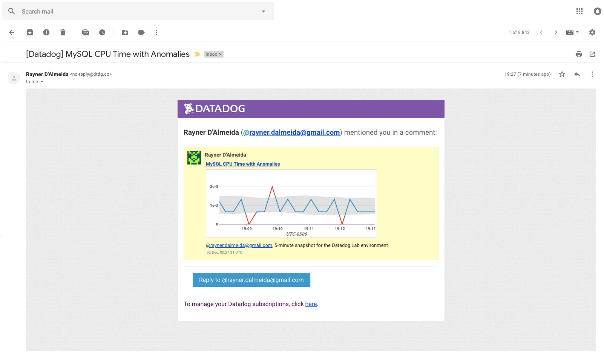

# Eric Kollegger Solutions Engineer Exercise

## Setup the Environment

* This exercise will explain how to get up and running with the DataDog Mac OS X Agent. I'll be using macOS High Sierra 10.13.6. First go to `https://www.datadoghq.com/` and click on the **Get Started Free** button in the upper right corner. After filling out and submitting the form, you'll receive an email confirming that your free trial has begun.

* I logged in with my credentials at `https://app.datadoghq.com` and clicked on **Integrations > Agent > Mac OS X**. Rather than downloading the DMG package, I opted to download via terminal by running `DD_API_KEY=<YOUR_API_KEY> bash -c "$(curl -L https://raw.githubusercontent.com/DataDog/datadog-agent/master/cmd/agent/install_mac_os.sh)"` so my API key would come integrated with the Agent out-of-the-box.

* The DataDog Agent is located in **Finder > Applications**, after opening it you should see a small dog bone icon appear in the top right tray which signals that it's active. We now have our very own DataDog Agent installed and ready for configuration!

## Collecting Metrics

* Add tags in the Agent config file and show us a screenshot of your host and its tags on the Host Map page in Datadog.

Using terminal, navigate to the Agent configuration file by typing `cd /opt/datadog-agent/etc/` and opening the `datadog.yaml` config file. From there, I added some custom tags to help identify my host. Your hostname will default to your machine name, e.g. `Erics-Macbook-Pro`, but I chose to alias mine:


Then we'll need to restart the Agent for the changes to get picked up. To do this you can click the Agent icon in the tray and select **Restart**, or if you want to achieve the same thing in terminal you'll run `launchctl stop com.datadoghq.agent` and then `launchctl start com.datadoghq.agent`. For more on basic Agent usage for Mac OS X, check out the docs [here](https://docs.datadoghq.com/agent/basic_agent_usage/osx/?tab=agentv6). Now back on our DataDog dashboard, go to **Infrastructure > Host Map** and click on the single hexagonal shape which represents our host. Under the **Tags** section you should see your custom tags are now being displayed. Mine looks like this:


* Install a database on your machine (MongoDB, MySQL, or PostgreSQL) and then install the respective Datadog integration for that database.

Due to being previously installed on my machine and my familiarity with it, I decided on PostgreSQL as my database of choice. On the dashboard go to **Integrations > Integrations**, find **PostgreSQL**, click on it and follow the configuration steps outlined [there](https://app.datadoghq.com/account/settings#integrations/postgres).

Once you've completed **Step 1** under **Configuration**, you'll need to edit the `postgres.yaml` file to reflect your generated password. This file can can be found in `/opt/datadog-agent/etc/conf.d`. After making the necessary changes mine looks like this:


Restart the Agent and run `datadog-agent status` in terminal to confirm that your integration was successful. This will output a list of information, for our needs we'll be looking specifically for a bit of output confirming the PostgreSQL integration was successful:


Then if we check back again on the Dashboard under **Integrations > Integrations** we should see our database is showing up under **Installed**:


* Create a custom Agent check that submits a metric named my_metric with a random value between 0 and 1000.

For our custom Agent check we'll need to create two files; a `.py` check file in `/opt/datadog-agent/etc/checks.d` and it's corresponding `.yaml` configuration file to be placed in `/opt/datadog-agent/etc/conf.d`. You can call it whatever you'd like but both file names must match. I named mine `checkvalue.py` and `checkvalue.yaml`, respectively.

As stated in the [Documentation](https://docs.datadoghq.com/developers/agent_checks/), all custom Agent checks inherit from the `AgentCheck` class and require a `check()` method. We're going to import our `AgentCheck` dependency and `randInt` to generate our randomized metric for collection. Then in our `check()` method, we name our metric and sample it with `self.gauge()`.


* Change your check's collection interval so that it only submits the metric once every 45 seconds.

The collector runs every 15-20 seconds by default, but we can change this by adding a `min-collection-interval` to our check's config file globally or at the instance level. For the purposes of this exercise we'll add it under `init_config` to set it globally. When you're done it should look like this:


We'll need to restart the Agent to in order to see the changes on the dashboard, this is true whenever changes are made to the check file or the accompanying config file. On the dashboard, navigate back to **Infrastructure > Host Map** and click on your host hexagon. On the left side of the panel there are several blue buttons representing our metrics being recorded thus far. If you named your random metric simply `my_metric` as I did it'll display as `(no-namespace)`. Click on it and you should see the following:


**Bonus Question:** Can you change the collection interval without modifying the Python check file you created?

**Answer:** Yes, the collection interval for a check can be changed in it's accompanying config file.

## Visualizing Data

Utilize the Datadog API to create a Timeboard that contains:

* Your custom metric scoped over your host.
* Any metric from the Integration on your Database with the anomaly function applied.
* Your custom metric with the rollup function applied to sum up all the points for the past hour into one bucket

I highly recommend installing [Postman for Mac OS X](https://www.getpostman.com/apps) and following this [guide](https://help.datadoghq.com/hc/en-us/articles/115002182863-Using-Postman-With-Datadog-APIs) which incorporates the [DataDog API Collection](https://help.datadoghq.com/hc/en-us/article_attachments/360002499303/datadog_collection.json) for setting up a DataDog-specific environment in Postman. This empowers you with organized API calls for easy editing and re-use. It also offers a birds-eye view of the wide range of requests that can be made to DataDog. Check [here](https://docs.datadoghq.com/graphing/functions/#apply-functions-optional) for all available functions that can be applied to your metrics. Below is a request I put together for a Timeboard that graphs the average of `my_metric`, transaction `anomalies()` on my database and a `rollup()` average of `my_metric` over the course of one hour:

```{
      "graphs" : [{
          "title": "Metric average over durandal.minimalghost",
          "definition": {
              "events": [],
              "requests": [
                  {"q": "avg:my_metric{host:durandal.minimalghost}"}
              ]
          },
          "viz": "timeseries"
      },
      {
          "title": "Postgres transactions committed",
          "definition": {
              "events": [],
              "requests": [
                  {"q": "anomalies(avg:postgresql.commits{*}, 'basic', 2)"}
              ]
          },
          "viz": "timeseries"
      },
      {
          "title": "One hour rollup visualization",
          "definition": {
              "events": [],
              "requests": [
                  {"q": "avg:my_metric{*}.rollup(sum, 3600)"}
              ]
          },
          "viz": "timeseries"
      }],
      "title" : "Eric's Custom Timeboard",
      "description" : "Solutions Engineer Task",
      "template_variables": [{
          "name": "host1",
          "prefix": "host",
          "default": "host:my-host"
      }],
      "read_only": "True"
    }
```

After making a successful submission (indicated by a `200` status code response) return to the DataDog Web UI and navigate to **Dashboards > Dashboard List**. At the top of the list should be a new Dashboard with the name you assigned to `title` in the request. Clicking on it will bring up your newly created Timeboard taking in real-time data! Below is my own Timeboard scoped to 4 hours in order to display some manner of graphing for the rollup frame, which looks empty when set to the default scope of 1 hour since it only has a single point of data:


* Set the Timeboard's timeframe to the past 5 minutes

You can manipulate the timeframe you want your graph scoped for by using the keyboard shortcuts `alt + [` to increase and `alt + ]` to decrease it. I've set mine to the requested 5 minute scope by using this method:


* Take a snapshot of this graph and use the @ notation to send it to yourself.

You can take a snapshot of a graph on the Timeboard by clicking the camera icon that appears when you mouse over any individual frame. You can then send it to yourself or a co-worker by using the @ symbol followed by the appropriate user name. Below is an example of me sending the `my_metric` average graph to myself:


This will send the snapshot with any notes you include to the email associated with that user. Here is the resulting email notification I received:


**Bonus Question:** What is the Anomaly graph displaying?

**Answer:** The grey area on the graph represents DataDog's assessment of the normalized thresholds for that metric based on previous data. Anything falling above or below this range is considered anomalous or abnormal behavior and is flagged in red.

## Monitoring Data

To create a new monitor go to **Monitors > New Monitor** on the dashboard.

1. Choose the detection method: Leave the default **Threshold Alert**.
2. Define the metric: Select `my_metric` from the metric dropdown list and set from to `host:durandal.minimalghost`, the rest of the options can be left to default.
3. Set alert conditions: Set **Alert threshold** to **800** and **Warning threshold** to **500**. Select `Notify` if data is missing from the dropdown. Everything else can be left as default.

The final product should look something like this:


My custom alert, warning and no data message snippet:
```{{#is_alert}}
my_metric at host ip {{host.ip}} has surpassed {{threshold}} and is currently at {{value}}!
{{/is_alert}}

{{#is_warning}}
my_metric has surpassed {{warn_threshold}} and is currently at {{value}}!
{{/is_warning}}

{{#is_no_data}}
my_metric has not received data for the past 10 minutes!
{{/is_no_data}}

@eric.kollegger@gmail.com
```

When the warning threshold condition was met I received this email:


**Bonus Question:** Since this monitor is going to alert pretty often, you don’t want to be alerted when you are out of the office. Set up two scheduled downtimes for this monitor:
  * One that silences it from 7pm to 9am daily on M-F
  * And one that silences it all day on Sat-Sun
  * Make sure that your email is notified when you schedule the downtime and take a screenshot of that notification

By navigating to **Monitors > Manage Downtime** and clicking the **Schedule Downtime** button, I was able to configure these two downtime requests.

* Weeknights downtime:


* Weekend downtime:


* Email notification for weeknight downtime:


## Collecting APM Data

I manually downloaded the trace agent from GitHub by running `go get github.com/DataDog/datadog-trace-agent/cmd/trace-agent` then `cd go/src/github.com/DataDog/datadog-trace-agent` and ran `make install`.
I checked to confirm my trace agent had properly installed by looking for it in `/opt/datadog-agent/embedded/bin`.

Then I made sure to uncomment the agent APM settings in `datadog.yaml` so my app could be properly traced by the agent. I installed dd_trace and blinker via `pip install`. Then following the Flask trace docs [here](http://pypi.datadoghq.com/trace/docs/#) I added the necessary imports and pointed the tracer at my Flask app:

```from flask import Flask
import blinker as _
import logging
import sys
from ddtrace import tracer
from ddtrace.contrib.flask import TraceMiddleware

# Have flask use stdout as the logger
main_logger = logging.getLogger()
main_logger.setLevel(logging.DEBUG)
c = logging.StreamHandler(sys.stdout)
formatter = logging.Formatter('%(asctime)s - %(name)s - %(levelname)s - %(message)s')
c.setFormatter(formatter)
main_logger.addHandler(c)

app = Flask(__name__)
traced_app = TraceMiddleware(app, tracer, service="dd-flask-app", distributed_tracing=False)

@app.route('/')
def api_entry():
    return 'Entrypoint to the Application'

@app.route('/api/apm')
def apm_endpoint():
    return 'Getting APM Started'

@app.route('/api/trace')
def trace_endpoint():
    return 'Posting Traces'

if __name__ == '__main__':
    app.run(host='0.0.0.0', port='5050')
```

First I enabled the trace-agent with `go/bin/trace-agent`, then in a separate terminal window I navigated to my Flask app and started it with `python dd_flask_app.py`.

* I saw the following outputs from the trace-app:


* And my Flask app:


Which indicated to me that the tracer had successfully connected to my service and was listening for activity. I assumed once I wired up the trace agent to my service I would see new analytics appear on the APM docs page as it mentioned checking back there after completing setup, but I saw no change. I generated some traces by hitting the
`http://localhost:5050/` and `http://localhost:5050/api/trace` endpoints a couple times and checked back on the dashboard. Sure enough, there was a **Trace Search & Analytics** tab listing my Flask app. I then continued onto documenting the requested analytics ahead.

* Created a [screenboard](https://p.datadoghq.com/sb/6417246f3-6ec7b41faf9c7dac9fc3c825176756a6) with both APM and infrastructure metrics:


**Bonus Question:** What is the difference between a Service and a Resource?

**Answer:** A service can be thought of as a self-contained software implementation that *serves* a specific functionality and is generally built to easily integrate with other services. They are the component pieces that make up larger platforms. Examples of a service could be Rails, ReactJS, PostgreSQL or MongoDB. A resource is any data query made to a service, for example a CRUD action made directly to a database, through a URL or via a route in an MVC framework.

## Final Question
I'm always interested in harnessing technology for social good. I think with everything going on right now regarding our democratic process being tampered with by foreign and domestic powers alike *(see: voter roll purging, gerrymandering, polling site closures around targeted demographics, hacking, etc)*, comparing metrics like voter registration versus turnout during elections in different states/districts could generate fascinating data trends to study. Even though it's a less useful implementation in terms of real-time analytics, this could be used to potentially pinpoint concentrated areas where these nefarious practices take place to help combat them. I'd have to look into how much of this kind of information is available publicly, the Census Bureau has an API but I haven't done enough research on what kind of data it exposes.
