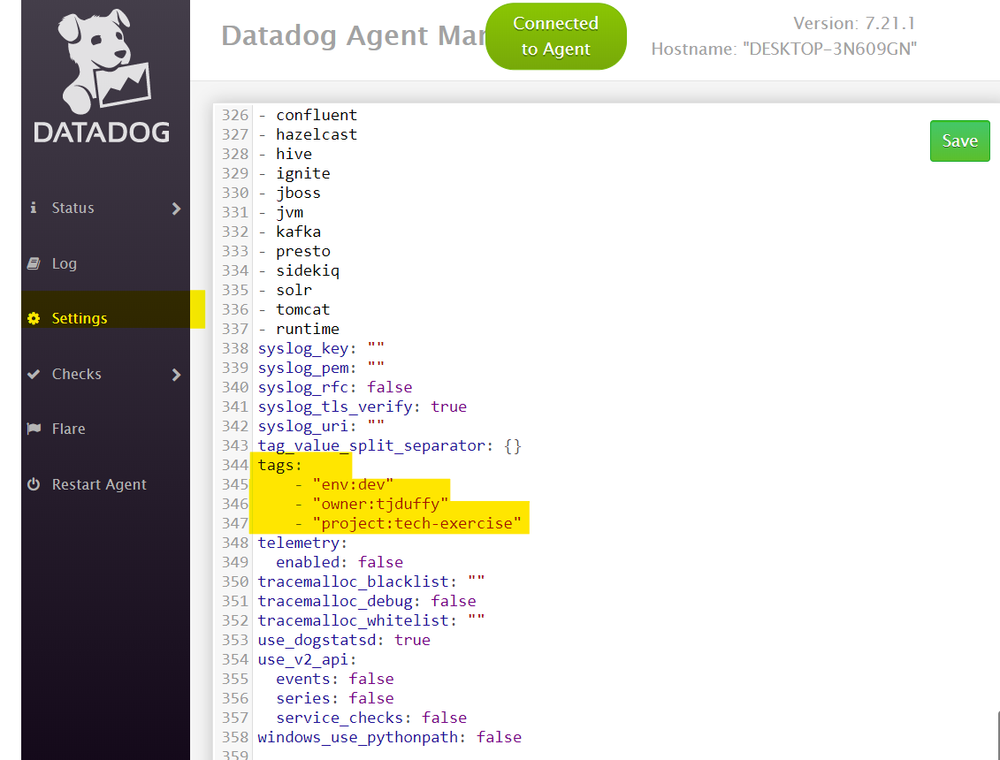
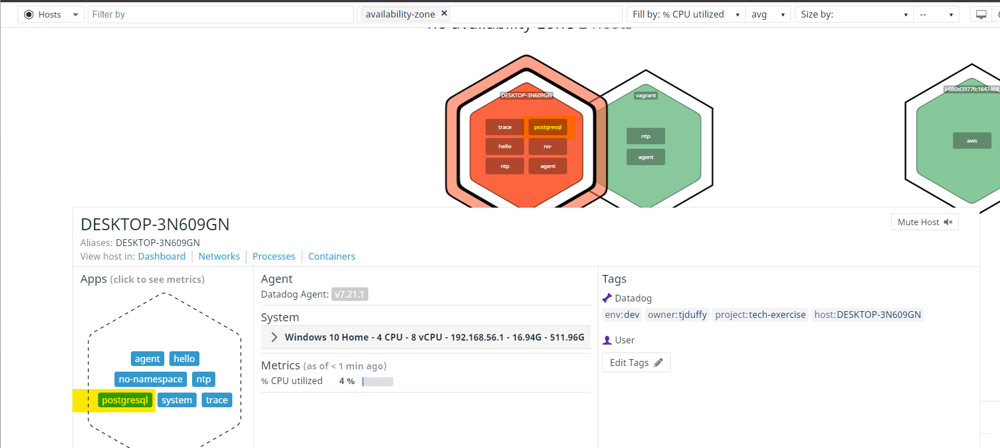

## Prerequisites - Setup the environment

In the Datadog UI, chose Integrations, Agent to get the Agent install instructions and downloads.

For my exercise I chose the Windows Agent.  Follow on screen instructions for download and installation.

Note: there is a command line option as well.  This is convenient for integrating the agent install into CI/CD Devops systems.

## Collecting Metrics:

* Add tags in the Agent config file and show us a screenshot of your host and its tags on the Host Map page in Datadog.

On a Windows host there is an Agent GUI available to manage the Agent.  I'll use this GUI to add the tags to the Agent config file and to restart the Agent.   

Find tags section and add tag key pair (or single value) in YAML format.



Restart agent after you have added the tags and saved your changes.  

Verify tags are working by checking the Host Map page in Datadog UI.  

Note: may take a few minutes for the tags to show up in Datadog.


*  Install a database on your machine (MongoDB, MySQL, or PostgreSQL) and then install the respective Datadog integration for that database.

I have installed PostgreSQL db on my Windows host.

Install the PostgreSQL integration from the Datadog UI.   Select the Integrations page from the UI and find the integration you need.  Find the PostgreSQL integration in Datadog and follow instructions on Configuration tab.

Create the read-only datadog user with proper access to PostgreSQL server as described on this tab


Next, edit the postgres.d/conf.yaml file to enable collection of metrics from your PostgreSQL server to Datadog.  For this exercise we only need to change the server, user and pw.


Click the 'Install Integration' button on bottom left of Configuration tab.  

After server minutes check the Host Map in Datadog.  You will see PostgreSQL has been added to the Apps on your host.  




And metrics are collected.  In the Datadog UI navigate to the Dashboards, Dashboard List.  Select the Postgres - Metrics dashboard


* Create a custom Agent check that submits a metric named my_metric with a random value between 0 and 1000.

Create a python script to setup the custom Agent check.  For Windows OS, the .py file is stored in the C:\ProgramData\Datadog\checks.d\ folder and its .yaml configuration file is stored in C:\ProgramData\Datadog\conf.d\ folder.

Created Sample custom Agent file *C:\ProgramData\Datadog\checks.d\custom_my_metric.py* that collects a metric called my_metric.  

```python

# the following try/except block will make the custom check compatible with any Agent version
try:
    # first, try to import the base class from new versions of the Agent...
    from datadog_checks.base import AgentCheck
except ImportError:
    # ...if the above failed, the check is running in Agent version < 6.6.0
    from checks import AgentCheck

# content of the special variable __version__ will be shown in the Agent status page
__version__ = "1.0.0"

import random
class my_metric(AgentCheck):
    def check(self, instance):
        self.gauge('my_metric', random.randrange(1000), tags=['customAgentCheck:custom_my_metric'])
```


* Change your check's collection interval so that it only submits the metric once every 45 seconds.

Created the corresponding configuration file *C:\ProgramData\Datadog\conf.d\custom_my_metric.yaml*

Note: I have added the param "min_collection_interval" to the config file.  

```yaml
init_config:

instances:
  - min_collection_interval: 45
```

The min_collection_interval value changes the check's collection interval so that it only submits the metric once every 45 seconds.  The default value is 15 seconds.  

* **Bonus Question** Can you change the collection interval without modifying the Python check file you created?

The metric collection interval can be modified without having to change the python script by changing the min_collection_interval value in the configuration file.  After changing the value and saving the file, restart the agent.

## Visualizing Data:

Utilize the Datadog API to create a Timeboard that contains:

- Your custom metric scoped over your host.

- Any metric from the Integration on your Database with the anomaly function applied.

- Your custom metric with the rollup function applied to sum up all the points for the past hour into one bucket

The dashboard "Datadog Tech Excercise - Visualizing Data" was created by using the Datadog API calls.  To get a quick handle on the syntax required for the body input for the https://api.datadoghq.com/api/v1/dashboard POST endpoint, I created the necessary dashboard using the UI, verified it and then exported the dashboard.  The resulting JSON file contains the body necessary for input for the /dashboard endpoint.  You will need to remove the "Id" values from the exported JSON first (new Id's are created when you POST and the new dashboard is created with the API).


Here is the body used with the create dashboard API post

```json
{
    "title": "Datadog Tech Excercise - Visualizing Data",
    "widgets": [
        {
            "definition": {
                "type": "timeseries",
                "requests": [
                    {
                        "q": "avg:system.mem.free{*}"
                    }
                ],
                "title": "Average Memory Free"
            }
        }
    ],
    "layout_type": "ordered",
    "description": "customer metric over host, db metric with anomaly, rollup",
    "is_read_only": false,
    "notify_list": [
        "tommyjduffy@gmail.com"
    ],
    "template_variables": [
        {
            "name": "host",
            "prefix": "host",
            "default": "<HOSTNAME_1>"
        }
    ],
    "template_variable_presets": [
        {
            "name": "Saved views for hostname 2",
            "template_variables": [
                {
                    "name": "host",
                    "value": "<HOSTNAME_2>"
                }
            ]
        }
    ]
}
```

Once this is created, access the Dashboard from your Dashboard List in the UI:

- Set the Timeboard's timeframe to the past 5 minutes

- Take a snapshot of this graph and use the @ notation to send it to yourself.

Send snapshot and include @ notation to my email address.


And below is the email received.


- **Bonus Question**: What is the Anomaly graph displaying?

The Anomaly graph shows in wide grey band what the usual historical trend line for the metric being monitored.  When the metric is outside of the grey band the graph line shows in red.  This indicates that the metric is behaving outside of the usual and historic trend for this metric.   In my example that is outside of 2 standard deviations from the norm.

## Monitoring Data:

Create a new Metric Monitor that watches the average of your custom metric (my_metric) and will alert if it’s above the following values over the past 5 minutes:

- Warning threshold of 500
- Alerting threshold of 800
- And also ensure that it will notify you if there is No Data for this query over the past 10m.

In the Datadog UI select Monitor, New Monitor and select the Metric as the monitor type.  Select 'my_metric' as the metric.  In the 'Set alert conditions' section, set the Alert and Warning thresholds, and set to 'Notify' if data is missing for more the 10 minutes.


Please configure the monitor’s message so that it will:

- Send you an email whenever the monitor triggers.
- Create different messages based on whether the monitor is in an Alert, Warning, or No Data state.
- Include the metric value that caused the monitor to trigger and host ip when the Monitor triggers an Alert state.
- When this monitor sends you an email notification, take a screenshot of the email that it sends you.

In the 'Say what's happening' section, enter the message to display in the email delivered.  There are message template variables available, including conditional statements, that allow for more dynamic messaging depending on the type of alert (warning, alert, no data).

In the 'Notify your team' section, enter the recipients of the message.  In this example I entered my own email address.  


- **Bonus Question**: Since this monitor is going to alert pretty often, you don’t want to be alerted when you are out of the office. Set up two scheduled downtimes for this monitor:

  One that silences it from 7pm to 9am daily on M-F,

  


  And one that silences it all day on Sat-Sun.

  

- Make sure that your email is notified when you schedule the downtime and take a screenshot of that notification.

<wait for email>

## Collecting APM Data:

Given the following Flask app (or any Python/Ruby/Go app of your choice) instrument this using Datadog’s APM solution:

Provide a link and a screenshot of a Dashboard with both APM and Infrastructure Metrics.

Dashboard with APM and Infrastructure Metrics


Using the gear icon on this dashboard, get a copy of the public URL to this dashboard.


Public URL to this dashboard.

https://p.datadoghq.com/sb/6mqbpnn5kcjdoek7-b1a2b143420f9984be9394dcabaff056


Please include your fully instrumented app in your submission, as well.

Instrumented app, apm-test.py, included in submission.


- **Bonus Question**: What is the difference between a Service and a Resource?

Services are a logical grouping of components of highly distributed systems, like microservice architectures.  Examples of services would be API endpoints, db queries and jobs.  

Resources are the particular action for a given service.  Typically an individual API endpoint or db query.  

## Final Question:

Datadog has been used in a lot of creative ways in the past. We’ve written some blog posts about using Datadog to monitor the NYC Subway System, Pokemon Go, and even office restroom availability!

Is there anything creative you would use Datadog for?

The Covid-19 pandemic has changed life for all of us.  From wearing masks, social distancing, remote work and schooling from home, we are confronted with a new normal every day in so many ways.  We are all learning to adapt as we begin to open up as safely as we can.  Part of the steps that have been taken to open customer facing businesses safely, is to monitor staff and customers for Covid 19 symptoms.  When we go a doctor's office, hair salon, or gym we are screened before entry: temperature taken, an a brief QA related to symptoms and if we were in contact with persons infected with Covid-19.  In many places, staff are also screen before entering their workplace.  I have come to learn that this screening is also done for all restaurant workers.   

What if this data could be monitored real time across all locations?  This looks like perfect scenario for Datadog.  Many sources of data streaming in that need to be collected and presented in such a way that meaningful actions and decisions can be made from it.

For example, a national chain of restaurants requires all of their employees to be screened before entering the work place.  The Q&A results along with the thermometer reading (via IOT device perhaps) will be collect from every employee at every location at the start of each shift.  This data can be integrated into Datadog for analysis and action.  HQ can know immediately if there is a potential hot spot location.  Does the data correlate with what is reported from other Covid-19 related data (local, regional, national)?  Will they need to address staffing shortage?  Allows for HR Outreach to employees for medical care, insurance questions and advice.  The data collected may be shared with other organizations and agencies, to further advance the collection knowledge and help combat this deadly pandemic.