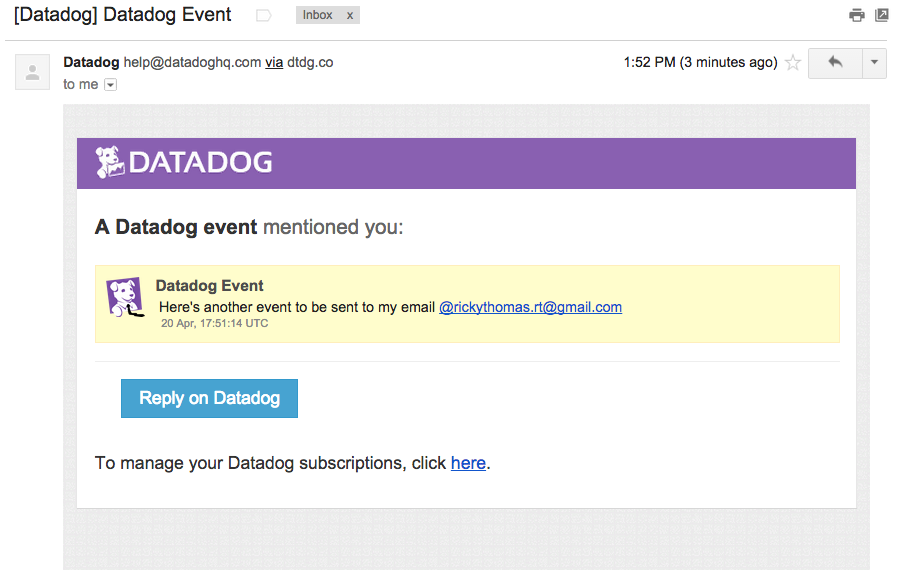

### Level One

#### Sign up for Datadog, get the agent reporting metrics from your local machine.
**Install successful**


#### Bonus Question
- The datadog agent is a piece of software that runs on your hosts collecting events and metrics for you. This allows you to better understand your systems monitoring and performance data. There are three components to the datadog agent.
  1. **The Collector** runs checks on your current machine capturing system metrics like memory and cpu.
  2. **Dogstatsd** is a statsd backend server you can send custom metrics to from an application.
  3. **The Forwarder** retrieves data from both the collector and dogstatsd and then queues it up to be sent on to Datadog.

#### Submit an event via the API

``` ruby
require 'rubygems'
require 'dogapi'

api_key = "hidden" #Normally I would mask this

dog = Dogapi::Client.new(api_key)

dog.emit_event(Dogapi::Event.new('This is my first submitted event!', :msg_title => 'Winning'))
```


#### Get an event to appear in your email inbox

**Event Emailed**

``` ruby
require 'rubygems'
require 'dogapi'

dog = Dogapi::Client.new(api_key)

dog.emit_event(Dogapi::Event.new("Here's another event to be sent to my email @rickythomas.rt@gmail.com", :msg_title => 'Datadog Event', :priority => 'normal', :alert_type=> 'success'))
```



### Level Two

#### Take a simple web app (in any of our supported languages) that you've already built and instrument your code with dogstatsd.

I built a StackOverflow like site in Rails called Macoverflow. This is a website where you can sign in and post questions about macaroni and cheese or post your homemade recipe!

- The following code is included inside a file titled datadog_helper.rb

``` ruby
module DatadogHelper

  STATSD = Statsd.new

  def self.render_page
    STATSD.increment('web.page_views')
  end
end
```

####While running a load test for a few minutes, visualize page views per second.

- I tested this on my question index page. The following code is in the Question Controller

``` ruby
class QuestionsController < ApplicationController
  before_action :set_question, only: [:show, :edit, :update, :destroy]

#GET /questions
  def index
    @questions = Question.all
    DatadogHelper.render_page
  end
```

-After running a load test on this page I was able to generate the graph below.

