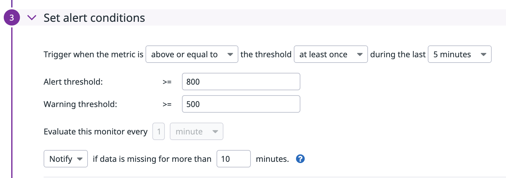
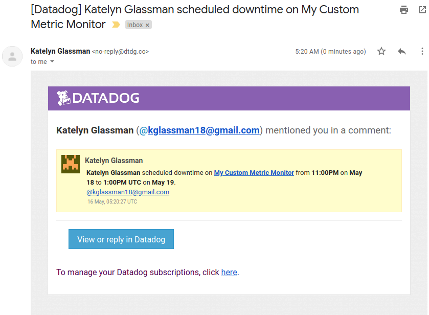
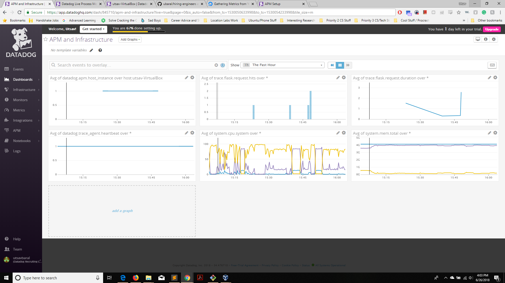

## Answers
Links to relevant dashboards at the bottom of this readme. [here](links-to-dashboards).

## Environment
For the host machine, I used *Oracle VM VirtualBox* software to spin up an instance of Ubuntu 16.04. I edited configuration files, agent properties, and other host related settings through the VM terminal, though having the actual operating system graphical interface was useful to configure other properties. Below is a screenshot of the configured host machine with the datadog agent running on it. Remember, the command to check the status of the datadog agent is `sudo service datadog-agent status`:
(Add Screenshot of ubuntu host with datadog)

## Collecting Metrics:
To begin collecting metrics with the agent to send to our DataDog client, let's edit the agent config file, which is located on the host machine at: */etc/datadog-agent/datadog.yaml*. We Want to add the api key for our account, which you can get from the DataDog HQ through your browser. Once we add the api key, we can add tags for our host as well in the same file. Here is a snippet of the config file with these parameters:
```yaml
...
api_key = <YOUR_API_KEY>
...

# Set the host's tags (optional)
tags:
   - region:westcoast
   - env:test
   - hiremelol
```

Now that we have the agent configured, and sending data to DataDog, we can check out the host in the *Host Map* page in DataDog. Here is a screen shot of my host machine in the Host Map page in Datadog:


Install MySQL on the host and then install the respective Datadog integration. Then create the following mysql configuration in */etc/datadog-agent/conf.d/mysql.d/conf.yaml*
```yaml
init_config:

instances:
  - server: localhost
    user: datadog
    pass: 'teapot00'
    tags:
	- optional_tag1
	- optional_tag2
    options:
	replication: 0
	galera_cluster: 1
```
	
	* graphs of sql metrics on the dashboard: 
	

* Create *hello.yaml* and *hello.py* files in the *./config.d/* and *./check.d/* directories, respectively.
	* *hello.yaml*
	``` yaml
	init_config:

	instances:
	    [{}]
	```
	* *hello.py*
	```python
	from checks import AgentCheck
	import random


	class HelloCheck(AgentCheck):
	    def check(self, instance):
		self.gauge('my_metric', random.randint(0,1001))
	```
	
	* Screenshot of my metric on Data Dog
	

* To change the check's collection interval to every 45sec (in v6), I added the *min_collection_interval* instance parameter in the check config file (*/config.d/hello.yaml*), and set it to 45. It will skip 2 checks and gauge the metric once every 3rd check.
	* updated *hello.yaml* file
	``` yaml
	init_config:

	instances:
	    - min_collections_interval: 45
	```

* **Bonus Question** Can you change the collection interval without modifying the Python check file you created?
	* The above method does not modify the python file.


## Visualizing Data
Utilize the Datadog API to create a Timeboard that contains:

* Your custom metric scoped over your host.
* Any metric from the Integration on your Database with the anomaly function applied.
* Your custom metric with the rollup function applied to sum up all the points for the past hour into one bucket

 Python script used to create this dashboard:
  ```python
  from datadog import initialize, api
 import json

 d = None
 with open('./keys.json') as json_data:
     d = json.load(json_data)

 API_KEY = d["api_key"]
 APP_KEY = d["app_key"]

 options = {
     'api_key': API_KEY,
     'app_key': APP_KEY
 }

 initialize(**options)

 title = "Visualizing Data Timeboard"
 description = "DataDog challenge second question on visualizing data."
 graphs = [{
     "definition": {
         "events": [],
         "requests": [
             {"q":"avg:my_metric{host:utsav-VirtualBox}"}
         ],
         "viz": "timeseries"
     },
     "title": "My Metric"
 },

 {
     "definition": {
         "events": [],
         "requests": [
             {"q": "anomalies(avg:mysql.performance.cpu_time{host:utsav-VirtualBox}, 'basic', 1)"}
         ],
         "viz": "timeseries"
     },
     "title": "SQL Performance Metric"
 },

 {
     "definition": {
         "events": [],
         "requests": [
             {"q":"avg:my_metric{host:utsav-VirtualBox}.rollup(avg, 3600)"}
         ],
         "viz": "timeseries"
     },
     "title": "My Metric (Rollup - 1hr)"
 }
 ]

 template_variables = [{
     "name": "host1",
     "prefix": "host",
     "default": "host:my-host"
 }]

 read_only = True
 response = api.Timeboard.create(title=title,
                      description=description,
                      graphs=graphs,
                      template_variables=template_variables,
                      read_only=read_only)

 print(response)
  ```
  * Screenshot of Timeboard:
  
  
  * **Bonus**: The anomaly function uses an algorithm to identify when a metric is behaving differently than it has in the past, taking into account trends.
 

## Monitoring Data

Create a new Metric Monitor that watches the average of your custom metric (my_metric) and will alert if it’s above the following values over the past 5 minutes:

* Screenshot of Monitor Details:

	
* Screenshot of Monitor Alert Email:


* Screenshot of Monitor Scheduled Downtime Email:



## Collecting APM Data

* Add the following python libraries to the app:
	```python
	from flask import Flask
	import blinker as _

	from ddtrace import tracer
	from ddtrace.contrib.flask import TraceMiddleware
	```

* Then create the flask app and insert code to create traced app with the middleware call:
	```python
	app = Flask(__name__)
	traced_app = TraceMiddleware(app, tracer, service="my-flask-app", distributed_tracing=False)
	```

* Screenshot of dashboard with flask tracing:


* Screenshot of dashboard with host infrastructure data:


* **Bonus Question:** Service is  a set of processes that work together to provide a feature. In this case the simple flask web app is the only one service. A Resource is A particular query to a service. So in this case, queries to the different endpoints are resources the belong to the web app service.

## Final Question
I would use DataDog to monitor data about the local gym I go to. It would be really useful to monitor data on what hours various services are used up. For example what hours the weight room is packed, what machines/equipment are in use, wheather or not the swimming pool is packed. Also then, I wouldn't have to bother trying to go when its packed. Plus this data could be used by the gym to create a better load balancing system, or incentives for people to come at different hours to maximize equipment usage and even increase profits.

## Links to Dashboards:
* [utsav-VirtualBox (host)](https://app.datadoghq.com/dash/host/510159929?live=true&page=0&is_auto=false&from_ts=1530054428216&to_ts=1530058028216&tile_size=m)
* [APM Dashboard](https://app.datadoghq.com/dash/845710/apm-and-infrastructure?live=true&page=0&is_auto=false&from_ts=1530054394568&to_ts=1530057994568&tile_size=m)
* [Visualizing Data Timeboard](https://app.datadoghq.com/dash/843528/visualizing-data-timeboard)
* [mySQL Overview]( https://app.datadoghq.com/dash/integration/12/mysql---overview?live=true&page=0&is_auto=false&from_ts=1530054368154&to_ts=1530057968154&tile_size=m)
