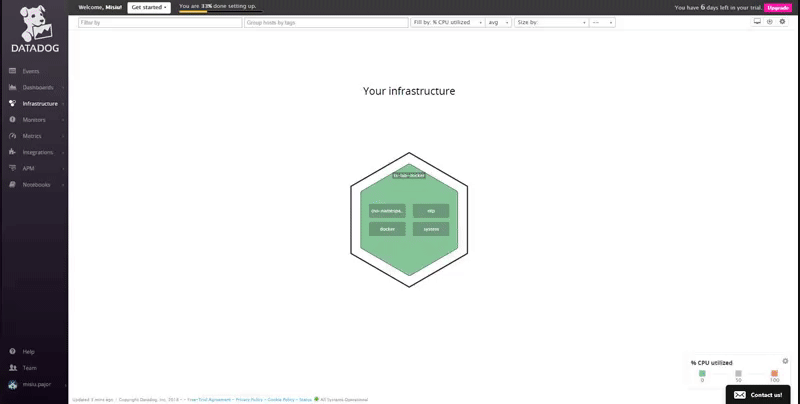

This document should provide you with nimble steps to help demonstrate the capabilities of the Datadog monitoring suite, using Docker, but also act as a submission for the Tech Excercise.

- [Introduction](#introduction)
- [Getting started](#getting-started)
    - [Installing the Prerequisites](#installing-the-prerequisites)
    - [Setup your Docker environment](#setup-your-docker-environment)
- [Collecting Metrics](#collecting-metrics)
    - [Adding tags](#adding-tags)
    - [Integrations](#integrations)
    - [Custom Agent Checks](#custom-agent-checks)
    - [Metric Intervals](#metric-intervals)
- [Visualizing Data](#visualizing-data)
- [Monitoring Data](#monitoring-data)
- [Collecting APM Data](#collecting-apm-data)
- [Final Question](#final-question)

# Introduction

This tutorial will lead you through the steps of starting Docker containers to quickly boot up three separate containers that runs the [Datadog agent](https://github.com/DataDog/dd-agent), a Python Flask App and a MySQL server.

Note that this tutorial does not cover the basics of installing and using Docker, but references will be see in-line to ease the workflow for you.

# Getting started

Before you begin, you will need to first:

* Create your [Datadog](https://datadoghq.com/) account
* Setup your [Docker](https://docs.docker.com/engine/installation) environment


## Installing the Prerequisites

## Create your Datadog Account

The first step is creating your Datadog account [here](https://datadoghq.com)

## Setup your Docker environment

For our test environment we will be deploying three containers using Docker:

1. datadog_agent - which runs: [Datadog Docker Agent](https://github.com/DataDog/docker-dd-agent)
2. datadog_mysql - which runs: MySQL 5.7
3. datadog_flask - which runs: a Flask application to demonstrate the APM capabilities
    
The setup should be a breeze for you as the above is available for you in a git repository. The below instructions will get you up and running:

1. Install Docker from [here](https://docs.docker.com/engine/installation/)
2. Git clone this repository:
`git clone git@github.com:mpajor/hiring-engineers.git`
3. Checkout the _my-submission_ branch:
`git checkout my-submission`
`cd docker`
4. Login to Datadog and get your API and APP key from [here](https://app.datadoghq.com/account/settings#api) and save it
5. Add your API and APP key and set some tags:
```
sed -i 's/API_KEY=.*/API_KEY=<your api key>/g' .env
sed -i 's/APP_KEY=.*/APP_KEY=<your app key>/g' .env
sed -i 's/TAGS=env:lab,role:agent/g' .env
```
6. Run your Docker containers:
` docker-compose up -d `
8. Finally, validate that your docker containers are running:
`docker ps`
``` sh
CONTAINER ID        IMAGE                            COMMAND                  CREATED             STATUS                            PORTS                                                                                          NAMES
86087dba5e14        docker_flask                     "python3 main.py"        2 minutes ago       Up 2 minutes                      0.0.0.0:5000->5000/tcp                                                                         datadog_flask
60833bf06a7d        mysql:5.7                        "docker-entrypoint.s…"   2 minutes ago       Up 2 minutes                      0.0.0.0:32836->3306/tcp                                                                        datadog_mysql
aee50e7ef51a        datadog/docker-dd-agent:latest   "/entrypoint.sh supe…"   2 minutes ago       Up 2 minutes (health: starting)   8125/udp, 8126/tcp, 0.0.0.0:32833->8126/udp                                                    datadog_agent                                                  ddtest_agent_1
```


# Collecting Metrics

Now to the fun. Collecting our metrics.

## Adding tags

* __Add tags in the Agent config file and show us a screenshot of your host and its tags on the Host Map page in Datadog.__

In our agent container we have defined tags using environment variables, these tags will automatically be defined for you in Datadogs configuration file `dd-agent/datadog.conf` under the  `# Set the host's tags (optional) section.` within the __datadog_agent__ container.
You can validate that the tags you defined earlier are set by running the below command on your Docker host:

``docker exec -it datadog_agent cat /etc/dd-agent/datadog.conf``

Yielded result:
```
[Main]
dd_url = https://app.datadoghq.com
api_key = <your api key>
gce_updated_hostname = yes
tags = env:lab,role:agent
non_local_traffic = yes
service_discovery_backend = docker
log_to_syslog = no
```

In the example below we have defined two tags: env and agent. The env describes which environment our docker host is a part of ("lab") and the role is defined to describe this hosts function ("agent").



You can also add your own custom tags easily using the UI:


If you are interested in adding tags systematically, say using the API or using a configuration management tool like Chef or Puppet, I would advise you to read more on: [Getting started with tags](https://help.datadoghq.com/hc/en-us/articles/204312749-Getting-started-with-tags)

## Integrations

* __Install a database on your machine (MongoDB, MySQL, or PostgreSQL) and then install the respective Datadog integration for that database.__

In our agent container: __datadog_mysql__ we have a MySQL server running with a service account named: _datadog_ setup. The datadog username and password is inherited from the .env file that we earlier modified.

The agent container __datadog_agent__ is configured to monitor our MySQL server using [Autodiscovery](https://docs.datadoghq.com/agent/autodiscovery). Autodiscovery will apply the template that is defined in `conf.d/auto_conf/mysql.yaml on all containers running a image named "mysql", thus making our __docker_mysql_1__ container discoverable.

Validate that the metrics from our already running MySQL container is sent to Datadog, run:

``docker exec -it datadog_agent /etc/init.d/datadog-agent info``

The output shows that everything is working as intended:


## Custom Agent Checks

* __Create a custom Agent check that submits a metric named my_metric with a random value between 0 and 1000.__

A template is defined in: `conf.d/my_metric.yaml`:

```yaml
init_config:

instances:
    [{}]
```

The python check is defined in: `_checks.d/my_metric.py_`:

```py
from random import random
from checks import AgentCheck
class RandomInteger(AgentCheck):
    def check(self, instance):
        self.gauge('my_metric', 1000 * random())
```

Validate that our custom agent check is currently working as intended, run:

``docker exec -it datadog_agent /etc/init.d/datadog-agent info``

The output shows that our my_metric check is sending data to Datadog:


## Metric Intervals

* __Change your check's collection interval so that it only submits the metric once every 45 seconds.__

By default check's collection interval is set to 20; you can change your check's collection interval by modifying `conf.d/my_metric.yaml`, simply add the __parameter min_collection_interval: 45__ to the file:

```yaml
init_config:
  min_collection_interval: 45

instances:
    [{}]
```

# Visualizing Data

### Creating a Timeboard using the API

Utilize the Datadog API to create a Timeboard that contains:

* __Your custom metric scoped over your host.__
* __Any metric from the Integration on your Database with the anomaly function applied.__
* __Your custom metric with the rollup function applied to sum up all the points for the past hour into one bucket__

Create a Timeboard by executing the included `scripts/create_timeboard.py` script:
`docker exec -it datadog_flask python /tmp/create_timeboard.py` which yields a link that we will open in our browser:
`Your timeboard 'My Timeboard' was created: https://app.datadoghq.com/dash/449266/my-timeboard`


* __Set the Timeboard's timeframe to the past 5 minutes__
* __Take a snapshot of this graph and use the @ notation to send it to yourself.__

Use the shortcut `alt + ]` to adjust the Timeboard's timeframe to past 5 minutes.
Click the camera icon in the top right corner of the graph to take a snapshot.
Create a message with the @notation and send it to yourself, or another user in Datadog.


Your message will now show up under events:


* __Bonus Question: What is the Anomaly graph displaying?__

The anomaly graph will help you detect what is considered to a normal state for your metrics and when not it will flag these anomalies.
The graph below is displaying anomalies for the metric "my_metric" with a gray band around it and a red line indicating detected anomalies. The gray band is configured to act within 2 bounds and can be adjusted if needed.
A more thorough explanation is available [here](https://www.datadoghq.com/blog/introducing-anomaly-detection-datadog)


# Monitoring data

### Create a new Metric Monitor


In the _Say what's happening_ section we set:
```
Hi Friend,
#{{#is_alert}}
Bad news.
my_metric has a value of: {{value}} on {{host.name}} ({{host.ip}})
This has surpassed your __alert__ threshold you set to: {{threshold}}
{{/is_alert}} 

##{{#is_warning}}
Heads up.
my_metric now has a value of {{value}} on {{host.name}} ({{host.ip}})
This surpasses your __warning__ threshold you set to: {{threshold}}
{{/is_warning}} 

###{{#is_no_data}}
Heads up. No data has been sent for my_metric on {{host.name}} ({{host.ip}}) for the past 10 minutes.
{{/is_no_data}} 

#{{#is_recovery}}
Good news. Everything is back on track.
{{/is_recovery}} 

 @misiu.pajor@gmail.com
```
 
This will send us an e-mail notification when the monitor triggers:


 
* __Bonus Question:__ Since this monitor is going to alert pretty often, you don’t want to be alerted when you are out of the office. Set up two scheduled downtimes for this monitor:

    * One that silences it from 7pm to 9am daily on M-F.

    
    * And one that silences it all day on Sat-Sun.
    
    * Make sure that your email is notified when you schedule the downtime and take a screenshot of that notification.
    
    
    
    An overview of your scheduled downtimes can also be seen:
    
    
    
    
# Collecting APM Data

A Flask app is running in our container __datadog__flask.
This app is instrumented to trace APM data and the application tracer is modified to report its findings to the Datadog agent running on our __datadog_agent__ container (through DogStatD on port 8126).

The source of the Flask App can be found in `app/main.py`:

```py
from flask import Flask
from ddtrace import tracer
from ddtrace.contrib.flask import TraceMiddleware
import logging
import sys

# Have flask use stdout as the logger
main_logger = logging.getLogger()
main_logger.setLevel(logging.DEBUG)
c = logging.StreamHandler(sys.stdout)
formatter = logging.Formatter('%(asctime)s - %(name)s - %(levelname)s - %(message)s')
c.setFormatter(formatter)
main_logger.addHandler(c)

tracer.configure(hostname='agent', port=8126)
app = Flask(__name__)
traced_app = TraceMiddleware(app, tracer, service="dd-flask-app", distributed_tracing=False)

@app.route('/')
def api_entry():
    return 'Entrypoint to the Application'

@app.route('/api/apm')
def apm_endpoint():
    return 'Getting APM Started'

@app.route('/api/trace')
def trace_endpoint():
    return 'Posting Traces'

if __name__ == '__main__':
    app.run(host='0.0.0.0', port=5000)
```

In order for us to to see some relevant data, we can generate random requests to our Flask app through the shell on our docker host, run:

```sh
RESOURCES=("/", "/api/apm", "/api/trace", "/not_found")
for i in {1..25}; do
	RANDOM_SEED=$$$(date +%s)
	RESOURCE=${RESOURCES[$RANDOM % ${#RESOURCES[@]}]}
	curl http://localhost:5000{$RESOURCE}; 
done
```

Now navigate to [Datadog APM](https://app.datadoghq.com/apm/service) to see the final result:


If we then tie together our APM and Infrastructure Metrics in a new Dashboard, it can look like this:


* __Bonus Question: What is the difference between a Service and a Resource?__

A service in Datadog APM is "is the name of a set of processes that work together to provide a feature set.", a basic example would be our Flask app in whole, while in a more complex environment you will find multiple services, eg: database, stock-scraper, stock-scraper-api, bloomberg-api.

A resource in Datadog APM is "is a particular query to a service", this is typically your route or handler functions, eg. "/api/bloomberg/get_companies"


# Final Question
Is there anything creative you would use Datadog for?
