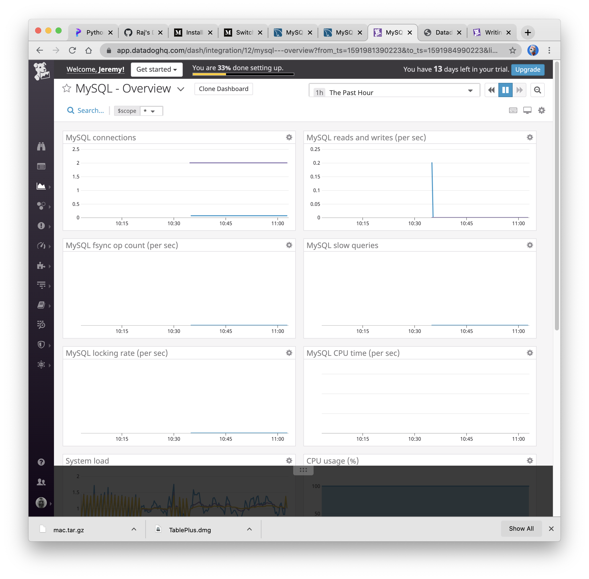
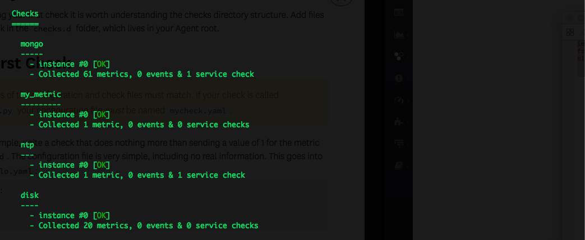
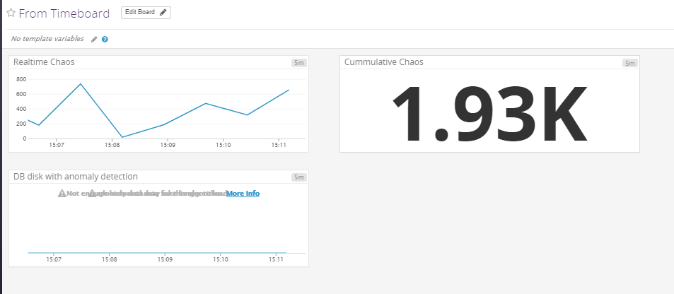
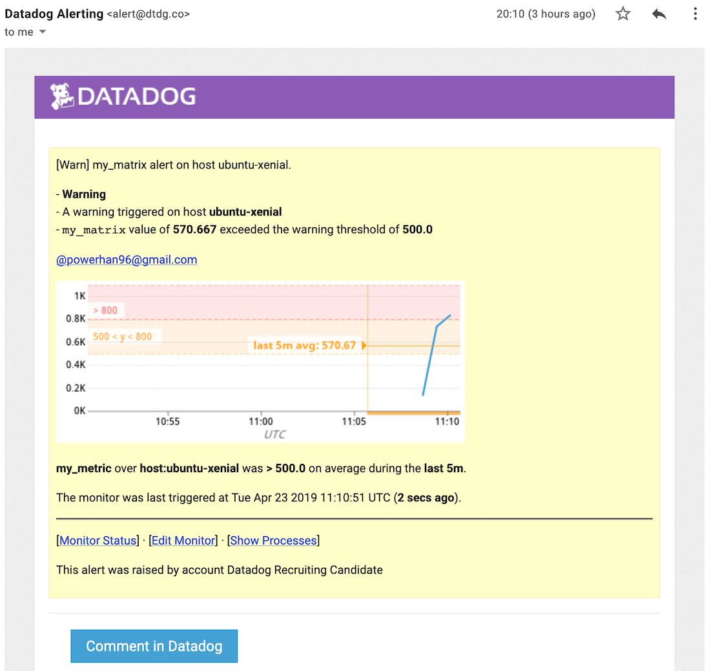

#The Challenge

Level 1:
I began the challenge by installing the latest versions of Vagrant and Virtual Box to run Datadog's software on a virtual machine. Doing so would help to avoid running into any OS or dependency issues. This would be my first time utilizing a virtual machine, so I spent some time researching the Vagrant documentation, as well as inspecting the Virtual Box application on my hard drive. After finishing the VM installation, I decided to try completing the challenge on my machine without the use of a VM. I was curious about what kind of metrics I would find regarding my own system. If a dependency issue arose, I had the steps recorded and a VM created to be used as back up.

Once I finshed installing the virtual machine, I navigated over to the Datadog website and began filling out the "Getting Started" fields.

I was subsequently redirected to the stack page where I was able to find all of the software usually included in one of my stacks besides JavaScript. I selected Ruby, PostgreSQL, Slack, and Git as my stack.

Finally, I moved on to the agent setup where a simple terminal command, using Datadog's API, was used to install the agent on my local machine.

I then followed the terminal's direction and navigated to the infrastructure page on Datadog's website to make sure my machine was comunicating with Datadog's servers. https://app.datadoghq.com/infrastructure

After installing the agent and waiting a few minutes, I logged into my Datadog portal and began exploring my system's metrics.

What is the Agent?
The Agent can be thought of as a piece of software that acts as a liaison between you and Datadog. By running on your hosts, the agent can monitor and collect your system's metrics to be sent to Datadog and translated into user friendly, interpretable reports, such as linear graphing, alerts, and over all system monitoring. The agent consists of three main parts, the "collector", which monitors your machines integrations to record metrics, the "Dogstatsd", which recieves customs metrics from an application, and the "forwarder", which compiles data from both the "collector" and "Dogstatsd" to be sent off to Datadog and interpreted. Agent based monitoring provides faster results, more acurate event measurments, and provides a broader view of your system's integration activity.

Here's an example of what the Agent recording metrics look like from my machine.

Since the Agent is downloaded to the user's hard drive, the config file can be accessed locally in the "Agent" directory. After googling "Agent config file", I found a rescource that provided me with documentation on basic Agent usage for OS X.

Location of config file locally:

Setting the host's tags can be seen on line 28

Datadog uses tagging to make it easier to querey the metrics used to monitor your machine. Tags allow you to narrow down a problem in an otherwise complex environment.

Datadog's "Guide to Tagging" Docs:
<http://docs.datadoghq.com/guides/tagging/>

Upon nevigating into the config file, I uncommented the tags on line 29 and added a couple more tags, in the form of key value pairs, making sure to save the changes. It's important to note that these tags can be almost anything, you can make up your own tags, so long as they're key: value pairs.

To apply these changes, I referenced Datadogs documentation to find the Agent's start and stop terminal commands, and executed both of them.

Start Agent: /usr/local/bin/datadog-agent start
Stop Agent: /usr/local/bin/datadog-agent stop

Once the Agent was restarted and the newly added tags had been applied, I navigated to view my host in Datadog's Host Map.

The new tags can be seen in the bottom right corner, under the "Tags" box.

Next, I moved on to installing a database on my machine. After installing MySQL through "brew install mysql", I navigated to the Integrations tab in my Datadog portal and selected the integrations sub tab. Following Datadog's thematic use of tags, I used the search box to locate the MySQL integration and clicked "install".

Once I clicked the "install" button, Datadog's documentation for installing the MySQL integration appeared. I browsed through the tabs and found that the "configuration" tab conatined the relevant code needed to get the integration up and running. At this point, I started a MySQL server, through the "mysql.server start;" bash command, so that my agent could be linked with the MySQL server. Before entering any prewritten commands provided by the documentation, I made sure to select the "generate password" box beforehand, which randomly generates passwords into each instance with the code. 

While it looked somewhat intimidating at first, I entered each command, starting top to bottom, exactly as they were written in the documentation. The commands extended up to 3 lines, and I was unsure whether or not I was entering them in correctly, but after each 3 line interval, I recieved a green "MySQL user - OK" or "MySQL grant - OK" message, informing me of its success.

I initially had an issue creating a user because I didn't select the "generate pasword" box before entering the "CREATE USER 'datadog'@'localhost'..." command. Wanting to stick to the documentaion's method, I tried making a new user, but was met with an error message. I researched the MySQL documentation regrding creating and destroying users and learned how to delete a user. After which I deleted my first user and created a new one with the generated password included.

The next setp required me to edit the configuration file in my Agent directory so that my Agent could be connected with the MySQL server. 

I navigated into my local Agent directory and opened the folder in Sublime text editor. Using "command + p", I located a file that was similarly named to "conf.d/mysql.yaml" (the file I was directed to edit by the documentation), but it was only an example of what a config file should look like. So, I created the "conf.d/mysql.yaml" file in the config.d folder and added the code provided in the Datadog MySQL integration doc.

The docs then required me to start and stop the agent. Like before, I executed the start and stop agent commands in terminal.
Start Agent: /usr/local/bin/datadog-agent start
Stop Agent: /usr/local/bin/datadog-agent stop

The final step in the MySQL integration docs required me to execute the "info" command and check to see if the integration was succesful. I simply googled "Execute info command integration check" and found documentation at http://docs.datadoghq.com/integrations/process/ decribing how to run this check.

After runng the "datadog-agent info" command in terminal, my checks all verified.

I finished configuring the inegration by clicking the "install integration" button, which then displayed a green "installed" button. The integration's suscces can be further confirmed by viewing the green check and message stating "The integration is working properly." when the inegration's configuration is cicked (this is all withtin the integration tab).

I wanted to see how other tools changed in response to this new MySQL integration. So I took some time to explore my Datadog portal and found a few noticable changes had been made. The Host Map in my infrastructure now shows MySQL as a tracked system, and its monitoring diagnostics can now be viewed.

It's also worthy to note that once you have initiated your first integration, the integration page will divide installed integrations from integrations that are available to be installed.

The MySQL integration will also gain its own "Integration Dashboard". These types of dashboards are automatically installed for all integrations that produce metrics. Link to dashboard: https://app.datadoghq.com/dash/integration/mysql?live=true&page=0&is_auto=false&from_ts=1498170229493&to_ts=1498173829493&tile_size=m

The Events page will also create an event notification, marking the integration's creation.
Link to events page: https://app.datadoghq.com/event/stream?tags_execution=and&show_private=true&per_page=30&aggregate_up=true&use_date_happened=false&display_timeline=true&from_ts=1497571200000&priority=normal&live=true&is_zoomed=false&status=all&to_ts=1498176000000&is_auto=false&incident=true&only_discussed=false&no_user=false&page=0&bucket_size=10800000

After being directed to write a custom Agent check that samples a random value, I googled "datadog writing custom agent checks" and found my way to the "Writing an Agent Check" doc at http://docs.datadoghq.com/guides/agent_checks/. These docs detail how users can write their own Agent checks to collect metrics from new data sources. Writing Agent checks are beneficial for custom applications, but not for generally available applications (i.e. open source projects), where an integration would work best.

All Agent checks inherit from the AgentCheck class found in the Agent directory (checks/__init__.py). Each custom Agent check requires a "check()" method that has an "instance" argument passed to it, and is ran once for every "instance". Datadog provides built in methods to allow the user to more easily send metrics.

Each custom Agent check will have a configuration file, written in yaml, that is placed in the "conf.d" file, and a checks file, written in python, located in the "checks.d" folder. The names of both these files must match, i.e. randcheck.py -> randcheck.yaml, and they can both be found in the local Agent directory.

Following the example documentation, 

I built a RandomTest class who's check method utilized the self.gauge(...) method. The gauge method measures the value of something at a particular time. The new metric called, 'test.support.random', included in the self.gauge(...) method, is used to sample a random value. My custom check inherits from AgentCheck, and will send a gauge of a random value for 'test.support.random' on each call.

To create the custom Agent check's configuration file. I followed the documentation's example in using a configuration that was simple, with no real information.

To apply my new changes, I stopped and started the Datadog Agent.

Start Agent: /usr/local/bin/datadog-agent start
Stop Agent: /usr/local/bin/datadog-agent stop

Once the Agent was up and running again. I used the "datadog-agent info" command to test whether my new custom Agent check was functioning properly. The "randomtest" check passed, displaying an "OK" message in the terminal.

I then navigated to my Datadog portal and viewed my infrastructure's Host Map, which now shows the test being monitored. The new test field can be selected to view status checks and metrics.

A view of the new metrics.

Level 2:

To clone my existing MySQL dashboard, I navigated into my Datadog portal and slected the dashboards tab. All my integration dashboards were displayed in the top right coner under the "Integration Dashboards" box. I then selected the "MySQL Overview" dashboard and navigated into it.

In the top right corner of the "MySQL Overview" box, a button with a gear symbol on it holds the option to clone the dashboard.

I was then prompted to rename and describe the dashboard.

After submitting the name and description, my new "MySQL - Overview Clone" dashboard was ready to be used.
Link to cloned dashboard: https://app.datadoghq.com/dash/306231/mysql---overview-clone?live=true&page=0&is_auto=false&from_ts=1498170485254&to_ts=1498174085254&tile_size=m

After an intial google search attempting find information about how to add new metics to the dashboard, I turned my search towards fiddling with the dashboard itself. I followed the "Add A Graph" button, located in the top of the dashboard, and was provided with a few options to create a new metric. The window provided me with 7 visualization graphs to choose from, a drop down menu filled with the types of metrics and events I wanted to build a graph for, and a labeling option for the new graph.

The "MySQL - Overview Clone" dashboard now displayed my newly made graph.

I then began repeating the same "Add A Graph" process to build a metric for my "test.support.random" custom Agent check.

The "MySQL - Overview Clone" dashboard now displayed my newly made graph.

Datadog provides two types of dashboards: 1) TimeBoard 2) ScreenBoard

1) TimeBoards are meant for troubleshooting and correlation due to their grid-like appearance. Their layout is automatic, and the metric and event graphs are always scoped to the same time.

2) ScreenBoards are best used for status boards and sharing data. They are flexible, customizable, and provide a high level look into a system. ScreenBoards are created with drag-and-drop widgets, and can be assigned to different time frames. As the screenshot shows, Screenboards have many more customizable features than Timeboards.

I took a snap shot of my "test.support.random" metric by navigating to the "Dashboards" tab and selecting the "Custom Metric - test" in the "Integrations Dashboard" box.
(link: https://app.datadoghq.com/dash/integration/custom%3Atest?live=true&page=0&is_auto=false&from_ts=1498170641844&to_ts=1498174241844&tile_size=m)
I was then able to view the "test.support.random" metric graph and find where the graph peaks above 0.9 by scrolling the mouse over its various points. To add a box around the +0.9 point of interest, I selected the camera icon in the top right corner of the graph's box, and was able to draw a box around the point exceeding 0.9. I tagged myself by writing @btbernheim@gmail.com in the graph's anotation field so that a notification containg the snapshot would be sent to my email.

A screenshot of the graph, its boxed point, and my email tag were also added to my Events feed.

Level 3:

To avoid continuous manuall monitoring of the "test.support.random" metric, I set up a monitor to alert me whenever the graph peaked above 0.9. I began by navigating to the "Monitors" tab and slecting the "New Monitor" sub tab. I selected the "metric" monitor type from the various selection of monitors,

and was then provided with a 4 step process towards creating the metric's monitor. To begin, I defined the metric by selecting "test.support.random" in the "Get" field. To make this monitor a "multi alert" by host, I slected the host tag in the "avg by" field, and changed the alert field to "Multi Alert". Next, I set the alert conditions by setting a "Threshold alert" that gets triggered when the metric is "above" some value, "at least once", during the last "5 minutes" from any host.

After saving my new monitor, I navigated back into the "Monitors" tab and saw that the "Graph Peak +0.9" monitor had signaled an alert.

I then checked my Events page to see if it had registered an event, which it had.

To give my monitor a descriptive name and message, I navigated to the "Monitors" tab and selected the "Manage Monitors" sub tab. Scrolling down to step 3, "Say what's happening", I added a monitor name and wrote the description of the event that would trigger the alert. I also added the "test.support.random" dashboard in the description, as well as my email using the @notification tag. In step 4, "Notify your team", I added myself "Brian Bernheim" (the only option inder "Users") and saved the changes.

About 10 minutes after adding and saving the monitor name and description, along with my tagged email address, Datadog sent me an email notifying me that my "test.support.random' metric had peaked over 0.9.

Once "test.support.random" recovered to below 0.9, a recovery email was also sent to me.

Finally, to avoid recieving alerts during off buisness hours, I navigated back to the "Monitors" tab and selected the "Manage Downtime" sub tab. I then selected the "Schedule Downtime" button near the top right corner of the page and was directed to a form to create the downtime interval.

I completed the 4 steps needed to add downtime to a monitor by 1) choosing which montior I would be targeting along with its scope, "test.random.support" 2) setting its downtime to be between the hours of 7pm and 9am, as well as making sure the downtime repeated daily 3) adding a message describing the downtime and the reason behind it, 4) tagging myself to be notified of the downtime.

The new downtime was added to the "Manage Downtime" page where future edits can be made.

Link to "Manage Downtime" dashboard (https://app.datadoghq.com/monitors#downtime?)

An email was sent notifying me that the downtime had initiated.

