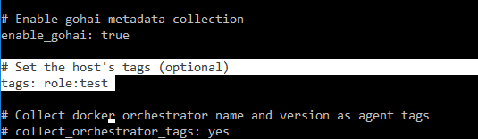
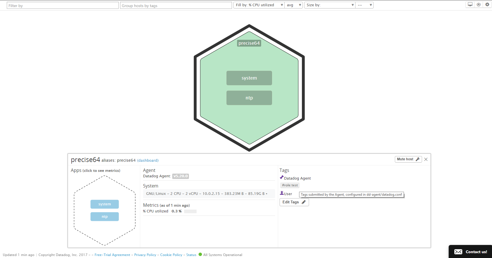
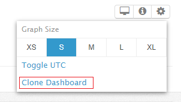
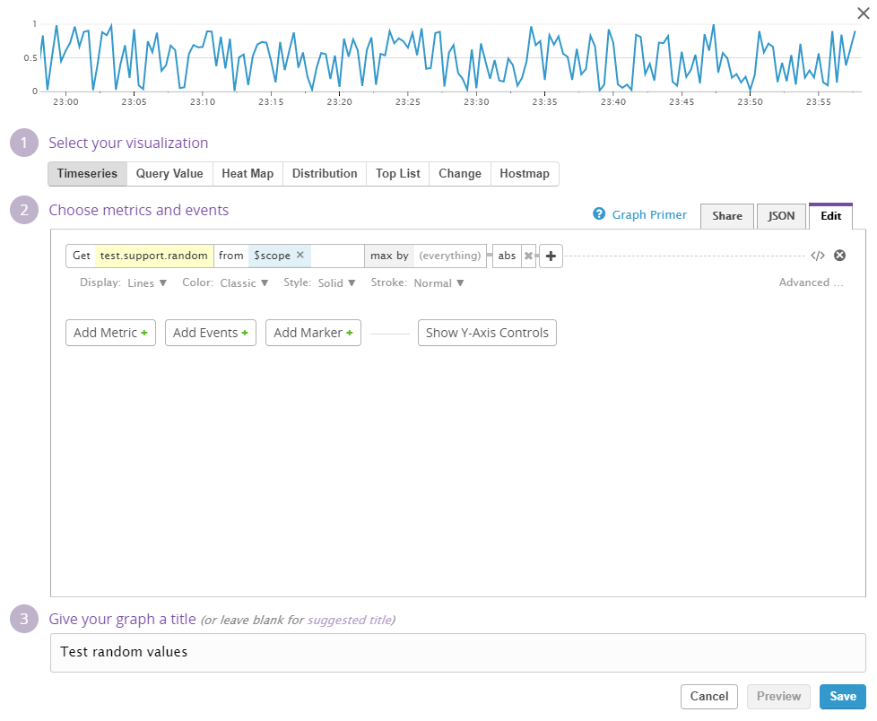
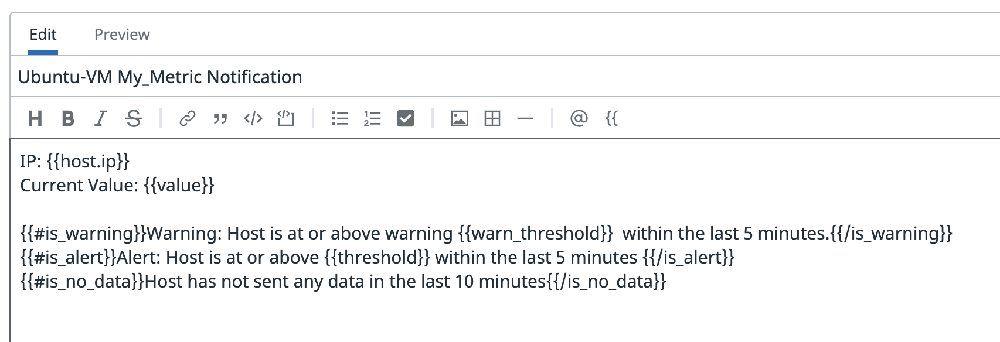
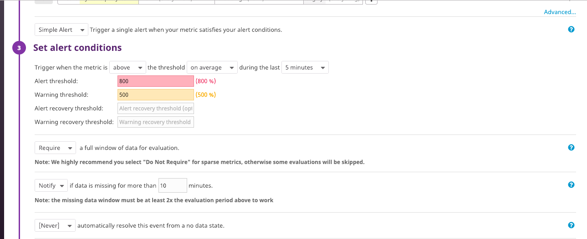
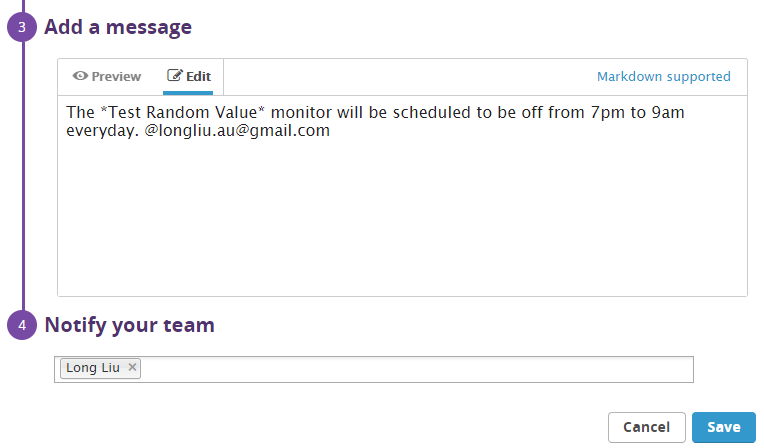
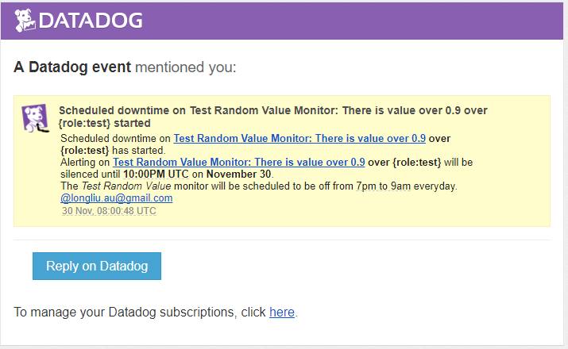

# Level 0 - Setup an Ubuntu VM.
Setup a virtual machine by utilizing [Vargrant](https://www.vagrantup.com/intro/getting-started/index.html).

# Level 1 - Collecting your Data
## Step 1: Sign up for Datadog, get the Agent reporting metrics from your local machine.

The local machine is a virtual machine in VirtualBox running Ubuntu 12.04 LTS 64-bit. 

Follow the [instruction](https://app.datadoghq.com/account/settings#agent/ubuntu) to install Datadog Agent on local machine.

Once the installation is completed, the status of the Agent can be checked by:
```bash
$sudo \etc\init.d\datadog-agent status
```
The information of the Agent can be checked by:
```bash
$sudo \etc\init.d\datadog-agent info
```

### - Bonus question: In your own words, what is the Agent?

An agent is an autonomous software that interacts with users and completes some jobs on behalf of the users. For example, the Datadog agent collects events and metrics on behalf of users. Besides, users can configure the agent and customize metrics for collection. The collected data are sent to Datadog for monitoring and analysis. Therefore, the Datadog agent contains three main parts: 1) a collector that captures system metrics by running checks; 2) a server that receive custormized metrics from applications; 3) a forwarder that send data from the collector and the server to Datadog.

## Step 2: Add tags in the Agent config file and show us a screenshot of your host and its tags on the Host Map page in Datadog.

[Tags](https://docs.datadoghq.com/guides/tagging/) are very useful to group machines and metrics for monitoring. Assigning tags using the Agent configuration file will define the tag for the overall agent.

The configuration file is saved in `/etc/dd-agent`, and the Agent configuration file is named as `datadog.conf`.

To add the tags in the Agent configuration file, we should firstly edit the configuration file:

```bash
$sudo nano \etc\dd-agent\datadog.conf
```

Then find these lines:

```bash
# Set the host's tags (optional)
# tags: mytag, env:prod, role:database
```

Uncomment the second line, and name the tag as `role:test`:

```bash
# Set the host's tags (optional)
tags: role:test
```



Press `ctrl + o` to save the file, and then exit it by pressing `ctrl + x`.

Restart the Datadog agent:
```bash
$sudo /etc/init.d/datadog-agent restart
```
The host and its tag on the Host Map page are shown in the following figure.



## Step 3: Install a database on your machine (MongoDB, MySQL, or PostgreSQL) and then install the respective Datadog integration for that database.

Download and install MySQL server:

```bash
$sudo apt-get install mysql-server
```

Test the status of MySQL Server:
```bash
$service mysql status
```

If MySQL Server is running, there will display `mysql start/running, process [PID]`. Otherwise, it can be manually started by: 
```bash
$sudo service mysql start
```

Find the Datadog integration for MySQL from [Integrations](https://app.datadoghq.com/account/settings).


Create a database user for the Datadog Agent by following the [instruction](https://docs.datadoghq.com/integrations/mysql/). We include tag `role:test` in the configuration. Therefore, MySQL configuration file in the Agent’s conf.d directory is 

```bash
init_config:

instances:
  - server: localhost
    user: datadog
    pass: <YOUR_CHOSEN_PASSWORD> 
    port: 3306
    tags: role:test
    options:
        replication: 0
        galera_cluster: 1
        extra_status_metrics: true
        extra_innodb_metrics: true
        extra_performance_metrics: true
        schema_size_metrics: false
        disable_innodb_metrics: false
```

The MySQL metrics can be found from Metric Explorer.


## Step 4: Write a custom Agent check that samples a random value. Call this new metric: test.support.random.

The custom Agent check will simply sample a random value for the metric `test.support.random`. Therefore, in the configuration file, we do not need to put any information. Hence, we create a configuration file named as `random.yaml` in the directory `/etc/dd-agent/conf.d`. The content in `random.yaml` is

```bash
init_config:

instance:
    [{}]
```

Next, the check file will be created in the directory `/etc/dd-agent/check.d`. The check file must have the same name as the configuration file. Therefore, the check file is named as `random.py`. According to the [Documents](https://docs.datadoghq.com/guides/agent_checks/), the custom check inherits from the `AgentCheck` class. In addition, we need a random number generator to yield a random value. Therefore `random.py` is

```python
from checks import AgentCheck
from random import random
class HelloCheck(AgentCheck):
  def check(self, instance):
    self.gauge('test.support.random', random())
```

We need to restart the agent to sent the check to Datadog.

```bash
$sudo \etc\init.d\datadog-agent restart
```
Then we can test the custom check
```bash
$sudo -u dd-agent dd-agent check random
```


# Level 2 - Visualizing your Data

## Step 1: Since your database integration is reporting now, clone your database integration dashboard and add additional database metrics to it as well as your test.support.random metric from the custom Agent check.
Firstly, select the MySQL database integration dashboard from `Dashboards -> Dashboards List`.


The overview of MySQL is presented, where we can see that the MySQL database integration is reporting.


Next, click the tools icon on the top right corner, and then click *Clone Dashboard* to clone the MySQL database integration dashboard. 



Name the copy of this dashboard as *MySQL - Overview (cloned)*.


Add a new graph to show an additional database metric by clicking the empty rectangular with text *add a graph*.


Then there will be different widgets to select for the new graph. In this case, we use *Timeseries* widget. The widget can be applied by dragging it on the dashboard.


The new metric we are interested in is the network connection of MySQL database. Therefore, we will get *mysql.net.connections* from *$scope*. The name of this figure is *MySQL net connections (connections/s)*. Next, save the configuration.


We follow the same step to add a new graph for the custom metric. The widget we will use is also *Timeseries*. The metric we should get is *test.random.support*. The figure is named as *Test random values*.



The two additional metrics are ready to shown in the dashboard.


### - Bonus question: What is the difference between a timeboard and a screenboard?

-|Timeboard|Screenboard
-|-----------|------------ 
Temporality|Graphs are in sync and scoped to the same time.|Graphs can have different time frame.
Layout| Graphs in timeboard are aligned to grid.|Graphs is resizable and can be dragged and dropped at any preferred position.
Method to share|Graphs can be shared individually.|Screenboard can be shared as a whole live. The access is read-only.
Advantages|It is appropriate for troubleshooting and correlation.|An ideal board to show the status of metrics and share with others.
  
## Step 2: Take a snapshot of your test.support.random graph and draw a box around a section that shows it going above 0.90. Make sure this snapshot is sent to your email by using the @notification.

Enlarge the graphs and annotate the test.support.random graph by clicking the icon on the top right corner.


Draw a box that contains values over 0.9. In the message box, use `@longmisc@gmail.com` to email the figure with drawing and the notes to the email address `longmisc@gmail.com`.



The recipient will have the email in a short time.


In addition, the message will be shown in the *Events* list.


# Level 3 - Alerting on your Data

## Step 1: Set up a monitor on this metric that alerts you when it goes above 0.90 at least once during the last 5 minutes.

A guide is provided [here](https://docs.datadoghq.com/guides/monitors/) for creating a new metric monitor. We will create a new monitor by hovering over *Monitors* in the main menu and clicking *New Monitor*.


There are many types of monitors to choose. In this case, we use the type of *Metric* to compare the values of a metric with the threshold we are going to define.


After selecting the monitor type, we are presented with the setting page of the monitor, where we will choose the detection method, define the metric, and set alert conditions.

We will use *Threshold Alert* as the detection method, because we have already had a specific level 0.9 as the threshold for values of the metric.

Next, select the metric *test.support.random* from *role:test* as the monitoring object, where *role:test* is the tag of our agent. We select *simple alert* because we only monitor one metric of the single agent.

Hence, the settings of the first two sections are shown as:


The alert will be triggered when the test metric goes **over 0.90 at lease once** during the last **5 minutes**. We **do not require** the a full window of data for evaluation, because the alert will be triggered immidiately when the condition is met. In addition, we will **be notified** when the data during **the past 10 minutes** are missing. This event is **not allowed to be automatically resolved**. Besides, we want the monitoring to start **without delay**. Therefore, in the third section, we set the condition of the alert as:


Once the condition is setup, the threshold will be shown on the graph of the metric.


### - Bonus points: Make it a multi-alert by host so that you won't have to recreate it if your infrastructure scales up.

We can switch to multi-alert by resetting the second section. In this case, we only select the **test.support.random** metric to monitor, and leave the other cells blank. Next, the **Multi Alert** is chosen, and a separate alert can be triggered for each **host**. The detail is shown as:


We can also set the alert group by using raw text. The raw text field can be shown by clicking the icon shown in the following figure:


The quary for defining the multi-alert by host is

```bash
avg:test.support.random{*} by {host}
```

## Step 2: Give it a descriptive monitor name and message (it might be worth it to include the link to your previously created dashboard in the message). Make sure that the monitor will notify you via email.

In section 4 and 5 of the Monitor setting page, we can describe the monitor name and message, and select the person or group to notify the events via email. The monitor name and message are shown in the following figure. The link of dashboard that shows the custom metric (*test.support.random*) is included in the message. 


The person who will be notified when alert is triggered will be assigned in section 5. In addition, we choose to **notify** recipient if there are modifications in the monitor in future.


## Step 3: This monitor should alert you within 15 minutes. So when it does, take a screenshot of the email that it sends you.

We can successfully be notified when the alert is triggered. The email sent from Datadog is shown as:



The link in this message navigates me to the dashboard of *test.support.random* metric.


The alert will also be shown in the *Events* list.


### - Bonus: Since this monitor is going to alert pretty often, you don't want to be alerted when you are out of the office. Set up a scheduled downtime for this monitor that silences it from 7pm to 9am daily. Make sure that your email is notified when you schedule the downtime and take a screenshot of that notification.

The *Manage Downtime* page is navigated by hovering over *Monitors* on the main menu and clicking *Manage Downtime*.


Next, click the *Schedule Downtime* button on the top right corner of the page.


We are presented with a page to select the monitor to silence. First, we select the *Test Random Value* monitor from our agent tagged as *role:test*.


We will schedule the downtime from 7pm to 9am daily. Therefore, we choose the *Recurring* tab. The settings for this schedule is shown in the following figure. 


We can also add a message to describe this schedule, where the person or group can be included to get notified.



Once the configuration is completed, we save the schedule. In the *Manage Downtime* page, we can see the monitor, which is labeled as *SCHEDULED* and *RECURRING*.


**When the downtime starts**, we will be notified via email.



In the *Manage Downtime* page, we can see the monitor, which is labeled as *ACTIVE* and *RECURRING*.


And this event is shown in the *Events* list.


