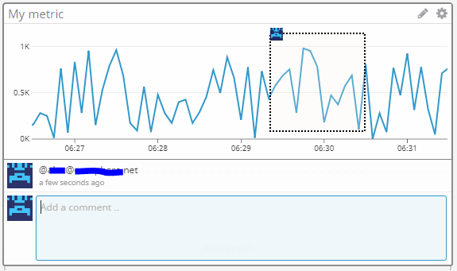

## Environtment

Setup environment on CentOS 7 VirtualBox.  Base image downloaded from [OSBoxes](https://www.osboxes.org/centos/#centos-7-1804-vbox).  Installed Datadog agent per Agent Setup instructions.

# Collecting Metrics
#### Add tags in the Agent config file and show us a screenshot of your host and its tags on the Host Map page in Datadog.
* Edited the file `/etc/datadog-agent/datadog.yaml`, adding the lines below:
```
tags:
  - recruting
  - env:sandbox
  - os:linux
```

#### Install a database on your machine (MongoDB, MySQL, or PostgreSQL) and then install the respective Datadog integration for that database.
* Downloaded and installed MySQL.
```
wget https://dev.mysql.com/get/mysql80-community-release-el7-1.noarch.rpm
sudo rpm -ivh mysql80-community-release-el7-1.noarch.rpm
sudo yum install mysql-server
sudo systemctl start mysqld
sudo grep 'temporary password' /var/log/mysqld.log
sudo mysql_secure_installation
```

* Prepared MySQL for Datadog.
```
mysql -u root -p
    CREATE USER 'datadog'@'localhost' IDENTIFIED WITH mysql_native_password by 'Datadog@19';
     GRANT REPLICATION CLIENT ON *.* TO 'datadog'@'localhost';
     GRANT PROCESS ON *.* TO 'datadog'@'localhost';
     ALTER USER 'datadog'@'localhost' WITH MAX_USER_CONNECTIONS 5;
     GRANT SELECT ON performance_schema.* TO 'datadog'@'localhost';
```
* Created `/etc/datadog-agent/conf.d/mysql.d/conf.yaml`.
```
init_config:

instances:
  - server: 127.0.0.1
    user: datadog
    pass: 'Datadog@19'
    port: 3306
    options:
        replication: 0
        galera_cluster: 1
        extra_status_metrics: true
        extra_innodb_metrics: true
        extra_performance_metrics: true
        schema_size_metrics: false
        disable_innodb_metrics: false
```
* Restarted agent.
```
sudo systemctl restart datadog-agent
```
* Verified the agent status.
```
sudo datadog-agent status mysql
```
* Installed MySQL integration and vizualize MySQL Dashboard.


#### Create a custom Agent check that submits a metric named my_metric with a random value between 0 and 1000.
* Create `/etc/datadog-agent/checks.d/random_check.py`
```
from datadog_checks.checks import AgentCheck
import random

__version__ = "1.0.0"

class RandomCheck(AgentCheck):
    def check(self, instance):
        self.gauge('my_metric', random.randint(1,1000))
```
* Create `/etc/datadog-agent/conf.d/random_check.yaml`.
```
instances: [{}]
```
#### Change your check's collection interval so that it only submits the metric once every 45 seconds.
* Update `/etc/datadog-agent/conf.d/random_check.yaml`.
```
init_config:

instances:
  - min_collection_interval: 45
```
#### Bonus Question -  Can you change the collection interval without modifying the Python check file you created?
Yes, the collection interval is changed modifing   `/etc/datadog-agent/conf.d/random_check.yaml`.

## Visualizing Data
#### Utilize the Datadog API to create a Timeboard
* Created application key at *Integrations -> APIs*.  Created the Timeboard using [timeboard.json](timeboard.json).

```
api_key=e460cf68f7b1dadeb42f5b9437ab96f0
app_key=64b9bbb4ea2103025b2d228d7cd67901a6ca9772

curl  -X POST -H "Content-type: application/json" -d @timeframe.json "https://api.datadoghq.com/api/v1/dash?api_key=${api_key}&application_key=${app_key}"
```


#### Bonus Question - What is the Anomaly graph displaying?


The grey band represents values not farther than 2 (third parameter of the anomalies function) deviations from the predicted value.

## Monitoring Data
* Create the monitor.  The monitor export can be found [here](monitor.json).


Although I used {{host.ip}} as a placeholder for the host IP in the message, I could not get it to work.

#### Bonus Question


## Collecting APM Data

Provide a link and a screenshot of a Dashboard with both APM and Infrastructure Metrics.  Please include your fully instrumented app in your submission, as well.

[Dashboard link](https://p.datadoghq.com/sb/b4bf04fba-afbd7bd697609f5805e72fccd1e2f419)

[Instrumented Python code](app.py)


#### Bonus Question - What is the difference between a Service and a Resource?
Service is a collection of processes that work together to provide a capability. Resource is a service query.  Using our Python application as an example, Service name is "python-app" and resources are the URLs we queried e.g. /api/trace and /api/apm.

## Final Question:
Datadog has been used in a lot of creative ways in the past. We’ve written some blog posts about using Datadog to monitor the NYC Subway System, Pokemon Go, and even office restroom availability!

Is there anything creative you would use Datadog for?

* Monitor my hot tub chemical levels so I can easily know what is needed.
* Monitor my home current energy consumption in real time.
* Monitor my car fuel and fluid levels.
* Monitoring data centre room temperatures we should be able to leverage CPU usage and external temperature to detect decreased efficiency of AC.  Such decreases in efficiency could be easily mitigated with preventive maintenance.
* Monitoring facilities temperature and providing.
