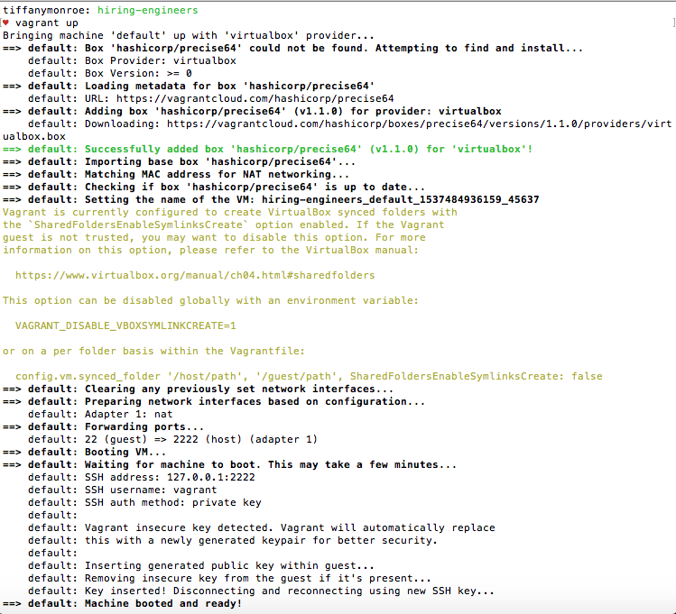

## Tiffany Monroe
Solutions Engineer Applicant

## Prerequisites - Setting up the environment

Used MacBook Pro OS High Sierra 10.13.4

### Github Setup

Forked Datadog Hiring Engineers Repository (https://github.com/DataDog/hiring-engineers/)

Cloned on local computer: ```git clone https://github.com/tiffanymonroe/hiring-engineers.git```

Changed directories: ```cd hiring-engineers```

Created new branch to work on: ```git checkout -b Tiffany_Monroe_Solutions_Engineer_Revised```

Used Atom to edit text in answers.md.

Checked Github:
```
git add .
git commit -m "new branch"
git push origin Tiffany_Monroe_Solutions_Engineer_Revised
```

Github worked.

### Vagrant Setup

Used instructions from
Downloaded [VirtualBox 5.2.18](https://www.virtualbox.org/wiki/Downloads) platform packages for OS X.

Installation failed: "System software from Oracle America, Inc. was blocked from loading."

Went to System Preferences to "allow" software to load, installation successful.

Downloaded and installed [Vagrant 2.1.5](https://www.vagrantup.com/downloads.html) 64-bit for OS X.

```
vagrant init hashicorp/precise64
vagrant up
```




Reviewed instructions, added SSH: ```vagrant ssh```


### Datadog Setup

Went to Datadog [website](https://datadoghq.com/), signed up for a free trial, put "Datadog Recruiting Candidate" in "Company" field, skipped the "Tell us about your stack" option.

Installed the [Agent](https://app.datadoghq.com/signup/agent) for OS X by typing provided code in Command Line:
 ```
 DD_API_KEY=ecbbdce5a2bc9bb8dc9145af1e490e3a bash -c "$(curl -L https://raw.githubusercontent.com/DataDog/datadog-agent/master/cmd/agent/install_mac_os.sh)"
 ```


Checked that Agent reports metrics: ```datadog-agent status```


Finished setup on [GUI](https://app.datadoghq.com/help/quick_start#mac): "You have 1 host reporting data to Datadog"


## Collecting Metrics

### Tags

Read documentation on tags, including [getting started](https://docs.datadoghq.com/tagging/) with tags, [assigning](https://docs.datadoghq.com/tagging/) tags, and [using](https://docs.datadoghq.com/tagging/using_tags/) tags.

Found how to [assign tags](https://docs.datadoghq.com/tagging/assigning_tags/#assigning-tags-using-the-configuration-files) in the Agent config file.

Found how to [locate](https://app.datadoghq.com/account/settings#agent/mac) the Agent config file.

Changed directories to locate the Agent config file:

```
cd ../../opt/datadog-agent/etc/conf.d
```

Could not find ```datadog.yaml``` in directory. Went up a level to see which files were located there.

```
cd ..
ls
```

Found ```datadog.yaml``` located in ```etc``` directory.

Uncommented out "tags" section, assigned tags.


Host Map does not show tags.

Restarted Agent.

Tags listed in "Stream."


Went to "Open Web UI" in the Datadog Agent.

Located "Datadog Agent Manager" in "Settings."


Added an extra line between commented out line and "tags" to save.

Restarted Agent, checked Host Map, shows tags.


### PostgreSQL

Read documentation on [installing](https://www.postgresql.org/download/macosx/) PostgreSQL, and installing [Homebrew](https://brew.sh/) packages.

Installed Homebrew from Command Line:
```
/usr/bin/ruby -e "$(curl -fsSL https://raw.githubusercontent.com/Homebrew/install/master/install)"
```

Response:
>Installation successful!

Installed PostgreSQL using [Homebrew](https://formulae.brew.sh/formula/postgresql):

```
brew install postgresql
```

Response:
>Pouring postgresql-10.5.high_sierra.bottle.1.tar.gz
