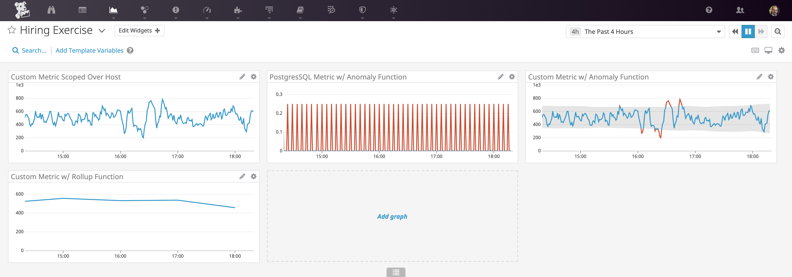
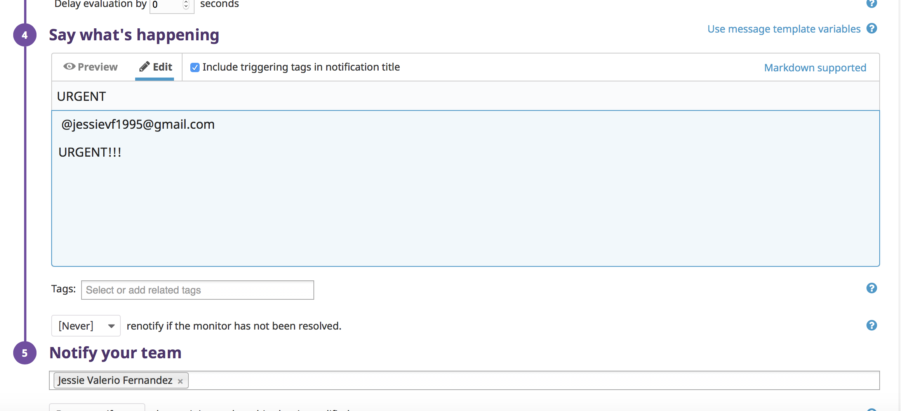
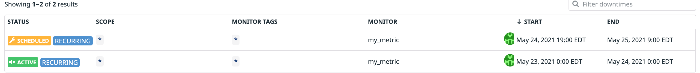
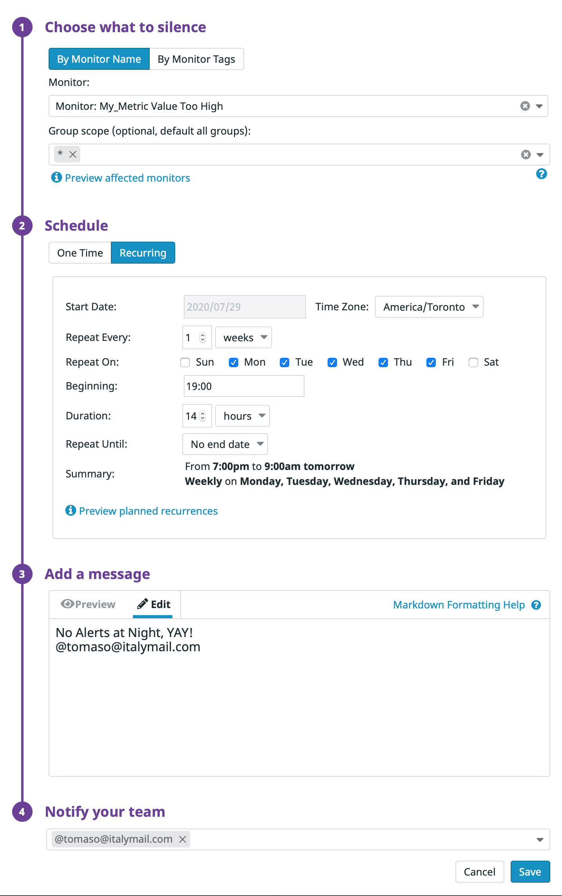

Your answers to the questions go here.

# Prerequisits
### You can utilize any OS/host that you would like to complete this exercise. However, we recommend one of the following approaches:

### You can spin up a fresh linux VM via Vagrant or other tools so that you don’t run into any OS or dependency issues. Here are instructions for setting up a Vagrant Ubuntu VM. We strongly recommend using minimum v. 16.04 to avoid dependency issues.
### You can utilize a Containerized approach with Docker for Linux and our dockerized Datadog Agent image.
### Then, sign up for Datadog (use “Datadog Recruiting Candidate” in the “Company” field), get the Agent reporting metrics from your local machine.


1. For this step, I decided to predominantly use my local machine as OSX is unix based. I may be able to excecute the same commands when installing certain dependencies.


# Collecting Metrics:

### Add tags in the Agent config file and show us a screenshot of your host and its tags on the Host Map page in Datadog.

1. In the image below, please go to the /opt/datadog-agent/etc/ directory and edit the datadog.yaml file to the image below. To add tags, all what is needed is the 'tags:' attribute followed by the tag values.

The syntax goes : 

tags: tag1, tag2

Tags are essentially a way you can filter certain data based on tag criterion. The are a way to indentify which nodes are needed to be analyzed.


2. Tags may also be added in the datadog user interface as well.


### Install a database on your machine (MongoDB, MySQL, or PostgreSQL) and then install the respective Datadog integration for that database.
1. For this step, you have to intall a database to gather, push, and query information. This database can also be analyzed using Datadog's APIs, which we will cover in later steps. I have installed the MySQL server into my local machine to analyze and push data into. To install the database, go to https://dev.mysql.com/downloads/ and install the MySQL community server.

2.  Once installed verify that it is installed in your local machine by checking the system preferences for a MySQL server icon


    Once you click preferences, click on the MySQL Server icon


    Click on the "Start MySQL server" button and you shall see the red radio lights turn green, signifying that it has started


3. The next step is to install the MySql intgration into your system. The integration is essentially an intiall setup to connect your databse with the datadog application. Once this initial setup is complete, we will track the performance of the database. 


Once you ran the mysql service, open the terminal.
In the terminal, execute the command below:

#### mysql -uroot -p

Once you have mysql running indicated by 'mysql>', run the quries below to install the inegration:

#### mysql> CREATE USER 'datadog'@'localhost' IDENTIFIED BY ‘h8R5BBH1MkDu?lv6xYqC1TEJ’;

#### mysql> GRANT REPLICATION CLIENT on *.* TO 'datadog'@'localhost' WITH MAX_USER CONNECTIONS 5;

Since we are using SQL SERVER 8, you may want to execute the following sql query below to get  full metrics catalog
#### mysql> ALTER USER 'datadog'@'localhost' WITH MAX_USER_CONNECTIONS 5; 

In the image below, you can also verify that your user has been created. You can also verify that your user has been granted additional privileges:


After verification, you want to configure your mysql.yaml file located in conf.d folder to connect the integration with Datadog.

### The image below is my setup and an example of how you want to setup Mysql to datadog. 


Located in the mysql.d directory is the conf.yaml for configuring your connection with datadog. This will allow data to be shown in your timeboard when you call the API, which we will go over later


### Create a custom Agent check that submits a metric named my_metric with a random value between 0 and 1000.

In your conf.d folder, please create a yaml file that contains the following content: 
```

			init_config:

			instances:
  				[{}]
```
This initializes the agent.

Now we are going to have the agent subit the metrics with a random value between 0 and 1000. Per python documentation, we added 'random.randint(0,1000)' to pass into the parameter. This submits a random number between 0 to 1000.
```
from checks import AgentCheck
import random
class HelloCheck(AgentCheck):
  def check(self, instance):
      self.gauge('my_metric2', random.randint(0,1000))
```

Restart datadog on your machine by using the bone icon located at the top of the screen


After restarting datadog, you should be able to see the graph located in the datadog ui using the 'Metrics Explorer'


### Change your check's collection interval so that it only submits the metric once every 45 seconds.
### Bonus Question Can you change the collection interval without modifying the Python check file you created?

In the conf.d folder where you created your .yaml file, configure that file so it onkly submites the metric once every 45 seconds. Below is an example:


# Utilize the Datadog API to create a Timeboard that contains:

### Your custom metric scoped over your host.
### Any metric from the Integration on your Database with the anomaly function applied.
### Your custom metric with the rollup function applied to sum up all the points for the past hour into one bucket
### Please be sure, when submitting your hiring challenge, to include the script that you've used to create this Timeboard.

1. First, you want to create a new python file in this directory: system/opt/datadog-agent/etc. You may name this file anything as long as we are going to call the script using the 'python' command.

2. In the python file, you first want to import the api and initialize it from datadog: 'from datadog import initialize, api'

3. An options variable is initialized with two arguments, an api key and and app key. This can be found in 'Integrations->API' tab in the datadog ui. To generate the app key, go under 'Application keys' and click on 'Create Application key' this will auto generate an application key for you to put in the 'options' variable in your python file. 

Below is where it can be found :


4. you want to initialize your options argument to have the api properly connected to datadog, so when you excecute it, data can be properly passed to the ui:

initialize(**options)


5. Set the title of the timeboard and the description of the timeboard.

6. The 'graphs' argument contains what information is redered onto your graphs when you use the API
  - The title of the graph is always required
  - The definition of each graph is also needed to pass in what data is being analyzed

Initialize a graph[] argument and define different graphs
  - The first graph captures the free memory from your system
  - The second graph caputures an anomoly of the average cpu time for your mysql database.
  - the third graph captures the sum of all the points using the rollup function

7. Call the api and create the Timeboard using the code below:
```
api.Timeboard.create(title=title,
                     description=description,
                     graphs=graphs,
                     template_variables=template_variables,
                     read_only=read_only)

```


Below is an example source code for the steps above. Also in this repo is a 'new.py' file to reference
```
from datadog import initialize, api

options = {
    'api_key': 'b4371073b027d86e3174258d84d52b8a',
    'app_key': '8a76ab889a96ef312cb024a9147b2e15500eb58d'
}

initialize(**options)

title = "My Timeboard"
description = "An informative timeboard."

graphs = [{
    "definition": {
        "events": [],
        "requests": [
            {"q": "avg:system.mem.free{*}"}
        ],
        "viz": "timeseries"
    },
    "title": "Average Memory Free"
    },{


    "definition": {
        "events": [],
        "requests": [
            {"q": "anomalies(avg:mysql.performance.cpu_time{*}, 'basic', 3)"}
        ],
        "viz": "timeseries"
    },
    "title": "SQL Anomaly"
    },{


    "definition": {
        "events": [],
        "requests": [
            {"q": "my_metric{host:precise64}.rollup(sum,3600)"}
        ],
        "viz": "timeseries"
    },
    "title": "my_metric2 SUM UP"


    },
]


template_variables = [{

    "name": "host1",
    "prefix": "host",
    "default": "host:my-host"
}]

read_only = True
print(api.Timeboard.create(title=title,
                     description=description,
                     graphs=graphs,
                     template_variables=template_variables,
                     read_only=read_only))


```

More information can be found in "https://docs.datadoghq.com/api/?lang=python#timeboards"


As a result, a timeboard has been made. Once you are able to successfully call the api, you can see the timeboard in the datadog UI as seen below:




### Set the Timeboard's timeframe to the past 5 minutes
### Take a snapshot of this graph and use the @ notation to send it to yourself.

To set the time frame to the past five minutes, I dragged the mouse cursor over the graph to only five minutes of the time from the present time.
I then used the photo camera icon to capture the snapshot and mention my self to 


Bonus Question: What is the Anomaly graph displaying?

The Anomaly graph is showing the performance of the mysql database.


# Monitoring Data

### Create a new Metric Monitor that watches the average of your custom metric (my_metric) and will alert if it’s above the following values over the past 5 minutes:

### Warning threshold of 500
### Alerting threshold of 800
### And also ensure that it will notify you if there is No Data for this query over the past 10m


Below is information on how to set up a metric monitor. A metric monitor essentially notifies the user if the data being analyzed has reached a threshold.
1. In the datadog ui, go to the path: Monitor->Manage monitors
2. In the Manage monitors section, please click on the 'New Monitor +' button located at the top right corner of the screen.
3. In the 'Define the metric' section, choose the metric you are monitoring and average it by the host.
4. You will then setup the trigger to the alert which will trigger, on average, above 10 minutes.
5. Warning threshold will be set to 500
6. Alerting threshold will be set to 800
7. After setting the threshold, you want to ensure that it will notify you if there is No Data for this query over the past 10m. Below are the image details on how to set this particular setting in the UI. 'Noitfy is data is missing for more than 10 minutes'

[](metric_monitor.png)


Essentially, datadog will notify you when there is a spike in data that is reached above the threshold you set.
The notification will be sent to your email


### Please configure the monitor’s message so that it will:

### Send you an email whenever the monitor triggers.

### Create different messages based on whether the monitor is in an Alert, Warning, or No Data state.

### Include the metric value that caused the monitor to trigger and host ip when the Monitor triggers an Alert state.

### When this monitor sends you an email notification, take a screenshot of the email that it sends you.

1. To confgure the message, go to section 4 of the setup, 'Say what's happening'.
2. In the section, put the header of the messagea and place the message below the header.
3. After the setup, press the 'Save' button in the bottom right corner of the page


Below is the email I received when the threshold has been reached


### Bonus Question: Since this monitor is going to alert pretty often, you don’t want to be alerted when you are out of the office. Set up two scheduled downtimes for this monitor:

### One that silences it from 7pm to 9am daily on M-F,
### And one that silences it all day on Sat-Sun.
### Make sure that your email is notified when you schedule the downtime and take a screenshot of that notification.
### Collecting APM Data:


1. For this configuration, go to the 'Manage Downtime' tab next to the 'Mangage Monitors'
2. Click on the 'Schedule Downtime' button.


3. In the first section, click on the 'By monitor name' radio button
4. Choose the metric to schedule for downtime
5. Go to the schedule section and scheule daily from 7pm-9am M-F as seen below:



6. You may set a message for the downtime



7. Please create a downtime for every Saturday and Sunday. For this confuguration, set it from 12 am Saturday and have it end 12 am Monday. which totals to 48 hours the whole weekend


8. After setting the downtime, you may also create a message for the downtime and notify your team members.
9. After you finished, please click the 'Save' button


### Given the following Flask app (or any Python/Ruby/Go app of your choice) instrument this using Datadog’s APM solution:

For this portion we are going to monitor the performance of a Python Flask application

2. Go to the system/opt/datadog-agent/etc directory and create a new python file.

3. In the Python file, we are now going to copy and paste the given test python application to the file.

Below is the configured code for the flask application

```
from flask import Flask
import logging
import sys

from ddtrace import tracer
from ddtrace.contrib.flask import TraceMiddleware

# Have flask use stdout as the logger
main_logger = logging.getLogger()
main_logger.setLevel(logging.DEBUG)
c = logging.StreamHandler(sys.stdout)
formatter = logging.Formatter('%(asctime)s - %(name)s - %(levelname)s - %(message)s')
c.setFormatter(formatter)
main_logger.addHandler(c)

app = Flask(__name__)
traced_app = TraceMiddleware(app, tracer, service="my-flask-app", distributed_tracing=False)

@app.route('/')
def api_entry():
    return 'Entrypoint to the Application'

@app.route('/api/apm')
def apm_endpoint():
    return 'Getting APM Started'

@app.route('/api/trace')
def trace_endpoint():
    return 'Posting Traces'


if __name__ == '__main__':
    app.run(host='0.0.0.0', port='5050')

```


4. We are now going to open terminal and 'cd' into the directory where we made our python flask application.
5. We now install necessary dependencies to the application so that it may run correctly. Commands are given below:

```
pip install flask
pip install ddtrace
```

6. We are now going to go back to our datadog.yaml file and scroll all the way to the bottom of the file.
This is where we configure our apm. We want to make sure that it is enabled so we set the 'enabled: ' argument to 'true'

Below is an example of how you want to setup the apm_config section of the file

```

apm_config:
#   Whether or not the APM Agent should run
  enabled: true
#   The environment tag that Traces should be tagged with
#   Will inherit from "env" tag if none is applied here
  env: none
#   The port that the Receiver should listen on
  receiver_port: 8126
#   Whether the Trace Agent should listen for non local traffic
#   Only enable if Traces are being sent to this Agent from another host/container
  apm_non_local_traffic: false
#   Extra global sample rate to apply on all the traces
#   This sample rate is combined to the sample rate from the sampler logic, still promoting interesting traces
#   From 1 (no extra rate) to 0 (don't sample at all)
  extra_sample_rate: 1.0
#   Maximum number of traces per second to sample.
#   The limit is applied over an average over a few minutes ; much bigger spikes are possible.
#   Set to 0 to disable the limit.
  max_traces_per_second: 10
#   A blacklist of regular expressions can be provided to disable certain traces based on their resource name
#   all entries must be surrounded by double quotes and separated by commas
#   Example: ["(GET|POST) /healthcheck", "GET /V1"]
#   ignore_resources: []

  analyzed_spans:
      my-flask-app|flask.request: 1


```

As show in the python code above, I decided to use the middleware instead of the ddtrace.

7. As we are in the 'etc' directory, we are now going to run the script for the flask app. Execute the following below:

```
pthyon2.7 <your_app_name>.py

in my case: 
python2.7 apm_app.py
```
We use python2.7 as the apm trace is supported by either only python version 2.7 or python 3 and up.

As you may have noticed the connection has been refused per the norification from the terminal as shown below:


To fix this, go to the directory opt/datadog-agent/embedded/bin and run double click on trace-agent executible:


After running the trace-agent, you may now run the python flask app located in the etc library. When you are able to successfully run the python file. You should be able to see the established connection and you can go to the port the application is rendering to.


Now that you have successfully ran your python file. Go to you browser and enter in the following URLs:

http://0.0.0.0:5050
http://0.0.0.0:5050/api/apm
http://0.0.0.0:5050/api/trace

When you go to each endpoint, datadog will now track the performance of each endpoint such as its latency of the endpoint as well as http code errors such as 404 or 200

After going to each url, below is the sumarry for each url


https://app.datadoghq.com/apm/service/my-flask-app/flask.request?paused=false&env=none&start=1538336432310&end=1538340032310


### Bonus Question: What is the difference between a Service and a Resource?

  - A service is a script that runs a specific part of an application depending on what the service is and where is is located. It acts more of a dependency for the application. It is needed for the application to run depeding on how the business is ran.
  - A resource acts more an add-on for the application.


### Is there anything creative you would use Datadog for?
  - Since datadog is an anyltics based application, it can be used to track SLA's within a company.


