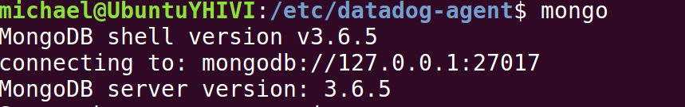
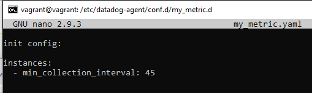
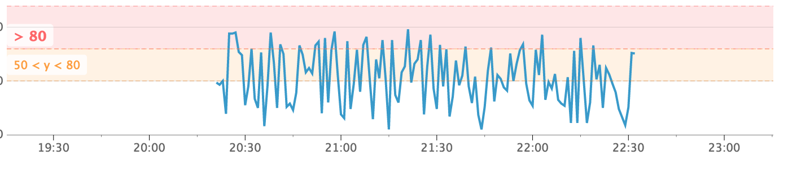
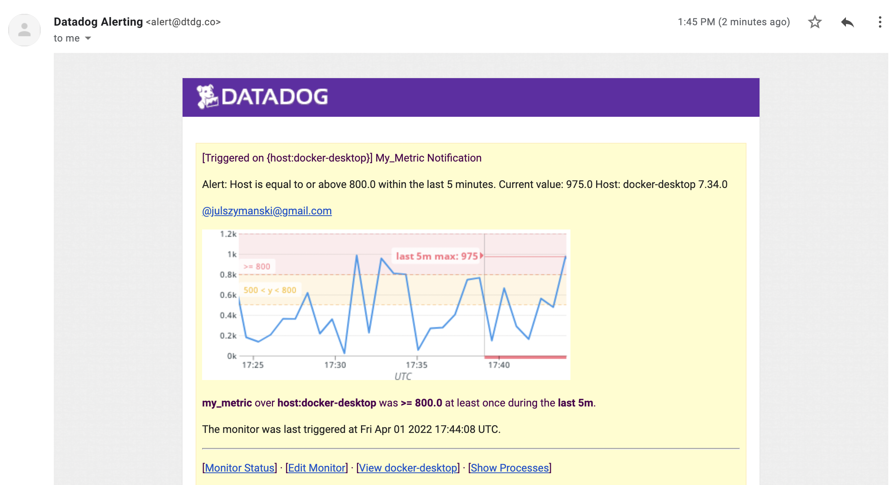
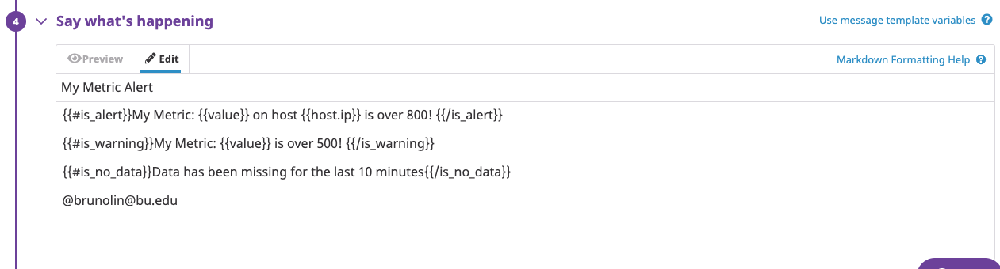

These are my answers for the solutions engineer hiring exercise at [Datadog](http://datadog.com). I made this explicitly more like a tutorial and you can see a bit of prose style on it. I hope you enjoy reading it.


## Questions

All the screenshots and code used to solve the questions are provided along with this repository.

## Prerequisites - Setup the environment

While I could set up another isolated environment, things usually works well directly on the Mac OS. Therefore this is my platform of choice to present this exercise.

## Collecting Metrics:

### Tags
Datadogs uses the tagging concept in many places. Tagging makes it easier to search something. It makes possible to identify hosts, applications, environments and anything you might find useful.

For example in the picture below, you see a subset of the `datadog.conf` file. In this picture you see a few tags which I used to identify this machine and the things which are related to it.
You can see my entire fire [here](./code/datadog.conf).


Below you can see a screenshot of my host and its tags on the Host Map page in Datadog.


### Integrations
To show other capabilities of Datadog related to integrations, I used my favorite non-SQL database, MongoDB. Below you can see my configuration file `mongo.yaml`. Or you can check the file [here](./code/mongo.yaml)



You can check if everything is fine by typing `/usr/local/bin/datadog-agent info -v`

You should see something like this as a result


This also means that your MongoDB integration is now able to collect metrics as picture below.


### Custom Agent Checks
Following that, I created a custom Agent check that submits a metric named `my_metric` with a random value between 0 and 100. I know the exercise suggested 1000, but I rather stay with small values if you don't mind.

To create a custom Agent check, you need to create two files. One is the called `my_metric.py` and the other one is called `my_metric.yaml`. Both needs to be named the same. Difference is only the extension. You can check the yaml file [here](./code/my_metric.yaml) and there python file [here](./code/my_metric.py).

Below is a screenshot from both files. You might notice that I also changed the check's collection interval so that it only submits the metric once every 45 seconds. That is different from the standard 20 seconds which is configured in the `datadog.conf` with the `collector_profile_interval: 20`. For more details about it, please check this part of the documentation: https://docs.datadoghq.com/guides/agent_checks/#configuration




* **Bonus Question**: Can you change the collection interval without modifying the Python check file you created?

We can change the collection interval without modifying the Python check file you created. You just need to do it on the yaml file. In this case, `my_metric.yaml`.

In case you are curious, this is how the dashboard looks like


## Visualizing Data:

### Datadog API
In this session, I used the Datadog API to create a Timeboard. This board contains three informations:

* My custom metric called `my_metric`
* My MongoDB `mongodb.opcounters.queryps` with the anomaly function applied.
* My custom metric `my_metric` with the rollup function applied to sum up all the points for the past 1 minute. I know you suggested 1h, but again I like to stay with smaller values.

I used Postman to send the API request as picture below.


Once this was created, the result looks like this in the UI:


### Datadog UI
Going further, I set the timeboard's timeframe to the past 5 minutes approximately and sent this information to my own email as per below screenshot


* **Bonus Question**: What is the Anomaly graph displaying?

As per Datadog documentation "Anomaly detection is an algorithmic feature that allows you to identify when a metric is behaving differently than it has in the past". In this case the total number of queries per second going throught MongoDB.

## Monitoring Data

### Metric Monitor
As expected, since I have already caught my test metric `my_metric` going above some limits, I decided to create alerts for some thresholds. This is done by creating a Monitor in Datadog.

This will alert if it’s above the following values over the past 5 minutes

* Warning threshold of 50
* Alerting threshold of 80
* And also ensure that it will notify you if there is no data for this query over the past 10m.

We also configured the monitor’s message, so that it will:

* Send myself an email whenever the monitor triggers.
* Create different messages based on whether the monitor is in an Alert, Warning, or no data state.
* Include the metric value that caused the monitor to trigger and host ip when the Monitor triggers an alert state.

Below you see a screenshot of the Monitor dashboard.



When this monitor triggers, it sends me an email notification which looks like this screenshot below.



In case you are curious on how the Monitor is configured, please take a look at the following two screenshots:




* **Bonus Question**: Since this monitor is going to alert pretty often, you don’t want to be alerted when you are out of the office. Set up two scheduled downtimes for this monitor:

It is very easy to create a scheduled downtime.


When you schedule the downtime, Datadog will send you an email to notify about it.


## Collecting APM Data:

It is sad to say that APM did not really work as expected.  So I have no beautiful screenshots for you. I tried to instrument this below code, among other codes too, but I failed to accomplish the task.

```
from flask import Flask
import logging
import sys
from ddtrace import tracer
from ddtrace.contrib.flask import TraceMiddleware

# Have flask use stdout as the logger
main_logger = logging.getLogger()
main_logger.setLevel(logging.DEBUG)
c = logging.StreamHandler(sys.stdout)
formatter = logging.Formatter('%(asctime)s - %(name)s - %(levelname)s - %(message)s')
c.setFormatter(formatter)
main_logger.addHandler(c)

app = Flask(__name__)

traced_app = TraceMiddleware(app, tracer, service="my-flask-app", distributed_tracing=False)

@app.route('/')
def api_entry():
    return 'Entrypoint to the Application!'

@app.route('/api/apm')
def apm_endpoint():
    return 'Getting APM Started'

@app.route('/api/trace')
def trace_endpoint():
    return 'Posting Traces'

if __name__ == '__main__':
    app.run()
```

I have followed the documentation and successfully installed python, ddtrace and flask, etc, but I kept on getting `ddtrace.writer - ERROR - cannot send services: [Errno 61] Connection refused`.


I tried to alternatively remove the middleware line `traced_app = TraceMiddleware(app, tracer, service="my-flask-app", distributed_tracing=False)` from the code and execute it without `ddtrace-run`, but it also did not work.


Everything else in my DataDog Agent seems to work fine. Only the APM is not working. It seems the APM is a different solution from the rest of the product. It would be nice to understand the architecture in the near future.

I had a good look at Google, but can't find anything related to `Errno 61` which helps me with this issue.

Finally, as my last option, I contacted your Support to try to troubleshoot together what is going on with the product and perhaps improve the documentation. Unfortunately, the support engineer was reluctant to help me based on the fact this is a hiring exercise. I felt a bit odd about it, but maybe it is how it is. :-)

Genuinely, I am curious how the reader will see this outcome.


* **Bonus Question**: What is the difference between a Service and a Resource?

Service is like a main process that does a particular thing. Examples of Services can be applications, databases or APIs.
Resources are  parts of the Service. Resources can be monitored more granularly. For example a function in an application, a query in a database, or a REST resource/verb in an API.


## Final Question:

### Is there anything creative you would use Datadog for?

** Datadog to answer how healthy is e-health**

All sectors of society are being digitized or have already been digitized - In the public sector area, both residents and companies expect digital services.

One of the interesting customer I have met along the way is called Inera. It is a Swedish organization which develops and manages the **national e-health service backbone**. It provides digitization on behalf of county councils, regions, municipalities, hospitals and private clinics. About 35 digital services are run by Inera today, including Care Guidance, National Patient Overview and Patient Journal. Some services are used by residents, others by healthcare professionals.

Inera is also responsible for the common infrastructure and IT architecture that underlies many of the services.

As you can imagine, the infrastructure needed to support all this digitalization is giant and complex. In the picture below(sorry it is in Swedish), you can see there are many parts in this infrastructure: Applications, middleware, queues, API's, databases, front-ends, back-ends, just to name a few.
Datadog, along with other tools, can provide many of the underlying technology necessary to monitor the health of the system.


