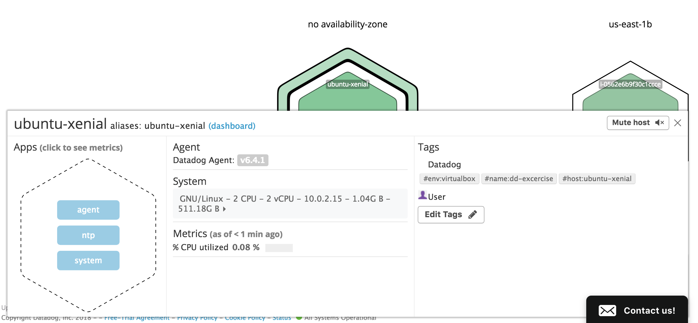
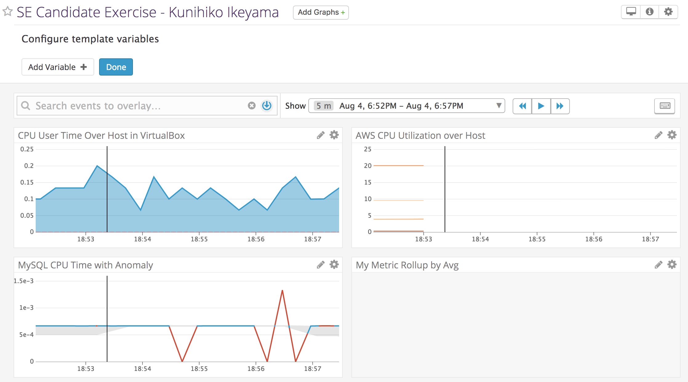
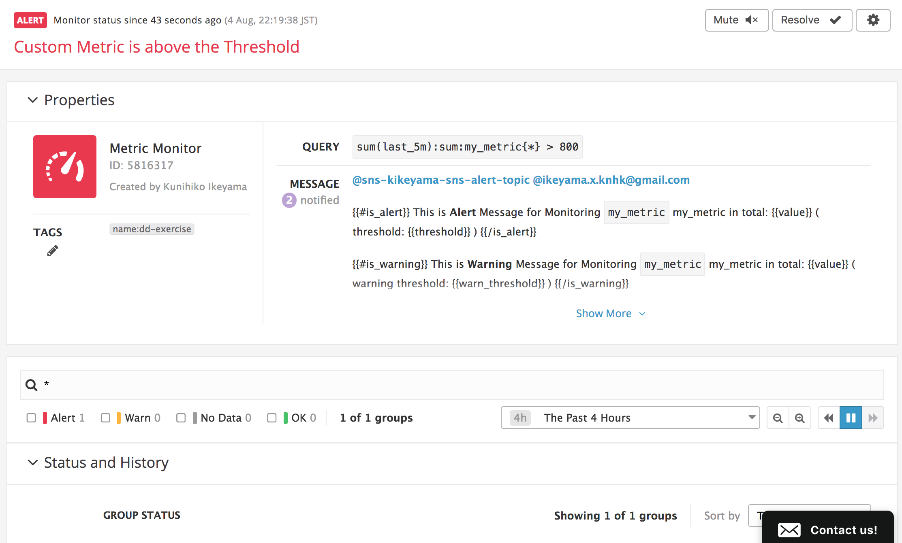

# Answers by Kunihiko Ikeyama

# Collecting Metrics:
## Add tags in the Agent config file and show us a screenshot of your host and its tags on the Host Map page in Datadog.

```yaml:/etc/datadog-agent/datadog.yaml
# Set the host's tags (optional)
tags:
  - env:virtualbox
  - name:dd-excercise
#   - mytag
#   - env:prod
#   - role:database
```

Screenshot: 



## Install a database on your machine (MongoDB, MySQL, or PostgreSQL) and then install the respective Datadog integration for that database.

Install MySQL
```bash
vagrant@ubuntu-xenial:~$ sudo apt install mysql-server mysql-client
Reading package lists... Done
Building dependency tree       
Reading state information... Done
The following additional packages will be installed:
  libaio1 libcgi-fast-perl libcgi-pm-perl libencode-locale-perl libevent-core-2.0-5 libfcgi-perl libhtml-parser-perl libhtml-tagset-perl libhtml-template-perl
  libhttp-date-perl libhttp-message-perl libio-html-perl liblwp-mediatypes-perl libtimedate-perl liburi-perl mysql-client-5.7 mysql-client-core-5.7 mysql-common
  mysql-server-5.7 mysql-server-core-5.7
Suggested packages:
  libdata-dump-perl libipc-sharedcache-perl libwww-perl mailx tinyca
The following NEW packages will be installed:
  libaio1 libcgi-fast-perl libcgi-pm-perl libencode-locale-perl libevent-core-2.0-5 libfcgi-perl libhtml-parser-perl libhtml-tagset-perl libhtml-template-perl
  libhttp-date-perl libhttp-message-perl libio-html-perl liblwp-mediatypes-perl libtimedate-perl liburi-perl mysql-client mysql-client-5.7 mysql-client-core-5.7
  mysql-common mysql-server mysql-server-5.7 mysql-server-core-5.7
0 upgraded, 22 newly installed, 0 to remove and 2 not upgraded.
Need to get 19.4 MB of archives.
After this operation, 163 MB of additional disk space will be used.
Do you want to continue? [Y/n] y
Get:1 http://archive.ubuntu.com/ubuntu xenial-updates/main amd64 mysql-common all 5.7.23-0ubuntu0.16.04.1 [15.4 kB]
Get:2 http://archive.ubuntu.com/ubuntu xenial/main amd64 libaio1 amd64 0.3.110-2 [6356 B]
Get:3 http://archive.ubuntu.com/ubuntu xenial-updates/main amd64 mysql-client-core-5.7 amd64 5.7.23-0ubuntu0.16.04.1 [6675 kB]
Get:4 http://archive.ubuntu.com/ubuntu xenial-updates/main amd64 mysql-client-5.7 amd64 5.7.23-0ubuntu0.16.04.1 [1662 kB]                                               
Get:5 http://archive.ubuntu.com/ubuntu xenial-updates/main amd64 mysql-server-core-5.7 amd64 5.7.23-0ubuntu0.16.04.1 [7765 kB]                                          
Get:6 http://archive.ubuntu.com/ubuntu xenial-updates/main amd64 libevent-core-2.0-5 amd64 2.0.21-stable-2ubuntu0.16.04.1 [70.6 kB]                                     
Get:7 http://archive.ubuntu.com/ubuntu xenial-updates/main amd64 mysql-server-5.7 amd64 5.7.23-0ubuntu0.16.04.1 [2597 kB]                                               
Get:8 http://archive.ubuntu.com/ubuntu xenial/main amd64 libhtml-tagset-perl all 3.20-2 [13.5 kB]                                                                       
Get:9 http://archive.ubuntu.com/ubuntu xenial/main amd64 liburi-perl all 1.71-1 [76.9 kB]                                                                               
Get:10 http://archive.ubuntu.com/ubuntu xenial/main amd64 libhtml-parser-perl amd64 3.72-1 [86.1 kB]                                                                    
Get:11 http://archive.ubuntu.com/ubuntu xenial/main amd64 libcgi-pm-perl all 4.26-1 [185 kB]                                                                            
Get:12 http://archive.ubuntu.com/ubuntu xenial/main amd64 libfcgi-perl amd64 0.77-1build1 [32.3 kB]                                                                     
Get:13 http://archive.ubuntu.com/ubuntu xenial/main amd64 libcgi-fast-perl all 1:2.10-1 [10.2 kB]                                                                       
Get:14 http://archive.ubuntu.com/ubuntu xenial/main amd64 libencode-locale-perl all 1.05-1 [12.3 kB]                                                                    
Get:15 http://archive.ubuntu.com/ubuntu xenial/main amd64 libhtml-template-perl all 2.95-2 [60.4 kB]                                                                    
Get:16 http://archive.ubuntu.com/ubuntu xenial/main amd64 libtimedate-perl all 2.3000-2 [37.5 kB]                                                                       
Get:17 http://archive.ubuntu.com/ubuntu xenial/main amd64 libhttp-date-perl all 6.02-1 [10.4 kB]                                                                        
Get:18 http://archive.ubuntu.com/ubuntu xenial/main amd64 libio-html-perl all 1.001-1 [14.9 kB]                                                                         
Get:19 http://archive.ubuntu.com/ubuntu xenial/main amd64 liblwp-mediatypes-perl all 6.02-1 [21.7 kB]                                                                   
Get:20 http://archive.ubuntu.com/ubuntu xenial/main amd64 libhttp-message-perl all 6.11-1 [74.3 kB]                                                                     
Get:21 http://archive.ubuntu.com/ubuntu xenial-updates/main amd64 mysql-client all 5.7.23-0ubuntu0.16.04.1 [10.0 kB]                                                    
Get:22 http://archive.ubuntu.com/ubuntu xenial-updates/main amd64 mysql-server all 5.7.23-0ubuntu0.16.04.1 [10.8 kB]                                                    
Fetched 19.4 MB in 31s (610 kB/s)                                                                                                                                       
perl: warning: Setting locale failed.
perl: warning: Please check that your locale settings:
	LANGUAGE = (unset),
	LC_ALL = (unset),
	LC_CTYPE = "UTF-8",
	LANG = "en_US.UTF-8"
    are supported and installed on your system.
perl: warning: Falling back to a fallback locale ("en_US.UTF-8").
locale: Cannot set LC_CTYPE to default locale: No such file or directory
locale: Cannot set LC_ALL to default locale: No such file or directory
Preconfiguring packages ...
/usr/bin/locale: Cannot set LC_CTYPE to default locale: No such file or directory
/usr/bin/locale: Cannot set LC_ALL to default locale: No such file or directory
Selecting previously unselected package mysql-common.
(Reading database ... 65178 files and directories currently installed.)
Preparing to unpack .../mysql-common_5.7.23-0ubuntu0.16.04.1_all.deb ...
Unpacking mysql-common (5.7.23-0ubuntu0.16.04.1) ...
Selecting previously unselected package libaio1:amd64.
Preparing to unpack .../libaio1_0.3.110-2_amd64.deb ...
Unpacking libaio1:amd64 (0.3.110-2) ...
Selecting previously unselected package mysql-client-core-5.7.
Preparing to unpack .../mysql-client-core-5.7_5.7.23-0ubuntu0.16.04.1_amd64.deb ...
Unpacking mysql-client-core-5.7 (5.7.23-0ubuntu0.16.04.1) ...
Selecting previously unselected package mysql-client-5.7.
Preparing to unpack .../mysql-client-5.7_5.7.23-0ubuntu0.16.04.1_amd64.deb ...
Unpacking mysql-client-5.7 (5.7.23-0ubuntu0.16.04.1) ...
Selecting previously unselected package mysql-server-core-5.7.
Preparing to unpack .../mysql-server-core-5.7_5.7.23-0ubuntu0.16.04.1_amd64.deb ...
Unpacking mysql-server-core-5.7 (5.7.23-0ubuntu0.16.04.1) ...
Selecting previously unselected package libevent-core-2.0-5:amd64.
Preparing to unpack .../libevent-core-2.0-5_2.0.21-stable-2ubuntu0.16.04.1_amd64.deb ...
Unpacking libevent-core-2.0-5:amd64 (2.0.21-stable-2ubuntu0.16.04.1) ...
Processing triggers for libc-bin (2.23-0ubuntu10) ...
Processing triggers for man-db (2.7.5-1) ...
Setting up mysql-common (5.7.23-0ubuntu0.16.04.1) ...
update-alternatives: using /etc/mysql/my.cnf.fallback to provide /etc/mysql/my.cnf (my.cnf) in auto mode
Selecting previously unselected package mysql-server-5.7.
(Reading database ... 65346 files and directories currently installed.)
Preparing to unpack .../mysql-server-5.7_5.7.23-0ubuntu0.16.04.1_amd64.deb ...
locale: Cannot set LC_CTYPE to default locale: No such file or directory
locale: Cannot set LC_ALL to default locale: No such file or directory
Unpacking mysql-server-5.7 (5.7.23-0ubuntu0.16.04.1) ...
Selecting previously unselected package libhtml-tagset-perl.
Preparing to unpack .../libhtml-tagset-perl_3.20-2_all.deb ...
Unpacking libhtml-tagset-perl (3.20-2) ...
Selecting previously unselected package liburi-perl.
Preparing to unpack .../liburi-perl_1.71-1_all.deb ...
Unpacking liburi-perl (1.71-1) ...
Selecting previously unselected package libhtml-parser-perl.
Preparing to unpack .../libhtml-parser-perl_3.72-1_amd64.deb ...
Unpacking libhtml-parser-perl (3.72-1) ...
Selecting previously unselected package libcgi-pm-perl.
Preparing to unpack .../libcgi-pm-perl_4.26-1_all.deb ...
Unpacking libcgi-pm-perl (4.26-1) ...
Selecting previously unselected package libfcgi-perl.
Preparing to unpack .../libfcgi-perl_0.77-1build1_amd64.deb ...
Unpacking libfcgi-perl (0.77-1build1) ...
Selecting previously unselected package libcgi-fast-perl.
Preparing to unpack .../libcgi-fast-perl_1%3a2.10-1_all.deb ...
Unpacking libcgi-fast-perl (1:2.10-1) ...
Selecting previously unselected package libencode-locale-perl.
Preparing to unpack .../libencode-locale-perl_1.05-1_all.deb ...
Unpacking libencode-locale-perl (1.05-1) ...
Selecting previously unselected package libhtml-template-perl.
Preparing to unpack .../libhtml-template-perl_2.95-2_all.deb ...
Unpacking libhtml-template-perl (2.95-2) ...
Selecting previously unselected package libtimedate-perl.
Preparing to unpack .../libtimedate-perl_2.3000-2_all.deb ...
Unpacking libtimedate-perl (2.3000-2) ...
Selecting previously unselected package libhttp-date-perl.
Preparing to unpack .../libhttp-date-perl_6.02-1_all.deb ...
Unpacking libhttp-date-perl (6.02-1) ...
Selecting previously unselected package libio-html-perl.
Preparing to unpack .../libio-html-perl_1.001-1_all.deb ...
Unpacking libio-html-perl (1.001-1) ...
Selecting previously unselected package liblwp-mediatypes-perl.
Preparing to unpack .../liblwp-mediatypes-perl_6.02-1_all.deb ...
Unpacking liblwp-mediatypes-perl (6.02-1) ...
Selecting previously unselected package libhttp-message-perl.
Preparing to unpack .../libhttp-message-perl_6.11-1_all.deb ...
Unpacking libhttp-message-perl (6.11-1) ...
Selecting previously unselected package mysql-client.
Preparing to unpack .../mysql-client_5.7.23-0ubuntu0.16.04.1_all.deb ...
Unpacking mysql-client (5.7.23-0ubuntu0.16.04.1) ...
Selecting previously unselected package mysql-server.
Preparing to unpack .../mysql-server_5.7.23-0ubuntu0.16.04.1_all.deb ...
Unpacking mysql-server (5.7.23-0ubuntu0.16.04.1) ...
Processing triggers for man-db (2.7.5-1) ...
Processing triggers for ureadahead (0.100.0-19) ...
Processing triggers for systemd (229-4ubuntu21.4) ...
Setting up libaio1:amd64 (0.3.110-2) ...
Setting up mysql-client-core-5.7 (5.7.23-0ubuntu0.16.04.1) ...
Setting up mysql-client-5.7 (5.7.23-0ubuntu0.16.04.1) ...
Setting up mysql-server-core-5.7 (5.7.23-0ubuntu0.16.04.1) ...
Setting up libevent-core-2.0-5:amd64 (2.0.21-stable-2ubuntu0.16.04.1) ...
Setting up mysql-server-5.7 (5.7.23-0ubuntu0.16.04.1) ...
locale: Cannot set LC_CTYPE to default locale: No such file or directory
locale: Cannot set LC_ALL to default locale: No such file or directory
update-alternatives: using /etc/mysql/mysql.cnf to provide /etc/mysql/my.cnf (my.cnf) in auto mode
Renaming removed key_buffer and myisam-recover options (if present)
Setting up libhtml-tagset-perl (3.20-2) ...
Setting up liburi-perl (1.71-1) ...
Setting up libhtml-parser-perl (3.72-1) ...
Setting up libcgi-pm-perl (4.26-1) ...
Setting up libfcgi-perl (0.77-1build1) ...
Setting up libcgi-fast-perl (1:2.10-1) ...
Setting up libencode-locale-perl (1.05-1) ...
Setting up libhtml-template-perl (2.95-2) ...
Setting up libtimedate-perl (2.3000-2) ...
Setting up libhttp-date-perl (6.02-1) ...
Setting up libio-html-perl (1.001-1) ...
Setting up liblwp-mediatypes-perl (6.02-1) ...
Setting up libhttp-message-perl (6.11-1) ...
Setting up mysql-client (5.7.23-0ubuntu0.16.04.1) ...
Setting up mysql-server (5.7.23-0ubuntu0.16.04.1) ...
Processing triggers for libc-bin (2.23-0ubuntu10) ...
Processing triggers for systemd (229-4ubuntu21.4) ...
Processing triggers for ureadahead (0.100.0-19) ...
vagrant@ubuntu-xenial:~$ 
```

Setup MySQL user for Datadog
```bash
vagrant@ubuntu-xenial:/etc/datadog-agent$ sudo mysql -e "CREATE USER 'datadog'@'localhost' IDENTIFIED BY 'password';" -u root -p 
Enter password: 
vagrant@ubuntu-xenial:/etc/datadog-agent$ sudo mysql -e "GRANT REPLICATION CLIENT ON *.* TO 'datadog'@'localhost' WITH MAX_USER_CONNECTIONS 5;"
ERROR 1045 (28000): Access denied for user 'root'@'localhost' (using password: NO)
vagrant@ubuntu-xenial:/etc/datadog-agent$ sudo mysql -e "GRANT REPLICATION CLIENT ON *.* TO 'datadog'@'localhost' WITH MAX_USER_CONNECTIONS 5;" -u root -p
Enter password: 
vagrant@ubuntu-xenial:/etc/datadog-agent$ 
vagrant@ubuntu-xenial:/etc/datadog-agent$ sudo mysql -e "GRANT PROCESS ON *.* TO 'datadog'@'localhost';" -u root -p
Enter password: 
vagrant@ubuntu-xenial:/etc/datadog-agent$ sudo mysql -e "GRANT SELECT ON performance_schema.* TO 'datadog'@'localhost';" -u root -p
Enter password: 
```

```yaml:/etc/datadog-agent/conf.d/mysql.yaml
init_config:

instances:
  - server: localhost
    user: datadog
    pass: password
    tags:
        - env:virtualbox
        - name:dd-excercise
        - service:mysql
    options:
        replication: 0
        galera_cluster: 1
```

Screenshot: 


## Create a custom Agent check that submits a metric named my_metric with a random value between 0 and 1000.

```python:/etc/datadog-agent/checks.d/my_metric.py
from checks import AgentCheck
import random

class MyMetric(AgentCheck):
  def check(self, instance):
    self.gauge('my_metric', random.randint(0,100))
    self.log.info('my_metric')
```

```yaml:/etc/datadog-agent/conf.d/my_metric.yaml
init_config:

instances:
    [{}]
```

Screenshot: 


## Change your check's collection interval so that it only submits the metric once every 45 seconds.

```yaml:/etc/datadog-agent/conf.d/my_metric.yaml
init_config:
    min_collection_interval: 45

instances:
    [{}]
```


## Bonus Question Can you change the collection interval without modifying the Python check file you created?
Yes. Interval can be updated by modifying my_metric.yaml under conf.d directory.


# Visualizing Data:
## Utilize the Datadog API to create a Timeboard that contains: 

Screenshot: 


### Your custom metric scoped over your host.

```json
{
  "requests": [
    {
      "q": "avg:my_metric{host:ubuntu-xenial}",
      "type": "line",
      "style": {
        "palette": "dog_classic",
        "type": "solid",
        "width": "normal"
      },
      "conditional_formats": []
    }
  ],
  "viz": "timeseries",
  "autoscale": true
}
```

Screenshot: 


### Any metric from the Integration on your Database with the anomaly function applied.

```json
{
  "viz": "timeseries",
  "status": "done",
  "requests": [
    {
      "q": "anomalies(avg:mysql.performance.cpu_time{env:virtualbox}, 'basic', 2)",
      "type": "line",
      "style": {
        "palette": "dog_classic",
        "type": "solid",
        "width": "normal"
      },
      "conditional_formats": [],
      "aggregator": "avg"
    }
  ],
  "autoscale": true
}
```

Screenshot: 


### Your custom metric with the rollup function applied to sum up all the points for the past hour into one bucket

```json
{
  "viz": "query_value",
  "status": "done",
  "requests": [
    {
      "q": "avg:my_metric{*} by {env}.rollup(avg, 3600)",
      "type": "area",
      "style": {
        "palette": "dog_classic",
        "type": "solid",
        "width": "normal"
      },
      "conditional_formats": [],
      "aggregator": "avg"
    }
  ],
  "autoscale": true
}
```

Screenshot: 


## Once this is created, access the Dashboard from your Dashboard List in the UI:
### Set the Timeboard's timeframe to the past 5 minutes
Screenshot: 


### Take a snapshot of this graph and use the @ notation to send it to yourself.
Screenshot: 


### Bonus Question: What is the Anomaly graph displaying?
Outliers that is out of expected values.


# Monitoring Data

Screenshot of settings: 


Screenshot of email: 


Screenshot of Triggered Alert: 


Screenshot of Event: 


## Bonus Question: Since this monitor is going to alert pretty often, you don’t want to be alerted when you are out of the office. Set up two scheduled downtimes for this monitor:
### One that silences it from 7pm to 9am daily on M-F,
Screenshot: 


### And one that silences it all day on Sat-Sun.
Screenshot: 


# Collecting APM Data:

## Provide a link and a screenshot of a Dashboard with both APM and Infrastructure Metrics.

Link: https://app.datadoghq.com/screen/402603/se-candidate-exercise---kunihiko-ikeyama-infra--apm
Screenshot: 


## Please include your fully instrumented app in your submission, as well.

```python:flask_dd_trace.py
from flask import Flask
import logging
import sys
import blinker as _

from ddtrace import tracer
from ddtrace.contrib.flask import TraceMiddleware

with tracer.trace("web.request", service="kikeyama_service") as span:
  span.set_tag("source", "flask_apm")

# Have flask use stdout as the logger
main_logger = logging.getLogger()
main_logger.setLevel(logging.DEBUG)
c = logging.StreamHandler(sys.stdout)
formatter = logging.Formatter('%(asctime)s - %(name)s - %(levelname)s - %(message)s')
c.setFormatter(formatter)
main_logger.addHandler(c)

app = Flask(__name__)
traced_app = TraceMiddleware(app, tracer, service="kikeyama_service", distributed_tracing=False)
#traced_app = TraceMiddleware(app, tracer, service='kikeyama_service')

@app.route('/')
def api_entry():
    return 'Entrypoint to the Application'

@app.route('/api/apm')
def apm_endpoint():
    return 'Getting APM Started'

@app.route('/api/trace')
def trace_endpoint():
    return 'Posting Traces'

if __name__ == '__main__':
    app.run(host='0.0.0.0', port='5050')
```

```bash
vagrant@ubuntu-xenial:~$ python flask_dd_trace.py 
2018-08-05 15:54:51,699 - ddtrace.contrib.flask.middleware - DEBUG - flask: initializing trace middleware
 * Serving Flask app "flask_dd_trace" (lazy loading)
 * Environment: production
   WARNING: Do not use the development server in a production environment.
   Use a production WSGI server instead.
 * Debug mode: off
2018-08-05 15:54:51,701 - werkzeug - INFO -  * Running on http://0.0.0.0:5050/ (Press CTRL+C to quit)
2018-08-05 15:54:52,702 - ddtrace.api - DEBUG - reported 1 traces in 0.00133s
2018-08-05 15:54:52,703 - ddtrace.api - DEBUG - reported 1 services
2018-08-05 15:54:56,285 - werkzeug - INFO - 10.0.2.2 - - [05/Aug/2018 15:54:56] "GET /api/trace HTTP/1.1" 200 -
2018-08-05 15:54:56,378 - werkzeug - INFO - 10.0.2.2 - - [05/Aug/2018 15:54:56] "GET /favicon.ico HTTP/1.1" 404 -
2018-08-05 15:54:56,707 - ddtrace.api - DEBUG - reported 2 traces in 0.00132s
2018-08-05 15:55:01,508 - werkzeug - INFO - 10.0.2.2 - - [05/Aug/2018 15:55:01] "GET /api/apm HTTP/1.1" 200 -
2018-08-05 15:55:01,716 - ddtrace.api - DEBUG - reported 1 traces in 0.00085s
2018-08-05 15:55:07,687 - werkzeug - INFO - 10.0.2.2 - - [05/Aug/2018 15:55:07] "GET / HTTP/1.1" 200 -
2018-08-05 15:55:07,721 - ddtrace.api - DEBUG - reported 1 traces in 0.00090s
```

## Bonus Question: What is the difference between a Service and a Resource?

Service: unit of applications
Resource: functions in web framework

# Final Question:
## Datadog has been used in a lot of creative ways in the past. We’ve written some blog posts about using Datadog to monitor the NYC Subway System, Pokemon Go, and even office restroom availability! Is there anything creative you would use Datadog for?

Visualizing earchquakes. My home country Japan has a lot of earthquakes from small to big one every day. Sometimes causes huge disaster. Visualizing real-time earthquake and tweets on Twitter would social benefit. Who needs help? What is short of stock (water, food, etc)? It'll improve volunteer quality and make victims happy.
