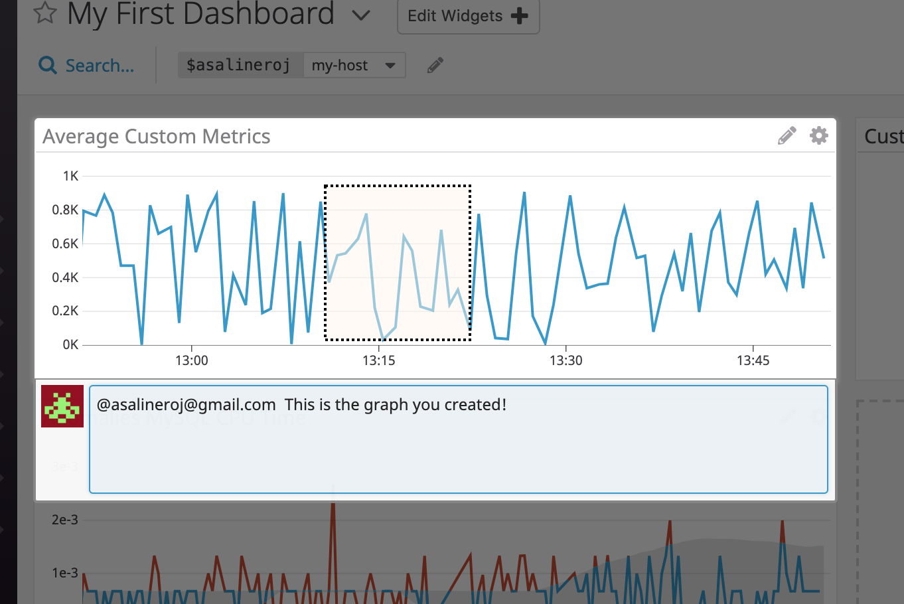

## Questions

Please provide screenshots and code snippets for all steps.

# Prerequisites - Setup the environment

 - Spin up a fresh linux VM via Vagrant and Virtual Box
 


## Collecting Metrics:

* Add tags in the Agent config file and show us a screenshot of your host and its tags on the Host Map page in Datadog.

First of all I have added the tags following the documentation: https://docs.datadoghq.com/tagging/assigning_tags/?tab=python


I then access the Host Map through the Side Navigation Menu:


Host Map


Host Configuration


* Install a database on your machine (MongoDB, MySQL, or PostgreSQL) and then install the respective Datadog integration for that database.


Following the instructions for the MySql Integration
https://docs.datadoghq.com/integrations/mysql/


* Create a custom Agent check that submits a metric named my_metric with a random value between 0 and 1000.
Following the custom agent documentation for developers which can be found at: https://docs.datadoghq.com/developers/write_agent_check/?tab=agentv6


Script for the custom agent check: [Agent Check](my_metric.py)

Verifying The check is running:


* Change your check's collection interval so that it only submits the metric once every 45 seconds.

Set at the configuration level to satisfy the Bonus Question.

* **Bonus Question** Can you change the collection interval without modifying the Python check file you created?


The default value is 15, it can be changed in the configuration file ([Agent Check Conf](my_metric.yaml)) but we have to bear in mind that the collector will try to run the check every 45 seconds but the check might need to wait in line, depending on how many integrations are enabled on the same Agent. 


## Visualizing Data:

Utilize the Datadog API to create a Timeboard that contains:

* Your custom metric scoped over your host.
* Any metric from the Integration on your Database with the anomaly function applied.
* Your custom metric with the rollup function applied to sum up all the points for the past hour into one bucket


Using the New Dashboard Endpoint with the layout_type argument set as ordered to create a dashboard that resembles the previous timeboard.
[Create Timeboard Script](create_timeboard.py)
Dashboard created through the Script:


* Set the Timeboard's timeframe to the past 5 minutes
* Take a snapshot of this graph and use the @ notation to send it to yourself.


Snapshot graph and notification reception



* **Bonus Question**: What is the Anomaly graph displaying?


Reference: https://docs.datadoghq.com/monitors/monitor_types/anomaly/

Anomaly detection is an algorithmic feature that allows you to identify when a metric is behaving differently than it has in the past. In this specific case it is showing anomalies regarding the percentage of CPU time spent in user space by MySQL.


## Monitoring Data

Create a new Metric Monitor that watches the average of your custom metric (my_metric) and will alert if it’s above the following values over the past 5 minutes:

* Warning threshold of 500
* Alerting threshold of 800
* And also ensure that it will notify you if there is No Data for this query over the past 10m.
* Send you an email whenever the monitor triggers.
* Create different messages based on whether the monitor is in an Alert, Warning, or No Data state.
* Include the metric value that caused the monitor to trigger and host ip when the Monitor triggers an Alert state.
* When this monitor sends you an email notification, take a screenshot of the email that it sends you.


Reference:https://docs.datadoghq.com/monitors/monitor_types/metric/

I create a Metric monitor in the Monitors section. and then configure the Monitor accordingly:
	1. Detection Method: Threshold Alert
	2. Defined metric: my_metric
	3. Alert Conditions (Already defaulted to trigger when metric is above the threshold during the last 5 minutes):
		3.a. Alert threshold: 800
		3.b. Warning threshold: 500
		3.c. Select Nofity if data is missing for more than 10 minutes.


Message to be sent:
```	
	my_metric threshold

	{{#is_alert}}
	ALERT on Host {{host.name}} with IP: {{host.ip}} 
	my_metric value is: {{value}} above the acceptable 800 threshold
	{{/is_alert}}


	{{#is_warning}}
	WARNING
	my_metric value is: {{value}} above the acceptable 500 threshold
	{{/is_warning}}

	{{#is_no_data}}
	No Data on my_metric in the last 10 minutes
	{{/is_no_data}} @asalineroj@gmail.com
```

* No Data Notification


* Warning Notification


* Alert Notification


* **Bonus Question**: Since this monitor is going to alert pretty often, you don’t want to be alerted when you are out of the office. Set up two scheduled downtimes for this monitor:

  * One that silences it from 7pm to 9am daily on M-F,
  * And one that silences it all day on Sat-Sun.
  * Make sure that your email is notified when you schedule the downtime and take a screenshot of that notification.

Reference for Managing Downtime: https://docs.datadoghq.com/monitors/downtimes/

Following the downtime documentation for monitors and the intuitive GUI I configure a downtime for 7pm-9am from Monday to Friday and another downtime for all day Saturday and Sunday. 

Please bear in mind the downtime times were set on Europe/Dublin Timezone which is different to UTC
Monday to Friday Downtime:


Weekend Downtime:


## Collecting APM Data:

Given the following Flask app (or any Python/Ruby/Go app of your choice) instrument this using Datadog’s APM solution:

```python
from flask import Flask
import logging
import sys

# Have flask use stdout as the logger
main_logger = logging.getLogger()
main_logger.setLevel(logging.DEBUG)
c = logging.StreamHandler(sys.stdout)
formatter = logging.Formatter('%(asctime)s - %(name)s - %(levelname)s - %(message)s')
c.setFormatter(formatter)
main_logger.addHandler(c)

app = Flask(__name__)

@app.route('/')
def api_entry():
    return 'Entrypoint to the Application'

@app.route('/api/apm')
def apm_endpoint():
    return 'Getting APM Started'

@app.route('/api/trace')
def trace_endpoint():
    return 'Posting Traces'

if __name__ == '__main__':
    app.run(host='0.0.0.0', port='5050')
```

* **Note**: Using both ddtrace-run and manually inserting the Middleware has been known to cause issues. Please only use one or the other.

* **Bonus Question**: What is the difference between a Service and a Resource?

Provide a link and a screenshot of a Dashboard with both APM and Infrastructure Metrics.

Please include your fully instrumented app in your submission, as well.

## Final Question:

Datadog has been used in a lot of creative ways in the past. We’ve written some blog posts about using Datadog to monitor the NYC Subway System, Pokemon Go, and even office restroom availability!

Is there anything creative you would use Datadog for?

## Instructions

If you have a question, create an issue in this repository.

To submit your answers:

* Fork this repo.
* Answer the questions in answers.md
* Commit as much code as you need to support your answers.
* Submit a pull request.
* Don't forget to include links to your dashboard(s), even better links and screenshots. We recommend that you include your screenshots inline with your answers.

## References

### How to get started with Datadog

* [Datadog overview](https://docs.datadoghq.com/)
* [Guide to graphing in Datadog](https://docs.datadoghq.com/graphing/)
* [Guide to monitoring in Datadog](https://docs.datadoghq.com/monitors/)

### The Datadog Agent and Metrics

* [Guide to the Agent](https://docs.datadoghq.com/agent/)
* [Datadog Docker-image repo](https://hub.docker.com/r/datadog/docker-dd-agent/)
* [Writing an Agent check](https://docs.datadoghq.com/developers/write_agent_check/)
* [Datadog API](https://docs.datadoghq.com/api/)

### APM

* [Datadog Tracing Docs](https://docs.datadoghq.com/tracing)
* [Flask Introduction](http://flask.pocoo.org/docs/0.12/quickstart/)

### Vagrant

* [Setting Up Vagrant](https://www.vagrantup.com/intro/getting-started/)

### Other questions:

* [Datadog Help Center](https://help.datadoghq.com/hc/en-us)
