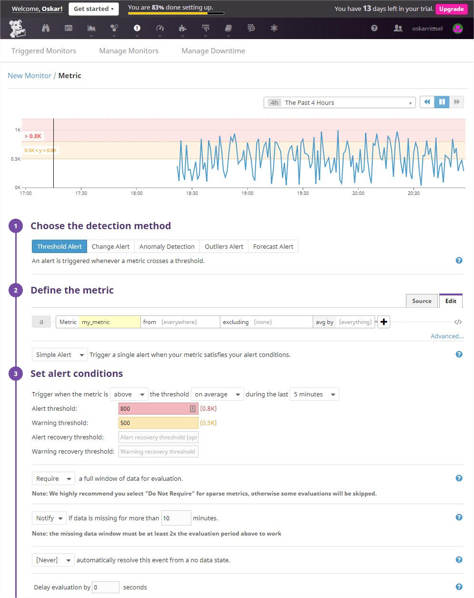

- [Introduction](#introduction)
- [Prerequisites](#prerequisites)
- [Collecting Metrics](#collecting-metrics)
    - [Adding custom tags](#adding-custom-tags)
    - [Integrations](#integrations)
    - [Custom Agent Checks](#custom-agent-checks)
- [Visualizing Data](#visualizing-data)
- [Monitoring Data](#monitoring-data)
- [Collecting APM Data](#collecting-apm-data)
- [Final Question](#final-question)


 # Introduction
 
 This document aims to provide you with a contextual overview that will help you ask questions of the data collected for your infrastructure and applications, utilizing two (out of the three) pillars of observability that Datadogs solution provides you with.

At the end of this exercise, you will be able to gain granular insight into your environment, from your infrastructure to your applications performance metrics. In combination with Datadogs machine learning capabilities, you will be able to spot trends, anomalies and predict what is happening in your environment, which will help you to reduce the MTTR (mean time to repair).

You're also able to ingest your logs to Datadog which gives you even further observability for your infrastructure and applications and help you reduce time to recovery during troubleshooting. Logs won't be covered in this document though, if you're interested in learning more, you can read about it [here](https://www.datadoghq.com/log-management/).
 
 This document will not cover the installation of OS or application(s) being monitored, Ubuntu 18.04 & MySQL.
 
 This is intended to be the submission for the Datadog Solutions Engineer Exercise.


 # Prerequisites

 ## Create your Datadog account

 Visit [Datadog](https://app.datadoghq.com/signup) to register a trial account with Datadog, a trial account is valid for 14 days and gives you unlimited access to all the functionality offered by Datadog


 ## Installation of Datadog agent
 
 Installing the Datadog agent is a breeze, all you need is a one-liner to be executed from the terminal. You can find these instructions [here](https://app.datadoghq.com/account/settings#agent/ubuntu).
```bash
DD_API_KEY=<YOUR-DD-API-KEY> bash -c "$(curl -L https://raw.githubusercontent.com/DataDog/datadog-agent/master/cmd/agent/install_script.sh)"
```

You can find your API key [here](https://app.datadoghq.com/account/settings#api)
 

 # Collecting Metrics


 ## Adding custom tags


Within the configuration file of datadog-agent you can add additional tags. With the help of tags you can quickly filter and correlate between your metrics, traces and logs.

```bash
vi /etc/datadog-agent/datadog.yaml
```

Add what additional tags you want in a similar way.
Notice that you can use `<KEY>:<VALUE>` which is the preferred way, but not required.

```yaml
tags:
  - oskars_hiring_exercise
  - env:test
  - role:technical_exercise
```

Thanks to tags you're able to ask questions of your monitored hosts in the hostmap using the *tags*, this gives you and easy and powerful way to filter out your infrastructure. In the example below you will see the hostmap group all monitored hosts by the tag named "`availability-zone`".

Notice that you're able to add tags through this page as well, "Edit tags".


 ## Integrations
Datadog comes with 250+ integrations that are vendor supported, in this exercise we will be using the MySQL integration which can be enabled [here](https://app.datadoghq.com/account/settings#integrations/mysql).

Next you need to prepare the MySQL server with a dedicated monitoring user and grant the proper permissions.

Create a datadog user and grant the replication permission.
```bash
mysql -e "CREATE USER 'datadog'@'localhost' IDENTIFIED BY 'PASSWORD';"
mysql -e "GRANT REPLICATION CLIENT ON *.* TO 'datadog'@'localhost' WITH MAX_USER_CONNECTIONS 5;
```
If you want to be able to retrieve all performance metrics from MySQL, grant the following permissions as well:

```bash
mysql -e "GRANT PROCESS ON *.* TO 'datadog'@'localhost';"
mysql -e "GRANT SELECT ON performance_schema.* TO 'datadog'@'localhost';"
```

You can verify that everything is correct with following commands.

```bash
mysql -u datadog --password='PASSWORD' -e "show status" | \
grep Uptime && echo -e "\033[0;32mMySQL user - OK\033[0m" || \
echo -e "\033[0;31mCannot connect to MySQL\033[0m"

mysql -u datadog --password='PASSWORD' -e "show slave status" && \
echo -e "\033[0;32mMySQL grant - OK\033[0m" || \
echo -e "\033[0;31mMissing REPLICATION CLIENT grant\033[0m"
```

The same goes for extended performance metrics.

```bash
mysql -u datadog --password='PASSWORD' -e "SELECT * FROM performance_schema.threads" && \
echo -e "\033[0;32mMySQL SELECT grant - OK\033[0m" || \
echo -e "\033[0;31mMissing SELECT grant\033[0m"

mysql -u datadog --password='PASSWORD' -e "SELECT * FROM INFORMATION_SCHEMA.PROCESSLIST" && \
echo -e "\033[0;32mMySQL PROCESS grant - OK\033[0m" || \
echo -e "\033[0;31mMissing PROCESS grant\033[0m"
```

The next step is to enable the MySQL integration on the datadog-agent, to start ingesting the metrics provided by the integration.

```bash
vi /etc/datadog-agent/conf.d/mysql.d/conf.yaml
```

```yaml
init_config:

instances:
  - server: localhost
    user: datadog
    pass: PASSWORD
    tags:
        - optional_tag1
        - optional_tag2
    options:
      replication: 0
      galera_cluster: 1
```

Restart the datadog-agent to load the new configuration file and then verify that the check is loaded and working properly.

```bash
systemctl restart datadog-agent
sudo -u dd-agent -- datadog-agent check mysql
```

In the list of the dashboards [here](https://app.datadoghq.com/dashboard/lists/preset/3), you will find an out of the box dashboard for MySQL named *MySQL - Overview* that will help you gain granular insight to your MySQL metrics.


 ## Custom Agent Checks

With Datadog you're not bound to only being able to utilize what integrations Datadog provide, you can create your own integrations and custom checks. This gives you great flexibility to monitor anything of interest that you might have.

Here you will see an example of a custom check which will submit a metric named my_metric every 45 seconds instead of the default 15 seconds.

**Note:** I suggest you name your custom checks with the prefix `custom_` to help differentiate any custom integration from the ones already delivered with datadog-agent.

Start off with the configuration file for your custom check.

```bash
vi /etc/datadog-agent/conf.d/custom_my_metric.yaml
```
```yaml
init_config:

instances:
  - min_collection_interval: 45
```

Next you need to create the check itself.
It's required to name the check file with the same name as the configuration file except the file extension (.yaml/.py)

```
vi /etc/datadog-agent/checks.d/custom_my_metric.py
```
```python
# Import random for random number generation
import random

# the following try/except block will make the custom check compatible with any Agent version
try:
    # first, try to import the base class from old versions of the Agent...
    from checks import AgentCheck
except ImportError:
    # ...if the above failed, the check is running in Agent version 6 or later
    from datadog_checks.checks import AgentCheck

    # content of the special variable __version__ will be shown in the Agent status page
    __version__ = "1.0.0"

# Generate a random number between 0 and 1000
class MyMetric(AgentCheck):
    def check(self, instance):
        self.gauge('my_metric', random.randint(0, 1000))
```

When this is done, restart the datadog-agent and then verify that your check is running.

```bash
systemctl restart datadog-agent
sudo -u dd-agent -- datadog-agent check custom_my_metric
```
 
 ## Bonus Question
 **Can you change the collection interval without modifying the Python check file you created?**

I believe this bonus question perhaps should be rephrased.
It's normally not within the python file you specify the collection interval, but in the yaml configuration file. 

For datadog-agent v6 you add `min_collection_interval` at an instance level individually for each instance.
 
 # Visualizing Data

 

 ### Creating a Dashboard using the API
 The file `scripts/create_timeboard.py` can be executed with `python scripts/create_timeboard.py`, this will create a dashboard named **Dashboard example for exercise** which contains a graph that includes the following metrics:
 
* my_metric from host:i-0034421f8056d59b6
* my_metric with rollup sum of 3600 seconds
* mysql.performance.cpu_time with anomalies function using 2 bounds

This would look like the following:


### Take a snapshot

When viewing a dashboard you can use the keyboard shortcuts `alt + [` or `alt + ]` to zoom out or in of time frames. We will use `alt + ]` to zoom in to a 5 minute time frame for your snapshot.

If you click within the graph or the little camera icon above the graph you can add an annotation and send it to a team member.


The annotation and snapshot can be found in the Events section as well as in the team members inbox.


## Bonus Question

**What is the Anomaly graph displaying?**

This provides you with observability of abnormal metric trends. By analyzing the metric's historical behaviour, Datadog is able to show you the normal trend of your metric's fluctuation. The grey band displays the normal fluctuation and anything that sticks out in red is an anomaly to this. This gives you a powerful way to detect and react on abnormal behaviour of metric's which is basically impossible to set threshold alerts on to detect.

In the graph below you're able to see normal behaviour (grey band) of *my_metric* and the anomalies detected which are flagged, in red.


 # Monitoring Data
 
 It's not only the dashboards we can utilize to see trends and detect potential problems in our environment. 
 
 Here's where monitoring comes to play, to reduce the mean time to repair (MTTR), by notifying you as soon as something is not playing nice.

 ### Create a new metric monitor

Let's create a new metric monitor by using the menu **"Monitors -> New Monitor"** and select *Metric*

Start off by selecting the *my_metric* under *Define the metric*

Next set the alert threshold to 800 and warning threshold to 500.

If you're not receiving any data for 10 minutes you want to get notified as well, so changing *Do not notify* if data is missing to *Notify* you'll get 10 minutes as the default value.

Verify that your settings are the same as the screenshot below.



Let's define what to say if an alert is triggered. 
Here you're able to utilize message template variables to add additional information to the notification message with a simple `{{variable}}`.

You're also able to do simple if-else statements.

`{{#variable}} This text will show {{/var}}` only if the `variable` is true.

`{{^var}} This text will show {{/var}}` only if `variable` is NOT true.

If you want deeper knowledge about message template variables I recommend you to read about it in the [Datadog Docs](https://https://docs.datadoghq.com/monitors/notifications/?tab=is_alertis_warning#message-template-variables)

With the use of these variables and if-else statements there's great flexibility in what to send, when to send it, and to whom.
Differentiate how to send and handle a notification based on if it's in warning, alert or in recovery.

For example you could use the following message:

Title:
`Alert message regarding my_check on {{host.name}}`

Body:
```
Dear my_metric owner,

{{#is_alert}}
Oh no!

my_metric has gone passed your alert threshold ({{threshold}}).
my_metric is now {{value}} on {{host.name}} - {{host.ip}}
{{/is_alert}}

{{#is_warning}}
Better watch out.

my_metric has gone passed your warning threshold ({{threshold}}).
my_metric is now {{value}} on {{host.name}} - {{host.ip}}
{{/is_warning}}

{{#is_no_data}}
Something's probably wrong here.

No data was received from my_metric on {{host.name}} - {{host.ip}} for the past 10 minutes!
{{/is_no_data}}

{{#is_recovery}}
You can relax, my_metric has recovered, and is now at {{value}}.
{{/is_recovery}}

@oskarrittsel@gmail.com

```


When you receive these alerts in your email, this is what you can expect.


## Bonus Question

Configure schedule downtimes for this monitor.

* One that silences it from 7pm to 9am daily on M-F,
* And one that silences it all day on Sat-Sun.
* Make sure that your email is notified when you schedule the downtime and take a screenshot of that notification.

Under **"Monitors -> Manage Downtime"** you're able to schedule downtime for when you don't want to be notified regarding the monitor alert you just configured.


Adding a message will give you an email like this:


 # Collecting APM Data

Let's begin with APM, so you'll get observability over traces from your applications, allowing you to search and analyze traces, drill down to a specific trace or line of code.


These instructions will use the ddtrace method to retrieve the traces, so first you need to install this through pip.

```bash
apt install python3-pip
pip3 install ddtrace
```

This example will utilize the following Flask app so let's create a python file called flask_app.py and add the content to it.

```bash
vi flask_app.py
```
```python
from flask import Flask
import logging
import sys

# Have flask use stdout as the logger
main_logger = logging.getLogger()
main_logger.setLevel(logging.DEBUG)
c = logging.StreamHandler(sys.stdout)
formatter = logging.Formatter('%(asctime)s - %(name)s - %(levelname)s - %(message)s')
c.setFormatter(formatter)
main_logger.addHandler(c)

app = Flask(__name__)

@app.route('/')
def api_entry():
    return 'Entrypoint to the Application'

@app.route('/api/apm')
def apm_endpoint():
    return 'Getting APM Started'

@app.route('/api/trace')
def trace_endpoint():
    return 'Posting Traces'

if __name__ == '__main__':
    app.run(host='0.0.0.0', port=5050)
```

Let's run the new flask_app.py with ddtrace-run in the background so you can send some requests to the different endpoints and generate some data.

```bash
ddtrace-run python3 scripts/flask_app.py &
```

We can now view the traces within the flask service in **"APM -> Services"** and select the *flask* service, just like the screenshot below.


If you click on one of the resources you're able to drill down to the traces for the specific resource you choose. Here you can get a detailed flame graph and span list to view the details of the specific trace and being able to correlate with the infrastructure metrics and logs within the same view like the image shows you below.


We are also able to create a dashboard and bring in the APM traces together with metrics from the infrastructure just like the image below.


## Bonus Question

**What is the difference between a Service and a Resource?**

A service is a group of processes that are doing the same kind of job. For example a webapp and it's database it relies on, are two different services.

A resource is a specific entry point to a service, such as a SQL query or a API endpoint such as the `/api/config` for a web application.

 # Final Question

*Datadog has been used in a lot of creative ways in the past. We’ve written some blog posts about using Datadog to monitor the NYC Subway System, Pokemon Go, and even office restroom availability!*

**Is there anything creative you would use Datadog for?**

I would send my sleep statistics and metrics to Datadog so I'm able to visualize and predict my sleep behaviour with metrics, such as body movement, snoring, hours of sleep and the time I wake up.

This would give me the benefits to observe anomalies in my sleep pattern over time, keep annotations on how I feel when I wake up to help me improve my sleep.

I would also utilize the webhook features to play a tune or vibrate the bed to stop me from snoring, to turn on the coffee percolator and parking heater in my car when the alarm goes off so I can optimize the morning routine. This would lead to reduced time to get ready and improve my comfort during my morning routine to get me in the most optimal state, as quickly as possible, for great productivity for the rest of the day.