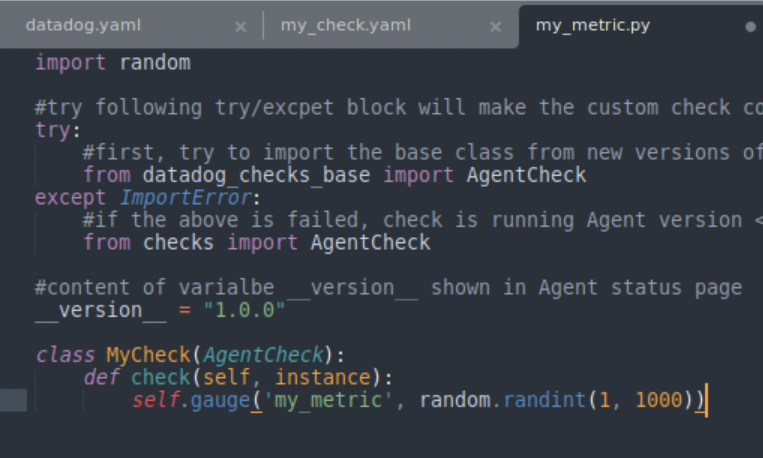

## Answers
Links to relevant dashboards at the bottom of this readme. [here](links-to-dashboards).

## Environment
For the host machine, I used *Oracle VM VirtualBox* software to spin up an instance of Ubuntu 16.04. I edited configuration files, agent properties, and other host related settings through the VM terminal, though having the actual operating system graphical interface was useful to configure other properties. Below is a screenshot of the configured host machine with the datadog agent running on it. Remember, the command to check the status of the datadog agent is `sudo service datadog-agent status`:


## Collecting Metrics:
To begin collecting metrics with the agent to send to our DataDog client, let's edit the agent config file, which is located on the host machine at: */etc/datadog-agent/datadog.yaml*. We Want to add the api key for our account, which you can get from the DataDog HQ through your browser. Once we add the api key, we can add tags for our host as well in the same file. Here is a snippet of the config file with these parameters:
```yaml
...
api_key = <YOUR_API_KEY>
...

# Set the host's tags (optional)
tags:
   - region:westcoast
   - env:test
   - hiremelol
```

Now that we have the agent configured, and sending data to DataDog, we can check out the host in the *Host Map* (see link at bottom) page in DataDog. Here is a screen shot of my host machine in the Host Map page:


On to the next questions... Now we want to install MySQL on the host and then install the respective Datadog integration in the browser app. This pair of steps may take some time. I ran into some trouble setting up this step where I didn't give my VM enough space to install the sql server packages. If you run into space issues with your VM (and are currently using Windows software like me), just give your VM more space by following the instructions [here](https://www.howtogeek.com/124622/how-to-enlarge-a-virtual-machines-disk-in-virtualbox-or-vmware/).

Once you have your mySQL server installed on the host, you want to set up a "datadog" user in the host SQL server and create the password. This will be the user that sends mySQL metrics to the agent running on the host.

Now, we want create/edit the file to specify configuration properties for mysql integration with the datadog agent. Edit (or create) the file on the host at: */etc/datadog-agent/conf.d/mysql.d/conf.yaml*.
```yaml
init_config:

instances:
  - server: localhost
    user: datadog
    pass: <PASSWORD_HERE>
    tags:
	- optional_tag1
	- optional_tag2
    options:
	replication: 0
	galera_cluster: 1
```
	
	* graphs of sql metrics on the dashboard: 
	
Also, my mySQL instance was on `localhost` server, but remember to remove this and replace with the mySQL server of the instance you desire.

To create a custom Agent check that submits a metric named my_metric with a random value between 0 and 1000, we will follow instruction on the [*Writing an Agent check*](https://docs.datadoghq.com/developers/agent_checks/) tutorial. I left the file names the same since it is just a test metric anyways. As per the tutorial, we first create *hello.yaml* and *hello.py* files in the *./config.d/* and *./check.d/* directories, respectively.
*hello.yaml*
``` yaml
init_config:

instances:
    [{}]
```
*hello.py*
```python
from checks import AgentCheck
import random


class HelloCheck(AgentCheck):
    def check(self, instance):
	self.gauge('my_metric', random.randint(0,1001))
```

Screenshot of my metric on Data Dog


An important note to remember is that the *.yaml* and *.py* files must have the same name for the agent check to run. Once we have properly configured the checks, we can see the status of the datadog agent service again with `sudo service datadog-agent` and see that the "hello" (or whatever you name your files) test runs properly.

To change the check's collection interval to every 45sec (in v6), I added the *min_collection_interval* instance parameter in the check config file (*/config.d/hello.yaml*), and set it to 45. It will skip 2 checks and gauge the metric once every 3rd check.
updated *hello.yaml* file
``` yaml
init_config:

instances:
    - min_collections_interval: 45
```

**Bonus Question** Can you change the collection interval without modifying the Python check file you created?
The above method does not modify the python file.


## Visualizing Data
Utilize the Datadog API to create a Timeboard that contains:

* Your custom metric scoped over your host.
* Any metric from the Integration on your Database with the anomaly function applied.
* Your custom metric with the rollup function applied to sum up all the points for the past hour into one bucket

 Python script used to create this dashboard is below. Check out the comments in the `graphs` list to see the datadog queries we use to create the graphs with the above specifications.
  ```python
  from datadog import initialize, api
 import json

 d = None
 with open('./keys.json') as json_data:
     d = json.load(json_data)

 API_KEY = d["api_key"]
 APP_KEY = d["app_key"]

 options = {
     'api_key': API_KEY,
     'app_key': APP_KEY
 }

 initialize(**options)

 title = "Visualizing Data Timeboard"
 description = "DataDog challenge second question on visualizing data."
 graphs = [{
     "definition": {
         "events": [],
         "requests": [
             {"q":"avg:my_metric{host:utsav-VirtualBox}"} # custom metric scoped over host
         ],
         "viz": "timeseries"
     },
     "title": "My Metric"
 },

 {
     "definition": {
         "events": [],
         "requests": [
             {"q": "anomalies(avg:mysql.performance.cpu_time{host:utsav-VirtualBox}, 'basic', 1)"} # metric from the Integration on your Database with the anomaly function applied
         ],
         "viz": "timeseries"
     },
     "title": "SQL Performance Metric"
 },

 {
     "definition": {
         "events": [],
         "requests": [
             {"q":"avg:my_metric{host:utsav-VirtualBox}.rollup(avg, 3600)"} # custom metric with the rollup function applied to sum up all the points for the past hour into one bucket
         ],
         "viz": "timeseries"
     },
     "title": "My Metric (Rollup - 1hr)"
 }
 ]

 template_variables = [{
     "name": "host1",
     "prefix": "host",
     "default": "host:my-host"
 }]

 read_only = True
 response = api.Timeboard.create(title=title,
                      description=description,
                      graphs=graphs,
                      template_variables=template_variables,
                      read_only=read_only)

 print(response)
  ```
Screenshot of Visualizing Data Timeboard (link at bottom):

  
**Bonus**: The anomaly function uses an algorithm to identify when a metric is behaving differently than it has in the past, taking into account relevant trends. The graph displays the actual metric value over time and overlays what the expected metric value range is in light gray.
 

## Monitoring Data

Create a new Metric Monitor that watches the average of your custom metric (my_metric) and will alert if it’s above certain values over the past 5 minutes. To do this we go to DataDog HQ in the browser and create a new monitor and follow the on screen steps to alert for certain values. In order to print certain segments conditionally based on whether we have a warning, alert, or no-data response we take advantage of the variables `is_alert, is_no_data, is_warning`. And add monitor message text where messages like '{{#var}} This text will show {{/var}}' only if the variable "var" is true. That way we can only show certain messages when they are relevant to the alert type.

In case my explanation here is vague, just check out the [*Monitors*](https://docs.datadoghq.com/monitors/) documenation for more detailed instructions and in depth information.

Screenshot of Monitor Details:

	
Screenshot of Monitor Alert Email:


Screenshot of Monitor Scheduled Downtime Email:


## Collecting APM Data

To begin collecting APM data for the flask app in the instructions, we will install the DataDog middleware to the flask app. I'm using python, and we need to add some important python packages before we begin, so let's start with that.

Run a python instance. Maybe use a `virtualenv` if you are so inclined (in my case, I just installed the packages directly on the host machine's python library). Make sure you have `pip` installed, if you don't know what that is, check out [this page](https://pypi.org/project/pip/).

With pip installed and a python shell open, let's install the `blinker` and `ddtrace` python libraries to our host:
First,
```sh
>>> pip install blinker 
```
Then,
```sh
>>> pip install ddtrace 
```

Now we have the neccesary libraries installed to begin tracing our application!

To begin instrumenting the application, we need to edit the code for the app to include the following python libraries:
```python
from flask import Flask
import blinker as _

from ddtrace import tracer
from ddtrace.contrib.flask import TraceMiddleware
```

Once we create the `app` variable that initializes a flask application instance, we want to insert code to create the traced app with the middleware call:
```python
app = Flask(__name__)
traced_app = TraceMiddleware(app, tracer, service="my-flask-app", distributed_tracing=False)
```

And that's it to get the most basic information about our dummy flask application sending to our datadog agent! We can collect more in-depth data by utilizing more functions available to us with the datadog libary. To go more in depth on this, checkout the info and links provided in the datdog docs [here](https://docs.datadoghq.com/tracing/setup/python/).

Screenshot of dashboard with flask tracing:


Screenshot of dashboard with host infrastructure data:


**Bonus Question:** A Service is a "set of processes that work together to provide a feature". In this case the simple flask web app is the only one service. A Resource is a particular query to a service. So in this case, queries to the different endpoints are resources that belong to the web app service.

## Final Question
I would use DataDog to monitor data about the local gym I go to. It would be really useful to monitor data on what hours various services are used up. For example what hours the weight room is packed, what machines/equipment are in use, whether or not the swimming pool is packed. This data could be used by the gym to create a better load balancing system, or incentives for people to come at different hours to maximize equipment usage and even increase profits.

## Links to Dashboards:
* [utsav-VirtualBox (host)](https://app.datadoghq.com/dash/host/510159929?live=true&page=0&is_auto=false&from_ts=1530054428216&to_ts=1530058028216&tile_size=m)
* [APM Dashboard](https://app.datadoghq.com/dash/845710/apm-and-infrastructure?live=true&page=0&is_auto=false&from_ts=1530054394568&to_ts=1530057994568&tile_size=m)
* [Visualizing Data Timeboard](https://app.datadoghq.com/dash/843528/visualizing-data-timeboard)
* [mySQL Overview]( https://app.datadoghq.com/dash/integration/12/mysql---overview?live=true&page=0&is_auto=false&from_ts=1530054368154&to_ts=1530057968154&tile_size=m)
