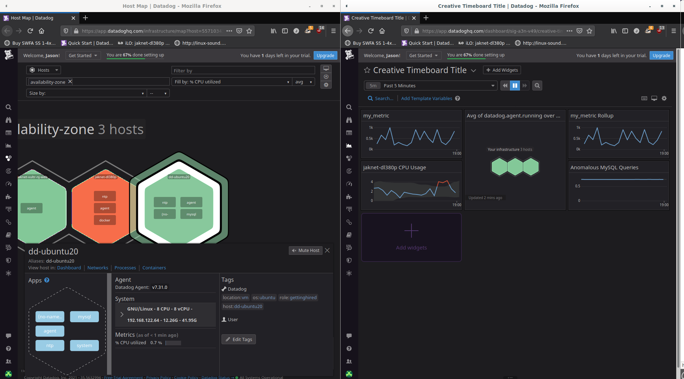
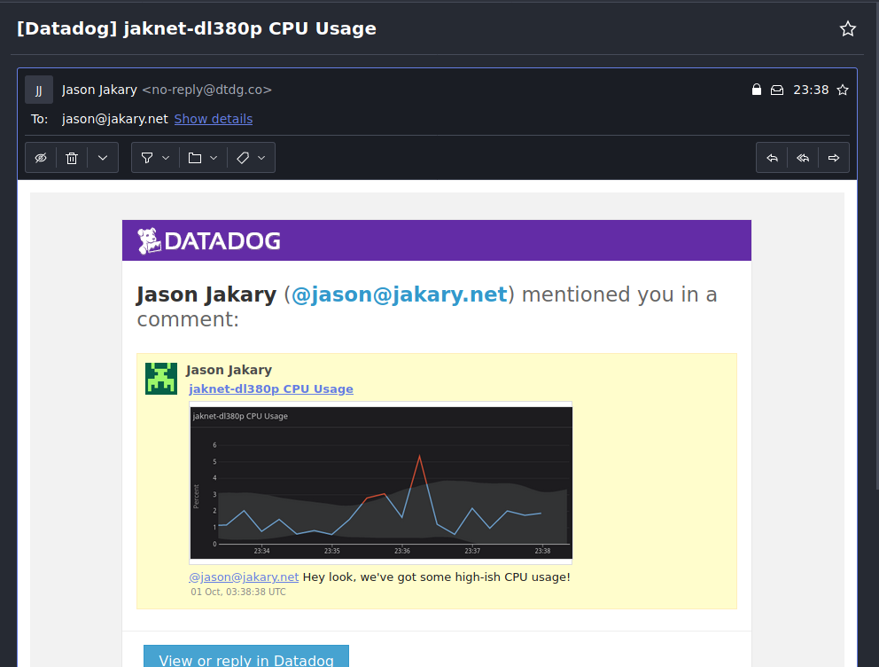
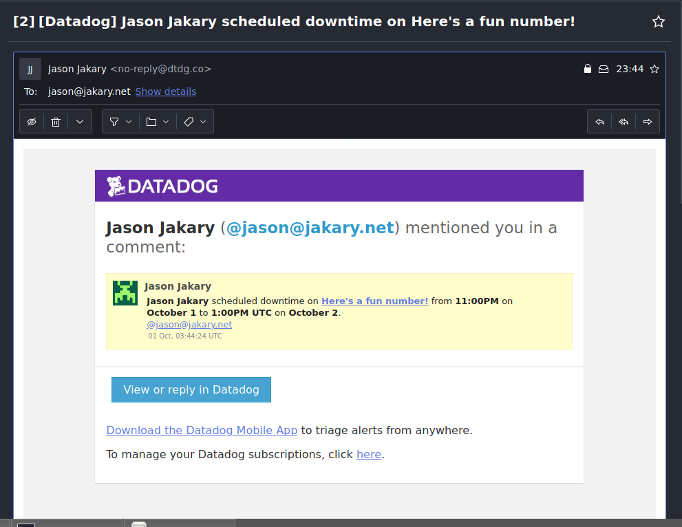

# Jason Jakary, Sales Engineer Candidate
### October, 2021

## Overview
This was a fun exercise that gave me a much better under-the-hood look at Datadog than what I was able to research with an interest and the [Youtube channel](https://www.youtube.com/channel/UCPO2QgTCReBAThZca6MB9jg). For the sake of clarity and brevity, I've organized this document to mirror the [exercise readme](README.md). 

### Why work at Datadog?
In a sentence, working here as an SE means an opportunity to merge my technical, people, and business backgrounds to work with cool software I personally use and help to teach more people about it. I was originally looking for a monitoring and analytics platform for my homelab when I discovered that not only does Datadog seem the solution on this front, but that there's an SE opening in Denver. Having just completed my MBA, I'm actively searching for SE positions to put that business education to use. My fiancee and I are also planning to move to Denver in the coming months. After having conversations with Amanda and Jake, the company atmosphere seems fantastic. I'd love to work with you all and look forward to meeting you, pending review of this document.  

### Files that need to be included:
- [x] dd-ubuntu20 neofetch output
- [x] /etc/datadog-agent/checks.d/my_metric.py
- [x] /etc/datadog-agent/conf.d/my_metric.yaml
- [x] Screenshot of Hostmap showing tags
- [x] Timeboard script
- [x] Monitor Downtime Email

### Setting up the environment:
- [x] Create a fresh Linux VM
- [x] Setup Datadog account
- [x] Get datadog-agent running on the VM

To get started, I spun up a virtual instance of Ubuntu Server 20.04.03 following the recommendation to use an Ubuntu image 16.04 or newer. 
Rather than using Oracle's VirtualBox software, I'm using QEMU/KVM with virt-manager as I've found VMs created and managed this way tend to run faster and smoother on Linux systems when compared to VirtualBox. I'm currently a bit hardware-lite at the moment with most of my homelab in a storage unit, but once this exercise is complete I'll be re-imaging the virtualization server to be built around Proxmox. I believe having a machine fully centered on virtualization rather than a Debian machine used primarily for virtualization will prove quite educating. For now though, we'll stick to QEMU/KVM. See Figure 1 for the virtual specs of the machine we'll be using. 

*Figure 1. Neofetch output of dd-ubuntu20 detailing virtual system specifications*

### Collecting Metrics:
- [x] Add tags in the Agent config file 
- [x] Install database and integration on the VM
- [x] Create custom Agent Check submitting the metric, *my_metric*, with a random value between 0-1000 every 45 seconds

###### Can you change the collection interval without modifying the Python check file?
The great thing about open source is that the answer to "Can you..." is usually "Yes, provided a sufficient understanding of the system." In our case, the collection interval is changed via `min_collection_interval` in *my_metric.yaml* (which isn't a python file, but rather a .yaml file). That's a bit inside-the-box though, as the Python and YAML files work together directly. For an outside-the-box solution, we can use a cron job! Kind of... cron jobs are native to all Linux distros and are an easy way to automate commands. Since the Datadog agent runs all metrics upon startup, running `systemctl restart datadog-agent` as root will get the random number generator within our metric to generate a new number. The issue here is twofold though:
1. The agent may be running other services that we don't want restarted.
2. Cron jobs have a resolution of one minute, so to restart the agent every 45 seconds requires the creation of a script to run `systemctl restart datadog-agent` every 45 seconds and cron job set to run at a time divisible by 45 seconds to ensure the script stays on schedule. 

### Visualizing Data:
###### Create a Timeboard that contains:
- [x] *my_metric* scoped over the host
- [x] Any metric from the database integration with the anomaly function applied
- [x] *my_metric* with the roll-up function applied to sum up all points from the past hour into one bucket
- [x] Set the time frame to the past 5 minutes
- [x] Take a snapshot and use @ notation to send it to myself

Here's where Datadog seems to shine for me. As a power-user-but-not-a-programmer, the clear user experience makes the mountains of available data much easier to digest. An easy to read and comprehend UI lowers the "barrier to entry" when it comes to who can use it. This is important first so that less tech-savvy management teams can easily understand the situation at hand and make big-picture decisions. It's also important for the seasoned administrators though. For every brain cell spent on [successfully] understanding the data presented, that's a brain cell that can't work on something else. I love command line as much as the next Linux nerd, but sometimes the GUI just makes everything easier. I've included both the Hostmap from the last section and the [Timeboard](code/CreativeTimeboardTitle.json) for this one in Figure 2.

*Figure 2. Both the Hostmap and Timeboard showing hosts, tags, and some metrics*

###### What is the Anomaly graph displaying? 
In this case, it's displaying any situation where far more or far less queries to my database are performed. That's a bit boring though, since it's an empty database with nobody intentionally connecting to it. Instead, see my other widget,*jaknet-dl380p CPU Usage* as it's tracking the CPU usage of the server that's running *dd-ubuntu20* and therefore much more active. Figure 3 contains a snapshot of the CPU usage with anomaly filter applied. 

*Figure 3. Screenshot of the snapshot as created via "@" notation*

### Monitoring Data:
###### Create a new Metric Monitor:
- [x] Monitoring *my_metric*
- [x] Warning threshold of 500 over the last 5 minutes
- [x] Alert threshold of 800 over the last 5 minutes
- [x] Notify me if there is no data over the past 10 minutes
- [x] Alert message will email whenever monitor triggers
- [x] Alert message will have different messages for Warning, Alert, and No Data
- [x] Alert message will include the offending metric value and host IP
- [x] Alert message will have downtime between 1900-0900 M-F
- [x] Alert message will have downtime between 0000-2359 S-S
- [x] Email will be sent when downtime is scheduled - include pic

All tasks completed. See Figure 4 for requested pic of the downtime email. UTC is generally preferable to a local timezone as it standardizes year-round, locale-independent management. 

*Figure 4. Screenshot of the email announcing scheduled downtime in UTC*

### Collecting APM Data:
- [ ] Utilize the provided Flask app
- [x] What's the difference between a service and a resource?

Here I fully admit I've run into hardship. I've used the included code, but the problem I keep running into is that when running `falsk run`, the machines return `OSError: [Errno 98] Address already in use`. Yes, machines plural as I've spun up clean Ubuntu and Windows VMs and even tried this on my Debian host, but more to the point of what was tried:
- Roughly a dozen variations on `app.run(host='0.0.0.0', port'5000')` as originally written.
- Confirmed Port 5000 was not in use via `netstat -l` and `lsof -i:5000`.
- Based on error messages, suspect *socketserver.py* may be taking up ports, so did a dive into socket architecture. Neat stuff, but it was becoming a counterproductive rabbit hole.
- Utilized online Flask forum to assist in troubleshooting, concluded it's not likely an issue with Flask.
- Current though process is that there's something blocking ports with my virtual network interface, but not sure what as I'm managing the VM over Port 22 via SSH. 

###### Services vs. Resources
The simplest way to break down services vs. resources is to think of it this way: A service is a verb, a resource is a noun. When a user logs into a multifactor-protected access point for example, they first input their username and password. These credentials are compared against the credential database (a resource). Once verified, the user must answer a multifactor authentication challenge. Here, a service generates a random alphanumeric string and compares against the input it receives. Services do things, resources are things that can be used by services, processes, etc. but are not themselves *doing* something.

### Final Question: 
###### How would you creatively use Datadog?

My "creative" use case is pretty typical for an enterprise, but a little "out there" for an individual. When I've got some more down time I'll be configuring my platform to manage my homelab. A few solutions I'd like to implement beyond just "manage the rack" over the next few months:
- Create integration for OpenHab to monitor temp, atmospheric pressure, lights, and power consumption at various points.
- Alert via email if appliances are on, but nobody's home (stove, curling irons, etc.).
- Keep an eye on nutrient levels for hydroponic garden.
- I've held off on it for the sake of this exercise, but next up on my homelab is converting the QEMU/KVM-based virtualization server into a Proxmox server. Managing both virtual machines and containers from the same host should be fun, and perfectly suited for Datadog management.
- Keep learning more about the platform. It seems super powerful and I fully recognize there's a ton to discover :)
