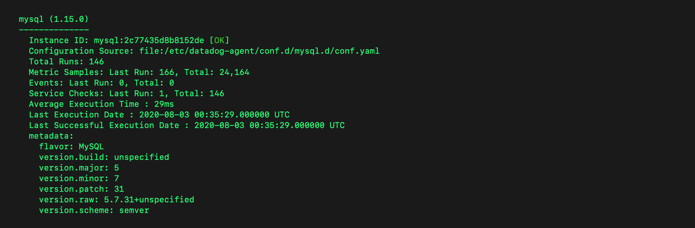
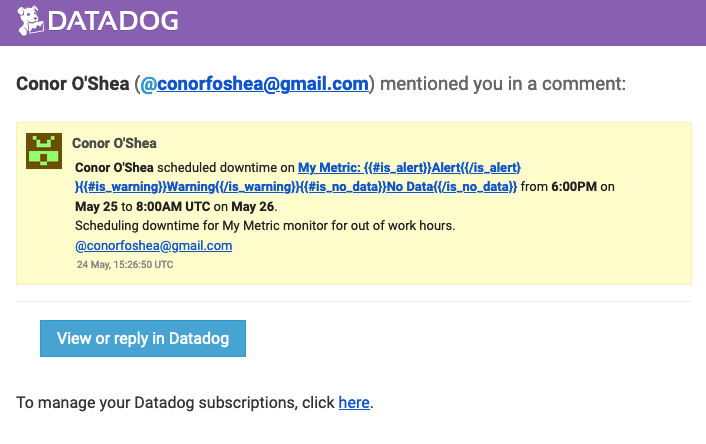
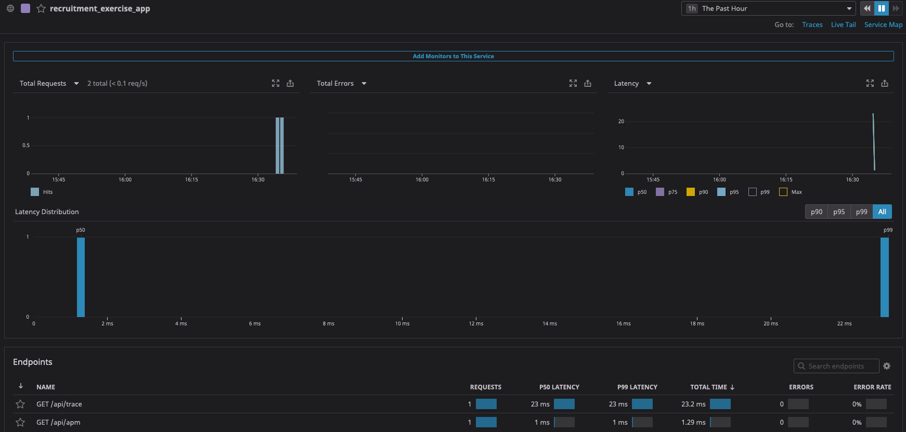

# Prerequisites - Setup the environment
For this exercise, I created a fresh Ubuntu VM locally, and also installed the DataDog agent on a Ubuntu VPS that I use for various mini projects and websites. Both of these systems run `v.18.04`.

To install the agent, I used the one-step install for Ubuntu, which can be found from the Datadog Application under [Integrations > Agent](https://app.datadoghq.eu/account/settings#agent/ubuntu)

# Collecting Metrics

 - I added tags relating to OS and OS version and also assigned the host tag to "local" by [editing the configuration file](https://docs.datadoghq.com/tagging/assigning_tags/?tab=agentv6v7#configuration-files) `datadog.yaml` which is located in `/etc/datadog-agent`. I added the following configuration to datadog.yaml to accomplish this:
```
hostname: local

tags:
  - environment:dev
  - os:ubuntu
  - os_version:18.04
```


 - I installed MySQL for this step on the local VM. The steps for MySQL Integration are available from the Datadog Application under [Integrations > Integrations](https://app.datadoghq.eu/account/settings#integrations/mysql). Once this was set up I could see data flowing into the default dashboard "MySQL - Overview":



 - I created a [Custom Agent Check](https://docs.datadoghq.com/developers/write_agent_check/?tab=agentv6v7) using the following Python script in `/etc/datadog-agent/checks.d` to submit a metric named my_metric, consisting of a random value between 0 and 1000.

 custom_check.py
 ```python
import random

# the following try/except block will make the custom check compatible with any Agent version
try:
    # first, try to import the base class from new versions of the Agent...
    from datadog_checks.base import AgentCheck
except ImportError:
    # ...if the above failed, the check is running in Agent version < 6.6.0
    from checks import AgentCheck

# content of the special variable __version__ will be shown in the Agent status page
__version__ = "1.0.0"

class MyCheck(AgentCheck):
    def check(self, instance):
        self.gauge('custom_metric.my_metric', random.randint(0, 1000), tags=['custom_metric:my_metric'])
 ```
 I added the following configuration file to `/etc/datadog-agent/conf.d` to configure the check and set the minimum collection interval to 45 seconds.

custom_check.yaml
```yaml
init_config:

instances:
  - min_collection_interval: 45
 ```
 - **Bonus Question**: Initially I set the collection using the check configuration file, however this may also be set in the Datadog Application via the [Metrics Summary](https://app.datadoghq.eu/metric/summary) page:


 # Visualizing Data:
I used the following JSON and cURL command to create a timeboard with the 3 required graphs.

dashboard.json
```json
{
    "notify_list": null,
    "description": "This dashboard shows key metrics relating to the recruitment candidate exercise.",
    "is_read_only": false,
    "title": "Recruitment Exercise Dashboard",
    "widgets": [{
            "definition": {
                "requests": [{
                    "q": "custom_metric.my_metric{host:local}"
                }],
                "type": "timeseries",
                "title": "My Metric"
            },
            "id": 1
        },
        {
            "definition": {
                "requests": [{
                    "q": "anomalies(max:system.cpu.iowait{*}, 'basic', 2)"
                }],
                "type": "timeseries",
                "title": "I/O wait (%)"
            },
            "id": 2
        },
        {
            "definition": {
                "type": "query_value",
                "requests": [{
                    "q": "avg:custom_metric.my_metric{*}.rollup(sum, 3600)",
                    "aggregator": "last"
                }],
                "title": "Sum of my_metric over the last hour",
                "autoscale": true,
                "precision": 0
            },
            "id": 3
        }
    ],
    "layout_type": "ordered"
}
```
```shell
curl -X POST -H "Content-Type: application/json" \
	-H "DD-API-KEY:65a1cb0da0b457ea3a79e5004c00bf03" \
	-H "DD-APPLICATION-KEY:ed6e30e42a383a6e4a0a98759021f3c5c0d868f6" \
	-d @dashboard.json \
	"https://api.datadoghq.eu/api/v1/dashboard"
```
 - For the timeseries of my_metric, I used a simple metric query, scoped over host:local: `custom_metric.my_metric{host:local}`
 - From my MySQL integration I selected I/O wait times, as it seemed prone to anomalies. I added the [Anomalies function](https://docs.datadoghq.com/dashboards/functions/algorithms/#anomalies) to the query. I read some of the details on the [various anomalies algorithms and the bounds parameter](https://www.datadoghq.com/blog/introducing-anomaly-detection-datadog/) so that I could select appropriate values for each of these parameters. I selected the `basic` algorithm for its ability to adjust quickly to changing conditions, and also because the metric appears not to have any seasonality or trends to its value. I selected my bounds value as 2 with the assumption that given a normal distribution of values in the metric (unlikely, but a near enough approximation for the circumstances), I might expect approximately 95% of values to lie within the bounds.
 - For my [rollup](https://docs.datadoghq.com/dashboards/functions/rollup) graph I used `rollup(sum, 3600)` to give the sum of values over 1 hour (3600 seconds). I then used `"aggregator": "last"` to select the most recent 1 hour period. I used `"precision": 0` as this should be an integer, and `"autoscale": true` to improve readability of the relatively large number.
 - The UI only allowed for setting a custom timeframe at the individual graph level, however the timeboard URL structure allows for setting a custom interval in milliseconds. By adjusting the parameters `from_ts` and `to_ts` to `0` and `300000` respectively, the UI would render the most recent 5 minute period.
 - Below is a screenshot of the created dashboard. The full interactive dashboard may be found [here](https://p.datadoghq.eu/sb/w2moqtz1opco022a-e49e627036a4b8564a210035e3be68e8).


 - I took a [snapshot](https://www.datadoghq.com/blog/real-time-graph-annotations/) of the basic My Metric graph, mentioned myself and received the following email:


 - **Bonus Question**: The Anomaly graph is showing the area inside the bounds, coloured a lighter grey. The metric line is overlayed with all values that lie outside of the bounds coloured black.


# Monitoring Data:
I created a new Metric monitor using the UI: [Monitors > New Monitor > Metric](https://app.datadoghq.eu/monitors#create/metric), and completed the following configuration:


 - I configured the monitor message using the available [template variables](https://docs.datadoghq.com/monitors/notifications/?tab=is_alert#message-template-variables) as follows:


 - When the monitor detected an average of > 500 over 5 minutes, I got the following notification:


 - **Bonus Question**: I scheduled downtime for the monitor for nighttime and weekends and notified myself. (This was scheduled in IST, but comes through on the notification as UTC):




# Collecting APM Data
I implemented the given Flask application on my VPS so that it would be open to the internet to make requests. First I used ddtrace-run to get some basic trace data flowing into Datadog. I set the Service environment variable to `recruitment_exercise_app`.



Then I tried out instrumenting the app manually to see if I could get more details into the traces. I created a [custom span](http://pypi.datadoghq.com/trace/docs/advanced_usage.html#opentracing) using the [opentracing](https://opentracing.io/guides/python/) and [ddtrace](http://pypi.datadoghq.com/trace/docs/) libraries. I added a custom tag to the span to grab the `utm_source` from the request params if it is there, and added a random delay to simulate a long running process. Below is the code for this application.

```python
from flask import Flask
from flask import request
from random import randint
from time import sleep
from ddtrace.opentracer import Tracer, set_global_tracer
import logging
import sys
import opentracing

# Have flask use stdout as the logger
main_logger = logging.getLogger()
main_logger.setLevel(logging.DEBUG)
c = logging.StreamHandler(sys.stdout)
formatter = logging.Formatter('%(asctime)s - %(name)s - %(levelname)s - %(message)s')
c.setFormatter(formatter)
main_logger.addHandler(c)

app = Flask(__name__)

@app.route('/')
def api_entry():
    return 'Entrypoint to the Application'

@app.route('/api/apm')
def apm_endpoint():
    span = opentracing.tracer.start_span('custom_apm_span')
    span.set_tag('utm.source', request.args.get('utm_source'))
    sleep(randint(1,5))
    span.finish()
    return 'Getting APM Started'

@app.route('/api/trace')
def trace_endpoint():
    main_logger.info("Debug message")
    return 'Posting Traces'

def init_tracer(service_name):
    config = {
        'agent_hostname': 'localhost',
        'agent_port': 8126,
    }
    tracer = Tracer(service_name, config=config)
    set_global_tracer(tracer)
    return tracer

if __name__ == '__main__':
    init_tracer('custom_tracing')
    app.run(host='0.0.0.0', port='5050')
```

With the custom tag data flowing into the traces in Datadog, I created a [facet](https://docs.datadoghq.com/tracing/guide/add_span_md_and_graph_it/?tab=java) using the custom tag.


I had hoped to create a visualisation using the new custom tag and the span duration however, while the traces seemed to be flowing correctly into Datadog, I wasn't getting any Analysed Spans which were necessary to include this data in a graph. Guessing that this was an issue with how I had manually instrumented the application, I tried out a number of different methods of manual instrumentation but unfortunately none of them seemed to create Analysed Spans in Datadog.

Instead, I graphed the request duration of the application over time for the Flask application and added it to my [dashboard](https://p.datadoghq.eu/sb/w2moqtz1opco022a-e49e627036a4b8564a210035e3be68e8):


 - **Bonus Question**: A Service is a set of [processes that do the same job](https://docs.datadoghq.com/tracing/visualization/service/#overview) - for example a web framework or database. A Service may provide one or many Resources, which are [particular actions completed by the service](https://docs.datadoghq.com/tracing/visualization/resource/). They are [typically an instrumented web endpoint, database query, or background job](https://docs.datadoghq.com/tracing/visualization/).

# Final Question
Initially I thought of the resource management issues that have arisen due to social distancing restrictions. In particular, if supermarkets were able to report their occupancy in real time to Datadog, this could be used along with other attributes such as brand, location, and capacity etc. to give people an idea of what supermarket they would be best to go to, and at what times.

This made me think of another industry for whom careful resource management a constant struggle: theme parks. Real time information on queue length and attraction downtime could really help with directing patrons to the right resources. With an increased quality of data collection, there would also be an opportunity to attempt to predict demand and potentially even attraction downtime. For example, if an attraction had to be stopped, nearby and similar attractions could be automatically warned of a potential increase in demand.

Finally, when thinking about uses that I could implement without the requirement for access to private systems, I had a look at what public APIs are out there. Flights tend to be particularly well served by open APIs, and there is the potential for some very interesting monitoring analysis at the moment. For example, using FlightAware's FlightXML, you could monitor departures by IATA code. This could be enhanced using the IATA Open Air API to add location data to the IATA codes. This could indicate where in the world flights are picking back up again and where is keeping travel to a minimum.

