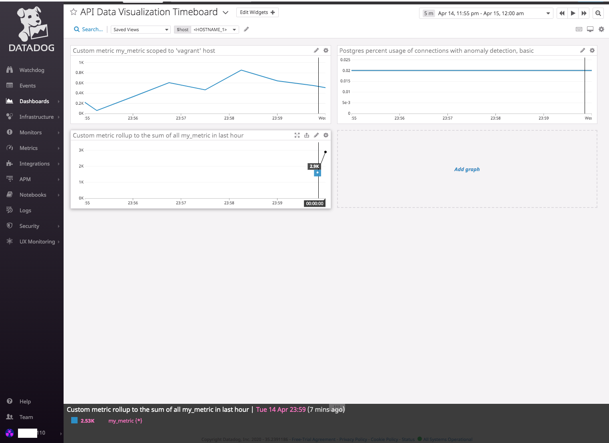
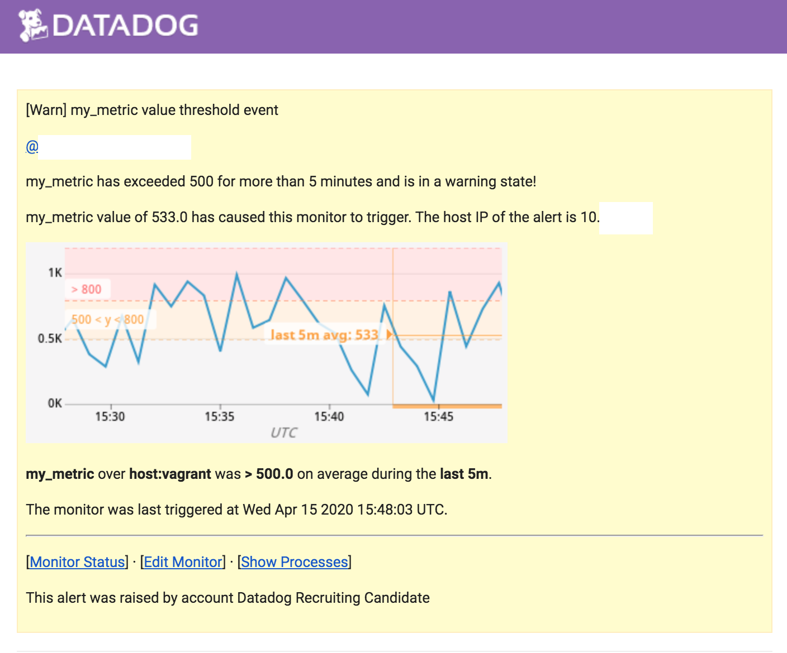

Your answers to the questions go here.

## Preface
Thank you for the opportunity to complete this exercise. I have added some formatting to the text from the [provided README](https://github.com/DataDog/hiring-engineers/blob/solutions-engineer/README.md). These responses are to the solutions-engineer branch. 

## Included Content

I have provided screenshots and code snippets for all steps, screenshots posted inline being served out the folder [answers-attachments](answers-attachments). I have added my code snippets in line. 

I performed much of the API work in Postman, so I have included the relevant code used to perform the work. If there is an artifact missing that you would like to see, please let me know.

## Environment

I used HashiCorp Vagrant with an Ubuntu 18.04 image on my laptop. The environment is still running and should still be reporting some metrics into my Datadog Tenant. 

I chose to use the provided flask app.

## Challenge 1: Collecting Metrics
### Part 1: Adding tags to the Datadog Agent config file
#### 1.1.1: List of tags added
I chose to add the following tags to the config file to help manage environment sprawl and provide the ability to group resources by common attributes, such as the running workload, the team responsible, or the environment classification. 

tags:
* platform:vagrant
* workload:flaskapp
* security:low
* data:npi
* env:npd
* team:devops

#### 1.1.2: Screenshot of tags in the config file
 
#### 1.1.3: Screenshot of host in the Host Map with config file tags

### Part 2: Database install and integration: Postgres
#### 1.2.1: Screenshot of datadog-agent status showing Postgres integration install
I chose to use Postgres as my installed database due to its prevalence and maturity. I found it extremely easy to install the Postgres integration and love the built-in instructions in the GUI.

After I set up the integration, I used the "datadog-agent status" command to show me the integration was up and running successfully! I verified in the SaaS console that the agent was feeding me data and all the applicable metrics were coming in properly.

### Part 3: Custom Agent Check with my_metric custom random value submission and 45 second submission interval
I set up a custom agent check called my_metric that submits a random value between 0 and 1000 every 45 seconds. I found it very convenient to create a custom check simply by creating a config file in conf.d and a corresponding check file in the checks.d directory.

Once again, I verified that my custom check file was running with an "datadog-agent status" and began to see custom metrics in the console every 45 seconds as configured in the my_metric config file.

#### 1.3.1: Screenshot of custom metric my_metric dashboard

#### 1.3.2: Code for my_metric from checks.d
    
    '''
    import random
    # the following try/except block will make the custom check compatible with any Agent version
    try:
        # first, try to import the base class from new versions of the Agent...
        from datadog_checks.base import AgentCheck
    except ImportError:
        # ...if the above failed, the check is running in Agent version < 6.6.0
        from checks import AgentCheck

    # content of the special variable __version__ will be shown in the Agent status page
    __version__ = "1.0.0"

    def RandNum():
        x = random.randrange(0,1000)
        return x

    class RandMetric(AgentCheck):
        def check(self, instance):
            self.gauge('my_metric', RandNum(), tags=['TAG_KEY:TAG_VALUE'])

    '''
 [link to the script](answers-attachments/1.3.2.py)

#### 1.3.3: Snapshot of config file for my_metric from conf.d which submits my_metric only once every 45 seconds

## Challenge 2: Visualizing Data
### Part 1: Datadog API Timeboard Creation
#### 2.1.1 Screenshot of created Timeboard with three widgets - custom metric scoped over host, Postgres metric with anomaly function applied, and custom metric with rollup function to sum all points from the past hour
I used Postman to create a timeboard via the Datadog API. I downloaded the Datadog Postman collection and used it as I worked through my API call creation. After generating a new application key for use with Postman, I loaded all of my environment variables in and tested connectivity. 

I built three different timeboards to validate that each JSON element worked properly individually, and then combined them into one list along with the rest of the timeboard creation syntax.

I read through the documentation to get information on how to scope to a specific host for a given metric, how to configure a metric with the anomalies function applied, and how to use the rollup function over a given period of time.

[Public Dashboard Link](https://p.datadoghq.com/sb/cgguwls3kat23rz0-7a254a2965b947296b834b69cd962fa0)

#### 2.1.2 Script to create Timeboard with three widgets - custom metric scoped over host, Postgres metric with anomaly function applied, and custom metric with rollup function to sum all points from the past hour. I used Postman to submit the API calls.
    '''
    curl --request POST \
    --url https://api.datadoghq.com/api/v1/dashboard \
    --header 'Content-Type: application/json' \
    --header 'DD-API-KEY: [API-KEY-REDACTED]' \
    --header 'DD-APPLICATION-KEY: [APP-KEY-REDACTED]' \
    --header 'Postman-Token: TOKEN-REDACTED' \
    --header 'cache-control: no-cache' \
    --data '{\n    "title": "API Data Visualization Timeboard",\n    "widgets": [\n        {\n            "definition": {\n                "type": "timeseries",\n                "requests": [\n                    {\n                        "q": "my_metric{host:vagrant}"\n                    }\n                ],\n                "title": "Custom metric my_metric scoped to '\''vagrant'\'' host"\n            }\n        },\n        {"definition": {\n                "type": "timeseries",\n                "requests": [\n                    {\n                        "q": "anomalies(avg:postgresql.percent_usage_connections{*}, '\''basic'\'', 2)"\n                    }\n                ],\n                "title": "Postgres percent usage of connections with anomaly detection, basic"\n            }\n        },\n        {"definition": {\n                "type": "timeseries",\n                "requests": [\n                    {\n                        "q": "sum:my_metric{*}.rollup(sum,3600)"\n                    }\n                ],\n                "title": "Custom metric rollup to the sum of all my_metric in last hour"\n            }\n        }\n    ],\n    "layout_type": "ordered",\n    "description": "API Data Visualization: Custom Host-Specific Metric, Postgres Connection Usage Anomaly Detection, and Custom Metric Rollup (1 hr)",\n    "is_read_only": true,\n    "notify_list": [\n        "[EMAIL-ID-REDACTED]"\n    ],\n    "template_variables": [\n        {\n            "name": "host",\n            "prefix": "host",\n            "default": "<HOSTNAME_1>"\n        }\n    ],\n    "template_variable_presets": [\n        {\n            "name": "Saved views for hostname 2",\n            "template_variables": [\n                {\n                    "name": "host",\n                    "value": "<HOSTNAME_2>"\n                }\n            ]\n        }\n    ]\n}\n'
    '''
[link to the script](answers-attachments/2.1.2.sh)
### Part 2: Dashboard Interaction
#### 2.2.1 Snapshot of API created Timeboard scoped to the last 5 minutes
I set the timeframe to show the last 5 minutes per the instructions and took a snapshot through the console.

#### 2.2.2 What is the Anomaly graph displaying?
The Anomaly graph is showing any substantial deviations from the "normal" behaviors using an algorithm based on past data points.

## Challenge 3: Monitoring Data
### Part 1: Created Metric Monitor to watch my_metric average with thresholds set (Warning:500:5 minutes, Alerting:800:5 minutes, NO DATA:10 minutes), configured to send an email whenever the monitor triggers with different messages based on whether the monitor is in an Alert, Warning, or No Data state. 
### Email includes the metric value that caused the monitor to trigger and host ip when the Monitor triggers an Alert state. Email sample included.
#### 3.1.1 Screenshot of custom Metric Monitor
I created a Metric Monitor interactively using the console and set all of the appropriate parameters. I then researched the appropriate syntax to use in the "Message" field so that the message would change based on the type of event and provide more rich information (I know in my experience, it's extremely frustrating to get notifications that tell you to look somewhere else for the context). 

I received an email almost immediately after configuring the Metric Monitor and saw that all of my syntax worked properly. I then went in to the console and sent all of the test alerts to make sure the messages changed appropriately, which they fortunately did. 

After verifying all my notifications were working properly, I muted the monitor in the console because my email was blowing up with alerts. I then scheduled my downtimes as specified. I think this part of the console could use some improvement, the wizard that I was working with was somewhat hard to follow - especially around the duration of the scheduled downtime (how long that downtime would be in effect before expiring) as opposed to the actual details of what the downtime would consist of when it is in effect. I received an email informing me that a change had been made to my scheduled downtime each time that I made any tweaks to it.

#### 3.1.2 JSON to create custom Metric Monitor
    '''
    {
        "id": 17706183,
        "name": "my_metric value threshold event",
        "type": "metric alert",
        "query": "avg(last_5m):avg:my_metric{host:vagrant} > 800",
        "message": "@[EMAIL-ID-REDACTED] \n\n{{#is_alert}} my_metric alert threshold of 800 has been exceeded for more than 5 minutes! {{/is_alert}} \n\n{{#is_alert_recovery}} my_metric has recovered from an alert state{{/is_alert_recovery}} \n\n{{#is_warning}} my_metric has exceeded 500 for more than 5 minutes and is in a warning state! {{/is_warning}} \n\n{{#is_recovery}} my_metric has recovered from a warning state {{/is_recovery}} \n\n{{#is_no_data}} my_metric has not reported data for the last 10 minutes! {{/is_no_data}} \n\nmy_metric value of {{value}} has caused this monitor to trigger. The host IP of the alert is {{host.ip}}",
        "tags": [],
        "options": {
            "notify_audit": false,
            "locked": false,
            "timeout_h": 0,
            "new_host_delay": 300,
            "require_full_window": true,
            "notify_no_data": true,
            "renotify_interval": "0",
            "escalation_message": "",
            "no_data_timeframe": 10,
            "include_tags": true,
            "thresholds": {
                "critical": 800,
                "warning": 500
            }
        }
    }
    '''
[3.1.2](answers-attachments/3.1.2.json)
#### 3.1.3 Email notification screenshot

### Part 2: Two Scheduled Downtimes - 7pm to 9am daily on M-F, all day on Sat-Sun, email notification when downtime was scheduled.
#### 3.2.1 Screenshot of email notification

## Challenge 4: Collecting APM Data
### Part 1: Instrument the Python Flask App. 
#### 4.1.1 I confirmed that Trace Collection was enabled by default in my version of the Datadog Agent, and installed then ran ddtrace with my Flask application. I enabled App Analytics in the Flask code base.

I enjoyed this part of the exercise the most. It was painless to follow the integration steps and I'm very impressed with how simple and straightforward it is to run ddtrace with my app and instantly get tracing information in the SaaS console. 

Additionally, the fact that Trace Collection is enabled in the agent by default for current versions is a nice touch and helped me get up and running immediately. On top of that, having a one-liner to get App Analytics enabled either in the code or through an environment variable is super convenient. When I initially read this portion, I thought it would be the most difficult one but I was very impressed to breeze through it. The team did a great job with ease of use and I found that the APM documentation was the strongest of all of them (from my point of view). 

    '''
    from flask import Flask
    import logging
    import sys
    import ddtrace.profile.auto
    ddtrace.config.analytics_enabled = True

    # Have flask use stdout as the logger
    main_logger = logging.getLogger()
    main_logger.setLevel(logging.DEBUG)
    c = logging.StreamHandler(sys.stdout)
    formatter = logging.Formatter('%(asctime)s - %(name)s - %(levelname)s - %(message)s')
    c.setFormatter(formatter)
    main_logger.addHandler(c)

    app = Flask(__name__)

    @app.route('/')
    def api_entry():
        return 'Entrypoint to the Application'

    @app.route('/api/apm')
    def apm_endpoint():
        return 'Getting APM Started'

    @app.route('/api/trace')
    def trace_endpoint():
        return 'Posting Traces'

    if __name__ == '__main__':
        app.run(host='0.0.0.0', port='5050')

    '''
[link to the script](answers-attachments/4.1.1.py)

#### 4.1.2 Link and Screenshot of APM/Infrastructure Metrics Dashboard. 
I decided to use four different metrics for this dashboard. First, CPU and disk-in-use as an indicator of overall host health. Secondly, the Trace Agent CPU percentage gives a specific data point on CPU usage in cores for more context-rich data. I chose to include the Trace Agent Trace Writer bytes estimate to give details on the Agent's internal algorithm. Lastly, I included a time-series plot of the Postgres database's percentage of max connections in use.

This dashboard will give me a broader view into the health of the Datadog Agent, my application, database, and host.

[Public Dashboard Link](https://p.datadoghq.com/sb/cgguwls3kat23rz0-9238448f1d7b74ee26540f6ba377e2d4)

#### 4.1.3 What is the difference between a Service and a Resource?
In the scope of Datadog, a Service is a group of endpoints, queries, or jobs for the purpose of provided a capability that can be scaled or accessed in a uniform manner. Services are shown in the Service List and visually represented in the Service Map. A given Service in Datadog can be viewed individually with their trace metrics suck as throughput, latency, error rates, etc. 

A Resource represents a particular domain of a customer application, such as an instrumented web endpoint, database query, or background job. Services are typically composed of specific resources, as the resource is a particular action for a given service.

## Challenge 5: Final Question
### Part 1: Datadog has been used in a lot of creative ways in the past. Is there anything creative you would use Datadog for?
#### 5.1.1 

I think that Datadog would be a great productivity engine to integrate with day-to-day technology (computers, mobile devices, and wearable technology) and smart home technology (motion sensors, IoT devices like coffee pots, smart fridges, garage doors, etc).

The Datadog platform would be a highly pluggable and lightweight data aggregation tool that can work with very low latency and can work at massive scale. The reason this would be useful is to gather holistic data about a person's day-to-day activity, allowing for predictive analytics and eventually prescriptive analytics especially around productivity and health.

A key feature that I feel most smart homes are missing is an effective way to represent data - such as energy consumption, motion activity in the home, and operating costs (bills and discretionary income). There are many "platforms" such as Nest that have helpful visualization and graphing, but Datadog would allow for an open platform and has the support for a myriad of use cases - allowing for the user to adopt technology into their life seamlessly and on their terms. 

Some of the key outcomes of this implementation could include better correlation of macro-level patterns. An example of this could be the relationship between food and liquid consumption and the amount of time someone spends on their work computer. With fine-grained visibility brought about through the APM suite, it would be possible to observe how someone is using their time and the correlation to stress eating or caffeine consumption. By measuring these data points independently and unobtrusively, it would be possible to create models that could help to drive healthier outcomes by helping someone reduce activities that lead them to unhealthy behaviors.
The most empowering factor to me is that this data is not interpreted, it's simply gathered for the user. The Datadog platform is extremely accessible, and there could be a great market to have specialists such as physical trainers, doctors, dietitians, and therapists help individuals consult on their data sets and extract value from it in an open platform rather than in proprietary ecosystems.

The additional benefit is that this application of Datadog allows for rich customization and use cases that can be tuned and improved over time. If someone wants to spend less time on their phone, they could easily integrate it to report cpu usage, battery consumption, and app-specific usage - all while having the power to visualize that data in a way that is meaningful to them while collecting at massive scale. 

I think this is a very creative and potentially world changing use case for Datadog. There are so many possible outcomes of this technology, and I think that with the right focus and investment it could democratize the power of data driven decision making - all in an accessible, versatile, and feature-rich platform. 

## Public Dashboards
###    Quick Links to all public dashboards:
* API Data Visualization Timeboard - referenced in 2.1.1, 2.2.1 - https://p.datadoghq.com/sb/cgguwls3kat23rz0-7a254a2965b947296b834b69cd962fa0
* APM and Infrastructure Side by Side - referenced in 4.1.2 - https://p.datadoghq.com/sb/cgguwls3kat23rz0-9238448f1d7b74ee26540f6ba377e2d4

## Closing Notes
During the course of this activity, I unfortunately encountered a setback where my disk failed and I lost my first Vagrant box and all my project data. I did some load testing/synthetic data creation to generate prettier graphs, but due to the suspect behavior of my storage I kept the synthetic activity to a minimum. I validated all of my project dashboards are live at the time of submission, but have attached screenshots in case my current box fails.

I blurred sensitive parts of my submission for security and privacy reasons but left enough data for the recruiting team to confirm my identity and uniqueness of my submission. Please reach out to Amanda M. if you need information on my identity.

## Backup Screenshots of Public Dashboards
* [A.1](answers-attachments/A.1.png) - API Data Visualization Timeboard - referenced in 2.1.1, 2.2.1
* [A.2](answers-attachments/A.2.png) - APM and Infrastructure Side by Side - referenced in 4.1.2
