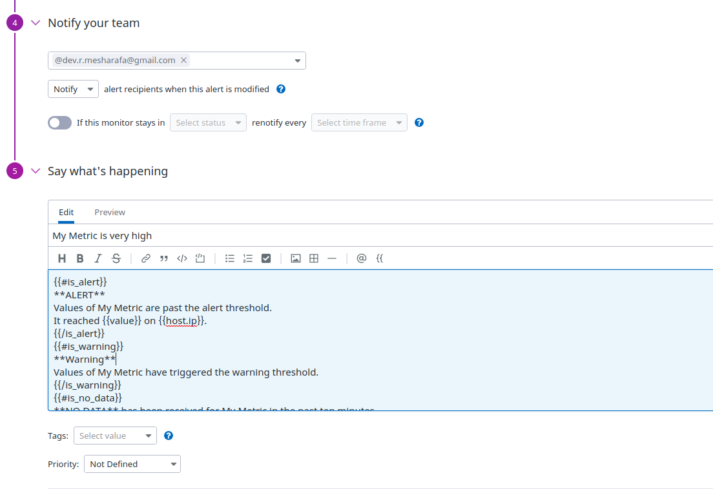
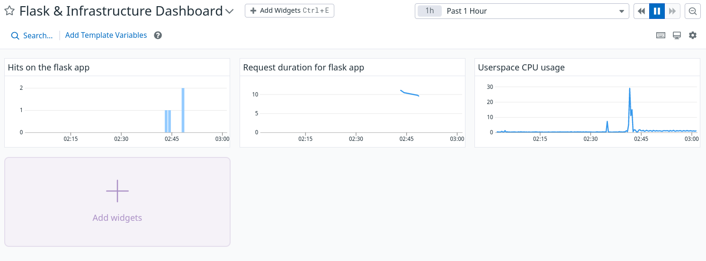

## Prerequisites - Setup the environment ###

I began by setting up the Ubuntu virtual machine using vagrant. It was relatively straightforward. I followed the [instructions here](https://www.vagrantup.com/intro/getting-started/). 

And set up 16.04 Linux version. I then signed up for Datadog's 14-day free trial.

### Collecting Metrics: ###

Tags are a way to distinguish between hosts. 

First I adapted the Agent configuration file. We can set up datadog tags by editing datadog.yaml. It can be found \etc\datadog-agent\datadog.yaml

Once inside the file, you can modify the tag section.

Here is an example of mine:

You then need to restart your Agent using: sudo service datadog-agent restart

It took me a couple of tries for it to appear on my Host Map but once it did this is what it looked like:

Install a database on your VM

I chose MySql. This [link](https://support.rackspace.com/how-to/installing-mysql-server-on-ubuntu/) has simple instructions on how to install MySQL.

### Create a custom Agent check ### 

Inside /etc/datadog-agent/checks.d create a python file. I named mine hello.py. Inside hello.py I wrote a python script that provides an output with a random number 0 to 1000.

 After that file is created and saved, we need to create a yaml file with the same name as the python file inside /etc/datadog-agent/conf.d folder. 

Once inside the yaml file check’s collection interval needs to be modified so that the metric is only submitted once every 45 seconds. It should look something like this. 

**Can you change the collection interval without modifying the Python check file you created?**

Yes. You can set a min interval option in the custom metric check yaml file inside the conf.d directory. The name of the yaml file needs to match the name of your custom agent check python file in the checks.d directory. 

Ex: conf.d/smile.yaml and checks.d/smile.py

So really all that needs to be changed is in the min interval in the yaml file.

### Visualizing Data ###

After installing Datadog on the VM I created timeboard.py file inside the /etc/datadog-agent folder. 

It should look something like this:

Setting the timeboard to show the time frame of the past 5 minutes is relatively simple. I hovered the cursor over the graph and selected the 5 minute time frame and emailed the snapshot to myself.

This is what my 5-minute timeboard looks liked

My timeboard over a span of 5 minutes after I emailed myself with the @notation:

**What is the Anomaly graph displaying?**

The Anomaly graph detects data changes based on past expressions of the information. It predicts what the normal flow of the data should look like. The graph is staying constant on the y-axis. Therefore, there are no anomalies being detected.

### Monitoring Data ###

Data can be monitored from Datadog’s platform. 

 This is how I set mine up. It will alert me with a warning if the threshold is greater or equal to 500, an alert it hits the 800 threshold and if no data is sent for 10 mins for my_metric.

 Here are screenshots of the interaction with the Datadog UI:

The warning message would change depending on if it was a warning, alert or no data. I included all three

This is what an over 500 email warning would look like.

Here is how I set up my downtime monitor for 7 pm to 9 am EST(11pm to 1pm UTC) as well as weekends.

The downtime email received should look something like this:

### Collecting APM data ###

First, we need to install flask onto our VM. Following Flask’s installation, we can use the flask app provided by the Datadog challenge. I used ddtrace to start the python script and then I hit the endpoints (ex. 0.0.0.0:5050/api/trace).

Here is a [linkto my dashboard](https://app.datadoghq.com/dash/856222/training-timeboard-for-hiring-engineers-exercise?live=true&page=0&is_auto=false&from_ts=1531179455884&to_ts=1531265855884&tile_size=m) and a screenshot.

APM screenshot:

After exporting the graph to a timeboard this is what it looked like:

**What is the difference between a Service and a Resource?**

A service is a set of behaviors that are going to consistently perform the same task.  Services work together to provide a feature.

A resource is a specific behavior of a service. 

**Is there anything creative you would use Datadog for?**

An interesting way that I would use datadog would be as a habit tracker. Many of us have goals and habits that we would like to incorporate into our lives. Yet, a good way to make it habit adaptions easier is to make the incorporation of those habits as seamless as possible. First thing I would do is track our circadian rhythms.

Create a scope that tracks when are most active, most focused, most tired, most hungry, most likely to need to need to use the bathroom etc.

Then depending on the user’s schedule he/ she could incorporate his/ her habit when it is most appropriate.

For example, if the user would like to exercise more he would schedule a work out routine when his energy levels are at their peak.

If the user needs to learn new information he would schedule a study session when he is most focused.

Over time the user would be able to track is the incorporations of the new behaviors were successfully maintained. If not, adaptations can be made.

