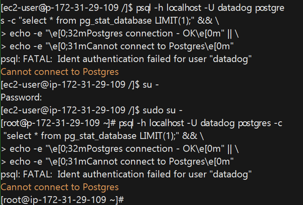
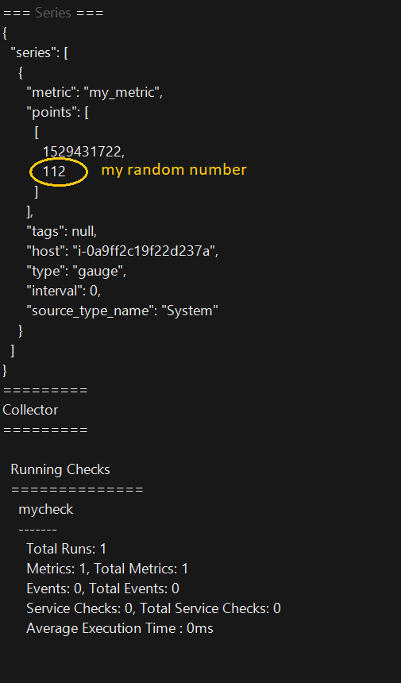
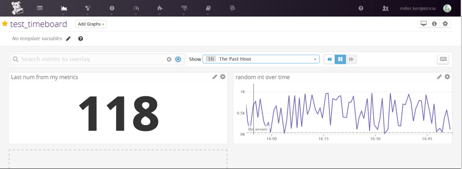
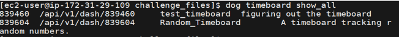
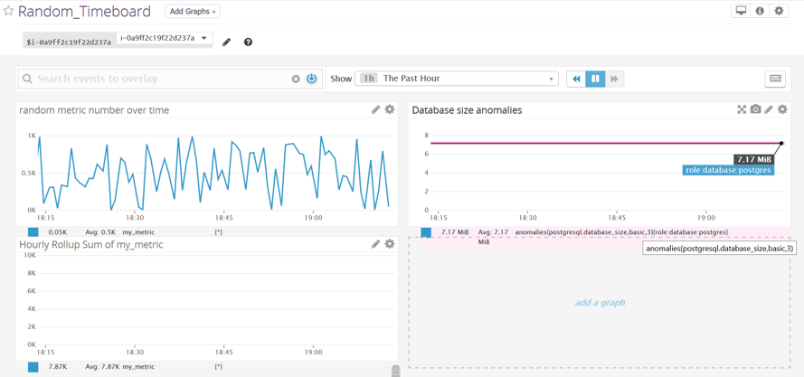
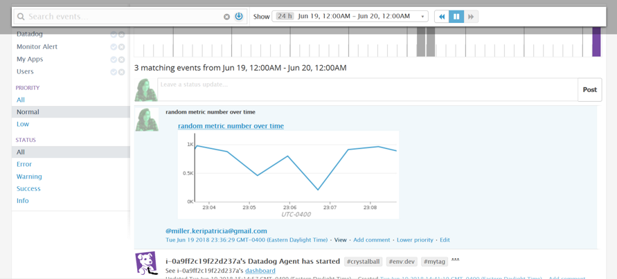
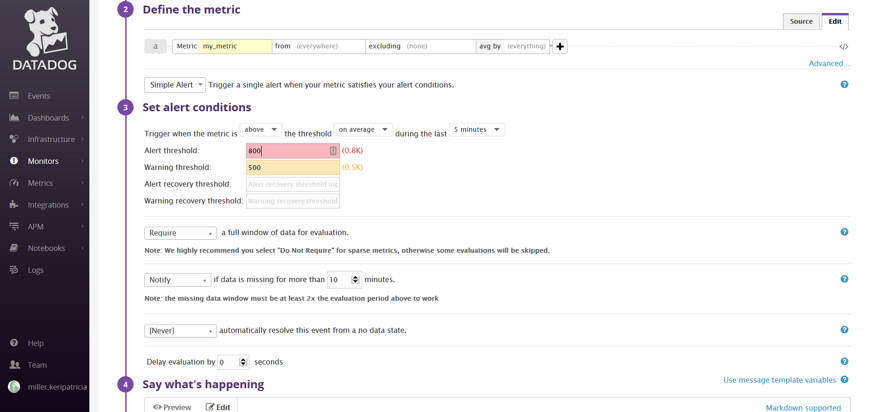
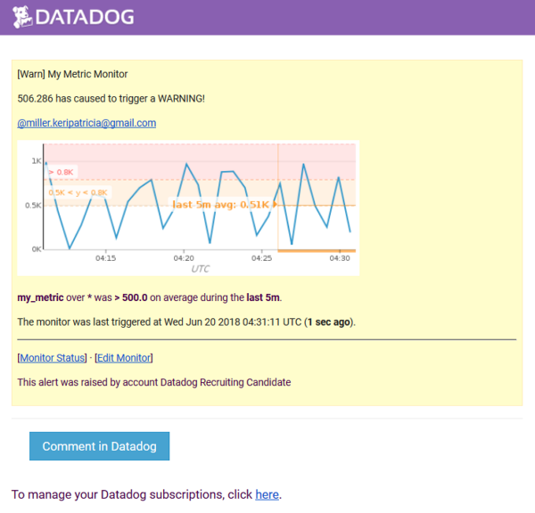
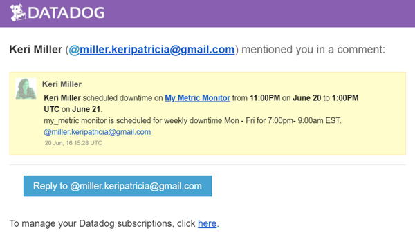
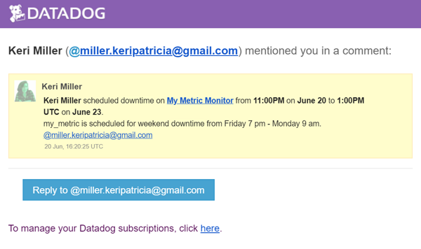

* [Section 0 - Setup the Environment](#prerequisites---setup-the-environment)
    * [Setting up AWS](#setting-up-aws-linux)
* [Section 1 - Collecting Metrics](#collecting-metrics)
    * [Adding Tags to the Agent File](#adding-tags-to-the-agent-file)
    * [Integrating the Database](#integrating-the-database)
    * [Creating a Custom Agent Check](#creating-a-custom-agent-check)
    * [Changing the Collection Interval](#changing-the-collection-interval)
* [Section 2 - Visualizing the Data](#visualizing-data)
    * [Utilize the Datadog API to create a Timeboard](#utilize-the-datadog-api-to-create-a-timeboard)
    * [Monitoring the Timeboard](#monitoring-the-timeboard)
* [Section 3 - Monitoring Data](#monitoring-data)
    * [Create a Custom Metric Monitor](#create-a-custom-metric-monitor)
    * [Setting up Downtimes](#setting-up-downtimes)
* [Section 4 - Collecting APM Data](#collecting-apm-data)
* [Final Question](#final-question)
    

# Answers:

## Prerequisites - Setup the environment:

Originally for this challenge I decided to set up my environment with Vagrant. I'm on a Windows 10 home OS I've used Vagrant before and really enjoyed it and I figured why not.
However, after setting up and making a vagrant box to share I decided to switch to AWS' cloud Linux vm. I've always wanted to try EC2 and running my vm on their cloud would save me space, cpu and work installing postgres.
 
-- You can still read about how I set up my vagrant [here](vagrantSetup.md)

### Setting up AWS Linux:

Log into aws 
Navigate to the EC2 Dashboard from the Services drop down menu and Launch an Instance.
From there follow the directions on the Quick Start screen.
 
I chose the first option for my AMI because it came with Python and Postgres preloaded.

Next option was to chose the Instance type. 
Since this is a light tutorial the free tier t2 Micro should be more than fine.

Finally before my vm is created I created and downloaded a new key pair so that I can ssh into my vm from my local machine.

From here I had two ways I could access my VM from windows. 
Either through puTTy or through ssh in the Windows Sub-Linux(WSL). I'll be using the latter.

In the bash shell use the `chmod` command to make sure your private key file isn't publicly viewable
`chmod 400 /path/my-key-pair.pem`

Use the ssh command to connect to the instance. You specify the private key (.pem) file and user_name@public_dns_name. For example, if you used an Amazon Linux AMI, the user name is ec2-user. 
`sudo ssh -i /path/my-key-pair.pem ec2-user@ec2-198-51-100-1.compute-1.amazonaws.com`
you can find the public DNS address on your dashboard 

__warning: without `sudo` I got an 'unprotected private key file' error__

SUDO!

Success!!

## Collecting Metrics:

I installed the Datadog agent on Ubuntu with the easy one step install `DD_API_KEY=1852b8c40afd989d5e512340f1a0d3c8 bash -c "$(curl -L https://raw.githubusercontent.com/DataDog/datadog-agent/master/cmd/agent/install_script.sh)"`
//TODO: insert picture of agent output
Agent v6 installed successfully and is running.
 
### Adding Tags to the Agent file:

I navigated over to the agent config file located at `/etc/datadog-agent/datadog.yaml` (note: agent v6 will be a `.yaml` file and v5 is `.conf`)

I checked out the `datadog.yaml.example` and the `datadog.yaml` too see how to format my tags. It looks like these files start off identical by default but it'll be good to have an unchanged example copy if I needed to ever revert back. 
I uncommented the tags on `datadog.yaml` file and added a few of my own and saved.

    # Set the host's tags (optional)
     tags:
       - mytag
       - crystalball
       - env:dev
       - role:database:postgres
       
I went onto my dashboard to see if my tags were there and didn't see any. I checked the dogs and didn't see another step requiring a restart. So then I tried to check the agent's config with ` sudo datadog-agent configcheck`
I got the following error:

    
I went beck to investigate my yaml file. I see my api key is in there and not commented out on top. Since I am able to see my host on the dashboard but just not my new tags I started to doubt this is the kind of key it was referring too.
I went over to line 34 and it is my tags settings. After a quick search I found that some people have solved a similar error in other programs with indentation. I fixed the indentation in the file.

That solved the  agent config check error! However, the actual output wasn't helpful after all.
So, I decided to try restarting the agent thinking maybe the service should restart whenever you change the config file.

 It wasn't until I went to filter on the hostmap dashboard that I noticed My tags showed up.
    
   
    
Yay!
- [X]  Add tags in the Agent config file and show us a screenshot of your host and its tags on the Host Map page in Datadog.

### Integrating the database:

One of the benefits of using AWS is that Postgres is that it has postgres packages you can readily install onto their instances. 
Run `sudo yum list postgres*` to see available packages 
I'm going to pick their newest available and run `sudo yum install postgresql96-server` to install postgres from amazon's maintained packages. 

After Postgres is installed I initialized my first database and started the postgres server.
        
        sudo ../../etc/init.d/postgresql96 initdb
        sudo ../../etc/init.d/postgresql96 start

Then I created a role for ec2-user:

    sudo -u postgres createuser --superuser $USER
    createdb $USER

At this point the  `psql` command works.

I went to the integrations menu on my datadog dashboard and selected PostgresSQL to install

I followed the directions on the 'configurations' tab.
and got an indent auth failure when trying to verify my new datadog user. 

I looked up what proper permissions should be set for postgres on ec2.

I couldn't find the config file in it's usual spot but I found it's location with the following commands:

but That wasn't the correct config file. So then I tried this:

and opened that path in a text editor: `sudo vim /var/lib/pgsql96/data/pg_hba.conf`
That was the right one. 
changed this:

to this:

I changed it to how I usually have my config file set up if I were on Vagrant or my regular windows os.
trouble shooting online also suggested changing a setting in the original config file I found to allow localhost connection. 

Open `sudo vim  /var/lib/pgsql96/data/postgresql.conf` 

change this:

to this:

and restart postgres: `sudo ../../etc/init.d/postgresql96 restart`

just to be safe I'm going to delete the datadog user I made and start again from the directions. 
in PSQL:

    ec2-user=# revoke SELECT ON pg_stat_database from datadog;
    ec2-user=# DROP ROLE datadog;
 
Alright, datadog role is valid.

I went to edit my postgres config yaml file but only found `conf.yaml.example` there so I copied it.

`sudo cp conf.yaml.example conf.yaml`

and changed it according to the directions...

`sudo initctl restart datadog-agent`

Verify install:

`sudo datadog-agent stats`

 

and finally click 'Install Integration' to install it on your Datadog Dashboard.

- [X]  Install a database on your machine (MongoDB, MySQL, or PostgreSQL) and then install the respective Datadog integration for that database.

### Creating a custom Agent check:

For this section I'll be following the datadog docs for [writing your first check](https://docs.datadoghq.com/developers/agent_checks/)

Checks are made of two files, a python file and a yaml configuration file. They must have the same name and they are placed in two specific folders.
    
    # python file goes in:
    /etc/datadog-agent/checks.d
    # yaml file goes in:
    /etc/datadog-agent/conf.d

So I'll start off making those two files `mycheck.py` and `mycheck.yaml` and placing them in their folders.
I modeled my agent check to the Hello world example and kept it very simple:

my initial `mycheck.yaml`:

    init_config:           
                           
    instances:             
        [{}]               

my initial `mycheck.py`:

    import random
    from checks import AgentCheck
    
    class RandomCheck(AgentCheck):
        def check(self, instance):
            rand_num = random.randint(1, 1000)
            self.gauge('my_metric', rand_num)
            
(_Note:_ custom python libraries have to be manually installed. However I didn't need to do that with random since it is part of the standard library.)

I ran the check with `sudo -u dd-agent datadog-agent check mycheck`

- [X]  Create a custom Agent check that submits a metric named my_metric with a random value between 0 and 1000.

### Changing the collection interval:

To change the metric collection interval I could either edit `mycheck.py` and hardcode it into the check or I can use the `mycheck.yaml` file to configure settings.
I think keeping configurations separate would be the best practice because even though my check is very small now a more complicated check could easily bury these settings.

I updated `mycheck.yaml`:

    init_config:
    
    instances:
        - min_collection_interval: 45

restarted the agent `sudo initctl restart datadog-agent`

I wasn't sure how to check how often mycheck is running but I believe this worked because when I run `sudo datadog-agent status` and checkout the running checks in the output I can see that mycheck is running less frequently than all of the other default metrics

     
- [X]  Change your check's collection interval so that it only submits the metric once every 45 seconds.
 
### BONUS
- [X]  **Bonus Question** Can you change the collection interval without modifying the Python check file you created?

## Visualizing Data:

## Utilize the Datadog API to create a Timeboard:

I setup my Dogshell so that I can interact with the datadogAPI via my terminal
I made a timeboard using the Dashboard GUI to just figure out what the graphs could look like:

I then made the python script `timeboard.py` and tried to run it with `python timeboard.py` and was stuck.
I was getting no output and didn't show any new timeboard when I ran `dog timeboard show_all`.

Through trial and error I was able to figure out the format and that my metric should be written as `"avg:my_metric{*}"`

- [X] Your custom metric scoped over your host.

        "definition": {
                "events": [],
                "requests": [
                    {"q": "avg:my_metric{*}"}
                ],
                "viz": "timeseries"
            },
            "title": "random metric number over time"
        
- [X] Any metric from the Integration on your Database with the anomaly function applied.
        
        "definition": {
                "events": [],
                "requests": [
                    {"q": "anomalies(avg:postgresql.database_size{role:database:postgres}, 'basic',3)")
            }],
               "viz": "timeseries"
            },
            "title": "Database size anomalies" 
- [X] Your custom metric with the rollup function applied to sum up all the points for the past hour into one bucket
    
        "definition":{
            "events": [],
            "requests": [
                {"q": "avg:my_metric{*}.rollup(sum, 3600}
            ],
            "viz": "timeseries"
        },
        "title": "Hourly Rollup Sum of my_metric"
I deleted my old `Random_Dashboard` and reran the timeboard.py script

Here is the script used to create this timeboard: [link to timeboard.py](timeboard.py)

Once this is created, access the Dashboard from your Dashboard List in the UI:

### Monitoring the Timeboard:

- [X] Set the Timeboard's timeframe to the past 5 minutes

I was able to view the five min timeframe from the UI dash by zooming in the graphs with `Alt+]`

- [X] Take a snapshot of this graph and use the @ notation to send it to yourself.

- [ ] **Bonus Question**: What is the Anomaly graph displaying?

My anomalies graph is displaying my database size with a grey area marking what is a normal fluctuation. This particular db metric hasn't changed.

## Monitoring Data:

### Create a Custom Metric Monitor:

- [X] Create a new Metric Monitor that watches the average of your custom metric (my_metric) and will alert if it’s above the following values over the past 5 minutes:

In the UI from the Monitor menu I've selected 'New Monitor'/Metric.
 I set to alert conditions to __Warning threshold of 500__, __Alerting threshold of 800__ and __Notify if there is not data for 10 mins__
 
 
 
I configured the monitor message to __Send me an email whenever the monitor triggers__

- [X] Using conditional statements created different messages based on whether the monitor is in an Alert, Warning, or No Data state.
- [X] Include the metric value that caused the monitor to trigger and host ip when the Monitor triggers an Alert state.
- [X] When this monitor sends you an email notification, take a screenshot of the email that it sends you.

- [X] **Bonus Question**: Since this monitor is going to alert pretty often, you don’t want to be alerted when you are out of the office. Set up two scheduled downtimes for this monitor:

### Setting up Downtimes:

I set up two monitor downtimes from the 'Manage Downtimes' Section of the Monitor Menu.
  * One that silences it from 7pm to 9am daily on M-F,
    
  * And one that silences it all day on Sat-Sun.
    
  
## Collecting APM Data:

I had a lot of trouble getting the tracer to work. 
I pasted the boilerplate code to a new file called `my_app.py` and followed the directions to install the tracer with regular pip. I also installed it with datadog's custom pip install for good measure.

I enabled the APM from the `datadog.yaml` and restarted my Agent.

I set it to the following:

I've tried using the boiler without changes with `ddtrace-run python my_app.py`. The terminal output says there is one service being reported but I'm not seeing anything on my UI dash.

I then manually added the flask middleware from the doc example and then installed `Flask` and `Blinker` with pip and datadog's pip

I ran this file with `python my_app.py` because of the warning of using one or the other.

I got an identical output to the no middleware method with no change on my UI

 

I finally remember that I haven't accessed my localhost yet so, there is nothing to report (ugh!).

I navigate over to my public ip at port 5050 `http://ec2-18-236-72-13.us-west-2.compute.amazonaws.com:5050/` 

 

Here is the link to python file I used for my_app [LINK to my_app.py](my_app.py) I ran it with `python my_app.py` to not cause an error.

- [X] **Bonus Question**: What is the difference between a Service and a Resource?

A "Service" is the name of a set of processes that do the same job and a "Resource" is a particular action for a service.

I made a screenboard to show my APM and Infrastructure metrics. [link to screenboard](https://p.datadoghq.com/sb/66ef15e59-9cbb68fcf742786f3d7390d1326f6487) 

## Final Question:

__Is there anything creative you would use Datadog for?__

I would love to use datadog to track traffic in the American Museum of Natural History. I feel that there could be a lot of data you can track that would be useful to both the patrons and the curators.
As a patron you can track how crowded different wings and exhibits are and plan you trip around going to the less populated areas. 

As a curator, if you were able to track how many people crowd around a particular exhibit piece and how long people generally stay there you can better plan where the best spots to display are or you can track how much interest a particular piece is getting.
You could probably even plan a whole special exhibit on intersecting popular subjects that might not have been thought of together. 
