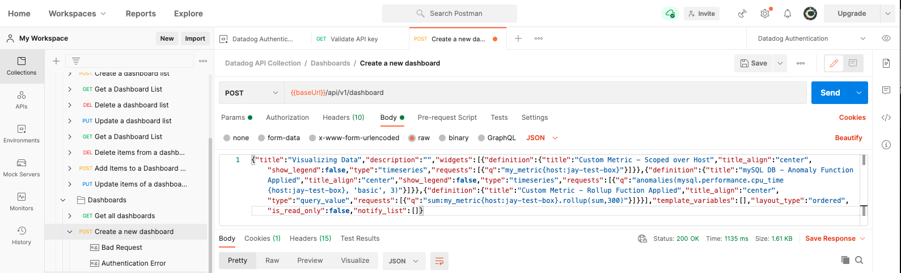

## Tasks - The following are the categories in which the tasks have been allocated. 
----------------
1. Environment Set-up
2. Collecting Metrics
3. Visualizing Data
4. Monitoring Data
5. Collecting APM Data
6. Creative Use of Datadog

I have done my best to try and provide you as much details as possible. 

#### 1. Environment Set-up
- VMWare Fusion as Hypervisor on my Macbook Pro (Personal Laptop)
- Operating System - Ubuntu 18.04 - My favourite OS for any Testing
- Datadog Account - jaydesai83@gmail.com
- Datadog Agent - v7.25.1

##### Task 1. Challenges/Comments/Links
None, it's a local environment set-up which I have to do multiple times. Account creation and agent install for Datadog was seamless. 


#### 2. Collecting Metrics
**Task:** 
Add tags in the Agent config file and show us a screenshot of your host and its tags on the Host Map page in Datadog.
**How:** 
Installed Agent >> Standard Process from Portal for Ubuntu. Edited “datadog.yaml” file located at “/etc/datadog-agent/datadog.yaml” and inserted a couple of tags.

Host in Datadog Dashboard


Agent Status Output


##### Task: 
Install a database on our machine and then install the respective datadog integeration for that database. 
##### How: 
Installed Integeration >> Standard Process from Portal for MySQL. Edited “conf.yaml” file located at “/etc/datadog-agent/conf.d/mysql.d/conf.yaml” and made changes according to the provided instructions.

Plugin Installed from Datadog Portal


Database Metrics available in Metrics Explorer


##### Task: 
Create a custom Agent check that submits a metric named my_metric with a random value between 0 and 1000.

##### How: 
Followed guide to create a custom agent check. Created a file called mycheck.py “/etc/datadog-agent/check.d/mycheck.py” 
Additionally, created a mycheck.yaml file “/etc/datadog-agent/conf.d/mycheck.yaml” 

Custom Check from Datadog Agent Status Output


Custom Check metrics in Datadog Portal


````python
# Editor: Jay Desai - The following code snipet is an edited version of the original example code snippet available on https://docs.datadoghq.com/developers/write_agent_check/?tab=agentv6v7
# the following try/except block will make the custom check compatible with any Agent version
import random
try:
    # first, try to import the base class from new versions of the Agent...
    from datadog_checks.base import AgentCheck
except ImportError:
    # ...if the above failed, the check is running in Agent version < 6.6.0
    from checks import AgentCheck

# content of the special variable __version__ will be shown in the Agent status page
__version__ = "1.0.0"

class HelloCheck(AgentCheck):
    def check(self, instance):
# generates a random value between 400 and 1000
        self.gauge('my_metric',random.randint(400,1000))
````


##### Task: 
Change your check's collection interval so that it only submits the metric once every 45 seconds.

##### How: 
Edited the .yaml file to include –min_collection_interval value and set it to 45.

````yaml
init_config:

instances:
  - min_collection_interval: 45

instances: [{}]
````

##### Task: Bonus Round
Can you change the collection interval without modifying the Python check file you created?

##### How: 
I think the documentation is now updated showing how to edit the .yaml file to change the collection interval. I used the available documentation. 

##### Challenges/Comments/Links -  Task 2
Agent install was a fairly simple task. Creating Tags was simple too as the steps were well documented on docs.datadoghq.com
Had to spend some time looking at and understanding the multiple .yaml files. 


#### 3. Visualizing Data
##### Task: 
Utilize the Datadog API to create a Timeboard that contains:
    Your custom metric scoped over your host.
    Any metric from the Integration on your Database with the anomaly function applied.
    Your custom metric with the rollup function applied to sum up all the points for the past hour into one bucket
##### How: 
Download the Postman Collection for datadog and authenticated via the available API Key.

Datadog Postman Collection - Verfication of the API Key


Rather than using the provided example, I manually created a Dasboard Graphically, exported the JSON, altered it and used it complete the exercise. 
My JSON payload I used to create the Dashboard is as per the screen below:
( The exercise asks for 1 hour, unfortunately the image below is from my testing, which was set to 300 - That value when changed to 3600 will provide data over the hour )



````json
{"title":"Visualizing Data","description":"","widgets":[{"definition":{"title":"Custom Metric - Scoped over Host","title_align":"center","show_legend":false,"type":"timeseries","requests":[{"q":"my_metric{host:jay-test-box}"}]}},{"definition":{"title":"mySQL DB - Anomaly Function Applied","title_align":"center","show_legend":false,"type":"timeseries","requests":[{"q":"anomalies(mysql.performance.cpu_time{host:jay-test-box}, 'basic', 3)"}]}},{"definition":{"title":"Custom Metric - Rollup Fuction Applied","title_align":"center","type":"query_value","requests":[{"q":"sum:my_metric{host:jay-test-box}.rollup(sum,300)"}]}}],"template_variables":[],"layout_type":"ordered","is_read_only":false,"notify_list":[]}
````

The snapshot/sceenshot of the Visualization is as below. I have also used the 'Notifications' to send the notifications to myself. 
Additionally, I have also created a Public URL For same: https://p.datadoghq.com/sb/jzdbkkrelppjuizh-56f4d3ba1ad4230e82caec7b18beb827
( Unsure if you will have any data on that URL when you test as it is being generated from a VM running on my machine )


##### Challenges/Comments/Links -  Task 3
My primary challenge with this task was the inability to use the provided Example JSON Pay load to create a Dashboard. I had to resort to reverse engineering, created Dashboards manually and then exported the JSON. 
https://docs.datadoghq.com/api/


#### 4. Monitoring Data
##### Task:
Create a new Metric Monitor that watches the average of your custom metric (my_metric) and will alert if it’s above the following values over the past 5 minutes:

Warning threshold of 500
Alerting threshold of 800
And also ensure that it will notify you if there is No Data for this query over the past 10m.
Please configure the monitor’s message so that it will:

- Send you an email whenever the monitor triggers.
- Create different messages based on whether the monitor is in an Alert, Warning, or No Data state.
- Include the metric value that caused the monitor to trigger and host ip when the Monitor triggers an Alert state.
- When this monitor sends you an email notification, take a screenshot of the email that it sends you.

##### How: 

I created a Monitor whith 'Threshold Alert' as detection method. Metric was set to 'my_metric' from my vm 'jay-test-box'. It was a 'Simple Alert'.


My e-mail is already in the system, so receiving notifications is not a challenge. Received notifications from alert@dtdg.co
The task was to create different messages based on what monitor type/state has been triggered. After a few tries, I was able to create all three custom messages.

````markdown
{{#is_alert}}

This is a custom message based on whether the monitor is an ALERT, WARNING or NO DATA state. 
ALERT ! ALERT ! 
Metric value that caused the trigger is **{{value}}** and the Host IP is :  **{{host}}**

{{/is_alert}}

{{#is_warning}}

This is a custom message based on whether the monitor is an ALERT, WARNING or NO DATA state. 
WARNING ! WARNING ! 
Metric value that caused the trigger is **{{value}}** and the Host IP is :  **{{host.ip}}**

{{/is_warning}}

{{#is_no_data}}

This is a custom message based on whether the monitor is an ALERT, WARNING or NO DATA state. 
NO DATA ! NO DATA ! 
Metric value that caused the trigger is **{{value}}** and the Host IP is :  **{{host.ip}}**

{{/is_no_data}}


 @jaydesai83@gmail.com
````

##### Task: Bonus Round
Since this monitor is going to alert pretty often, you don’t want to be alerted when you are out of the office. Set up two scheduled downtimes for this monitor:

One that silences it from 7pm to 9am daily on M-F


And one that silences it all day on Sat-Sun.


(Please Note: The calendar dates are not accurate for the screenshot as I was in test mode)

Make sure that your email is notified when you schedule the downtime and take a screenshot of that notification.


##### Challenges/Comments/Links -  Task 4
My primary challenge with this task was to get the multiple notifications. Documentation was useful to a point, but had to apply some logic too. ;)
https://docs.datadoghq.com/monitors/notifications/?tab=is_alert


#### 5. Collect APM Data
##### Task: 
Given the following Flask app (or any Python/Ruby/Go app of your choice) instrument this using Datadog’s APM solution

##### How: 
I used the provided .py code and ran Flask on the VM and generated some APM Metrics. 


Transaction Trace view in Datadog Portal


Flask Code for the provided Application.

myapp.py - code
````python
from flask import Flask
import logging
import sys
from ddtrace import tracer

# Have flask use stdout as the logger
main_logger = logging.getLogger()
main_logger.setLevel(logging.DEBUG)
c = logging.StreamHandler(sys.stdout)
formatter = logging.Formatter('%(asctime)s - %(name)s - %(levelname)s - %(message)s')
c.setFormatter(formatter)
main_logger.addHandler(c)

app = Flask(__name__)

@app.route('/')
def api_entry():
    return 'Entrypoint to the Application'

@app.route('/api/apm')
# tracer below enables dd-trace send data to datadog
@tracer.wrap("flask.request", service='flask', resource="GET /api/apm", span_type="web")
def apm_endpoint():
    current_span = tracer.current_span()
    if current_span:
        current_span.set_tag('flask.key', 'value')
        current_span.set_tag('flask.endpoint', '/api/apm')
        current_span.set_tag('http.endpoint', 'GET')
    return 'Getting APM Started'

@app.route('/api/trace')
# tracer below enables dd-trace send data to datadog
@tracer.wrap("flask.request", service='trace_request', resource="GET /api/trace", span_type="web")
def trace_endpoint():
    current_span = tracer.current_span()
    if current_span:
        current_span.set_tag('flask.key', 'value')
        current_span.set_tag('flask.endpoint', '/api/trace')
        current_span.set_tag('http.endpoint', 'GET')
    return 'Posting Traces'

if __name__ == '__main__':
    app.run(host='0.0.0.0', port='5050')
````

Datadog Agent Status showing APM Metrics summary


##### Task: Bonus Round
What is the difference between Service and Resource?

##### How: 
Service: Services are the building blocks of modern microservice architectures - broadly a service groups together endpoints, queries, or jobs for the purposes of building your application.
Resource: Resources represent a particular domain of a customer application - they are typically an instrumented web endpoint, database query, or background job.
My two cents: In most cases, a resource is a subset of service.

##### Challenges/Comments/Links -  Task 5
Documentation came in handy, Installing dd-trace was a challenge, had to install multiple dependencies on my Ubuntu 18.04 which were not documented anywhere. 
https://docs.datadoghq.com/tracing/setup_overview/setup/python/?tab=containers


 
#### Final Question: Creative Use of Datadog
##### Response: 
I am an IoT nerd and I love beer.  I have a few IoT sensors around the house. I will like to use datadog to create a visualization for me which tells me;

- How many times do I leave the house via my front door ?
- How may times do I enter my garage ? (my beer fridge is located in the garage)
- How many times do I open the fridge ?
- What times have these events occurred at ?
Ideally to understand my drinking habits. ;)
